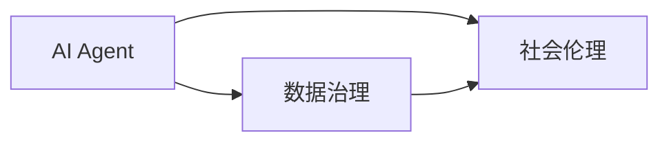

# AI Agent: AI的下一个风口 数据治理与社会伦理

## 1. 背景介绍
### 1.1 人工智能的发展历程
#### 1.1.1 人工智能的起源与定义
#### 1.1.2 人工智能的发展阶段
#### 1.1.3 人工智能的现状与挑战

### 1.2 AI Agent的概念与特点
#### 1.2.1 AI Agent的定义
#### 1.2.2 AI Agent的特点
#### 1.2.3 AI Agent的应用领域

### 1.3 数据治理与社会伦理的重要性
#### 1.3.1 数据治理的概念与内涵
#### 1.3.2 社会伦理的概念与内涵
#### 1.3.3 数据治理与社会伦理在AI发展中的重要性

## 2. 核心概念与联系
### 2.1 AI Agent的核心概念
#### 2.1.1 自主性
#### 2.1.2 交互性
#### 2.1.3 适应性

### 2.2 数据治理的核心概念
#### 2.2.1 数据质量
#### 2.2.2 数据安全
#### 2.2.3 数据隐私

### 2.3 社会伦理的核心概念
#### 2.3.1 公平性
#### 2.3.2 透明性
#### 2.3.3 问责制

### 2.4 三者之间的内在联系


## 3. 核心算法原理具体操作步骤
### 3.1 强化学习算法
#### 3.1.1 马尔可夫决策过程
#### 3.1.2 Q-learning算法
#### 3.1.3 策略梯度算法

### 3.2 联邦学习算法
#### 3.2.1 联邦平均算法
#### 3.2.2 差分隐私算法
#### 3.2.3 安全多方计算协议

### 3.3 因果推理算法
#### 3.3.1 因果图模型
#### 3.3.2 因果效应估计
#### 3.3.3 反事实推理

## 4. 数学模型和公式详细讲解举例说明
### 4.1 马尔可夫决策过程
马尔可夫决策过程(Markov Decision Process, MDP)是一个五元组 $(S,A,P,R,\gamma)$，其中：
- $S$ 是状态空间，表示Agent所处的环境状态集合；
- $A$ 是动作空间，表示Agent可以采取的动作集合；
- $P$ 是状态转移概率矩阵，$P(s'|s,a)$ 表示在状态 $s$ 下采取动作 $a$ 后转移到状态 $s'$ 的概率；
- $R$ 是奖励函数，$R(s,a)$ 表示在状态 $s$ 下采取动作 $a$ 后获得的即时奖励；
- $\gamma \in [0,1]$ 是折扣因子，表示未来奖励的重要程度。

Agent的目标是最大化累积奖励的期望：

$$V^{\pi}(s)=\mathbb{E}\left[\sum_{t=0}^{\infty} \gamma^{t} R\left(s_{t}, \pi\left(s_{t}\right)\right) \mid s_{0}=s\right]$$

其中 $\pi$ 是Agent的策略函数，$\pi(a|s)$ 表示在状态 $s$ 下选择动作 $a$ 的概率。最优策略 $\pi^*$ 满足贝尔曼最优方程：

$$V^{*}(s)=\max _{a} \sum_{s^{\prime}} P\left(s^{\prime} \mid s, a\right)\left[R(s, a)+\gamma V^{*}\left(s^{\prime}\right)\right]$$

### 4.2 Q-learning算法
Q-learning是一种常用的无模型强化学习算法，它通过不断估计状态-动作值函数 $Q(s,a)$ 来寻找最优策略。Q-learning的更新规则为：

$$Q(s, a) \leftarrow Q(s, a)+\alpha\left[r+\gamma \max _{a^{\prime}} Q\left(s^{\prime}, a^{\prime}\right)-Q(s, a)\right]$$

其中 $\alpha \in (0,1]$ 是学习率，$r$ 是执行动作 $a$ 后获得的即时奖励，$s'$ 是执行动作后转移到的新状态。重复迭代更新Q值，直到收敛到最优Q值函数 $Q^*(s,a)$，此时最优策略为：

$$\pi^{*}(s)=\arg \max _{a} Q^{*}(s, a)$$

### 4.3 联邦平均算法
联邦平均(FederatedAveraging, FedAvg)是一种常用的联邦学习算法，它通过在不同客户端之间共享模型参数的方式来实现分布式训练。假设有 $K$ 个客户端，每个客户端 $k$ 有本地数据集 $D_k$，本地模型参数为 $w_k$。FedAvg算法的主要步骤如下：

1. 服务器将全局模型参数 $w$ 发送给所有客户端；
2. 每个客户端利用本地数据集 $D_k$ 对本地模型 $w_k$ 进行训练，得到更新后的本地模型参数 $w_k'$；
3. 客户端将更新后的本地模型参数 $w_k'$ 发送给服务器；
4. 服务器对所有客户端的本地模型参数进行聚合，得到新的全局模型参数：

$$w \leftarrow \sum_{k=1}^{K} \frac{n_{k}}{n} w_{k}^{\prime}$$

其中 $n_k=|D_k|$ 表示客户端 $k$ 的数据量，$n=\sum_{k=1}^K n_k$ 表示总数据量。

重复迭代上述步骤，直到全局模型收敛。FedAvg算法可以在保护数据隐私的同时实现模型的联合训练。

## 5. 项目实践：代码实例和详细解释说明
下面我们以PyTorch框架为例，给出一个简单的联邦学习代码实例。假设有两个客户端，每个客户端有自己的本地数据集，我们希望在不共享原始数据的情况下联合训练一个神经网络模型。

```python
import torch
import torch.nn as nn
import torch.optim as optim
from torch.utils.data import DataLoader, Dataset

# 定义神经网络模型
class Net(nn.Module):
    def __init__(self):
        super(Net, self).__init__()
        self.fc1 = nn.Linear(28 * 28, 512)
        self.fc2 = nn.Linear(512, 10)

    def forward(self, x):
        x = x.view(-1, 28 * 28)
        x = torch.relu(self.fc1(x))
        x = self.fc2(x)
        return x

# 定义联邦平均算法
def federated_averaging(models, weights):
    global_model = Net()
    global_dict = global_model.state_dict()
    for k in global_dict.keys():
        global_dict[k] = torch.stack([models[i].state_dict()[k].float() * weights[i] for i in range(len(models))], 0).sum(0)
    global_model.load_state_dict(global_dict)
    return global_model

# 定义本地训练函数
def local_train(model, train_loader, optimizer, epochs):
    criterion = nn.CrossEntropyLoss()
    for epoch in range(epochs):
        for batch_idx, (data, target) in enumerate(train_loader):
            optimizer.zero_grad()
            output = model(data)
            loss = criterion(output, target)
            loss.backward()
            optimizer.step()
    return model

# 定义客户端数据集
class ClientDataset(Dataset):
    def __init__(self, data, targets):
        self.data = data
        self.targets = targets

    def __getitem__(self, index):
        return self.data[index], self.targets[index]

    def __len__(self):
        return len(self.data)

# 设置超参数
num_clients = 2
num_rounds = 10
local_epochs = 5
batch_size = 32
learning_rate = 0.01

# 初始化全局模型和客户端模型
global_model = Net()
client_models = [Net() for _ in range(num_clients)]

# 加载客户端数据集
client_datasets = [
    ClientDataset(torch.randn(100, 28, 28), torch.randint(0, 10, (100,))),
    ClientDataset(torch.randn(100, 28, 28), torch.randint(0, 10, (100,)))
]
client_loaders = [DataLoader(dataset, batch_size=batch_size, shuffle=True) for dataset in client_datasets]

# 开始联邦学习
for round in range(num_rounds):
    # 客户端本地训练
    for i in range(num_clients):
        client_models[i] = local_train(client_models[i], client_loaders[i], optim.SGD(client_models[i].parameters(), lr=learning_rate), local_epochs)
    
    # 服务器聚合更新全局模型
    weights = [len(client_datasets[i]) / sum(len(dataset) for dataset in client_datasets) for i in range(num_clients)]
    global_model = federated_averaging(client_models, weights)
    
    # 将更新后的全局模型发送给客户端
    for i in range(num_clients):
        client_models[i].load_state_dict(global_model.state_dict())
```

在上面的代码中，我们首先定义了一个简单的神经网络模型 `Net`，包含两个全连接层。然后定义了联邦平均算法 `federated_averaging`，它将客户端模型的参数按照数据量的比例进行加权平均，得到更新后的全局模型参数。

接着定义了本地训练函数 `local_train`，它使用客户端本地数据集对客户端模型进行训练，返回更新后的客户端模型。我们还定义了一个简单的客户端数据集 `ClientDataset`，用于加载客户端的本地数据。

在主程序中，我们设置了一些超参数，如客户端数量、联邦学习轮数、本地训练轮数、批量大小和学习率等。然后初始化全局模型和客户端模型，并加载客户端数据集。

最后，我们开始进行联邦学习。在每一轮中，首先让每个客户端使用本地数据集对本地模型进行训练，然后将更新后的客户端模型发送给服务器。服务器使用联邦平均算法对客户端模型进行聚合，得到更新后的全局模型，并将其发送给所有客户端，开始新一轮的迭代。

通过这种方式，我们可以在不共享原始数据的情况下，利用多个客户端的本地数据集来联合训练一个全局模型，既保护了数据隐私，又提高了模型的性能。

## 6. 实际应用场景
### 6.1 智能医疗
#### 6.1.1 医疗数据隐私保护
#### 6.1.2 医疗诊断辅助决策
#### 6.1.3 药物研发与推荐

### 6.2 金融风控
#### 6.2.1 反欺诈检测
#### 6.2.2 信用评分
#### 6.2.3 个性化理财推荐

### 6.3 智慧城市
#### 6.3.1 交通流量预测与调度
#### 6.3.2 公共安全监控
#### 6.3.3 城市资源优化配置

## 7. 工具和资源推荐
### 7.1 开源框架
#### 7.1.1 TensorFlow Federated
#### 7.1.2 PySyft
#### 7.1.3 FATE

### 7.2 数据集
#### 7.2.1 LEAF
#### 7.2.2 Federated EMNIST
#### 7.2.3 Federated Shakespeare

### 7.3 学习资料
#### 7.3.1 《Federated Learning》
#### 7.3.2 《Advances and Open Problems in Federated Learning》
#### 7.3.3 《Federated Machine Learning: Concept and Applications》

## 8. 总结：未来发展趋势与挑战
### 8.1 技术趋势
#### 8.1.1 联邦学习与隐私计算的融合
#### 8.1.2 纵向联邦学习的发展
#### 8.1.3 联邦强化学习的探索

### 8.2 标准规范
#### 8.2.1 数据治理标准的建立
#### 8.2.2 伦理规范的制定
#### 8.2.3 安全评估与审计机制

### 8.3 挑战与机遇
#### 8.3.1 数据孤岛问题
#### 8.3.2 系统性能瓶颈
#### 8.3.3 社会认知与接受度

## 9. 附录：常见问题与解答
### 9.1 联邦学习与传统分布式学习的区别是什么？
联邦学习与传统分布式学习的主要区别在于数据的分布和隐私保护。在传统分布式学习中，数据通常被集中存储