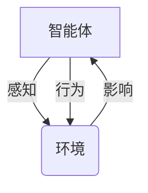
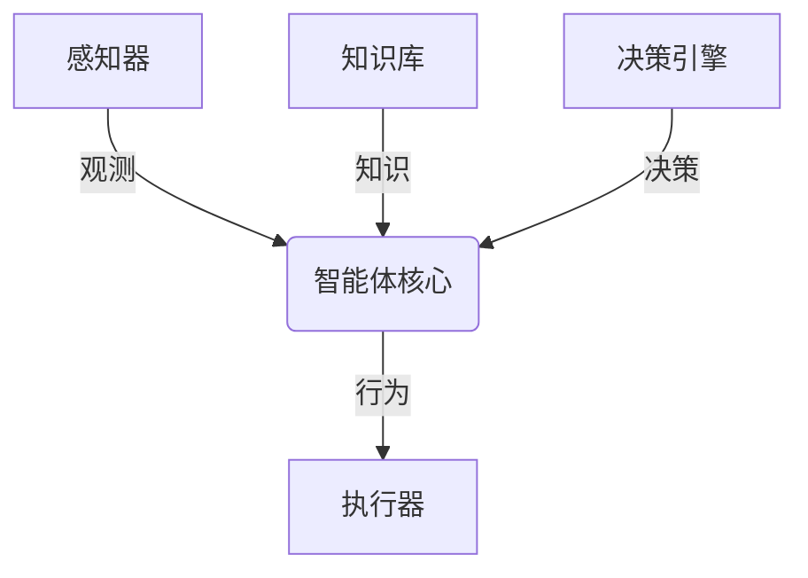
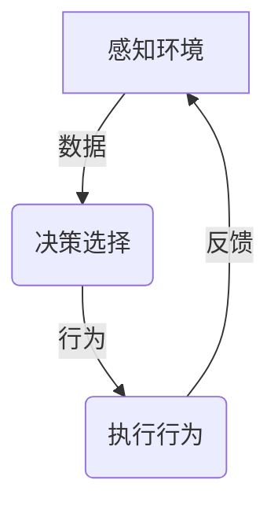

# AI Agent: AI的下一个风口 智能体与传统软件的关系

## 1. 背景介绍

### 1.1 人工智能的发展历程

人工智能(Artificial Intelligence, AI)作为一门跨学科的综合性科学,自20世纪50年代问世以来,经历了起起伏伏的发展历程。从早期的专家系统、机器学习算法,到后来的深度学习、强化学习等技术的不断突破,AI已经渗透到了我们生活和工作的方方面面。

### 1.2 传统软件的局限性

然而,传统的软件系统存在着固有的局限性。它们通常是基于预定义的规则和算法来执行特定任务,缺乏自主学习和适应能力。随着问题复杂度的增加和环境的动态变化,传统软件系统难以满足日益增长的需求。

### 1.3 智能体的崛起

在这种背景下,AI Agent(智能体)作为一种新兴的软件范式应运而生。智能体是具有感知、决策和行为能力的自主系统,能够根据环境的变化做出智能响应。它们具备自主学习、规划、推理和交互的能力,可以更好地应对复杂动态环境的挑战。

## 2. 核心概念与联系

### 2.1 什么是智能体?

智能体(Agent)是一种具有自主性、反应性、主动性和持续性的软件实体。它能够感知环境,根据内部知识库和决策机制做出行为选择,并通过执行行为来影响环境。



### 2.2 智能体与传统软件的区别

传统软件通常是被动执行预定义的指令,而智能体则是主动做出决策并采取行动。智能体具有以下特点:

- 自主性:能够独立做出决策和行为选择
- 反应性:能够及时响应环境变化
- 主动性:能够主动采取行动实现目标
- 持续性:能够持续运行并维持内部状态

### 2.3 智能体的关键组成部分

一个典型的智能体系统由以下几个核心组成部分构成:



- 感知器:用于获取环境信息
- 知识库:存储智能体的知识和经验
- 决策引擎:根据感知和知识做出决策
- 执行器:执行智能体的行为

## 3. 核心算法原理具体操作步骤

智能体的核心算法原理可以概括为感知-决策-行为的循环过程。具体操作步骤如下:

### 3.1 感知环境

1) 通过各种传感器(视觉、听觉、触觉等)获取环境数据
2) 对原始数据进行预处理和特征提取
3) 将处理后的数据输入到智能体的感知模块

### 3.2 决策选择

1) 将感知数据与知识库中的信息进行匹配
2) 根据决策算法(如规划、推理、学习等)做出行为选择
3) 评估各种行为选择的效用和代价

### 3.3 执行行为

1) 将选定的行为转换为可执行的指令序列
2) 通过执行器(如机器人手臂、语音合成等)执行行为
3) 观测行为对环境的影响,并将反馈输入到感知模块

### 3.4 持续迭代

智能体通过不断重复上述过程,逐步优化自身的知识库和决策策略,以更好地适应环境变化。



## 4. 数学模型和公式详细讲解举例说明

### 4.1 马尔可夫决策过程

马尔可夫决策过程(Markov Decision Process, MDP)是描述智能体决策问题的重要数学模型。一个MDP可以用一个五元组来表示:

$$
\langle S, A, P, R, \gamma \rangle
$$

其中:

- $S$ 是状态集合
- $A$ 是行为集合
- $P(s'|s,a)$ 是状态转移概率,表示在状态 $s$ 执行行为 $a$ 后转移到状态 $s'$ 的概率
- $R(s,a,s')$ 是即时奖励函数,表示在状态 $s$ 执行行为 $a$ 后转移到状态 $s'$ 所获得的奖励
- $\gamma \in [0,1)$ 是折现因子,用于权衡即时奖励和长期奖励的重要性

智能体的目标是找到一个策略 $\pi: S \rightarrow A$,使得期望的累积折现奖励最大化:

$$
\max_\pi \mathbb{E}\left[ \sum_{t=0}^\infty \gamma^t R(s_t, a_t, s_{t+1}) \right]
$$

其中 $s_0$ 是初始状态, $a_t = \pi(s_t)$ 是在状态 $s_t$ 执行的行为。

### 4.2 Q-Learning算法

Q-Learning是一种常用的强化学习算法,用于求解MDP问题。它通过不断尝试和更新,逐步学习出一个最优的行为策略。

Q-Learning算法的核心是估计一个Q函数 $Q(s,a)$,表示在状态 $s$ 执行行为 $a$ 后可获得的期望累积奖励。Q函数的更新规则如下:

$$
Q(s_t, a_t) \leftarrow Q(s_t, a_t) + \alpha \left[ r_t + \gamma \max_{a'} Q(s_{t+1}, a') - Q(s_t, a_t) \right]
$$

其中:

- $\alpha$ 是学习率,控制更新幅度
- $r_t$ 是在状态 $s_t$ 执行行为 $a_t$ 后获得的即时奖励
- $\gamma$ 是折现因子
- $\max_{a'} Q(s_{t+1}, a')$ 是在状态 $s_{t+1}$ 执行最优行为后可获得的期望累积奖励

通过不断更新Q函数,智能体最终可以学习到一个近似最优的策略 $\pi^*(s) = \arg\max_a Q(s,a)$。

## 5. 项目实践: 代码实例和详细解释说明

为了更好地理解智能体的工作原理,我们以一个简单的网格世界(Gridworld)游戏为例,实现一个基于Q-Learning的智能体代理。

### 5.1 问题描述

在一个 $4 \times 4$ 的网格世界中,智能体代理需要从起点出发,到达终点。网格中可能存在障碍物,代理需要学习如何绕过障碍物到达终点。每一步移动都会获得一个小的负奖励,到达终点会获得大的正奖励。

### 5.2 环境设置

```python
import numpy as np

# 网格世界的大小
GRID_SIZE = 4

# 定义状态
STATES = np.arange(GRID_SIZE * GRID_SIZE)

# 定义行为
ACTIONS = [0, 1, 2, 3]  # 上、右、下、左

# 定义奖励
REWARDS = np.full((GRID_SIZE, GRID_SIZE), -1.0)
REWARDS[0, GRID_SIZE - 1] = 100.0  # 终点奖励
REWARDS[1, 1] = -100.0  # 障碍物惩罚

# 定义状态转移概率
def get_next_state(state, action):
    row = state // GRID_SIZE
    col = state % GRID_SIZE
    
    if action == 0:  # 上
        next_row = max(row - 1, 0)
    elif action == 1:  # 右
        next_col = min(col + 1, GRID_SIZE - 1)
    elif action == 2:  # 下
        next_row = min(row + 1, GRID_SIZE - 1)
    else:  # 左
        next_col = max(col - 1, 0)
    
    next_state = next_row * GRID_SIZE + next_col
    reward = REWARDS[next_row, next_col]
    
    return next_state, reward
```

### 5.3 Q-Learning实现

```python
import random

# 初始化Q函数
Q = np.zeros((GRID_SIZE * GRID_SIZE, 4))

# 设置超参数
ALPHA = 0.1  # 学习率
GAMMA = 0.9  # 折现因子
EPSILON = 0.1  # 探索率

# Q-Learning算法
for episode in range(1000):
    state = 0  # 初始状态
    done = False
    
    while not done:
        # 选择行为
        if random.uniform(0, 1) < EPSILON:
            action = random.choice(ACTIONS)  # 探索
        else:
            action = np.argmax(Q[state, :])  # 利用
        
        # 执行行为
        next_state, reward = get_next_state(state, action)
        
        # 更新Q函数
        Q[state, action] += ALPHA * (reward + GAMMA * np.max(Q[next_state, :]) - Q[state, action])
        
        # 更新状态
        state = next_state
        
        # 判断是否到达终点
        if state == GRID_SIZE * GRID_SIZE - 1:
            done = True

# 输出最优策略
policy = np.argmax(Q, axis=1).reshape((GRID_SIZE, GRID_SIZE))
print("最优策略:")
print(policy)
```

在上述代码中,我们首先定义了网格世界的状态、行为和奖励函数。然后,我们使用Q-Learning算法,通过不断尝试和更新Q函数,最终学习到一个近似最优的策略。

代码的关键步骤如下:

1. 初始化Q函数为全0矩阵
2. 对于每一个episode:
    - 从初始状态开始
    - 根据当前状态和Q函数,选择行为(利用或探索)
    - 执行选定的行为,获得下一个状态和即时奖励
    - 根据Q-Learning更新规则,更新Q函数
    - 更新当前状态
    - 判断是否到达终点
3. 根据最终的Q函数,输出最优策略

通过上述实现,我们可以看到智能体代理最终学会了如何绕过障碍物到达终点,展现了强大的自主学习能力。

## 6. 实际应用场景

智能体技术在许多实际应用场景中发挥着重要作用,例如:

### 6.1 机器人控制

在机器人控制领域,智能体可以作为机器人的"大脑",根据传感器数据做出决策,控制机器人执行各种任务,如导航、操作、交互等。

### 6.2 游戏AI

智能体广泛应用于游戏AI的开发,用于控制非玩家角色(NPC)的行为,提供更具挑战性和智能性的对手。

### 6.3 网络安全

智能体可以用于网络安全领域,通过学习网络流量模式,及时发现和响应各种网络攻击。

### 6.4 智能交通系统

在智能交通系统中,智能体可以根据实时交通数据,优化信号灯控制、路径规划等,缓解交通拥堵。

### 6.5 智能家居

智能家居系统中的智能代理可以学习用户的生活习惯,自动调节家电设备,提供个性化的智能服务。

## 7. 工具和资源推荐

### 7.1 AI框架和库

- TensorFlow: Google开源的端到端机器学习框架
- PyTorch: Facebook开源的深度学习框架
- Scikit-learn: Python机器学习库
- OpenAI Gym: OpenAI开源的强化学习环境集合

### 7.2 开发工具

- Jupyter Notebook: 交互式数据科学和可视化工具
- Visual Studio Code: 微软开源的代码编辑器
- Git: 分布式版本控制系统

### 7.3 在线课程

- CS188 Introduction to Artificial Intelligence (UC Berkeley)
- Reinforcement Learning (DeepMind & UCL)
- Artificial Intelligence for Robotics (Udacity)

### 7.4 书籍和论文

- 《Artificial Intelligence: A Modern Approach》
- 《Reinforcement Learning: An Introduction》
- 《Deep Reinforcement Learning Hands-On》
- 相关顶级会议和期刊论文

## 8. 总结: 未来发展趋势与挑战

### 8.1 发展趋势

智能体技术正在快速发展,未来可能的发展趋势包括:

- 多智能体系统:多个智能体协同工作,解决更复杂的问题
- 人机协作:智