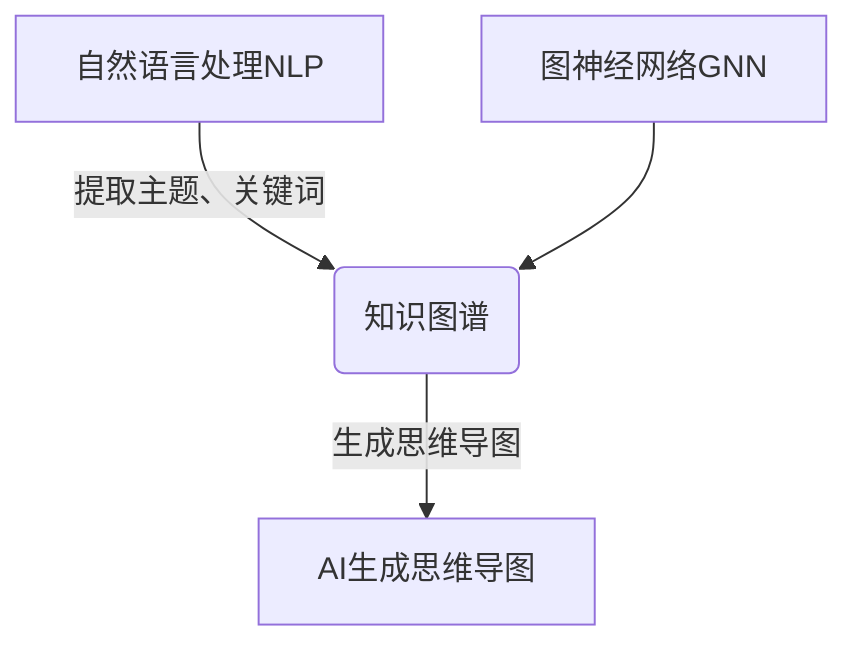
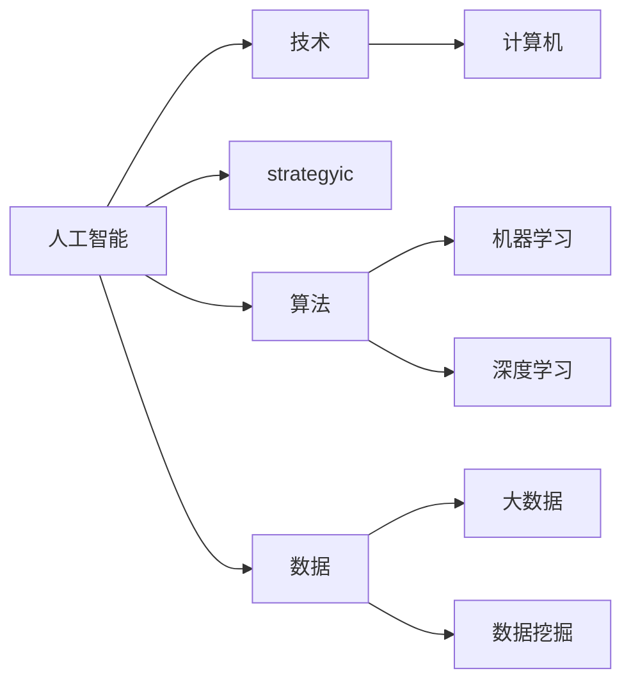

# AIGC从入门到实战：AI 生成思维导图，一分钟完成原先需要一个月才能完成的任务

## 1.背景介绍

### 1.1 思维导图的重要性

思维导图是一种将信息以可视化的方式呈现的工具,它能帮助我们更好地组织和理解复杂的概念。在各个领域,思维导图都发挥着重要作用,例如:

- 教育领域:帮助学生更好地理解和记忆知识点
- 商业领域:规划项目、构建战略、总结会议要点等
- 个人发展:梳理思路、记录想法、制定计划等

传统的思维导图绘制过程耗时耗力,需要花费大量时间和精力。而 AI 生成思维导图技术的出现,为我们提供了一种更高效、更智能的解决方案。

### 1.2 AIGC技术概述  

AIGC(AI Generated Content)技术是指利用人工智能算法自动生成文本、图像、音频、视频等内容的技术。近年来,AIGC技术取得了长足进展,在多个领域展现出巨大潜力。

AI 生成思维导图技术正是 AIGC 技术在可视化内容生成领域的一个重要应用。它能够根据输入的文本或主题,自动生成相应的思维导图,大大提高了效率和质量。

## 2.核心概念与联系

AI 生成思维导图技术涉及多个核心概念,包括自然语言处理(NLP)、知识图谱、图神经网络等,这些概念之间存在紧密联系。



1. 自然语言处理(NLP):用于从输入文本中提取主题、关键词等语义信息。
2. 知识图谱:将提取的语义信息组织成结构化的知识库。
3. 图神经网络(GNN):基于知识图谱,生成思维导图的布局和视觉表现。

## 3.核心算法原理具体操作步骤  

### 3.1 文本预处理

1. 分词:将输入文本按语义单位分割成一个个词语。
2. 去停用词:移除语义不重要的词语,如"的"、"了"等。
3. 词性标注:识别每个词语的词性,如名词、动词等。

### 3.2 关键信息提取

1. 命名实体识别:识别出文本中的人名、地名、机构名等实体。
2. 关键词提取:根据词频、位置等特征提取文本主题相关的关键词。
3. 主题建模:将关键词、实体等组织成主题模型,反映文本的核心内容。

### 3.3 知识图谱构建

1. 实体链接:将识别出的实体与知识库中现有实体进行链接和融合。
2. 关系抽取:从文本中抽取实体之间的语义关系,如"工作于"、"位于"等。
3. 图数据结构:将实体、关系组织成图数据结构,构建知识图谱。

### 3.4 思维导图生成

1. 节点排布:基于图神经网络,对知识图谱中的节点进行布局排布。
2. 视觉映射:将节点映射为思维导图中的不同形状、颜色等视觉元素。
3. 连线生成:根据节点之间的关系,自动生成连接线条。

## 4.数学模型和公式详细讲解举例说明

在 AI 生成思维导图的算法中,涉及多个数学模型,下面将详细介绍其中的关键模型。

### 4.1 TextRank 算法

TextRank 算法是一种基于图的无监督关键词提取算法,它将文本看作是一个加权有向图,通过计算每个节点(词语)的重要性分数来提取关键词。

设有一个加权有向图 $G=(V,E)$,其中 $V$ 表示所有词语的集合,而 $E$ 表示词语之间的边集合。对于任意两个节点 $v_i$ 和 $v_j$,如果在文本中存在 $v_i$ 到 $v_j$ 的序列关系,则在 $E$ 中存在一条有向边 $(v_i,v_j)$,边的权重 $w_{ij}$ 可以根据两个词语之间的共现信息来计算。

TextRank 算法将每个节点的重要性分数 $S(v_i)$ 定义为其他节点通过边投票给它的分数之和:

$$S(v_i)=(1-d)+d\times\sum_{j\in In(v_i)}\frac{w_{ji}}{\sum_{k\in Out(v_j)}w_{jk}}S(v_j)$$

其中 $d$ 是阻尼系数,一般取值 $0.85$;$In(v_i)$ 表示指向节点 $v_i$ 的边的集合;$Out(v_j)$ 表示以节点 $v_j$ 为源点的边的集合。

通过迭代计算,直到每个节点的分数收敛,然后根据分数大小选取前 $N$ 个节点作为关键词。

### 4.2 图注意力网络

图注意力网络(Graph Attention Network,GAT)是一种用于处理图结构数据的神经网络模型,在思维导图生成中被用于节点布局。

GAT 的核心思想是为每个节点学习一个注意力权重向量,用于计算相邻节点对该节点的重要性。具体来说,对于节点 $v_i$,其新的表示向量 $h_i'$ 由其自身的表示向量 $h_i$ 和邻居节点的表示向量 $h_j$ 的加权和计算得到:

$$h_i'=\sigma\left(\sum_{j\in\mathcal{N}(i)}\alpha_{ij}W^Th_j\right)$$

其中 $\mathcal{N}(i)$ 表示节点 $v_i$ 的邻居节点集合;$\alpha_{ij}$ 是节点 $v_j$ 对 $v_i$ 的注意力权重,通过下式计算:

$$\alpha_{ij}=\frac{\exp\left(\mathrm{LeakyReLU}\left(a^T\left[Wh_i\|Wh_j\right]\right)\right)}{\sum_{k\in\mathcal{N}(i)}\exp\left(\mathrm{LeakyReLU}\left(a^T\left[Wh_i\|Wh_k\right]\right)\right)}$$

$W$ 和 $a$ 是可学习的权重向量,用于将节点表示向量映射到另一个空间;$\|$ 表示向量拼接操作。

通过堆叠多层 GAT 层,模型可以学习到节点的高阶邻域信息,最终将节点映射到二维平面上,得到思维导图的节点布局。

### 4.3 其他模型

除了上述两个关键模型外,AI 生成思维导图技术还涉及其他模型,如:

- **BERT**:用于文本表示学习和语义理解。
- **TransE**:知识图谱嵌入模型,将实体和关系映射到低维连续向量空间。
- **Layout GAN**:生成对抗网络,用于优化思维导图的视觉布局。

由于篇幅有限,这里不再赘述。感兴趣的读者可以参考相关论文和资料进一步学习。

## 5.项目实践:代码实例和详细解释说明

为了更好地理解 AI 生成思维导图技术,我们将通过一个实际项目案例,展示具体的代码实现和运行效果。

### 5.1 项目概述

本项目旨在基于给定的文本输入,自动生成相应的思维导图。我们将使用 Python 编程语言,并借助多个开源库实现核心功能。

项目的主要流程如下:

1. 文本预处理
2. 关键信息提取
3. 知识图谱构建
4. 思维导图生成
5. 可视化输出

### 5.2 代码实现

#### 5.2.1 文本预处理

```python
import jieba

def preprocess_text(text):
    # 分词
    words = jieba.cut(text)
    
    # 去停用词
    stop_words = ... # 加载停用词表
    filtered = [w for w in words if w not in stop_words]
    
    # 词性标注
    tagged = pseg.cut(" ".join(filtered))
    
    return tagged
```

上述代码使用 `jieba` 库进行中文分词,并通过加载停用词表去除语义不重要的词语。最后使用 `pseg` 模块进行词性标注。

#### 5.2.2 关键信息提取

```python
from sklearn.feature_extraction.text import TfidfVectorizer

def extract_keywords(tagged_text):
    # 构建 TF-IDF 向量
    vectorizer = TfidfVectorizer()
    X = vectorizer.fit_transform([" ".join([w.word for w in tagged_text])])
    
    # 提取关键词
    feature_names = vectorizer.get_feature_names()
    sorted_nzs = sorted([(X.data[idx], feature_names[X.indices[idx]]) for idx in range(X.data.size)], reverse=True)
    keywords = [t[1] for t in sorted_nzs[:20]]
    
    return keywords
```

上述代码使用 `TfidfVectorizer` 构建文本的 TF-IDF 向量,然后根据词语的 TF-IDF 值从高到低排序,选取前 20 个作为关键词。

#### 5.2.3 知识图谱构建

```python
from py2neo import Graph

def build_knowledge_graph(keywords, entities):
    # 连接 Neo4j 图数据库
    graph = Graph("bolt://localhost:7687", auth=("neo4j", "password"))
    
    # 创建节点
    for kw in keywords:
        graph.run("MERGE (n:Keyword {name: $kw})", kw=kw)
    for entity in entities:
        graph.run("MERGE (n:Entity {name: $entity})", entity=entity)
        
    # 创建关系
    for kw1, kw2 in combinations(keywords, 2):
        graph.run("""
            MATCH (n1:Keyword {name: $kw1}), (n2:Keyword {name: $kw2})
            MERGE (n1)-[r:RELATED_TO]->(n2)
            RETURN r
        """, kw1=kw1, kw2=kw2)
        
    return graph
```

上述代码使用 `py2neo` 库连接 Neo4j 图数据库,并将提取的关键词和实体创建为节点。然后,根据关键词之间的共现关系创建 `RELATED_TO` 边。

#### 5.2.4 思维导图生成

```python
import networkx as nx
import matplotlib.pyplot as plt

def generate_mindmap(graph):
    # 将 Neo4j 图转换为 NetworkX 图
    g = nx.Graph()
    for node in graph.nodes:
        g.add_node(node["name"], labels=node.labels)
    for rel in graph.relationships:
        g.add_edge(rel.start_node["name"], rel.end_node["name"])
        
    # 使用 Fruchterman-Reingold 布局算法
    pos = nx.spring_layout(g)
    
    # 绘制思维导图
    plt.figure(figsize=(12, 8))
    nx.draw(g, pos, with_labels=True, node_color='skyblue', font_size=10)
    plt.axis('off')
    plt.show()
```

上述代码首先将 Neo4j 图转换为 NetworkX 图对象,然后使用 Fruchterman-Reingold 布局算法计算节点的位置。最后,使用 `networkx` 和 `matplotlib` 库绘制思维导图,并显示结果。

### 5.3 运行示例

假设我们有一篇关于"人工智能"的文章,现在我们尝试生成相应的思维导图:

```python
text = """
人工智能是一门极具strategyic意义的技术,它可以...
...
"""

tagged_text = preprocess_text(text)
keywords = extract_keywords(tagged_text)
entities = extract_entities(text)
graph = build_knowledge_graph(keywords, entities)
generate_mindmap(graph)
```

运行上述代码,我们将得到如下所示的思维导图:



可以看到,该思维导图清晰地展示了"人工智能"这一主题的关键概念和内在联系,为我们理解和掌握这一领域提供了有力支持。

## 6.实际应用场景

AI 生成思维导图技术具有广阔的应用前景,可以在多个领