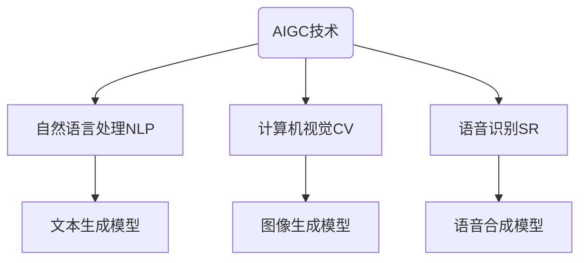
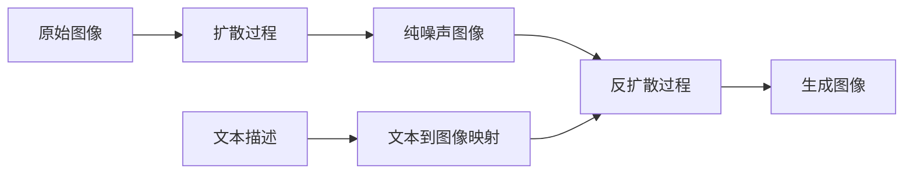
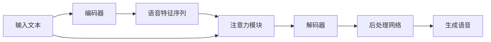

# AIGC从入门到实战：AIGC在金融行业的创新场景—银行零售新范式

## 1.背景介绍

### 1.1 人工智能时代的到来

近年来,人工智能(AI)和大数据分析技术的飞速发展,正在推动各行各业的数字化转型。在这场科技革命的浪潮中,金融业作为支柱产业之一,也迎来了前所未有的机遇与挑战。传统的金融服务模式正在被颠覆,银行业务流程和客户体验都面临着根本性的重塑。

### 1.2 AIGC概念的兴起

在这一背景下,AIGC(AI Generated Content,人工智能生成内容)作为AI与大数据的融合应用,开始在金融领域崭露头角。AIGC技术能够基于海量数据和算法模型,自动生成文本、图像、音视频等多种形式的内容,为金融机构提供了全新的内容创作和服务交付方式。

### 1.3 银行零售业务的挑战

银行的零售业务一直是盈利的重要来源,但也面临着激烈的市场竞争。如何通过AIGC赋能银行零售,提升客户体验、优化运营效率、开拓创新服务,正成为业内热点话题。

## 2.核心概念与联系

### 2.1 AIGC技术概述

AIGC是指利用人工智能算法模型从大数据中自动生成文本、图像、音视频等内容的技术。它涵盖了自然语言处理(NLP)、计算机视觉(CV)、语音识别等多个AI子领域。常见的AIGC模型有:

- 文本生成模型(GPT、BERT等)
- 图像生成模型(DALL-E、Stable Diffusion等)
- 语音合成模型(WaveNet、Tacotron等)



### 2.2 AIGC在银行零售业务中的应用场景

AIGC可以为银行零售业务带来全方位的赋能,主要包括:

1. **智能客服**:基于NLP技术构建智能对话系统,提供7x24小时在线服务。
2. **个性化营销**:通过分析客户数据,生成定制化的营销内容和策略。
3. **金融咨询**:自动生成投资理财报告、风险评估等专业内容。
4. **智能审批**:利用AI模型加速信贷审批、反欺诈等流程。
5. **虚拟数字人**:构建基于AIGC的虚拟金融助理和导购员。

## 3.核心算法原理具体操作步骤

### 3.1 文本生成模型原理

以GPT(Generative Pre-trained Transformer)为例,它采用自回归(Auto-Regressive)的生成方式,将文本生成任务建模为一个标记预测问题。给定之前的文本序列$X=(x_1,x_2,...,x_t)$,模型需要预测下一个标记$x_{t+1}$的概率分布:

$$P(x_{t+1}|x_1,x_2,...,x_t)$$

该概率由模型的编码器和解码器计算得到。编码器捕获输入序列的上下文信息,解码器则根据上下文和之前生成的标记,预测下一个最可能的标记。


### 3.2 图像生成模型原理

以Stable Diffusion为例,它是一种基于潜在扩散模型(Latent Diffusion Model)的生成模型。主要分为两个过程:

1. **扩散(Diffusion)过程**:将原始图像注入高斯噪声,使其逐渐变为纯噪声图像。
2. **反扩散(Reverse Diffusion)过程**:从纯噪声图像出发,通过迭代去噪,最终重建原始图像。

模型的关键是学习从文本到图像的映射函数,使生成的图像能够匹配给定的文本描述。



### 3.3 语音合成模型原理

以Tacotron为例,它是一种基于序列到序列(Seq2Seq)模型的端到端语音合成系统。主要包括以下模块:

1. **编码器(Encoder)**: 将输入文本序列编码为语音特征序列。
2. **注意力模块(Attention)**:对齐输入文本和语音特征的对应关系。
3. **解码器(Decoder)**: 根据注意力结果,预测语音波形。
4. **后处理网络(Postnet)**: 进一步优化生成的语音波形。



## 4.数学模型和公式详细讲解举例说明

### 4.1 自注意力机制(Self-Attention)

自注意力机制是Transformer等模型的核心部件,能够有效捕获序列中元素之间的长程依赖关系。对于长度为$n$的序列$\boldsymbol{x}=(x_1,x_2,...,x_n)$,自注意力的计算过程如下:

1. 计算查询(Query)、键(Key)和值(Value)向量:

$$\begin{aligned}
\boldsymbol{Q} &= \boldsymbol{x}\boldsymbol{W}^Q\\
\boldsymbol{K} &= \boldsymbol{x}\boldsymbol{W}^K\\
\boldsymbol{V} &= \boldsymbol{x}\boldsymbol{W}^V
\end{aligned}$$

其中$\boldsymbol{W}^Q,\boldsymbol{W}^K,\boldsymbol{W}^V$为可训练参数。

2. 计算注意力分数:

$$\text{Attention}(\boldsymbol{Q},\boldsymbol{K},\boldsymbol{V})=\text{softmax}\left(\frac{\boldsymbol{Q}\boldsymbol{K}^\top}{\sqrt{d_k}}\right)\boldsymbol{V}$$

其中$d_k$为缩放因子,用于防止内积值过大导致梯度消失。

3. 多头注意力(Multi-Head Attention):将注意力分成多个"头"进行并行计算,最后将结果拼接:

$$\text{MultiHead}(\boldsymbol{Q},\boldsymbol{K},\boldsymbol{V})=\text{Concat}(\text{head}_1,\text{head}_2,...,\text{head}_h)\boldsymbol{W}^O$$

其中$\text{head}_i=\text{Attention}(\boldsymbol{Q}\boldsymbol{W}_i^Q,\boldsymbol{K}\boldsymbol{W}_i^K,\boldsymbol{V}\boldsymbol{W}_i^V)$。

自注意力机制赋予了模型强大的建模能力,在AIGC任务中发挥着关键作用。

### 4.2 变分自编码器(Variational Autoencoder, VAE)

VAE是一种常用的生成模型,被广泛应用于图像、语音等连续数据的生成任务。它的基本思想是将观测数据$\boldsymbol{x}$看作是潜在变量$\boldsymbol{z}$通过某个生成过程$p_\theta(\boldsymbol{x}|\boldsymbol{z})$产生的,目标是最大化$\boldsymbol{x}$的边际对数似然:

$$\log p_\theta(\boldsymbol{x})=\log\int p_\theta(\boldsymbol{x}|\boldsymbol{z})p(\boldsymbol{z})d\boldsymbol{z}$$

由于上式难以直接优化,VAE引入了一个推断模型$q_\phi(\boldsymbol{z}|\boldsymbol{x})$来逼近真实的后验分布$p_\theta(\boldsymbol{z}|\boldsymbol{x})$,并最大化证据下界(Evidence Lower Bound, ELBO):

$$\mathcal{L}(\boldsymbol{x};\theta,\phi)=\mathbb{E}_{q_\phi(\boldsymbol{z}|\boldsymbol{x})}\left[\log p_\theta(\boldsymbol{x}|\boldsymbol{z})\right]-D_\text{KL}\left(q_\phi(\boldsymbol{z}|\boldsymbol{x})||p(\boldsymbol{z})\right)$$

其中第一项为重构项,第二项为KL散度正则化项。通过重参数技巧,可以使用随机梯度下降高效地训练VAE模型。

在AIGC任务中,VAE常被用于生成高质量的图像和语音数据。

## 5.项目实践:代码实例和详细解释说明

以下是一个使用Hugging Face的Transformers库,基于GPT-2模型实现文本生成的Python示例:

```python
from transformers import GPT2LMHeadModel, GPT2Tokenizer

# 加载预训练模型和分词器
model = GPT2LMHeadModel.from_pretrained('gpt2')
tokenizer = GPT2Tokenizer.from_pretrained('gpt2')

# 输入文本
input_text = "今天天气很好,我想"
input_ids = tokenizer.encode(input_text, return_tensors='pt')

# 生成文本
output = model.generate(input_ids, max_length=100, do_sample=True, top_k=50, top_p=0.95, num_return_sequences=1)
generated_text = tokenizer.decode(output[0], skip_special_tokens=True)

print(generated_text)
```

代码解释:

1. 导入GPT2模型和分词器。
2. 加载预训练的GPT-2模型和分词器。
3. 准备输入文本,并使用分词器将其转换为模型可接受的输入格式。
4. 调用`model.generate()`方法生成文本,设置相关参数如最大长度、采样策略等。
5. 使用分词器将模型输出的token序列解码为可读文本。

上述代码将根据给定的输入文本"今天天气很好,我想",生成一段连贯的续写文本。通过调整生成参数,可以控制输出文本的长度、多样性等特征。

## 6.实际应用场景

### 6.1 智能客服系统

银行可以基于AIGC技术构建智能客服系统,为客户提供7x24小时的在线服务支持。该系统集成了自然语言处理、对话管理等模块,能够自动理解客户的问题,并给出人性化的回复和解决方案。

客户只需通过网站、移动APP或其他渠道与智能客服系统进行交互,就能获得高效、贴心的服务体验,无需再等待人工客服的响应。这不仅提高了服务效率,也降低了银行的运营成本。

### 6.2 个性化营销内容生成

银行可以利用AIGC技术,根据客户的个人信息、交易记录、偏好等数据,自动生成定制化的营销内容。例如,为不同客户群体量身定制的理财方案介绍、贷款优惠活动等。

相比传统的大规模推广,个性化营销内容更加贴近客户需求,能够提高营销的转化率和投资回报率。同时,AIGC技术也大大降低了人工编写大量个性化内容的工作量。

### 6.3 虚拟数字人

AIGC技术为银行开辟了构建虚拟数字人的新途径。通过整合语音合成、计算机视觉、对话系统等模块,银行可以打造拟真的虚拟金融助理和导购员。

这些虚拟数字人不仅能提供自然流畅的语音交互,还可以根据客户的面部表情做出合理反应,为客户带来身临其境的体验。银行可以将虚拟数字人部署在网点、移动APP等场景,作为创新的服务形式,吸引年轻客户群体。

## 7.工具和资源推荐

### 7.1 开源AIGC框架和模型

- **Hugging Face Transformers**:覆盖主流的NLP预训练模型,提供统一的API接口。
- **Stable Diff