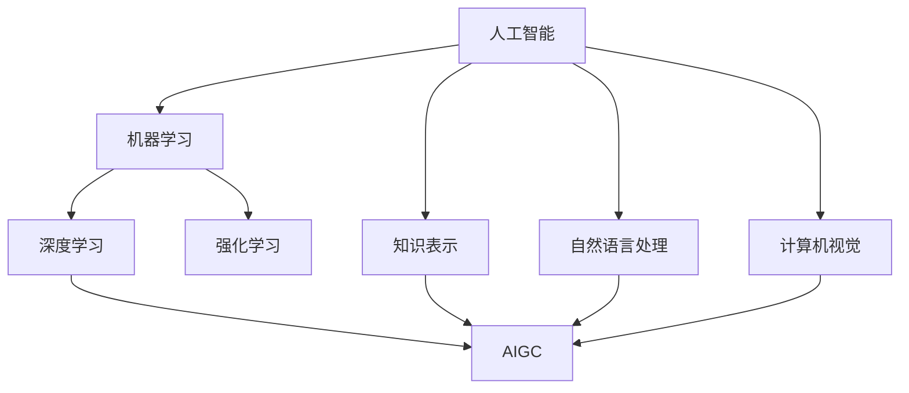

# AIGC从入门到实战：基建：人工智能时代的变迁

## 1. 背景介绍

### 1.1 人工智能的发展历程

人工智能(Artificial Intelligence,AI)自1956年达特茅斯会议正式提出以来,经历了几次起起伏伏的发展历程。早期的人工智能主要专注于推理、搜索等方面,如专家系统等。进入21世纪,得益于深度学习算法、大数据和算力的突破,人工智能迎来了新的春天。

### 1.2 AIGC的兴起

AIGC(AI Generated Content)是人工智能技术应用的新兴领域,它利用AI算法自动生成各种内容,如图像、视频、文本、音频等。从DALL-E、Midjourney到ChatGPT、Stable Diffusion,AIGC正在掀起一场内容生产革命。

### 1.3 AIGC对社会的影响

AIGC技术正在对各行各业产生深远影响,它极大提高了内容生产效率,降低了成本,同时也带来了版权、伦理等新的挑战。AIGC正引领人工智能从感知智能走向认知智能、创造智能的新阶段。

## 2. 核心概念与联系

### 2.1 人工智能的定义与分类

人工智能是研究、开发用于模拟、延伸和扩展人的智能的理论、方法、技术及应用系统的一门新的技术科学。按照实现方式,可分为符号主义、连接主义和行为主义三大流派。按照应用领域,可分为感知智能、认知智能和创造智能。

### 2.2 机器学习的概念与分类

机器学习是人工智能的核心,它通过算法使机器从数据中自动分析获得规律,并利用规律对未知数据进行预测。常见的机器学习算法包括监督学习、无监督学习、强化学习等。深度学习是机器学习的一个重要分支。

### 2.3 AIGC与人工智能、机器学习的关系

AIGC是人工智能技术在内容生成领域的具体应用,它综合利用了机器学习、深度学习、自然语言处理、计算机视觉等多种AI技术,使机器能够根据要求自动生成高质量的内容。AIGC是人工智能发展的必然趋势。



## 3. 核心算法原理具体操作步骤

### 3.1 基于transformer的生成模型

transformer是AIGC的核心算法架构,它通过self-attention机制实现了长距离依赖建模。以GPT系列模型为例,它的基本流程如下:

1. 对输入文本进行token化,转换为词嵌入向量
2. 将向量输入到多层transformer block中,通过self-attention和前馈网络提取特征
3. 在最后一层transformer block的输出上连接线性层和softmax,生成下一个token的概率分布
4. 根据概率分布采样生成下一个token,不断重复直到生成结束标记

### 3.2 GAN生成模型

GAN(Generative Adversarial Network)是另一种常用的生成模型,通过生成器和判别器的对抗学习,可以生成逼真的图像。基本流程如下:

1. 随机采样隐空间向量z作为生成器G的输入
2. 生成器G将z映射到图像空间,生成假样本
3. 判别器D同时接收真实样本和生成的假样本,尝试进行二分类
4. 通过最小最大博弈目标函数优化G和D,使G生成的图像尽可能逼真,D尽可能分辨不出真假
5. 重复以上步骤,直到G和D达到平衡

### 3.3 扩散模型

扩散模型是近年来兴起的一种生成模型,通过迭代的正向扩散和反向去噪过程生成高质量图像。基本流程如下:

1. 在训练阶段,对真实图像x进行T步正向扩散,在每一步加入高斯噪声,得到一系列逐渐被噪声破坏的图像$x_1,x_2,...,x_T$
2. 训练去噪自回归模型,学习从$x_t$预测$x_{t-1}$的条件概率分布,即从噪声较大的图像恢复噪声较小的图像
3. 在推理阶段,从高斯噪声采样$x_T$,然后迭代T步反向去噪过程,每一步根据去噪模型的预测采样$x_{t-1}$,最终得到干净的生成图像$x_0$

## 4. 数学模型和公式详细讲解举例说明

### 4.1 transformer的数学原理

transformer的核心是self-attention机制,对于一个长度为n的输入序列$X=(x_1,x_2,...,x_n)$,self-attention的计算过程如下:

1. 将输入$x_i$通过三个线性变换得到查询向量$q_i$、键向量$k_i$、值向量$v_i$:

$$q_i=W_Qx_i, k_i=W_Kx_i, v_i=W_Vx_i$$

2. 计算查询向量和所有键向量的点积注意力分数,并做softmax归一化:

$$\alpha_{ij}=\frac{\exp(q_i \cdot k_j)}{\sum_{j=1}^n \exp(q_i \cdot k_j)}$$

3. 将注意力分数与值向量加权求和,得到输出向量$z_i$:

$$z_i=\sum_{j=1}^n \alpha_{ij}v_j$$

通过self-attention,transformer可以灵活地建模任意两个位置之间的依赖关系,捕捉长距离信息。

### 4.2 GAN的损失函数

GAN的训练目标可以表示为生成器G和判别器D的最小最大博弈:

$$\min_G \max_D V(D,G)=\mathbb{E}_{x \sim p_{data}(x)}[\log D(x)]+\mathbb{E}_{z \sim p_z(z)}[\log (1-D(G(z)))]$$

其中$p_{data}$为真实数据分布,$p_z$为隐空间先验分布。这个目标函数可以解释为:

- 判别器D尝试最大化真实样本的对数概率$\log D(x)$和假样本的对数概率$\log (1-D(G(z)))$
- 生成器G尝试最小化假样本被判别器识别出的对数概率$\log (1-D(G(z)))$,即最大化$\log D(G(z))$

通过交替优化G和D,最终使G生成的样本分布接近真实数据分布。

### 4.3 扩散模型的前向过程和反向过程

扩散模型的前向过程是一个马尔可夫链,每一步加入高斯噪声:

$$q(x_t|x_{t-1})=\mathcal{N}(x_t;\sqrt{1-\beta_t}x_{t-1},\beta_t I)$$

其中$\beta_t$是噪声强度的超参数。反向过程是另一个马尔可夫链,每一步去除噪声:

$$p_\theta(x_{t-1}|x_t)=\mathcal{N}(x_{t-1};\mu_\theta(x_t,t),\sigma_\theta(x_t,t))$$

其中$\mu_\theta,\sigma_\theta$是用神经网络参数化的均值和方差。扩散模型的训练目标是最大化反向过程的似然概率:

$$\max_\theta \mathbb{E}_{x_0 \sim p_{data},\epsilon \sim \mathcal{N}(0,I)}[\log p_\theta(x_0|x_1)] \\
=\max_\theta \mathbb{E}_{x_0 \sim p_{data},\epsilon \sim \mathcal{N}(0,I)}[\log p_\theta(x_{t-1}|x_t)]
$$

## 5. 项目实践：代码实例和详细解释说明

下面以PyTorch实现一个简单的基于transformer的语言模型为例。

```python
import torch
import torch.nn as nn

class TransformerBlock(nn.Module):
    def __init__(self, embed_dim, num_heads, ff_dim):
        super().__init__()
        self.attn = nn.MultiheadAttention(embed_dim, num_heads)
        self.ff = nn.Sequential(
            nn.Linear(embed_dim, ff_dim),
            nn.ReLU(),
            nn.Linear(ff_dim, embed_dim)
        )
        self.norm1 = nn.LayerNorm(embed_dim)
        self.norm2 = nn.LayerNorm(embed_dim)
    
    def forward(self, x):
        x = self.norm1(x + self.attn(x, x, x)[0])
        x = self.norm2(x + self.ff(x))
        return x

class TransformerLM(nn.Module):
    def __init__(self, vocab_size, embed_dim, num_heads, ff_dim, num_layers):
        super().__init__()
        self.embed = nn.Embedding(vocab_size, embed_dim)
        self.pos_embed = nn.Parameter(torch.zeros(1, 512, embed_dim))
        self.blocks = nn.Sequential(*[TransformerBlock(embed_dim, num_heads, ff_dim) for _ in range(num_layers)])
        self.norm = nn.LayerNorm(embed_dim)
        self.out = nn.Linear(embed_dim, vocab_size)
    
    def forward(self, x):
        x = self.embed(x) + self.pos_embed[:,:x.size(1)]
        x = self.blocks(x)
        x = self.norm(x)
        x = self.out(x)
        return x
```

代码解释:

- TransformerBlock类实现了transformer的基本组件,包括多头自注意力、前馈网络和层归一化
- TransformerLM类实现了完整的语言模型,包括词嵌入、位置编码、多层TransformerBlock和最后的线性输出层
- 前向传播时,先将输入token转为嵌入向量并加上位置编码,然后通过多层TransformerBlock提取特征,最后通过线性层输出每个位置下一个token的概率分布

这个语言模型可以用teacher forcing的方式训练,即根据当前token预测下一个token,然后与真实的下一个token计算交叉熵损失。训练完成后,可以通过不断采样下一个token的方式生成文本。

## 6. 实际应用场景

AIGC技术可以应用于以下场景:

- 文案写作:自动生成新闻报道、产品介绍、广告文案等
- 对话助手:打造个性化的智能对话系统,如客服、陪聊、教育助手等
- 创意设计:自动生成各种图像、视频、音乐、3D模型等,辅助设计工作
- 游戏开发:自动生成游戏关卡、NPC对话、任务描述等游戏内容
- 教育培训:自动生成教案、试题、讲解视频等教育资源
- 医疗健康:自动撰写诊断报告、病例分析、医学论文等
- 金融投资:自动生成投资报告、市场分析、风险评估等
- 法律服务:自动生成合同、案例分析、法律意见等

总之,AIGC可以极大提高各行业的内容生产效率,释放人力,促进产业升级。但同时也要警惕AIGC可能带来的版权侵犯、隐私泄露、伦理失范等问题。

## 7. 工具和资源推荐

- 开源框架:PyTorch、TensorFlow、Keras、Jax等
- 预训练模型:GPT-3、DALL-E、Stable Diffusion、Whisper等
- 数据集:ImageNet、COCO、Conceptual Captions、Wikitext等
- 评测基准:GLUE、SuperGLUE、COCO Caption等
- 论文列表:https://github.com/wgwang/AIGC-paper-list
- 课程教程:DeepLearning.AI、fast.ai等
- 社区讨论:Twitter #AIGC、Reddit r/MediaSynthesis等

## 8. 总结：未来发展趋势与挑战

AIGC代表了人工智能从感知智能向认知智能、创造智能进化的趋势。未来AIGC技术将向以下方向发展:

- 多模态融合:打通文本、语音、视觉等不同模态,实现更自然的人机交互
- 个性化定制:根据用户的偏好、习惯生成个性化的内容,提供更好的用户体验
- 知识指导:融入常识、领域知识指导内容生成,提高生成内容的合理性、专业性
- 人机协作:人类提供创意、审美,机器提供效率、优化,实现人机协同创作

同时,AIGC也面临一些挑战