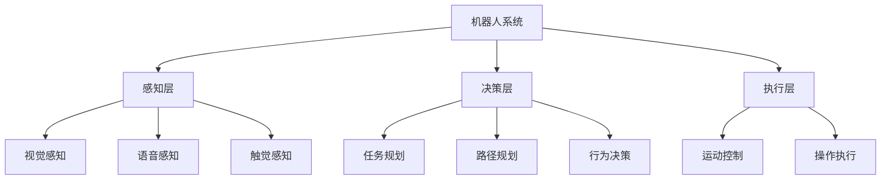

# AI人工智能 Agent：在机器人领域的应用

## 1. 背景介绍
### 1.1 人工智能的发展历程
#### 1.1.1 人工智能的起源与定义
#### 1.1.2 人工智能的三次浪潮
#### 1.1.3 当前人工智能的发展现状
### 1.2 机器人技术的发展
#### 1.2.1 机器人的定义与分类
#### 1.2.2 机器人技术的发展历程
#### 1.2.3 机器人在各领域的应用现状
### 1.3 人工智能与机器人的融合
#### 1.3.1 人工智能赋能机器人
#### 1.3.2 智能机器人的优势与挑战
#### 1.3.3 AI Agent在机器人领域的应用前景

## 2. 核心概念与联系
### 2.1 AI Agent的定义与特点
#### 2.1.1 AI Agent的定义
#### 2.1.2 AI Agent的特点
#### 2.1.3 AI Agent与传统程序的区别
### 2.2 AI Agent在机器人领域的应用模式
#### 2.2.1 自主决策型AI Agent
#### 2.2.2 人机协作型AI Agent
#### 2.2.3 群体智能型AI Agent
### 2.3 AI Agent与机器人系统的关系
#### 2.3.1 AI Agent在机器人感知层的应用
#### 2.3.2 AI Agent在机器人决策层的应用
#### 2.3.3 AI Agent在机器人执行层的应用



## 3. 核心算法原理具体操作步骤
### 3.1 基于深度学习的视觉感知
#### 3.1.1 卷积神经网络(CNN)
#### 3.1.2 目标检测与识别
#### 3.1.3 语义分割
### 3.2 基于强化学习的决策控制
#### 3.2.1 马尔可夫决策过程(MDP)
#### 3.2.2 Q-Learning算法
#### 3.2.3 Deep Q-Network(DQN)算法
### 3.3 基于进化算法的机器人优化
#### 3.3.1 遗传算法(GA)
#### 3.3.2 粒子群优化(PSO)算法
#### 3.3.3 蚁群算法(ACO)

## 4. 数学模型和公式详细讲解举例说明
### 4.1 马尔可夫决策过程(MDP)
MDP是一个五元组$\langle S,A,P,R,\gamma \rangle$，其中：
- $S$表示状态空间，$s \in S$
- $A$表示动作空间，$a \in A$
- $P$表示状态转移概率，$P(s'|s,a)$表示在状态$s$下执行动作$a$后转移到状态$s'$的概率
- $R$表示奖励函数，$R(s,a)$表示在状态$s$下执行动作$a$获得的即时奖励
- $\gamma$表示折扣因子，$\gamma \in [0,1]$

MDP的目标是找到一个最优策略$\pi^*$，使得期望累积奖励最大化：

$$\pi^* = \arg\max_{\pi} \mathbb{E}\left[\sum_{t=0}^{\infty} \gamma^t R(s_t,a_t)\right]$$

其中，$s_t$和$a_t$分别表示在时刻$t$的状态和动作。

### 4.2 Q-Learning算法
Q-Learning是一种常用的无模型强化学习算法，用于求解MDP问题。Q-Learning算法的核心是学习一个最优的Q函数$Q^*(s,a)$，表示在状态$s$下执行动作$a$的期望累积奖励。

Q-Learning算法的更新公式为：

$$Q(s,a) \leftarrow Q(s,a) + \alpha \left[R(s,a) + \gamma \max_{a'} Q(s',a') - Q(s,a)\right]$$

其中，$\alpha$表示学习率，$s'$表示在状态$s$下执行动作$a$后转移到的下一个状态。

## 5. 项目实践：代码实例和详细解释说明
下面以一个简单的机器人避障问题为例，演示如何使用Q-Learning算法训练一个AI Agent。

```python
import numpy as np

# 定义状态空间和动作空间
states = np.array([[0, 0], [0, 1], [0, 2], [0, 3], 
                   [1, 0], [1, 1], [1, 2], [1, 3]])
actions = np.array(['up', 'down', 'left', 'right'])

# 定义奖励矩阵
rewards = np.array([[0, 0, 0, 1], 
                    [0, 0, 0, -1],
                    [0, 0, 0, 0],
                    [0, 0, 0, 0]])

# 初始化Q表
Q = np.zeros((states.shape[0], actions.shape[0]))

# 设置超参数
alpha = 0.8  # 学习率
gamma = 0.9  # 折扣因子
num_episodes = 1000  # 训练轮数

# 开始训练
for episode in range(num_episodes):
    state = np.random.randint(0, states.shape[0])  # 随机选择初始状态
    while True:
        action = np.argmax(Q[state, :] + np.random.randn(1, actions.shape[0]) * (1. / (episode + 1)))  # ε-greedy策略选择动作
        next_state = np.random.choice(np.where(rewards[state, :] != -1)[0])  # 根据奖励矩阵选择下一个状态
        reward = rewards[state, next_state]  # 获得奖励
        Q[state, action] = Q[state, action] + alpha * (reward + gamma * np.max(Q[next_state, :]) - Q[state, action])  # 更新Q表
        state = next_state  # 更新状态
        if reward != 0:  # 如果到达终止状态，则结束本轮训练
            break

print(Q)  # 输出训练后的Q表
```

在上面的代码中，我们首先定义了状态空间、动作空间和奖励矩阵。然后初始化Q表，并设置了学习率、折扣因子和训练轮数等超参数。在每一轮训练中，我们随机选择一个初始状态，然后使用ε-greedy策略选择动作，根据奖励矩阵选择下一个状态，并获得相应的奖励。接着，我们使用Q-Learning算法的更新公式来更新Q表。当到达终止状态时，本轮训练结束。最后，我们输出训练后的Q表。

通过训练，AI Agent学会了在不同状态下选择最优动作，从而实现了避障的目标。

## 6. 实际应用场景
### 6.1 智能仓储机器人
#### 6.1.1 背景介绍
#### 6.1.2 技术方案
#### 6.1.3 应用效果
### 6.2 家庭服务机器人
#### 6.2.1 背景介绍
#### 6.2.2 技术方案 
#### 6.2.3 应用效果
### 6.3 医疗康复机器人
#### 6.3.1 背景介绍
#### 6.3.2 技术方案
#### 6.3.3 应用效果

## 7. 工具和资源推荐
### 7.1 机器人仿真平台
#### 7.1.1 Gazebo
#### 7.1.2 V-REP
#### 7.1.3 Webots
### 7.2 机器人开发框架
#### 7.2.1 ROS
#### 7.2.2 YARP 
#### 7.2.3 MOOS
### 7.3 机器学习平台
#### 7.3.1 TensorFlow
#### 7.3.2 PyTorch
#### 7.3.3 Keras

## 8. 总结：未来发展趋势与挑战
### 8.1 未来发展趋势
#### 8.1.1 多模态感知与融合
#### 8.1.2 类脑智能
#### 8.1.3 群体智能
### 8.2 面临的挑战
#### 8.2.1 安全与伦理
#### 8.2.2 鲁棒性与适应性
#### 8.2.3 可解释性与可信性

## 9. 附录：常见问题与解答
### 9.1 如何选择合适的机器人平台？
### 9.2 如何进行机器人系统的性能评估？
### 9.3 如何处理机器人系统中的不确定性问题？

AI Agent技术与机器人的融合，为机器人赋予了更加智能、自主的能力，极大地拓展了机器人的应用场景和服务范围。未来，随着人工智能技术的不断发展和成熟，AI Agent必将在机器人领域发挥越来越重要的作用，推动机器人技术向着更加智能化、人性化的方向发展。同时，我们也要清醒地认识到，AI Agent在机器人领域的应用仍然面临诸多挑战，需要产学研各界的共同努力，在不断探索和实践中寻求突破。相信通过持续不断的创新与进步，AI Agent必将引领机器人技术走向更加美好的未来。

作者：禅与计算机程序设计艺术 / Zen and the Art of Computer Programming