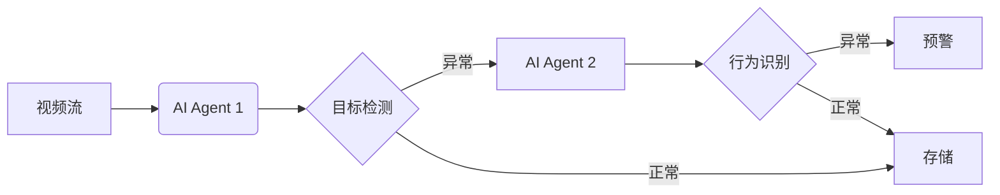

# AI人工智能代理工作流 AI Agent WorkFlow：在视频监控中的应用

## 1. 背景介绍
近年来,随着人工智能技术的飞速发展,AI在各个领域得到了广泛应用。其中,视频监控作为一个重要的应用场景,正在被AI技术所重塑和升级。传统的视频监控系统主要依靠人工值守,存在效率低下、准确率不高等问题。而引入AI技术后,尤其是AI Agent工作流,可以大大提升视频监控的智能化水平。

### 1.1 视频监控面临的挑战
#### 1.1.1 海量视频数据
#### 1.1.2 实时性要求高  
#### 1.1.3 复杂多变的场景
### 1.2 AI赋能视频监控
#### 1.2.1 智能视频分析
#### 1.2.2 异常行为检测
#### 1.2.3 目标跟踪与识别

## 2. 核心概念与联系
要理解AI Agent工作流在视频监控中的应用,首先需要明确几个核心概念:

### 2.1 AI Agent
AI Agent是一种智能体,能够感知环境,根据设定的目标自主地做出决策和执行动作,从而完成特定任务。它包含感知、决策、执行等模块。

### 2.2 工作流 Workflow
工作流是一系列有序的任务和活动,用于实现特定的业务目标。它定义了任务的执行顺序、分支条件、所需资源等。

### 2.3 计算机视觉 
计算机视觉是一门研究如何使机器"看懂"数字图像和视频的科学。它包括图像处理、目标检测与识别、语义分割等技术。

在视频监控场景下,多个AI Agent协同工作,构成一个工作流,对视频流进行智能分析,及时发现异常情况并预警,形成了一套完整的解决方案。

## 3. 核心算法原理与具体操作步骤
AI Agent工作流中,涉及到多个核心算法,下面以目标检测为例进行讲解。

### 3.1 目标检测算法YOLOv3
目标检测是识别出图像中感兴趣目标(如人、车等)的位置和类别。YOLOv3是一种常用的实时目标检测算法。

#### 3.1.1 特征提取
利用深度卷积神经网络提取图像的多尺度特征。

#### 3.1.2 预测
在特征图上进行密集预测,每个预测包括边界框位置、置信度、类别概率。 

#### 3.1.3 后处理NMS
采用非极大值抑制消除冗余和低质量的预测框。

### 3.2 具体操作步骤
1. 输入图像,进行预处理(缩放、归一化)
2. 送入骨干网络提取特征
3. 在3个尺度的特征图上进行预测
4. 应用NMS,获得最终检测结果
5. 可视化,将检测框绘制在原图上

## 4. 数学模型和公式详解
目标检测中的一个关键步骤是边界框回归,即预测目标的位置和大小。以下是YOLO v3的边界框回归公式:

$$ b_x = \sigma(t_x) + c_x $$
$$ b_y = \sigma(t_y) + c_y $$
$$ b_w = p_w e^{t_w} $$
$$ b_h = p_h e^{t_h} $$

其中:
- $b_x, b_y, b_w, b_h$ 是预测框的中心坐标和宽高
- $t_x, t_y, t_w, t_h$ 是网络预测的偏移量
- $c_x, c_y$ 是当前单元格左上角坐标  
- $p_w, p_h$ 是先验框(anchor)的宽高
- $\sigma$ 是 sigmoid 激活函数

通过以上公式,可以根据网络预测值和先验框计算出预测框的实际位置和大小。这是YOLO算法的核心之一。

## 5. 项目实践：代码实例和详解
下面是使用PyTorch实现YOLOv3目标检测的核心代码:

```python
class YOLOLayer(nn.Module):
    def __init__(self, anchors, num_classes):
        super().__init__()
        self.anchors = anchors
        self.num_classes = num_classes

    def forward(self, x, img_size):
        batch_size, _, h, w = x.shape
        stride = img_size // h
        
        # 预测值重塑为(batch_size, 3, h, w, num_classes+5)
        prediction = x.view(batch_size, len(self.anchors), self.num_classes + 5, h, w).permute(0, 1, 3, 4, 2).contiguous()
        
        # 从预测值中分离出xy坐标、宽高、置信度和类别概率
        x = torch.sigmoid(prediction[..., 0])
        y = torch.sigmoid(prediction[..., 1])
        w = prediction[..., 2]
        h = prediction[..., 3]
        conf = torch.sigmoid(prediction[..., 4])
        pred_cls = torch.sigmoid(prediction[..., 5:])

        # 计算预测框的实际中心坐标和宽高
        pred_boxes = FloatTensor(prediction[..., :4].shape)
        pred_boxes[..., 0] = x + grid_x
        pred_boxes[..., 1] = y + grid_y
        pred_boxes[..., 2] = torch.exp(w) * self.anchors[:, 0].view(1, -1, 1, 1)
        pred_boxes[..., 3] = torch.exp(h) * self.anchors[:, 1].view(1, -1, 1, 1)
        
        # 将预测值调整为实际尺寸
        output = torch.cat((pred_boxes.view(batch_size, -1, 4) * stride, conf.view(batch_size, -1, 1), pred_cls.view(batch_size, -1, self.num_classes)), -1)
        return output
```

这段代码定义了YOLO检测层,实现了以下功能:

1. 初始化时传入先验框(anchor)尺寸和类别数
2. 前向传播时,将网络预测值重塑并分离出各个部分
3. 根据公式计算预测框的实际位置和大小
4. 将预测值调整为输入图像的实际尺寸
5. 返回最终的检测结果,包括位置、置信度和类别概率

在实际项目中,还需要进行数据加载、骨干网络搭建、损失函数定义、后处理NMS等步骤,这里不再赘述。

## 6. 实际应用场景
AI Agent工作流在视频监控领域有广泛的应用,例如:

### 6.1 智慧城市
在城市的主要道路、广场等公共区域部署智能监控系统,通过AI算法实时分析视频内容,及时发现交通事故、违法犯罪等异常情况,提高城市管理效率。

### 6.2 平安校园
在校园内安装智能摄像头,利用AI算法识别学生的异常行为,如打架斗殴、翻越围墙等,为校园安全保驾护航。

### 6.3 工业安防
在工厂、仓库等场所应用AI视频监控,通过对人员、设备的智能识别和跟踪,及时发现安全隐患,预防事故发生。

## 7. 工具和资源推荐
- PyTorch: 流行的深度学习框架,可用于搭建各种AI模型
- OpenCV: 开源的计算机视觉库,提供了图像处理的各种算法
- YOLO: 优秀的实时目标检测算法,在速度和精度上都有不错表现
- COCO数据集: 大规模的目标检测数据集,常用于算法训练和测试

## 8. 总结：未来发展趋势与挑战
AI Agent工作流正在深刻变革视频监控行业,使监控系统变得更加智能和高效。展望未来,这一技术还将不断发展:

### 8.1 算法的轻量化
为了让AI算法在监控摄像头等边缘设备上运行,需要进一步压缩模型,降低计算量,实现端侧智能。

### 8.2 多模态感知
结合视频、音频、雷达等多种传感器数据,构建多模态的感知系统,全面提升异常行为检测和预警能力。

### 8.3 数据安全和隐私保护
在采集和使用视频数据的过程中,要高度重视个人隐私保护,建立健全的数据安全机制。

同时,AI视频监控也面临一些挑战:

### 8.4 复杂环境下的鲁棒性
在光照变化、天气恶劣等复杂环境下,保证算法稳定性是一大挑战。

### 8.5 小样本学习
现实场景中异常事件的样本数量有限,需要探索小样本甚至零样本学习的方法。

### 8.6 人机协作
如何实现人机协同,发挥人的经验和机器的效率,是值得深入研究的问题。

## 9. 附录：常见问题与解答
### Q1: 边缘计算和云计算如何结合？
A1: 可以将一些前处理和初步分析任务放在边缘端,而复杂的训练和推理在云端进行,实现端云协同。

### Q2: 如何评估视频监控算法的性能？  
A2: 通常采用准确率、召回率、平均精度(mAP)等指标,在标准数据集上进行测试。

### Q3: 视频监控领域还有哪些前沿技术值得关注？
A3: 多目标跟踪、行为识别、人群密度估计等是一些热点研究方向。

总之,AI正在为视频监控赋予全新的内涵,AI Agent工作流是一种优秀的架构和解决方案。相信通过产学研各界的共同努力,智能视频监控必将迎来更加广阔的应用前景,为社会安全和城市治理贡献力量。



作者：禅与计算机程序设计艺术 / Zen and the Art of Computer Programming