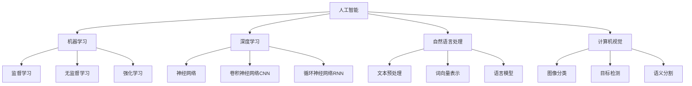

# AI原理与代码实例讲解

## 1.背景介绍
### 1.1 人工智能的发展历程
#### 1.1.1 人工智能的起源与早期发展
#### 1.1.2 人工智能的黄金时期
#### 1.1.3 人工智能的低谷期与复兴
### 1.2 人工智能的分类与应用领域  
#### 1.2.1 人工智能的主要分支
#### 1.2.2 人工智能在各行业的应用现状
### 1.3 人工智能面临的机遇与挑战
#### 1.3.1 人工智能技术的快速发展带来的机遇
#### 1.3.2 人工智能发展过程中面临的伦理与安全挑战

## 2.核心概念与联系
### 2.1 机器学习
#### 2.1.1 监督学习
#### 2.1.2 无监督学习  
#### 2.1.3 强化学习
### 2.2 深度学习
#### 2.2.1 神经网络
#### 2.2.2 卷积神经网络（CNN）
#### 2.2.3 循环神经网络（RNN）
### 2.3 自然语言处理
#### 2.3.1 文本预处理
#### 2.3.2 词向量表示
#### 2.3.3 语言模型
### 2.4 计算机视觉  
#### 2.4.1 图像分类
#### 2.4.2 目标检测
#### 2.4.3 语义分割



## 3.核心算法原理具体操作步骤
### 3.1 BP神经网络
#### 3.1.1 网络结构
#### 3.1.2 前向传播
#### 3.1.3 反向传播
#### 3.1.4 参数更新
### 3.2 卷积神经网络
#### 3.2.1 卷积层
#### 3.2.2 池化层  
#### 3.2.3 全连接层
### 3.3 循环神经网络
#### 3.3.1 基本RNN结构
#### 3.3.2 LSTM
#### 3.3.3 GRU
### 3.4 注意力机制
#### 3.4.1 Seq2Seq模型
#### 3.4.2 注意力机制原理
#### 3.4.3 自注意力机制

## 4.数学模型和公式详细讲解举例说明
### 4.1 损失函数  
#### 4.1.1 均方误差损失
$$L(y, \hat{y}) = \frac{1}{n} \sum_{i=1}^{n} (y_i - \hat{y}_i)^2$$
其中，$y_i$ 为真实值，$\hat{y}_i$ 为预测值，$n$ 为样本数。

#### 4.1.2 交叉熵损失
对于二分类问题，交叉熵损失定义为：
$$L(y, \hat{y}) = -\frac{1}{n} \sum_{i=1}^{n} [y_i \log(\hat{y}_i) + (1-y_i) \log(1-\hat{y}_i)]$$

对于多分类问题，交叉熵损失定义为：  
$$L(y, \hat{y}) = -\frac{1}{n} \sum_{i=1}^{n} \sum_{j=1}^{m} y_{ij} \log(\hat{y}_{ij})$$
其中，$y_{ij}$ 为真实标签的 one-hot 编码，$\hat{y}_{ij}$ 为预测概率，$m$ 为类别数。

### 4.2 优化算法
#### 4.2.1 梯度下降法
$$\theta := \theta - \alpha \nabla_{\theta} J(\theta)$$
其中，$\theta$ 为待优化参数，$\alpha$ 为学习率，$\nabla_{\theta} J(\theta)$ 为损失函数对参数的梯度。

#### 4.2.2 Adam优化算法
Adam 算法的更新规则为：
$$m_t = \beta_1 m_{t-1} + (1 - \beta_1) g_t$$
$$v_t = \beta_2 v_{t-1} + (1 - \beta_2) g_t^2$$
$$\hat{m}_t = \frac{m_t}{1 - \beta_1^t}$$
$$\hat{v}_t = \frac{v_t}{1 - \beta_2^t}$$
$$\theta_t = \theta_{t-1} - \frac{\alpha}{\sqrt{\hat{v}_t} + \epsilon} \hat{m}_t$$

其中，$m_t$ 和 $v_t$ 分别为一阶矩估计和二阶矩估计，$\beta_1$ 和 $\beta_2$ 为衰减率，$\epsilon$ 为平滑项，$\alpha$ 为学习率。

## 5.项目实践：代码实例和详细解释说明
### 5.1 利用PyTorch实现BP神经网络
```python
import torch
import torch.nn as nn
import torch.optim as optim

# 定义BP神经网络
class Net(nn.Module):
    def __init__(self, input_size, hidden_size, output_size):
        super(Net, self).__init__()
        self.hidden = nn.Linear(input_size, hidden_size) 
        self.output = nn.Linear(hidden_size, output_size)

    def forward(self, x):
        x = torch.relu(self.hidden(x))
        x = self.output(x)
        return x

# 超参数设置  
input_size = 784
hidden_size = 500 
output_size = 10
learning_rate = 0.001
num_epochs = 5
batch_size = 100

# 加载MNIST数据集
train_dataset = torchvision.datasets.MNIST(root='./data', 
                                           train=True, 
                                           transform=transforms.ToTensor(),
                                           download=True)

test_dataset = torchvision.datasets.MNIST(root='./data', 
                                          train=False, 
                                          transform=transforms.ToTensor())

# 数据加载器
train_loader = torch.utils.data.DataLoader(dataset=train_dataset, 
                                           batch_size=batch_size, 
                                           shuffle=True)

test_loader = torch.utils.data.DataLoader(dataset=test_dataset, 
                                          batch_size=batch_size, 
                                          shuffle=False)

# 初始化模型
model = Net(input_size, hidden_size, output_size)

# 定义损失函数和优化器
criterion = nn.CrossEntropyLoss()
optimizer = optim.Adam(model.parameters(), lr=learning_rate)

# 训练模型
total_step = len(train_loader)
for epoch in range(num_epochs):
    for i, (images, labels) in enumerate(train_loader):
        # 前向传播
        outputs = model(images.reshape(-1, 28*28))
        loss = criterion(outputs, labels)
        
        # 反向传播和优化
        optimizer.zero_grad()
        loss.backward()
        optimizer.step()
        
        if (i+1) % 100 == 0:
            print('Epoch [{}/{}], Step [{}/{}], Loss: {:.4f}' 
                  .format(epoch+1, num_epochs, i+1, total_step, loss.item()))

# 测试模型
with torch.no_grad():
    correct = 0
    total = 0
    for images, labels in test_loader:
        outputs = model(images.reshape(-1, 28*28))
        _, predicted = torch.max(outputs.data, 1)
        total += labels.size(0)
        correct += (predicted == labels).sum().item()

    print('Accuracy of the network on the 10000 test images: {} %'.format(100 * correct / total))
```

以上代码实现了一个简单的BP神经网络，用于对MNIST手写数字进行分类。主要步骤包括：

1. 定义BP神经网络的结构，包括输入层、隐藏层和输出层。
2. 加载MNIST数据集，并使用DataLoader进行数据加载。  
3. 初始化模型，定义损失函数（交叉熵损失）和优化器（Adam）。
4. 进行模型训练，对每个batch的数据进行前向传播、计算损失、反向传播和参数更新。
5. 在测试集上评估模型性能，计算分类准确率。

### 5.2 利用TensorFlow实现卷积神经网络
```python
import tensorflow as tf
from tensorflow import keras
from tensorflow.keras import layers

# 加载CIFAR-10数据集
(x_train, y_train), (x_test, y_test) = keras.datasets.cifar10.load_data()

# 数据预处理
x_train = x_train.astype('float32') / 255.0
x_test = x_test.astype('float32') / 255.0
y_train = keras.utils.to_categorical(y_train, 10)
y_test = keras.utils.to_categorical(y_test, 10)

# 定义CNN模型
model = keras.Sequential(
    [
        layers.Conv2D(32, (3, 3), activation='relu', input_shape=(32, 32, 3)),
        layers.MaxPooling2D((2, 2)),
        layers.Conv2D(64, (3, 3), activation='relu'),
        layers.MaxPooling2D((2, 2)),
        layers.Conv2D(64, (3, 3), activation='relu'),
        layers.Flatten(),
        layers.Dense(64, activation='relu'),
        layers.Dense(10, activation='softmax')
    ]
)

# 编译模型
model.compile(optimizer='adam',
              loss='categorical_crossentropy',
              metrics=['accuracy'])

# 训练模型
model.fit(x_train, y_train, epochs=10, batch_size=64, validation_data=(x_test, y_test))

# 评估模型
test_loss, test_acc = model.evaluate(x_test, y_test)
print('Test accuracy:', test_acc)
```

以上代码使用TensorFlow和Keras实现了一个卷积神经网络，用于对CIFAR-10图像数据集进行分类。主要步骤包括：

1. 加载CIFAR-10数据集，并进行数据预处理，将像素值归一化到[0, 1]范围，将标签转换为one-hot编码。
2. 定义CNN模型的结构，包括卷积层、池化层、全连接层等。
3. 编译模型，指定优化器、损失函数和评估指标。
4. 训练模型，指定训练轮数和批次大小，同时使用验证集进行模型评估。  
5. 在测试集上评估模型的性能，输出测试准确率。

## 6.实际应用场景
### 6.1 智能客服
利用自然语言处理技术，实现智能客服系统，自动回答用户的常见问题，提高客服效率和用户满意度。
### 6.2 医学影像分析
利用计算机视觉技术，对医学影像如X光片、CT、MRI等进行自动分析和诊断，辅助医生进行疾病筛查和诊断。
### 6.3 自动驾驶
利用计算机视觉和决策技术，实现车辆的自动驾驶，提高交通安全和出行效率。
### 6.4 个性化推荐  
利用机器学习技术，根据用户的历史行为和偏好，为其推荐感兴趣的商品、内容等，提高用户粘性和转化率。

## 7.工具和资源推荐
### 7.1 深度学习框架
- TensorFlow：由Google开发的开源机器学习框架，支持多种编程语言，适用于大规模机器学习和深度学习应用。
- PyTorch：由Facebook开发的开源机器学习库，具有动态计算图和自动求导等特性，适用于研究和快速原型开发。
- Keras：基于TensorFlow、Theano等后端的高层神经网络API，提供了简洁易用的接口，适合快速搭建和训练深度学习模型。

### 7.2 数据集
- MNIST：手写数字识别数据集，包含60,000个训练样本和10,000个测试样本，每个样本为28x28像素的灰度图像。
- CIFAR-10/CIFAR-100：小型图像分类数据集，CIFAR-10包含10个类别，每个类别有6,000张32x32像素的彩色图像；CIFAR-100包含100个类别，每个类别有600张图像。
- ImageNet：大型图像分类数据集，包含超过1,400万张图像，涵盖21,841个类别，常用于评测图像分类算法的性能。

### 7.3 在线课程与教程
- 吴恩达的机器学习课程：Coursera上的经典机器学习课程，涵盖了机器学习的基本概念和算法，适合初学者入门。
- 斯坦福大学CS231n课程：介绍卷积神经网络与计算机视觉的课程，包含详细的讲义、作业和项目，适合深入学习计算机视觉领域。
- TensorFlow官方教程：TensorFlow官网提供的教