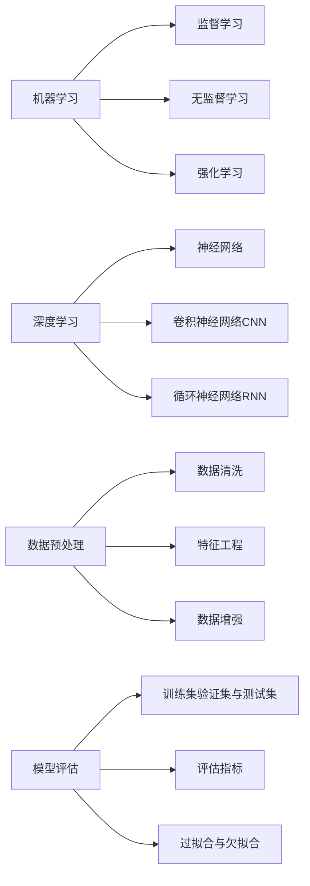

# AI工程流程原理与代码实战案例讲解

## 1.背景介绍

人工智能(Artificial Intelligence,AI)技术近年来飞速发展,已经在许多领域取得了令人瞩目的成就。从语音识别、图像分类到自然语言处理,AI正在深刻改变着我们的生活和工作方式。然而,要将AI技术应用到实际的工程项目中,需要遵循一定的流程和原理。本文将深入探讨AI工程的流程原理,并结合代码实战案例进行讲解,帮助读者系统地掌握AI项目开发的全流程。

### 1.1 AI工程概述
#### 1.1.1 AI工程的定义
#### 1.1.2 AI工程的发展历程
#### 1.1.3 AI工程的应用领域

### 1.2 AI工程面临的挑战
#### 1.2.1 数据质量和数量
#### 1.2.2 算法选择与优化  
#### 1.2.3 模型训练与调优
#### 1.2.4 部署与运维

## 2.核心概念与联系

要深入理解AI工程,首先需要掌握其中的核心概念。本章将介绍AI工程中的关键概念,并阐述它们之间的联系。

### 2.1 机器学习
#### 2.1.1 监督学习
#### 2.1.2 无监督学习  
#### 2.1.3 强化学习

### 2.2 深度学习
#### 2.2.1 神经网络
#### 2.2.2 卷积神经网络(CNN)
#### 2.2.3 循环神经网络(RNN)

### 2.3 数据预处理 
#### 2.3.1 数据清洗
#### 2.3.2 特征工程
#### 2.3.3 数据增强

### 2.4 模型评估
#### 2.4.1 训练集、验证集与测试集
#### 2.4.2 评估指标
#### 2.4.3 过拟合与欠拟合

以下是这些核心概念之间的联系图:



## 3.核心算法原理具体操作步骤

本章将详细介绍几种常用的机器学习和深度学习算法的原理和具体操作步骤。

### 3.1 线性回归
#### 3.1.1 算法原理
#### 3.1.2 损失函数
#### 3.1.3 梯度下降法
#### 3.1.4 正则化

### 3.2 逻辑回归
#### 3.2.1 算法原理 
#### 3.2.2 Sigmoid函数
#### 3.2.3 交叉熵损失函数
#### 3.2.4 多分类逻辑回归

### 3.3 支持向量机(SVM) 
#### 3.3.1 算法原理
#### 3.3.2 核函数
#### 3.3.3 软间隔与正则化
#### 3.3.4 SMO算法

### 3.4 决策树与随机森林
#### 3.4.1 决策树算法原理
#### 3.4.2 信息增益与基尼指数
#### 3.4.3 随机森林算法原理
#### 3.4.4 特征重要性

### 3.5 神经网络
#### 3.5.1 感知机
#### 3.5.2 多层感知机(MLP)
#### 3.5.3 激活函数
#### 3.5.4 反向传播算法

### 3.6 卷积神经网络(CNN)
#### 3.6.1 卷积层
#### 3.6.2 池化层
#### 3.6.3 全连接层 
#### 3.6.4 经典CNN网络结构

### 3.7 循环神经网络(RNN)
#### 3.7.1 RNN基本结构
#### 3.7.2 LSTM
#### 3.7.3 GRU
#### 3.7.4 双向RNN

## 4.数学模型和公式详细讲解举例说明

为了更好地理解AI算法的原理,本章将对一些重要的数学模型和公式进行详细讲解,并给出具体的例子。

### 4.1 线性回归的数学模型
假设我们有一个数据集 $\{(x_1,y_1),(x_2,y_2),...,(x_n,y_n)\}$,其中 $x_i$ 是输入特征, $y_i$ 是对应的目标值。线性回归的目标是找到一个线性函数 $f(x)=wx+b$,使得预测值 $f(x_i)$ 与真实值 $y_i$ 的差距最小。

我们定义损失函数为均方误差(MSE):

$$
J(w,b)=\frac{1}{2n}\sum_{i=1}^n(f(x_i)-y_i)^2
$$

其中 $n$ 是样本数量。我们的目标是找到最优的参数 $w$ 和 $b$,使得损失函数 $J(w,b)$ 最小化。

### 4.2 逻辑回归的数学模型
逻辑回归是一种常用的二分类算法。给定输入特征 $x$,我们希望预测其属于正类(标记为1)的概率 $p(y=1|x)$。

逻辑回归使用Sigmoid函数将线性函数的输出映射到(0,1)区间:

$$
p(y=1|x)=\sigma(wx+b)=\frac{1}{1+e^{-(wx+b)}}
$$

其中 $w$ 是权重向量, $b$ 是偏置项。

对于给定的数据集 $\{(x_1,y_1),(x_2,y_2),...,(x_n,y_n)\}$,我们定义似然函数:

$$
L(w,b)=\prod_{i=1}^np(y_i|x_i;w,b)
$$

取对数后得到对数似然函数:

$$
\log L(w,b)=\sum_{i=1}^n[y_i\log p(y_i|x_i;w,b)+(1-y_i)\log(1-p(y_i|x_i;w,b))]
$$

我们的目标是找到最优的参数 $w$ 和 $b$,使得对数似然函数最大化,等价于最小化交叉熵损失函数:

$$
J(w,b)=-\frac{1}{n}\sum_{i=1}^n[y_i\log p(y_i|x_i;w,b)+(1-y_i)\log(1-p(y_i|x_i;w,b))]
$$

### 4.3 支持向量机的数学模型
支持向量机(SVM)的目标是在特征空间中找到一个超平面,将不同类别的样本分开,并使得分类间隔最大化。

假设超平面方程为 $wx+b=0$,我们希望所有样本都满足:

$$
y_i(wx_i+b)\geq 1,i=1,2,...,n
$$

其中 $y_i\in\{-1,+1\}$ 表示样本的类别标签。

我们定义分类间隔为:

$$
\gamma=\min_{i=1,2,...,n}\frac{y_i(wx_i+b)}{\|w\|}
$$

SVM的目标是最大化分类间隔 $\gamma$,等价于最小化 $\frac{1}{2}\|w\|^2$,同时满足约束条件 $y_i(wx_i+b)\geq 1$。

引入松弛变量 $\xi_i\geq 0$,得到软间隔SVM的优化问题:

$$
\min_{w,b,\xi}\frac{1}{2}\|w\|^2+C\sum_{i=1}^n\xi_i
$$

$$
s.t. y_i(wx_i+b)\geq 1-\xi_i,i=1,2,...,n
$$

$$
\xi_i\geq 0,i=1,2,...,n
$$

其中 $C>0$ 是惩罚参数,用于平衡分类间隔和误分类样本的数量。

## 5.项目实践：代码实例和详细解释说明

本章将通过几个具体的项目实践,演示如何使用Python和常用的机器学习库(如scikit-learn、TensorFlow、PyTorch等)来实现AI算法,并对代码进行详细解释。

### 5.1 基于scikit-learn的线性回归实例

```python
from sklearn.linear_model import LinearRegression
from sklearn.datasets import make_regression
from sklearn.model_selection import train_test_split

# 生成示例数据集
X, y = make_regression(n_samples=100, n_features=1, noise=20, random_state=42)

# 划分训练集和测试集
X_train, X_test, y_train, y_test = train_test_split(X, y, test_size=0.2, random_state=42)

# 创建线性回归模型
model = LinearRegression()

# 训练模型
model.fit(X_train, y_train)

# 在测试集上进行预测
y_pred = model.predict(X_test)

# 输出模型的系数和截距
print("Coefficient: ", model.coef_)
print("Intercept: ", model.intercept_)

# 评估模型性能
print("Mean squared error: %.2f" % mean_squared_error(y_test, y_pred))
print("Coefficient of determination: %.2f" % r2_score(y_test, y_pred))
```

代码解释:
1. 首先从scikit-learn中导入LinearRegression类,用于创建线性回归模型。
2. 使用make_regression函数生成一个示例数据集,包含100个样本,1个特征,噪声为20。
3. 使用train_test_split函数将数据集划分为训练集和测试集,测试集占20%。
4. 创建LinearRegression对象,调用fit方法在训练集上训练模型。
5. 调用predict方法在测试集上进行预测,得到预测值y_pred。
6. 输出模型的系数(coef_)和截距(intercept_)。
7. 使用mean_squared_error和r2_score函数评估模型在测试集上的性能,分别输出均方误差和决定系数。

### 5.2 基于TensorFlow的卷积神经网络实例

```python
import tensorflow as tf
from tensorflow.keras import layers, models
from tensorflow.keras.datasets import mnist

# 加载MNIST数据集
(train_images, train_labels), (test_images, test_labels) = mnist.load_data()

# 数据预处理
train_images = train_images.reshape((60000, 28, 28, 1)) / 255.0
test_images = test_images.reshape((10000, 28, 28, 1)) / 255.0
train_labels = tf.keras.utils.to_categorical(train_labels)
test_labels = tf.keras.utils.to_categorical(test_labels)

# 构建卷积神经网络模型
model = models.Sequential([
    layers.Conv2D(32, (3, 3), activation='relu', input_shape=(28, 28, 1)),
    layers.MaxPooling2D((2, 2)),
    layers.Conv2D(64, (3, 3), activation='relu'),
    layers.MaxPooling2D((2, 2)),
    layers.Conv2D(64, (3, 3), activation='relu'),
    layers.Flatten(),
    layers.Dense(64, activation='relu'),
    layers.Dense(10, activation='softmax')
])

# 编译模型
model.compile(optimizer='adam',
              loss='categorical_crossentropy',
              metrics=['accuracy'])

# 训练模型
model.fit(train_images, train_labels, epochs=5, batch_size=64)

# 在测试集上评估模型性能
test_loss, test_acc = model.evaluate(test_images, test_labels)
print("Test accuracy: ", test_acc)
```

代码解释:
1. 从TensorFlow的keras模块中导入layers和models,用于构建卷积神经网络模型。
2. 加载MNIST手写数字数据集,包含60000个训练样本和10000个测试样本。
3. 对数据进行预处理,将图像像素值缩放到[0,1]区间,并将标签转换为one-hot编码。
4. 使用Sequential类构建卷积神经网络模型,包含三个卷积层、两个最大池化层、一个全连接层和一个输出层。
5. 编译模型,指定优化器为Adam,损失函数为分类交叉熵,评估指标为准确率。
6. 调用fit方法在训练集上训练模型,设置训练轮数为5,批量大小为64。
7. 在测试集上评估模型性能,输出测试集上的损失和准确率。

## 6.实际应用场景

AI技术在各个领域都有广泛的应用,本章将介绍几个典型的应用场景。

### 6.1 计算机视觉
- 图像分类
- 物体检测
- 语义分割
- 人脸识别