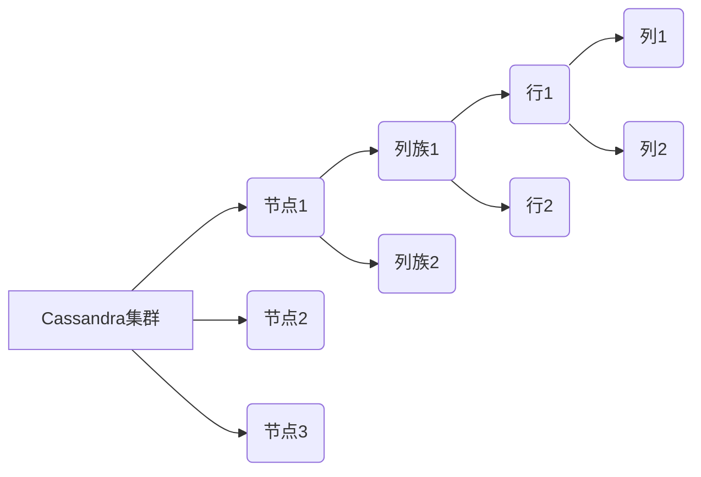
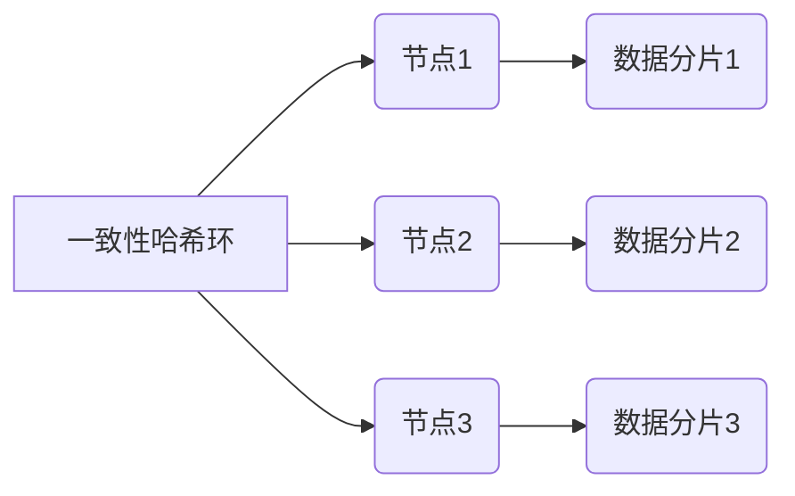
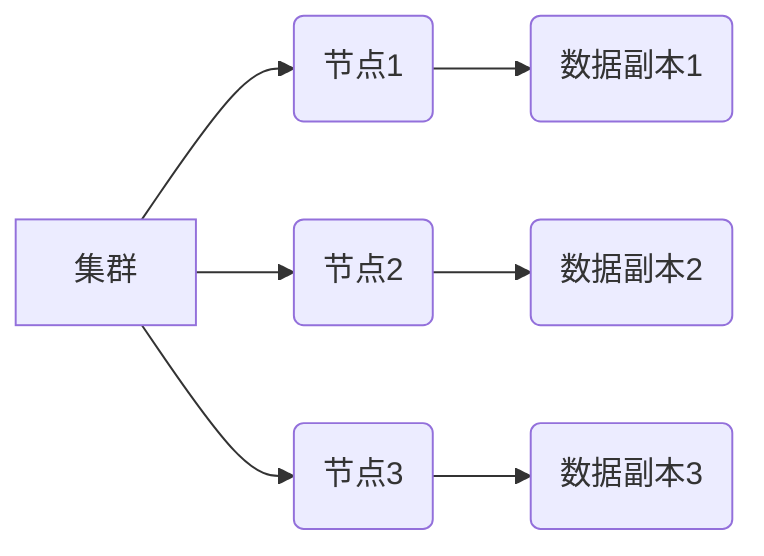
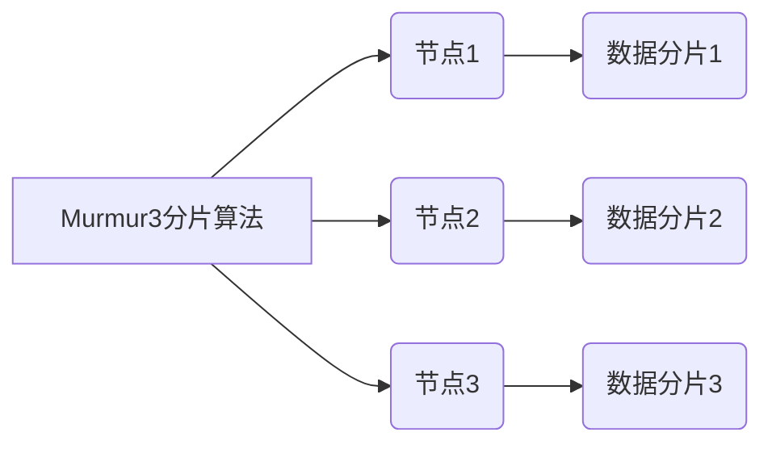
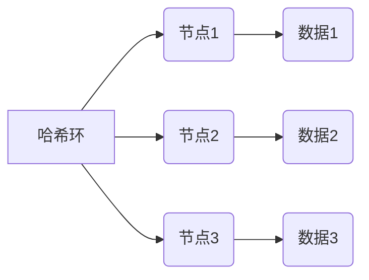
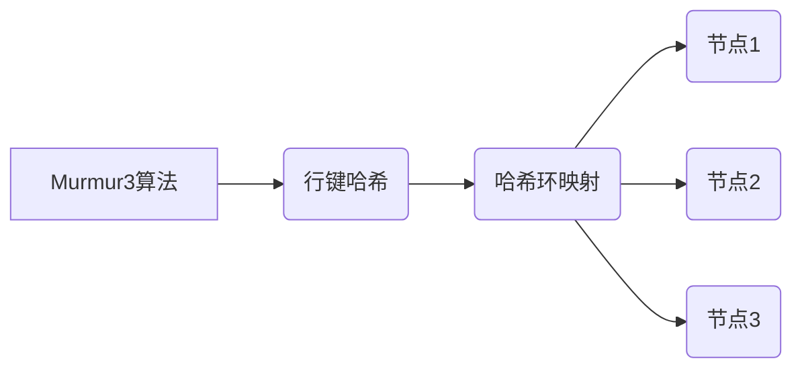
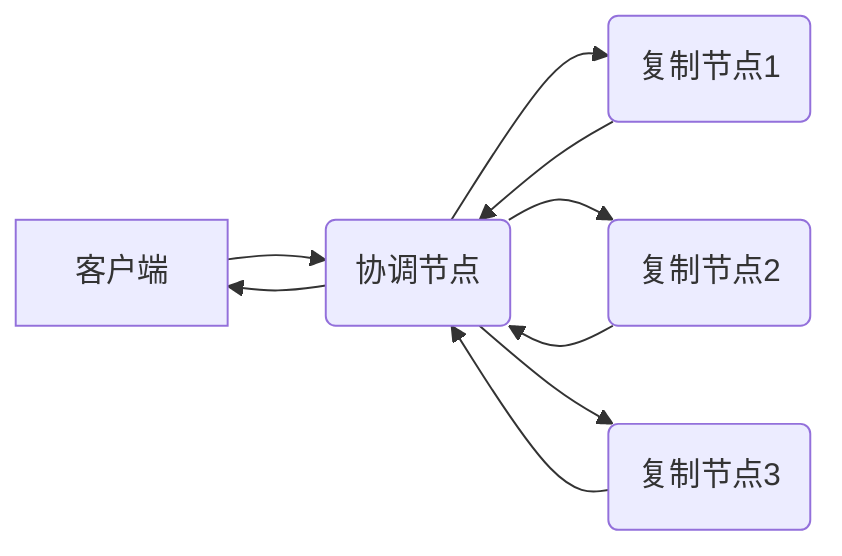
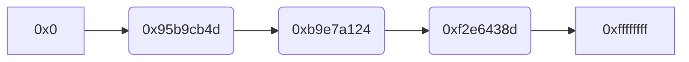
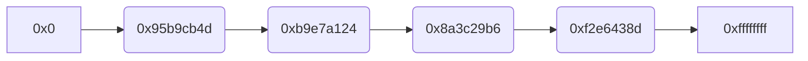

# AI系统Cassandra原理与代码实战案例讲解

## 1. 背景介绍

### 1.1 大数据时代的到来

随着互联网、物联网、云计算等技术的快速发展,数据呈现出爆炸式增长。传统的关系型数据库已经无法满足大数据时代对数据存储和处理的需求。这种需求催生了NoSQL(Not Only SQL)数据库的诞生,Cassandra就是其中一种广为人知的分布式NoSQL数据库。

### 1.2 Cassandra简介

Cassandra是一个开源的分布式NoSQL数据库,最初由Facebook设计,用于存储收件箱等简单格式数据,后被Apache软件基金会纳入顶级项目。它具有高可扩展性、无单点故障、行级数据复制等优点,适用于管理大量结构化数据的场景。

## 2. 核心概念与联系

### 2.1 数据模型

Cassandra采用列存储模型,更加灵活高效。主要概念包括:

- 节点(Node):构成Cassandra集群的组成单元
- 集群(Cluster):多个节点组成的分布式系统
- 列族(Column Family):相当于传统数据库的表
- 超级列族(Super Column Family):列族的列族
- 列(Column):键值对的形式存储数据
- 行(Row):多个列的集合,由行键标识



### 2.2 分布式体系结构

Cassandra采用无中心节点的对等分布式架构,每个节点都可读写数据,避免单点故障。通过一致性哈希环将数据分布到不同节点,并根据复制策略实现数据冗余备份。



### 2.3 数据复制

Cassandra通过配置复制因子(Replication Factor)确定每个数据在集群中的复制份数。复制数据分布在不同节点,提高数据可用性和容错性。



### 2.4 数据分片

Cassandra采用Murmur3分片算法将数据分布到不同节点,实现自动分片和负载均衡。每个节点只存储部分数据,降低单节点压力。



## 3. 核心算法原理具体操作步骤 

### 3.1 一致性哈希算法

Cassandra使用一致性哈希算法将节点和数据映射到一个环形空间,实现数据分布和负载均衡。具体步骤如下:

1. 计算节点哈希值,将节点均匀分布在哈希环上
2. 计算数据哈希值,映射到最近的节点上
3. 复制数据到相邻节点,确保数据冗余
4. 当节点加入或离开时,只需重新分布部分数据



### 3.2 Murmur3分片算法

Murmur3是Cassandra采用的分片算法,用于将数据均匀分布到不同节点。算法步骤:

1. 计算行键的哈希值
2. 将哈希值映射到哈希环的位置
3. 数据存储在该位置的节点上
4. 复制到相邻节点,确保数据冗余



### 3.3 数据读写流程

Cassandra的读写流程如下:

**写入流程:**

1. 客户端向协调节点发送写请求
2. 协调节点将数据分发给复制节点
3. 复制节点响应写成功或失败
4. 协调节点向客户端返回结果



**读取流程:**

1. 客户端向协调节点发送读请求
2. 协调节点并行读取复制节点数据
3. 协调节点对数据进行合并和修复
4. 协调节点向客户端返回最新数据


## 4. 数学模型和公式详细讲解举例说明

### 4.1 一致性哈希环

一致性哈希算法将节点和数据映射到一个环形空间,避免数据重新分布。具体过程如下:

1. 对节点IP或数据行键计算哈希值,得到一个m位整数:

$$hash(key) = \sum_{i=0}^{k-1}key_i \times 2^{i \times 8} \bmod 2^m$$

其中$key_i$是key的第i个字节,k是key的字节数。

2. 将哈希值映射到区间[0, $2^m$)的一个位置,形成哈希环。
3. 顺时针找到离该位置最近的节点,存储数据。

例如,有3个节点A、B、C,IP分别为192.168.0.1、192.168.0.2、192.168.0.3。对节点IP进行哈希:

```
hash(192.168.0.1) = 0x95b9cb4d
hash(192.168.0.2) = 0xb9e7a124
hash(192.168.0.3) = 0xf2e6438d
```

将它们映射到哈希环,如下图所示:



### 4.2 复制因子

复制因子(Replication Factor)决定了每个数据在集群中的复制份数,提高数据可用性和容错性。假设复制因子为N,数据将复制到N个不同节点。

例如,复制因子为3,数据key的哈希值为0x8a3c29b6。根据一致性哈希环,顺时针找到离该位置最近的3个节点,分别为A、B、C,则数据将复制到这3个节点。



### 4.3 数据一致性

Cassandra提供多种数据一致性级别,用于权衡数据可用性和一致性。常用的有:

- ONE: 写入任意一个节点即可
- QUORUM: 写入大多数节点,例如复制因子为3,写入2个节点
- ALL: 写入所有复制节点

一致性级别越高,数据一致性越好,但可用性降低。反之,一致性级别越低,数据可用性更高,但一致性降低。

## 5. 项目实践:代码实例和详细解释说明

### 5.1 创建键空间

```java
// 连接Cassandra集群
Cluster cluster = Cluster.builder().addContactPoint("127.0.0.1").build();
Session session = cluster.connect();

// 创建键空间
session.execute("CREATE KEYSPACE IF NOT EXISTS demo WITH replication = {'class':'SimpleStrategy', 'replication_factor':3}");
```

上述代码连接到本地Cassandra集群,创建一个名为demo的键空间,复制因子为3。

### 5.2 创建表

```java
// 创建表
session.execute("CREATE TABLE IF NOT EXISTS demo.users (" +
                "user_id uuid PRIMARY KEY," +
                "user_name text," +
                "email text)");
```

在demo键空间中创建一个users表,包含user_id(UUID主键)、user_name和email列。

### 5.3 插入数据

```java
// 准备语句
PreparedStatement ps = session.prepare("INSERT INTO demo.users (user_id, user_name, email) VALUES (?, ?, ?)");

// 绑定数据
BoundStatement bs = ps.bind(UUID.randomUUID(), "John Doe", "john@example.com");

// 执行插入
session.execute(bs);
```

使用PreparedStatement避免SQL注入,绑定数据后执行插入操作。

### 5.4 查询数据

```java
// 查询语句
Statement select = QueryBuilder.select().all().from("demo", "users");

// 执行查询
ResultSet results = session.execute(select);

// 遍历结果
for (Row row : results) {
    UUID userId = row.getUUID("user_id");
    String userName = row.getString("user_name");
    String email = row.getString("email");
    // 处理数据
}
```

使用QueryBuilder构造查询语句,执行查询并遍历结果集。

## 6. 实际应用场景

### 6.1 物联网数据存储

物联网设备产生大量时序数据,例如传感器数据、日志等。Cassandra适合存储这些半结构化数据,提供高吞吐量和线性扩展能力。

### 6.2 内容分发网络

CDN(Content Delivery Network)需要在全球范围内存储和分发大量静态内容,如网页、图片、视频等。Cassandra可以在多个地理位置复制数据,提高内容分发效率。

### 6.3 消息队列

Cassandra可以作为分布式消息队列,存储大量消息数据。它的高写吞吐量和数据分区特性适合处理大规模并发写入场景。

### 6.4 推荐系统

推荐系统需要存储和处理大量用户数据、商品数据等,Cassandra可以高效存储这些数据,并提供低延迟的读写性能。

## 7. 工具和资源推荐

### 7.1 Cassandra工具

- Cassandra查询工具: cqlsh
- 监控工具: OpsCenter、Metrics Reporter
- 数据建模工具: Apache Cassandra数据建模助手

### 7.2 学习资源

- Cassandra官方文档: https://cassandra.apache.org/doc/latest/
- Cassandra权威指南(第三版)
- DataStax Cassandra在线课程
- Cassandra Stack Overflow社区

## 8. 总结:未来发展趋势与挑战

### 8.1 云原生架构

未来Cassandra将更好地与Kubernetes等云原生技术栈集成,实现更高的自动化和可观测性。

### 8.2 人工智能与分析

Cassandra将继续优化支持人工智能、机器学习等数据分析场景,提供更高效的数据处理能力。

### 8.3 物联网和边缘计算

随着物联网和边缘计算的发展,Cassandra需要提供更好的数据分区和复制能力,满足分布式边缘场景的需求。

### 8.4 安全性和隐私保护

数据安全和隐私保护将成为重中之重,Cassandra需要加强数据加密、访问控制等安全特性。

## 9. 附录:常见问题与解答

### 9.1 Cassandra与关系型数据库的区别?

Cassandra是分布式NoSQL数据库,采用列存储模型,不支持事务和Join操作。而关系型数据库支持ACID事务,采用行存储模型。Cassandra更适合存储大量非结构化数据。

### 9.2 Cassandra的读写一致性级别有哪些?

常见的一致性级别包括ONE、QUORUM、ALL等。ONE表示写入任意一个节点即可,ALL表示写入所有复制节点。不同级别权衡了数据可用性和一致性。

### 9.3 如何选择合适的数据建模方案?

数据建模对Cassandra的性能至关重要。应该根据查询模式,将经常一起查询的列存储在同一列族中,避免需要跨多个