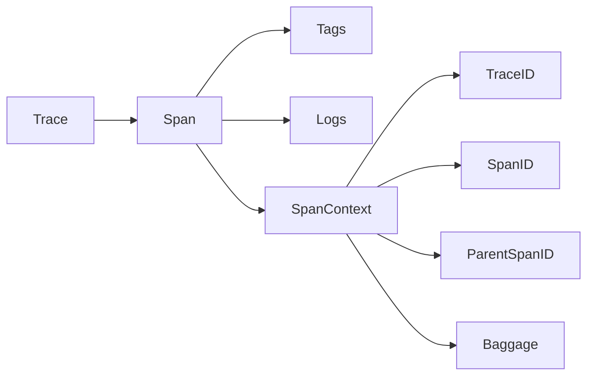

# AI系统Jaeger原理与代码实战案例讲解

## 1. 背景介绍

在当今快速发展的微服务时代,分布式系统的复杂性日益增加。开发人员需要深入了解系统中各个服务的交互和性能,以便快速定位和解决问题。这就需要一个强大的分布式追踪系统。Jaeger就是这样一个开源的端到端分布式追踪系统,可以监控和排查基于微服务的分布式系统。

### 1.1 分布式追踪的重要性

#### 1.1.1 微服务架构下的复杂性

#### 1.1.2 传统监控方式的局限性  

#### 1.1.3 分布式追踪的优势

### 1.2 Jaeger简介

#### 1.2.1 Jaeger的起源与发展

#### 1.2.2 Jaeger的主要特性

#### 1.2.3 Jaeger在业界的应用

## 2. 核心概念与联系

要深入理解Jaeger,首先需要了解其中的一些核心概念。

### 2.1 Span

#### 2.1.1 Span的定义

#### 2.1.2 Span的属性

#### 2.1.3 Span的生命周期

### 2.2 Trace 

#### 2.2.1 Trace的定义

#### 2.2.2 Trace的结构

#### 2.2.3 Trace的采样

### 2.3 Baggage

#### 2.3.1 Baggage的概念

#### 2.3.2 Baggage的传播

#### 2.3.3 Baggage的使用场景

### 2.4 核心概念之间的关系



## 3. 核心算法原理具体操作步骤

Jaeger追踪的核心是将请求在分布式系统中的流转过程记录下来。这依赖于一些关键算法。

### 3.1 数据采集

#### 3.1.1 Instrumentation API

#### 3.1.2 OpenTracing API

#### 3.1.3 Jaeger Client

### 3.2 数据传播

#### 3.2.1 Inject和Extract

#### 3.2.2 HTTP Headers

#### 3.2.3 Zipkin B3 Propagation

### 3.3 数据存储

#### 3.3.1 Cassandra

#### 3.3.2 Elasticsearch

#### 3.3.3 Kafka

### 3.4 数据查询

#### 3.4.1 Query Service

#### 3.4.2 UI

## 4. 数学模型和公式详细讲解举例说明

Jaeger使用一些数学模型来优化追踪和采样策略。

### 4.1 采样算法

#### 4.1.1 概率采样

$P(Sampled) = \frac{SamplingRate}{MaxRandomNumber}$

#### 4.1.2 限速采样

$SampleCount \leq \frac{MaxSampleCount}{Time}$

#### 4.1.3 自适应采样

$$
SamplingRate = 
\begin{cases}
MinSamplingRate & \text{if } IncomingQPS \leq MinQPSThreshold \\
MaxSamplingRate & \text{if } IncomingQPS \geq MaxQPSThreshold \\
\frac{MaxSamplingRate - MinSamplingRate}{MaxQPSThreshold - MinQPSThreshold} \times (IncomingQPS - MinQPSThreshold) + MinSamplingRate & \text{otherwise}
\end{cases}
$$

### 4.2 追踪数据的存储优化

#### 4.2.1 数据压缩

#### 4.2.2 数据过期策略

## 5. 项目实践：代码实例和详细解释说明

下面通过一个简单的示例来展示如何在代码中使用Jaeger进行分布式追踪。

### 5.1 环境准备

#### 5.1.1 安装Jaeger

#### 5.1.2 配置Jaeger Client

### 5.2 代码示例

#### 5.2.1 创建Tracer

```go
tracer, closer := tracing.Init("my-service")
defer closer.Close()
```

#### 5.2.2 创建Span

```go
span := tracer.StartSpan("my-operation")
defer span.Finish()
```

#### 5.2.3 添加Tags和Logs

```go
span.SetTag("my-tag", "my-value")
span.LogFields(log.String("event", "my-event"), log.Int("value", 42))
```

#### 5.2.4 Span上下文传播

```go
carrier := opentracing.HTTPHeadersCarrier(httpRequest.Header)
spanContext, _ := tracer.Extract(opentracing.HTTPHeaders, carrier)
span := tracer.StartSpan("my-operation", ext.RPCServerOption(spanContext))
```

### 5.3 运行和观察

#### 5.3.1 启动Jaeger UI

#### 5.3.2 查看追踪数据

## 6. 实际应用场景

Jaeger在很多实际场景中都有广泛应用。

### 6.1 性能优化

#### 6.1.1 识别性能瓶颈

#### 6.1.2 优化服务交互

### 6.2 问题排查

#### 6.2.1 错误定位

#### 6.2.2 异常追踪

### 6.3 系统监控

#### 6.3.1 服务可用性监控

#### 6.3.2 SLA监控

## 7. 工具和资源推荐

### 7.1 Jaeger生态系统

#### 7.1.1 Jaeger Client Libraries

#### 7.1.2 Jaeger Operator

#### 7.1.3 Jaeger Tracing as a Service

### 7.2 与其他系统的集成

#### 7.2.1 Prometheus

#### 7.2.2 Grafana 

#### 7.2.3 Istio

### 7.3 学习资源

#### 7.3.1 官方文档

#### 7.3.2 社区博客和教程

#### 7.3.3 Conference Talks

## 8. 总结：未来发展趋势与挑战

### 8.1 Jaeger的发展方向

#### 8.1.1 更智能的采样策略

#### 8.1.2 更强大的数据分析能力

#### 8.1.3 更方便的部署和使用

### 8.2 分布式追踪领域的挑战

#### 8.2.1 标准化

#### 8.2.2 性能开销

#### 8.2.3 数据隐私和安全

## 9. 附录：常见问题与解答

### 9.1 Jaeger与Zipkin的区别是什么?

### 9.2 Jaeger是否支持异步调用的追踪?

### 9.3 如何控制Jaeger的采样率?

### 9.4 Jaeger的数据存储支持哪些后端?

### 9.5 如何将Jaeger与Kubernetes集成?

作者：禅与计算机程序设计艺术 / Zen and the Art of Computer Programming