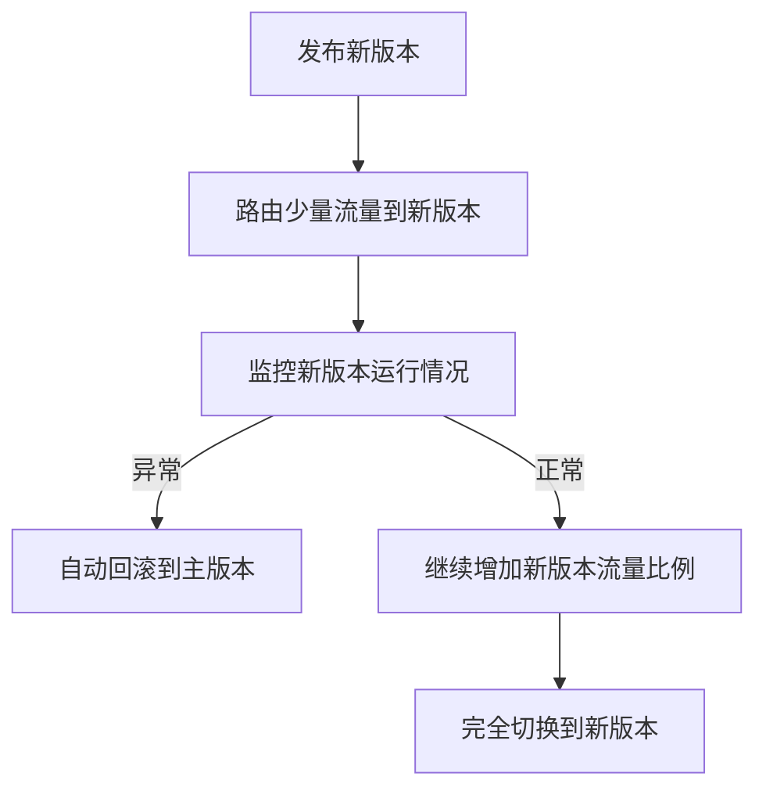

# AI系统金丝雀发布原理与代码实战案例讲解

## 1. 背景介绍

### 1.1 什么是金丝雀发布

在软件开发领域,金丝雀发布(Canary Release)是一种可控的持续交付技术,用于在生产环境中逐步推广新版本软件。它的名称源于矿工们在井下工作时,会携带金丝雀进入矿井。如果有有毒气体存在,金丝雀会先示警,从而保护矿工的安全。

金丝雀发布的核心思想是,先将新版本软件部署到生产环境的一个子集中,并监控新版本的运行情况。一旦确认没有重大问题,就逐步将新版本推广到更多的实例中,直至完全替换旧版本。如果出现任何异常,则可以快速回滚,将影响控制在可控范围内。

### 1.2 金丝雀发布的必要性

随着云原生技术的兴起,企业软件系统日益复杂,传统的一次性大规模部署方式已经不可取。主要原因如下:

1. **风险高**:一次性大规模部署,如果新版本存在缺陷,将导致整个系统瘫痪,影响全部用户。
2. **回滚困难**:大规模部署后,想要回滚到旧版本将面临巨大挑战。
3. **无法灰度测试**:无法在生产环境下对新版本进行充分的灰度测试和评估。

金丝雀发布通过分批次、可控的方式发布新版本,从而规避上述风险,提高发布的可靠性和安全性。

## 2. 核心概念与联系

### 2.1 金丝雀发布的核心概念

1. **路由层(Router Layer)**: 负责对流量进行分发,将部分流量路由到金丝雀版本。
2. **金丝雀版本(Canary Version)**: 新发布的软件版本,最初只会接收少量流量。
3. **主版本(Primary Version)**: 当前生产环境中运行的主要软件版本。
4. **指标监控(Metrics Monitoring)**: 持续监控金丝雀版本的关键指标,如错误率、延迟等。
5. **自动回滚(Automatic Rollback)**: 当监控到异常情况时,自动将流量切回到主版本。

### 2.2 金丝雀发布与其他发布模式的关系

1. **蓝绿部署(Blue/Green Deployment)**: 金丝雀发布可视为蓝绿部署的一种特殊形式,不同之处在于金丝雀发布只部署新版本的一个子集。
2. **A/B 测试(A/B Testing)**: A/B测试专注于测试新功能对用户体验的影响,而金丝雀发布关注的是新版本软件的整体运行情况。
3. **滚动发布(Rolling Deployment)**: 滚动发布是一种全量发布方式,与金丝雀发布的分批次发布形成对比。

## 3. 核心算法原理具体操作步骤 

金丝雀发布的核心算法可概括为以下步骤:



1. **发布新版本**: 首先,需要构建并发布新版本的软件包,准备在生产环境中部署。

2. **路由少量流量到新版本**: 通过路由层,将少量流量(通常为5%~10%)转发到新部署的金丝雀版本实例。其余大部分流量仍然由主版本处理。

3. **监控新版本运行情况**: 密切监控金丝雀版本的关键指标,如错误率、延迟、吞吐量等,评估新版本的运行质量。

4. **自动回滚或继续推广**:
    - 如果监控到异常情况(如错误率超标),则自动将流量切回到主版本,并终止本次发布。
    - 如果新版本运行正常,则逐步增加路由到新版本的流量比例,直至100%切换到新版本。

5. **完全切换到新版本**: 当所有流量都已切换到新版本,旧版本实例将被终止,发布过程完成。

上述算法可通过自动化工具实现,从而实现发布过程的自动化和可控性。

## 4. 数学模型和公式详细讲解举例说明

在金丝雀发布过程中,需要根据监控指标判断是否应该继续推广还是回滚。这可以通过建立数学模型来量化评估。

假设我们关注以下两个关键指标:

- $p$: 错误率(Error Rate),即请求失败的比例
- $l$: 延迟(Latency),即请求的响应时间

我们为这两个指标设定了可接受的上限阈值:

- $p_0$: 错误率的最大可接受阈值
- $l_0$: 延迟的最大可接受阈值

对于金丝雀版本,我们统计一个时间窗口内的实际指标值:

- $p_c$: 金丝雀版本的实际错误率
- $l_c$: 金丝雀版本的实际平均延迟

我们可以定义一个评分函数 $score(p_c, l_c)$ 来综合考虑这两个指标:

$$score(p_c, l_c) = \alpha \cdot \frac{p_c}{p_0} + (1-\alpha) \cdot \frac{l_c}{l_0}$$

其中 $\alpha$ 是错误率和延迟的权重系数,用于调节两个指标的相对重要性。

评分函数的取值范围为 $[0, +\infty)$,值越小表示新版本的表现越好。我们可以设定一个评分阈值 $s_0$,当评分高于该阈值时,触发自动回滚:

$$\text{If } score(p_c, l_c) > s_0 \text{, then rollback}$$

通过这种方式,我们可以量化地评估新版本的运行质量,并根据预先设定的策略做出是否继续推广的决策。

例如,假设我们设定:

- $p_0 = 0.01$ (错误率不超过1%)
- $l_0 = 100ms$ (平均延迟不超过100毫秒)
- $\alpha = 0.6$ (错误率的权重为60%)
- $s_0 = 1.5$ (评分阈值为1.5)

如果在一个时间窗口内,金丝雀版本的实际指标为:

- $p_c = 0.008$ (实际错误率为0.8%)
- $l_c = 120ms$ (实际平均延迟为120毫秒)

那么,评分为:

$$score(0.008, 120) = 0.6 \cdot \frac{0.008}{0.01} + 0.4 \cdot \frac{120}{100} = 0.48 + 0.48 = 0.96$$

由于评分低于阈值1.5,因此该版本被评估为可以继续推广。

通过这种数学模型,我们可以更加客观、量化地评估新版本的运行质量,从而指导金丝雀发布的决策过程。

## 5. 项目实践:代码实例和详细解释说明

为了演示金丝雀发布的实现,我们将使用 Kubernetes 和 Istio 构建一个示例项目。Istio 是一个开源的服务网格,提供了流量管理、安全性和可观测性等功能,非常适合实现金丝雀发布。

### 5.1 准备工作

1. 安装并配置 Kubernetes 集群
2. 在集群中安装 Istio

### 5.2 部署应用程序

我们将部署一个简单的 Go 语言 Web 应用程序,它提供了一个 `/` 根路径的 HTTP 服务。

首先,创建一个 Deployment 资源:

```yaml
# go-app-deployment.yaml
apiVersion: apps/v1
kind: Deployment
metadata:
  name: go-app
spec:
  replicas: 3
  selector:
    matchLabels:
      app: go-app
  template:
    metadata:
      labels:
        app: go-app
    spec:
      containers:
      - name: go-app
        image: go-app:v1
        ports:
        - containerPort: 8080
```

然后,创建一个 Service 资源:

```yaml
# go-app-service.yaml
apiVersion: v1
kind: Service
metadata:
  name: go-app
spec:
  selector:
    app: go-app
  ports:
  - port: 8080
    targetPort: 8080
```

使用 `kubectl` 应用上述资源:

```bash
kubectl apply -f go-app-deployment.yaml
kubectl apply -f go-app-service.yaml
```

### 5.3 配置金丝雀发布

接下来,我们将使用 Istio 的 VirtualService 资源来配置金丝雀发布。

```yaml
# go-app-virtualservice.yaml
apiVersion: networking.istio.io/v1alpha3
kind: VirtualService
metadata:
  name: go-app
spec:
  hosts:
  - go-app.default.svc.cluster.local
  http:
  - route:
    - destination:
        host: go-app
        subset: v1
      weight: 90
    - destination:
        host: go-app
        subset: v2
      weight: 10
```

这个 VirtualService 将 90% 的流量路由到 `v1` 子集(即旧版本),剩余 10% 的流量路由到 `v2` 子集(即新版本)。

我们还需要定义这两个子集,通过 DestinationRule 资源:

```yaml
# go-app-destinationrule.yaml
apiVersion: networking.istio.io/v1alpha3
kind: DestinationRule
metadata:
  name: go-app
spec:
  host: go-app
  subsets:
  - name: v1
    labels:
      version: v1
  - name: v2
    labels:
      version: v2
```

现在,我们可以部署新版本的应用程序:

```yaml
# go-app-deployment-v2.yaml
apiVersion: apps/v1
kind: Deployment
metadata:
  name: go-app-v2
spec:
  replicas: 3
  selector:
    matchLabels:
      app: go-app
      version: v2
  template:
    metadata:
      labels:
        app: go-app
        version: v2
    spec:
      containers:
      - name: go-app
        image: go-app:v2
        ports:
        - containerPort: 8080
```

应用上述资源:

```bash
kubectl apply -f go-app-virtualservice.yaml
kubectl apply -f go-app-destinationrule.yaml
kubectl apply -f go-app-deployment-v2.yaml
```

现在,10% 的流量将被路由到新版本 `v2`。我们可以通过 Istio 的监控功能观察新版本的运行情况,如果一切正常,则可以继续增加 `v2` 的流量权重,直至完全切换到新版本。

### 5.4 自动化金丝雀发布

上述过程可以通过自动化工具实现自动化,例如使用 Flagger 或 Argo Rollouts 等工具。以 Flagger 为例,它提供了声明式的金丝雀发布配置:

```yaml
# go-app-canary.yaml
apiVersion: flagger.app/v1beta1
kind: Canary
metadata:
  name: go-app
spec:
  targetRef:
    apiVersion: apps/v1
    kind: Deployment
    name: go-app
  progressDeadlineSeconds: 60
  service:
    port: 8080
  analysis:
    interval: 15s
    threshold: 5
    maxWeight: 60
    metrics:
    - name: request-success-rate
      thresholdRange:
        min: 99
      interval: 1m
    - name: request-duration
      thresholdRange:
        max: 500
      interval: 30s
    webhooks:
      - name: load-test
        url: http://flagger-loadtester.test/
        timeout: 5s
        metadata:
          cmd: "hey -z 1m -q 10 -c 2 http://go-app.test/"
```

这个配置指定了金丝雀发布的各种参数,如分析间隔、权重增量、成功率和延迟的阈值等。Flagger 将自动执行金丝雀发布过程,包括流量路由、指标分析和回滚决策。

通过自动化工具,我们可以更好地管理金丝雀发布,降低人工操作的复杂性和出错风险。

## 6. 实际应用场景

金丝雀发布广泛应用于各种云原生应用的持续交付过程中,例如:

1. **微服务架构**: 将新版本的微服务逐步推广到生产环境,降低全量部署的风险。
2. **Web 应用**: 对新版本的 Web 应用进行金丝雀测试,评估新功能的用户体验。
3. **移动应用**: 通过金