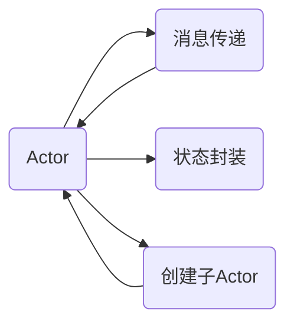

# Actor Model原理与代码实例讲解

## 1.背景介绍
### 1.1 Actor Model的起源与发展
Actor Model最早由Carl Hewitt在1973年提出,是一种用于构建并发和分布式系统的计算模型。它起源于Hewitt对人工智能中并发计算的研究,旨在提供一种更自然、更高效的并发编程模型。

### 1.2 Actor Model解决的问题
在传统的多线程并发编程中,共享内存和锁机制常常会导致死锁、竞争条件等问题,使得并发编程变得复杂且容易出错。Actor Model通过将系统建模为一组独立的Actor,每个Actor拥有自己的状态和行为,通过消息传递进行通信,从而避免了共享内存带来的问题。

### 1.3 Actor Model的应用领域
Actor Model在许多领域得到了广泛应用,如分布式系统、游戏服务器、物联网等。著名的应用有Erlang语言及其OTP框架、Akka toolkit等。它们利用Actor Model构建了高度可伸缩、容错的分布式系统。

## 2.核心概念与联系
### 2.1 Actor
Actor是Actor Model的核心概念,它是一个并发计算的基本单元。每个Actor都是一个独立的实体,拥有唯一的地址,可以发送和接收消息。Actor内部维护自己的状态,根据收到的消息更新状态或进行计算,并可以创建新的Actor。

### 2.2 消息传递
Actor之间通过异步消息传递进行通信。当一个Actor向另一个Actor发送消息时,消息会被放入接收方Actor的邮箱中。接收方Actor从邮箱中按顺序取出消息进行处理。消息传递是非阻塞的,发送方无需等待接收方处理完消息。

### 2.3 状态封装
每个Actor维护自己的状态,这些状态对外部是不可见的。Actor只能通过处理消息来修改自己的内部状态。这种状态封装避免了多个线程直接共享和修改同一状态,从而消除了锁和同步的需要。

### 2.4 Actor间的关系
Actor之间可以形成层次结构,即一个Actor可以创建其他Actor作为其子Actor。父Actor可以监督子Actor的运行,并在子Actor发生故障时进行处理。这种层次结构有利于构建容错性和可伸缩性更好的系统。

### 2.5 Actor Model与传统并发模型的区别
与基于共享内存和锁的传统并发模型相比,Actor Model具有以下优点:
- 避免了共享内存导致的竞争条件和死锁问题
- 提供了更高层次的并发抽象,使得并发编程更加自然和简单
- 易于构建分布式系统,Actor可以分布在不同的节点上
- 具有更好的容错性,Actor之间相互隔离,一个Actor的失败不会直接影响其他Actor

下面是Actor Model核心概念之间关系的Mermaid流程图:



## 3.核心算法原理具体操作步骤
### 3.1 创建Actor
创建一个Actor需要指定其行为,即如何处理接收到的消息。Actor的行为通常使用函数或方法来定义。创建Actor时,需要提供一个唯一的地址,用于标识该Actor。

### 3.2 发送消息
要发送消息给一个Actor,需要知道该Actor的地址。发送消息使用类似于 `send(actorRef, message)` 的语法,其中 `actorRef` 是接收方Actor的引用,`message` 是要发送的消息对象。

### 3.3 处理消息
Actor从其邮箱中按顺序取出消息进行处理。处理消息时,Actor可以更新自己的内部状态,也可以给其他Actor发送消息,或者创建新的子Actor。

### 3.4 状态更新
Actor在处理消息时可以修改自己的内部状态。由于状态是封装在Actor内部的,因此不需要使用锁或其他同步机制来保护状态。Actor可以根据收到的消息自由地更新状态。

### 3.5 创建子Actor
Actor可以创建其他Actor作为子Actor,形成Actor层次结构。创建子Actor的过程与创建普通Actor类似,只是需要在创建时指定父Actor的引用。子Actor的生命周期由父Actor管理。

### 3.6 错误处理
当Actor在处理消息时发生错误,可以将错误信息发送给其父Actor。父Actor可以根据错误类型和severity决定如何处理错误,例如重启子Actor、记录错误日志等。这种错误处理机制称为"Let it crash"原则。

## 4.数学模型和公式详细讲解举例说明
### 4.1 Actor Model的形式化定义
我们可以使用元组 $(A, M, S, F)$ 来形式化定义一个Actor系统:
- $A$ 表示Actor的集合
- $M$ 表示消息的集合
- $S$ 表示Actor状态的集合
- $F: A \times M \rightarrow (A \times M)^*$ 是一个转移函数,表示Actor接收到消息后的行为

对于一个Actor $a \in A$,其状态为 $s \in S$,当它接收到一个消息 $m \in M$ 时,转移函数 $F$ 定义了 $a$ 的下一步行为:

$$F(a, m) = ((a_1, m_1), (a_2, m_2), ..., (a_n, m_n))$$

其中, $(a_i, m_i)$ 表示 Actor $a$ 给 Actor $a_i$ 发送消息 $m_i$。这个元组的结果表示 $a$ 处理消息 $m$ 后,更新自己的状态,并给其他Actor发送了一系列消息。

### 4.2 并发性和并行性
Actor Model支持并发和并行。并发性是指多个Actor同时存在,它们之间通过消息传递进行通信。并行性是指多个Actor可以在不同的物理线程或不同的节点上同时执行。

假设有两个Actor $a1$ 和 $a2$,它们分别有状态 $s1$ 和 $s2$。如果 $a1$ 给 $a2$ 发送一个消息 $m$,那么这个过程可以表示为:

$$(a1, s1) \stackrel{m}{\longrightarrow} (a2, s2)$$

这表示 Actor $a1$ 在状态 $s1$ 下向 Actor $a2$ 发送消息 $m$,Actor $a2$ 在接收到消息后,更新其状态为 $s2$。这个过程是异步的,即 $a1$ 发送消息后无需等待 $a2$ 处理完成。

### 4.3 Actor层次结构
Actor之间可以形成层次结构,即一个Actor可以创建子Actor。假设 Actor $a$ 创建了两个子Actor $c1$ 和 $c2$,我们可以用树形结构表示它们的关系:

```
    a
   / \
  c1 c2
```

如果 $a$ 在状态 $s$ 下创建了子Actor $c1$ 和 $c2$,并分别给它们发送消息 $m1$ 和 $m2$,那么这个过程可以表示为:

$$a \stackrel{create(c1,c2)}{\longrightarrow} (c1 \stackrel{m1}{\longrightarrow} s1, c2 \stackrel{m2}{\longrightarrow} s2)$$

其中, $s1$ 和 $s2$ 分别是 $c1$ 和 $c2$ 在处理消息后的新状态。这个过程体现了Actor层次结构下的消息传递和状态转移。

## 5.项目实践：代码实例和详细解释说明
下面我们以Akka框架为例,演示如何使用Scala语言实现一个简单的Actor系统。

### 5.1 定义Actor
首先,我们定义一个名为 `MyActor` 的Actor,它可以处理两种类型的消息: `Greeting` 和 `Stop`。

```scala
import akka.actor.{Actor, ActorSystem, Props}

case class Greeting(message: String)
case object Stop

class MyActor extends Actor {
  override def receive: Receive = {
    case Greeting(message) =>
      println(s"Received message: $message")
    case Stop =>
      println("Stopping actor...")
      context.stop(self)
  }
}
```

在 `MyActor` 的 `receive` 方法中,我们定义了如何处理不同类型的消息。当收到 `Greeting` 消息时,Actor会打印出消息内容;当收到 `Stop` 消息时,Actor会打印一条停止信息,并调用 `context.stop(self)` 来停止自己。

### 5.2 创建和使用Actor
接下来,我们创建一个 `ActorSystem`,并使用 `actorOf` 方法创建 `MyActor` 的实例:

```scala
val system = ActorSystem("MyActorSystem")
val myActor = system.actorOf(Props[MyActor], "myActor")
```

创建好Actor后,我们可以给它发送消息:

```scala
myActor ! Greeting("Hello, Actor!")
myActor ! Greeting("How are you?")
myActor ! Stop
```

这里使用 `!` 操作符来发送消息。前两条语句发送 `Greeting` 消息,最后一条发送 `Stop` 消息以停止Actor。

### 5.3 运行结果
运行上述代码,我们会得到以下输出:

```
Received message: Hello, Actor!
Received message: How are you?
Stopping actor...
```

这表明 `MyActor` 成功接收并处理了发送的消息。

### 5.4 完整代码
下面是完整的示例代码:

```scala
import akka.actor.{Actor, ActorSystem, Props}

case class Greeting(message: String)
case object Stop

class MyActor extends Actor {
  override def receive: Receive = {
    case Greeting(message) =>
      println(s"Received message: $message")
    case Stop =>
      println("Stopping actor...")
      context.stop(self)
  }
}

object Main extends App {
  val system = ActorSystem("MyActorSystem")
  val myActor = system.actorOf(Props[MyActor], "myActor")

  myActor ! Greeting("Hello, Actor!")
  myActor ! Greeting("How are you?")
  myActor ! Stop

  system.terminate()
}
```

这个示例演示了如何定义Actor,创建ActorSystem,以及在Actor之间发送消息。Akka框架提供了更多高级功能,如Actor层次结构、容错机制等,可以用于构建复杂的分布式系统。

## 6.实际应用场景
Actor Model在许多实际场景中得到了应用,下面列举几个典型的例子:

### 6.1 分布式聊天系统
在分布式聊天系统中,每个用户可以表示为一个Actor。当用户发送消息时,消息会被发送给对应的用户Actor。用户Actor可以将消息转发给其他用户Actor,实现消息的路由和传递。这种基于Actor的设计可以很好地应对聊天系统的高并发和分布式需求。

### 6.2 实时游戏服务器
在实时游戏中,游戏世界中的每个实体(如玩家、NPC、物品等)都可以用一个Actor来表示。这些Actor通过消息传递来同步状态和交互。例如,当玩家移动时,其对应的Actor会将移动消息发送给其他相关Actor(如附近的玩家、NPC等),以更新它们的状态。Actor Model可以很好地处理游戏服务器的高并发和实时性需求。

### 6.3 物联网系统
在物联网系统中,每个设备可以表示为一个Actor。设备Actor负责采集传感器数据,并将数据发送给其他Actor进行处理和分析。Actor之间通过消息传递来协调工作,例如将数据汇总给中央控制Actor,或者在设备之间传递控制命令。Actor Model提供了一种自然的方式来组织和管理大规模的分布式设备网络。

### 6.4 金融交易系统
在金融交易系统中,每个交易可以用一个Actor来处理。交易Actor负责验证交易、更新账户余额、生成交易记录等。不同的交易Actor之间通过消息传递来协调工作,确保整个系统的一致性和正确性。Actor Model可以帮助构建高度并发、可扩展的金融交易处理系统。

这些只是Actor Model的一些典型应用场景,除此之外,它还可以用于构建电商系统、社交网络、流数据处理等多种领域的应用。Actor Model提供了一种通用的并发编程模型,可以帮助开发者更容易地构建高效、可靠的分布式系统。

## 7.工具和资源推荐
### 7.1 Akka
Akka是一个流行的Actor Model实现,提供了一组库和工具来构建高度并发、分布式和容错的应用程序。Akka支持Java和Scala语言,可以