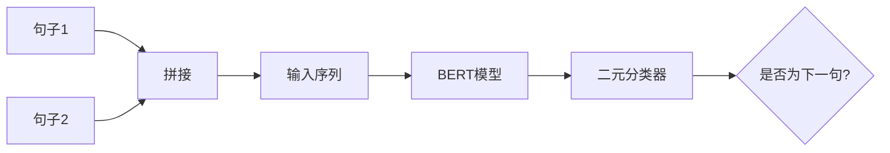
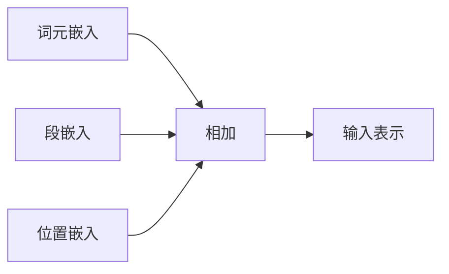

# BERT原理与代码实例讲解

## 1.背景介绍

在自然语言处理(NLP)领域,Transformer模型凭借其出色的性能,已成为主流的序列建模架构。2018年,Google的AI研究员团队在Transformer的基础上提出了BERT(Bidirectional Encoder Representations from Transformers)模型,这是一种全新的预训练语言表示模型,在多项NLP任务上取得了突破性进展。

### 1.1 Transformer模型的局限性

尽管Transformer模型在机器翻译等序列生成任务上表现出色,但在文本分类、语义理解等理解型任务上,其效果并不理想。这主要由于Transformer是基于自回归(auto-regressive)语言模型训练的,每个位置的单词只能利用左侧上下文信息。这种单向编码方式无法捕捉双向语境,从而限制了模型的理解能力。

### 1.2 BERT模型的创新之处

BERT模型的核心创新在于采用了Masked Language Model(MLM)和Next Sentence Prediction(NSP)两种任务的联合预训练方式,使得预训练模型能够有效地学习双向语境表示。此外,BERT还引入了全新的位置编码方式,使其能够适用于更多NLP任务。

## 2.核心概念与联系

### 2.1 Transformer编码器(Encoder)

BERT的核心是基于Transformer的编码器(Encoder)结构。Transformer编码器由多个相同的编码器层(Encoder Layer)组成,每个编码器层包含两个子层:多头自注意力机制(Multi-Head Attention)和前馈神经网络(Feed-Forward Neural Network)。


### 2.2 Masked Language Model(MLM)

MLM任务的目标是根据上下文预测被掩码的单词。在预训练过程中,BERT随机选择一些输入token,并用特殊的[MASK]标记替换它们。模型的目标是基于剩余的上下文,正确预测出这些被掩码的单词。


### 2.3 Next Sentence Prediction(NSP)

NSP任务的目标是判断两个句子是否为连续的句子对。在预训练过程中,BERT会为每个输入样本生成一个二元分类标签,表示第二个句子是否为第一个句子的下一个句子。



### 2.4 输入表示

BERT采用了WordPiece嵌入的方式,将单词拆分为多个词元(WordPiece),并为每个词元分配一个嵌入向量。此外,BERT还引入了段嵌入(Segment Embedding)和位置嵌入(Position Embedding),以提供句子和位置信息。



## 3.核心算法原理具体操作步骤

### 3.1 BERT的预训练过程

BERT的预训练过程包括两个并行的任务:MLM和NSP。

1. **MLM任务**:
   - 从输入序列中随机选择15%的token进行掩码
   - 将80%的掩码token替换为[MASK]标记
   - 将10%的掩码token替换为随机token
   - 保留剩余10%的token不变
   - 使用掩码后的序列作为输入,目标是预测正确的掩码token

2. **NSP任务**:
   - 为每个输入样本生成一个二元标签,表示第二个句子是否为第一个句子的下一个句子
   - 50%的时候为IsNext,50%的时候为NotNext
   - 使用这些标签对NSP进行二元分类训练

BERT在大规模语料库上联合预训练MLM和NSP任务,使得模型能够同时学习双向语境表示和句子关系表示。

### 3.2 BERT的微调过程

预训练完成后,BERT可以在特定的下游任务上进行微调(Fine-tuning)。微调过程包括以下步骤:

1. 将预训练好的BERT模型加载到新的模型架构中
2. 根据下游任务的需求,添加适当的输出层(如分类层或回归层)
3. 使用标注好的下游任务数据,对整个模型进行端到端的微调训练
4. 在验证集上评估模型性能,选择最优模型

由于BERT模型已经在大规模语料库上学习了通用的语言表示,因此在下游任务上只需要进行少量的微调,就可以取得非常好的效果。

## 4.数学模型和公式详细讲解举例说明

### 4.1 Transformer的自注意力机制

Transformer中的自注意力机制是一种全新的注意力计算方式,它允许模型直接捕捉输入序列中任意两个位置之间的依赖关系。给定一个查询向量$\boldsymbol{q}$、键向量$\boldsymbol{K}$和值向量$\boldsymbol{V}$,自注意力机制的计算过程如下:

$$\text{Attention}(\boldsymbol{Q}, \boldsymbol{K}, \boldsymbol{V}) = \text{softmax}\left(\frac{\boldsymbol{Q}\boldsymbol{K}^\top}{\sqrt{d_k}}\right)\boldsymbol{V}$$

其中,$d_k$是缩放因子,用于防止点积过大导致的梯度饱和问题。

在实际应用中,通常会使用多头自注意力机制(Multi-Head Attention),它可以从不同的子空间捕捉不同的依赖关系:

$$\text{MultiHead}(\boldsymbol{Q}, \boldsymbol{K}, \boldsymbol{V}) = \text{Concat}(\text{head}_1, \dots, \text{head}_h)\boldsymbol{W}^O$$
$$\text{where } \text{head}_i = \text{Attention}(\boldsymbol{Q}\boldsymbol{W}_i^Q, \boldsymbol{K}\boldsymbol{W}_i^K, \boldsymbol{V}\boldsymbol{W}_i^V)$$

其中,$\boldsymbol{W}_i^Q$、$\boldsymbol{W}_i^K$、$\boldsymbol{W}_i^V$和$\boldsymbol{W}^O$是可学习的线性变换矩阵。

### 4.2 BERT的MLM目标函数

在MLM任务中,BERT的目标是最大化被掩码token的条件概率。给定一个输入序列$\boldsymbol{X}$和掩码位置索引集合$\mathcal{M}$,MLM的目标函数可以表示为:

$$\mathcal{L}_{\text{MLM}} = \sum_{i \in \mathcal{M}} \log P(x_i | \boldsymbol{X}_{\backslash i})$$

其中,$\boldsymbol{X}_{\backslash i}$表示除去第$i$个位置的输入序列,$P(x_i | \boldsymbol{X}_{\backslash i})$是BERT模型预测第$i$个位置的token为$x_i$的条件概率。

### 4.3 BERT的NSP目标函数

在NSP任务中,BERT需要判断两个句子是否为连续的句子对。给定两个句子$\boldsymbol{S}_1$和$\boldsymbol{S}_2$,以及它们是否为连续句子对的标签$y$,NSP的目标函数可以表示为:

$$\mathcal{L}_{\text{NSP}} = -\log P(y | \boldsymbol{S}_1, \boldsymbol{S}_2)$$

其中,$P(y | \boldsymbol{S}_1, \boldsymbol{S}_2)$是BERT模型预测$\boldsymbol{S}_1$和$\boldsymbol{S}_2$是否为连续句子对的概率。

### 4.4 BERT的联合训练目标函数

BERT在预训练过程中同时优化MLM和NSP两个目标函数,联合训练的目标函数为:

$$\mathcal{L} = \mathcal{L}_{\text{MLM}} + \mathcal{L}_{\text{NSP}}$$

通过最小化这个联合目标函数,BERT可以同时学习双向语境表示和句子关系表示。

## 5.项目实践:代码实例和详细解释说明

在这一部分,我们将使用Python和Hugging Face的Transformers库,演示如何加载预训练的BERT模型,并在文本分类任务上进行微调。

### 5.1 导入所需库

```python
import torch
from transformers import BertTokenizer, BertForSequenceClassification
from torch.utils.data import TensorDataset, DataLoader
```

### 5.2 加载预训练模型和分词器

```python
tokenizer = BertTokenizer.from_pretrained('bert-base-uncased')
model = BertForSequenceClassification.from_pretrained('bert-base-uncased', num_labels=2)
```

这里我们加载了`bert-base-uncased`预训练模型,并指定了二元文本分类任务(`num_labels=2`)。

### 5.3 准备数据

```python
texts = ["This movie is great!", "I didn't like the ending."]
encodings = tokenizer(texts, padding=True, truncation=True, return_tensors="pt")

input_ids = encodings['input_ids']
attention_masks = encodings['attention_mask']
labels = torch.tensor([1, 0])  # 1 for positive, 0 for negative

dataset = TensorDataset(input_ids, attention_masks, labels)
dataloader = DataLoader(dataset, batch_size=2, shuffle=True)
```

我们将文本数据编码为BERT可接受的输入格式,并创建了一个`TensorDataset`和`DataLoader`对象。

### 5.4 模型微调

```python
device = torch.device("cuda" if torch.cuda.is_available() else "cpu")
model.to(device)

optimizer = torch.optim.AdamW(model.parameters(), lr=2e-5)

for epoch in range(3):
    model.train()
    for batch in dataloader:
        input_ids, attention_masks, labels = (t.to(device) for t in batch)
        
        outputs = model(input_ids, attention_mask=attention_masks, labels=labels)
        loss = outputs.loss
        
        loss.backward()
        optimizer.step()
        optimizer.zero_grad()
```

我们在设备(CPU或GPU)上加载模型,使用AdamW优化器,并在3个epoch内对模型进行微调训练。

### 5.5 模型评估

```python
model.eval()
test_text = "This is a great movie!"
encoded = tokenizer(test_text, padding=True, truncation=True, return_tensors="pt").to(device)

with torch.no_grad():
    output = model(**encoded)
    prediction = torch.argmax(output.logits, dim=-1)
    print(f"Prediction: {prediction.item()} (0 for negative, 1 for positive)")
```

我们对一个新的文本进行编码,并使用微调后的模型进行预测。输出结果为预测的标签(0或1)。

通过这个简单的示例,您可以了解如何使用Hugging Face的Transformers库加载和微调BERT模型。在实际应用中,您可以根据具体任务调整模型架构、超参数和训练策略。

## 6.实际应用场景

BERT模型在自然语言处理领域有着广泛的应用,包括但不限于以下场景:

1. **文本分类**: 将文本分类到预定义的类别中,如情感分析、新闻分类、垃圾邮件检测等。

2. **命名实体识别(NER)**: 识别文本中的人名、地名、组织机构名等实体。

3. **问答系统**: 根据给定的问题从文本中检索相关答案。

4. **机器翻译**: 将一种语言的文本翻译成另一种语言。

5. **文本摘要**: 自动生成文本的摘要或概括。

6. **自然语言推理**: 判断一个假设是否可以从给定的前提中推导出来。

7. **语义相似度计算**: 计算两个句子或文本之间的语义相似程度。

8. **文本生成**: 根据给定的上下文或主题自动生成连贯的文本。

9. **关系抽取**: 从文本中抽取实体之间的语义关系。

10. **文