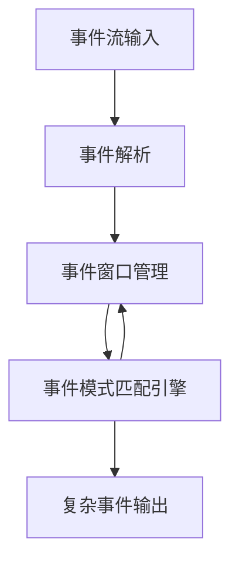

# CEP 原理与代码实例讲解

## 1. 背景介绍

在当今时代,随着数据的爆炸式增长,实时处理数据流成为了一个迫切的需求。传统的数据库系统往往无法满足对大量实时数据流的处理需求。因此,复杂事件处理(Complex Event Processing,CEP)应运而生,旨在从高速数据流中实时检测有意义的事件模式。

CEP 广泛应用于金融交易监控、网络安全监控、物联网设备监控等领域。它能够快速响应关键事件,及时做出反应,从而提高系统的实时性和可靠性。

## 2. 核心概念与联系

CEP 的核心概念包括:

1. **事件(Event)**: 事件是指发生在特定时间点的原子性数据记录,如股票交易记录、网络流量数据包等。

2. **事件流(Event Stream)**: 事件流是一个按时间顺序排列的事件序列。CEP 系统从事件流中检测出有意义的复杂事件模式。

3. **事件模式(Event Pattern)**: 事件模式定义了对事件流进行复杂检测的规则,如"连续三次股票价格下跌超过5%"。

4. **复杂事件(Complex Event)**: 复杂事件是指符合预定义事件模式的事件集合,如连续三次股票大跌构成的"暴跌"事件。

5. **事件窗口(Event Window)**: 事件窗口用于限定事件模式匹配的时间范围和数据范围,如"最近一分钟内"或"最近1000个事件"。

6. **事件处理语言(Event Processing Language)**: 用于定义事件模式的领域特定语言,如 SQL 类似的 EPL(Event Processing Language)。

这些概念相互关联,共同构建了 CEP 系统的核心功能。下面我们将详细介绍 CEP 的核心算法原理。

## 3. 核心算法原理具体操作步骤

CEP 系统的核心算法通常包括以下几个步骤:

1. **事件流接收**: CEP 系统从各种数据源(如消息队列、日志文件等)接收实时事件流。

2. **事件解析**: 将原始事件数据解析为内部事件对象,以便进行模式匹配。

3. **事件模式匹配**: 使用预定义的事件模式规则对事件流进行复杂模式匹配,检测出符合规则的复杂事件。

4. **事件窗口管理**: 根据窗口策略动态维护事件窗口,控制事件模式匹配的时间范围和数据范围。

5. **复杂事件输出**: 将检测到的复杂事件以适当的形式输出,如触发报警、更新仪表盘等。

下面我们将使用一个流行的 CEP 引擎 Esper 来具体说明其算法实现。

Esper 采用增量迭代的方式进行模式匹配,算法流程如下:



1. **事件解析**: 将原始事件数据解析为内部事件对象,并将事件插入到相应的事件流中。

2. **事件窗口管理**: 根据窗口策略,维护每个事件流对应的事件窗口,控制事件模式匹配的时间范围和数据范围。窗口类型包括时间窗口、长度窗口等。

3. **事件模式匹配引擎**: 遍历事件窗口中的事件,使用有限状态自动机(Finite State Machine)进行模式匹配。当检测到符合模式的复杂事件时,输出该复杂事件。

4. **复杂事件输出**: 将检测到的复杂事件以适当的形式输出,如触发报警、更新仪表盘等。

Esper 引擎采用了高效的索引和缓存机制,能够快速匹配大量的事件流数据。其模式匹配语言 EPL 类似于 SQL,支持丰富的事件模式定义,如时间窗口、数据窗口、模式守卫等。

## 4. 数学模型和公式详细讲解举例说明

在 CEP 系统中,事件模式匹配算法通常可以建模为有限状态自动机。以下是一个简单的数学模型:

假设事件流为 $E = \{e_1, e_2, \dots, e_n\}$,事件模式为 $P$,则模式匹配问题可以形式化为:判断 $E$ 中是否存在一个事件子序列 $\{e_{i_1}, e_{i_2}, \dots, e_{i_k}\}$ 满足模式 $P$。

我们可以将事件模式 $P$ 表示为一个有限状态自动机 $M = (Q, \Sigma, \delta, q_0, F)$,其中:

- $Q$ 是状态集合
- $\Sigma$ 是事件字母表
- $\delta: Q \times \Sigma \rightarrow Q$ 是状态转移函数
- $q_0 \in Q$ 是初始状态
- $F \subseteq Q$ 是终止状态集合

对于每个输入事件 $e_i \in E$,自动机 $M$ 根据当前状态 $q$ 和事件 $e_i$,通过状态转移函数 $\delta$ 转移到下一状态。如果最终达到终止状态 $q_f \in F$,则表示事件子序列 $\{e_{i_1}, e_{i_2}, \dots, e_{i_k}\}$ 匹配了模式 $P$。

例如,假设我们需要检测"连续三次股票价格下跌超过5%"的模式,可以构建如下有限状态自动机:

$$
\begin{aligned}
Q &= \{q_0, q_1, q_2, q_3\} \\
\Sigma &= \{\text{下跌}>5\%, \text{其他}\} \\
\delta(q_0, \text{下跌}>5\%) &= q_1 \\
\delta(q_1, \text{下跌}>5\%) &= q_2 \\
\delta(q_2, \text{下跌}>5\%) &= q_3 \\
\delta(q_i, \text{其他}) &= q_0 \quad \forall i \in \{0, 1, 2, 3\} \\
q_0 &= \text{初始状态} \\
F &= \{q_3\}
\end{aligned}
$$

该自动机具有四个状态,初始状态为 $q_0$,终止状态为 $q_3$。当连续三次输入事件为"下跌>5%"时,自动机将转移到终止状态 $q_3$,检测到复杂事件"暴跌"。

通过构建合适的有限状态自动机,CEP 系统可以高效地匹配各种复杂的事件模式。这种数学模型不仅简洁优雅,而且具有很强的表达能力和可扩展性。

## 5. 项目实践: 代码实例和详细解释说明

为了更好地理解 CEP 的原理和实现,我们将使用 Java 语言和 Esper CEP 引擎构建一个简单的股票交易监控系统。该系统将监控股票交易事件流,检测出"连续三次股票价格下跌超过5%"的复杂事件。

### 5.1 定义事件类

首先,我们定义一个 `StockTick` 事件类,表示股票行情数据:

```java
import com.espertech.esper.client.EventBean;

public class StockTick {
    private String symbol;
    private double price;

    public StockTick(String symbol, double price) {
        this.symbol = symbol;
        this.price = price;
    }

    public String getSymbol() {
        return symbol;
    }

    public double getPrice() {
        return price;
    }

    public static StockTick fromEventBean(EventBean eventBean) {
        String symbol = (String) eventBean.get("symbol");
        double price = (double) eventBean.get("price");
        return new StockTick(symbol, price);
    }
}
```

### 5.2 定义事件模式

接下来,我们使用 Esper 的 EPL 语言定义事件模式。该模式将检测"连续三次股票价格下跌超过5%"的复杂事件:

```java
String pattern = "@Name('Triple Decline Pattern') " +
                 "select * from StockTick(symbol='AAPL').win:length_batch(3) " +
                 "having price < prev(1, price) * 0.95 and prev(1, price) < prev(2, price) * 0.95";
```

该模式使用了 `length_batch` 视图来维护一个长度为 3 的事件窗口。`having` 子句检查窗口中的最后三个事件是否满足"连续三次下跌超过5%"的条件。

### 5.3 创建 CEP 引擎并注册事件模式

接下来,我们创建 Esper CEP 引擎实例,并注册上述事件模式:

```java
import com.espertech.esper.client.*;

public class StockMonitor {
    private EPServiceProvider epService;

    public StockMonitor() {
        Configuration config = new Configuration();
        config.addEventTypeAutoName("com.example.StockTick");
        epService = EPServiceProviderManager.getDefaultProvider(config);

        String pattern = "@Name('Triple Decline Pattern') " +
                         "select * from StockTick(symbol='AAPL').win:length_batch(3) " +
                         "having price < prev(1, price) * 0.95 and prev(1, price) < prev(2, price) * 0.95";
        EPStatement statement = epService.getEPAdministrator().createEPL(pattern);
        statement.addListener(new StockMonitorListener());
    }

    public void sendEvent(StockTick tick) {
        epService.getEPRuntime().sendEvent(tick);
    }

    // ...
}
```

我们创建了一个 `StockMonitor` 类,在构造函数中初始化 Esper 引擎,注册事件模式,并添加一个事件监听器 `StockMonitorListener`。`sendEvent` 方法用于向引擎发送股票行情事件。

### 5.4 实现事件监听器

最后,我们实现 `StockMonitorListener` 类,用于处理检测到的复杂事件:

```java
import com.espertech.esper.client.EventBean;
import com.espertech.esper.client.UpdateListener;

public class StockMonitorListener implements UpdateListener {
    public void update(EventBean[] newEvents, EventBean[] oldEvents) {
        if (newEvents != null) {
            for (EventBean event : newEvents) {
                StockTick tick = StockTick.fromEventBean(event);
                System.out.println("Triple Decline Detected: " + tick.getSymbol());
            }
        }
    }
}
```

当检测到"连续三次股票价格下跌超过5%"的复杂事件时,`update` 方法将被调用,我们可以在其中执行相应的处理逻辑,如发送报警等。

### 5.5 运行示例

最后,我们编写一个 `Main` 类来运行这个股票交易监控系统:

```java
public class Main {
    public static void main(String[] args) {
        StockMonitor monitor = new StockMonitor();

        // 发送一些股票行情事件
        monitor.sendEvent(new StockTick("AAPL", 100.0));
        monitor.sendEvent(new StockTick("AAPL", 98.0));
        monitor.sendEvent(new StockTick("AAPL", 96.0));
        monitor.sendEvent(new StockTick("AAPL", 97.0)); // 不会触发复杂事件

        // 输出:
        // Triple Decline Detected: AAPL
    }
}
```

在这个示例中,我们发送了四个股票行情事件。前三个事件符合"连续三次股票价格下跌超过5%"的模式,因此触发了复杂事件,输出了相应的提示信息。

通过这个简单的示例,我们可以看到如何使用 Esper CEP 引擎构建一个实时事件处理系统。Esper 提供了强大的事件模式匹配功能,并且具有良好的性能和可扩展性。

## 6. 实际应用场景

CEP 技术在许多领域都有广泛的应用,下面是一些典型的应用场景:

1. **金融交易监控**: 监控股票、外汇等金融交易,检测出异常交易模式,如内幕交易、操纵市场等违规行为。

2. **网络安全监控**: 实时分析网络流量数据,检测出潜在的网络攻击模式,如分布式拒绝服务攻击、端口扫描等。

3. **物联网设备监控**: 监控来自传感器的实时数据流,检测出设备故障、异常状态等复杂事件模式。

4. **业务活动监控**: 监控企业内部的业务流程事件,如订单处理、库存管理等,检测出异常情况并及时报警。

5. **欺诈检测**: