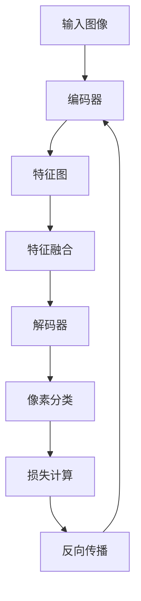

# FCN原理与代码实例讲解

## 1.背景介绍

全卷积网络(Fully Convolutional Networks, FCN)是一种用于语义分割的深度学习模型,它可以对图像中的每个像素进行分类,将其分配到预定义的类别中。语义分割在计算机视觉领域有着广泛的应用,例如无人驾驶、医学图像分析、遥感图像处理等。FCN的提出解决了传统卷积神经网络在分割任务中的一些局限性,成为语义分割领域的重要里程碑。

### 1.1 传统卷积神经网络的局限性

传统的卷积神经网络通常由卷积层和全连接层组成,用于图像分类任务。然而,在语义分割任务中,需要对图像中的每个像素进行分类,而全连接层会丢失图像的空间信息,无法很好地处理这种像素级别的分类问题。

### 1.2 FCN的创新点

FCN的核心创新点在于将传统卷积神经网络中的全连接层替换为卷积层,使整个网络都由卷积层组成。这种全卷积结构可以接受任意尺寸的输入图像,并输出与输入图像相同尺寸的特征图,从而实现像素级别的分类。

## 2.核心概念与联系

### 2.1 卷积层和上采样

FCN主要由两部分组成:编码器(encoder)和解码器(decoder)。编码器部分由一系列卷积层和池化层组成,用于提取图像的特征。解码器部分则由上采样层(upsampling)和卷积层组成,用于将编码器输出的特征图逐步上采样,恢复到与输入图像相同的分辨率。


### 2.2 跳跃连接

为了更好地融合不同层次的特征信息,FCN引入了跳跃连接(skip connection)的概念。编码器中的浅层特征图通过跳跃连接与解码器中相应层的特征图相结合,从而保留了更多的细节信息,有助于提高分割的精度。


### 2.3 损失函数

FCN采用交叉熵损失函数(cross-entropy loss)作为优化目标。对于每个像素,模型会预测它属于各个类别的概率,与真实标签进行比较,计算交叉熵损失。在训练过程中,通过反向传播算法优化网络参数,使损失函数最小化。

## 3.核心算法原理具体操作步骤

FCN的核心算法原理可以概括为以下几个步骤:

1. **编码器阶段**: 输入图像经过一系列卷积层和池化层,提取不同层次的特征。
2. **特征融合**: 编码器输出的特征图通过跳跃连接与解码器中相应层的特征图相结合,融合不同层次的特征信息。
3. **解码器阶段**: 融合后的特征图经过一系列上采样层和卷积层,逐步恢复到与输入图像相同的分辨率。
4. **像素分类**: 最终输出的特征图经过一个1x1卷积层,将每个像素分配到预定义的类别中。
5. **损失计算**: 使用交叉熵损失函数计算模型输出与真实标签之间的差异。
6. **反向传播**: 通过反向传播算法更新网络参数,使损失函数最小化。



## 4.数学模型和公式详细讲解举例说明

### 4.1 卷积运算

卷积运算是FCN中的核心操作之一,它可以提取输入数据的局部特征。对于一个二维输入数据$I$和卷积核$K$,卷积运算可以表示为:

$$
(I * K)(i, j) = \sum_{m} \sum_{n} I(i+m, j+n) K(m, n)
$$

其中,$(i, j)$表示输出特征图的位置,$(m, n)$表示卷积核的位置。卷积运算可以看作是在输入数据上滑动卷积核,计算局部区域与卷积核的内积。

### 4.2 池化运算

池化运算是另一个常用的操作,它可以减小特征图的空间维度,同时保留重要的特征信息。最大池化(max pooling)是一种常见的池化方法,它取池化窗口内的最大值作为输出:

$$
\text{max\_pool}(I)(i, j) = \max_{(m, n) \in R} I(i+m, j+n)
$$

其中,$R$表示池化窗口的大小和位置。

### 4.3 上采样运算

上采样运算是FCN解码器中的关键步骤,它可以将特征图的空间分辨率逐步恢复到与输入图像相同的大小。常用的上采样方法包括反卷积(deconvolution)和双线性插值(bilinear interpolation)等。

对于反卷积操作,可以看作是卷积操作的逆过程,将稀疏的特征图转换为密集的输出:

$$
(I * K)(i, j) = \sum_{m} \sum_{n} I(i-m, j-n) K(m, n)
$$

其中,$K$是一个可学习的上采样核。

### 4.4 损失函数

FCN采用交叉熵损失函数作为优化目标。对于一个像素$(i, j)$,模型输出$p_{i,j}^c$表示它属于类别$c$的概率,真实标签为$y_{i,j}$,则交叉熵损失可以表示为:

$$
L = -\sum_{i,j} \sum_{c} y_{i,j}^c \log p_{i,j}^c
$$

在训练过程中,通过反向传播算法优化网络参数,使损失函数$L$最小化。

## 5.项目实践:代码实例和详细解释说明

以下是一个使用PyTorch实现的FCN模型示例,用于对PASCAL VOC数据集进行语义分割。

### 5.1 导入所需库

```python
import torch
import torch.nn as nn
import torch.optim as optim
from torchvision import transforms, datasets
```

### 5.2 定义FCN模型

```python
class FCN(nn.Module):
    def __init__(self, n_classes):
        super(FCN, self).__init__()
        
        # 编码器部分
        self.encoder = nn.Sequential(
            nn.Conv2d(3, 64, 3, padding=1),
            nn.ReLU(inplace=True),
            nn.MaxPool2d(2, stride=2),
            
            nn.Conv2d(64, 128, 3, padding=1),
            nn.ReLU(inplace=True),
            nn.MaxPool2d(2, stride=2),
            
            nn.Conv2d(128, 256, 3, padding=1),
            nn.ReLU(inplace=True),
            nn.MaxPool2d(2, stride=2),
            
            nn.Conv2d(256, 512, 3, padding=1),
            nn.ReLU(inplace=True),
            nn.MaxPool2d(2, stride=2)
        )
        
        # 解码器部分
        self.decoder = nn.Sequential(
            nn.Conv2d(512, 256, 3, padding=1),
            nn.ReLU(inplace=True),
            nn.ConvTranspose2d(256, 128, 2, stride=2),
            
            nn.Conv2d(128, 64, 3, padding=1),
            nn.ReLU(inplace=True),
            nn.ConvTranspose2d(64, 32, 2, stride=2),
            
            nn.Conv2d(32, n_classes, 1)
        )
        
    def forward(self, x):
        encoder_output = self.encoder(x)
        decoder_output = self.decoder(encoder_output)
        
        return decoder_output
```

在这个示例中,编码器部分由四个卷积块组成,每个卷积块包含一个卷积层、一个ReLU激活函数和一个最大池化层。解码器部分则由三个卷积块组成,每个卷积块包含一个卷积层、一个ReLU激活函数和一个反卷积(ConvTranspose2d)层,用于上采样特征图。最后一层是一个1x1卷积层,用于将特征图映射到预定义的类别数量。

### 5.3 数据预处理

```python
# 定义数据转换
transform = transforms.Compose([
    transforms.Resize((256, 256)),
    transforms.ToTensor(),
    transforms.Normalize(mean=[0.485, 0.456, 0.406], std=[0.229, 0.224, 0.225])
])

# 加载数据集
train_dataset = datasets.VOCSegmentation(root='data/VOCdevkit', year='2012', image_set='train', download=True, transform=transform)
val_dataset = datasets.VOCSegmentation(root='data/VOCdevkit', year='2012', image_set='val', download=True, transform=transform)
```

在这个示例中,我们使用PyTorch提供的`VOCSegmentation`数据集,并对图像进行了resize、转换为张量和归一化处理。

### 5.4 训练模型

```python
# 定义模型、优化器和损失函数
model = FCN(n_classes=21)
optimizer = optim.Adam(model.parameters(), lr=0.001)
criterion = nn.CrossEntropyLoss()

# 训练循环
for epoch in range(num_epochs):
    running_loss = 0.0
    for inputs, labels in train_loader:
        # 前向传播
        outputs = model(inputs)
        loss = criterion(outputs, labels)
        
        # 反向传播
        optimizer.zero_grad()
        loss.backward()
        optimizer.step()
        
        running_loss += loss.item()
    
    # 打印损失
    print(f'Epoch {epoch+1}, Loss: {running_loss/len(train_loader)}')
```

在训练过程中,我们使用Adam优化器和交叉熵损失函数。每个epoch,我们遍历训练数据集,进行前向传播计算损失,然后通过反向传播更新模型参数。最后,打印当前epoch的平均损失值。

### 5.5 评估模型

```python
# 评估模型
model.eval()
with torch.no_grad():
    for inputs, labels in val_loader:
        outputs = model(inputs)
        # 计算指标
        ...
```

在评估阶段,我们将模型设置为评估模式,并在验证数据集上进行前向传播,计算相关的评估指标,如像素精度(Pixel Accuracy)、平均交并比(Mean IoU)等。

## 6.实际应用场景

FCN在计算机视觉领域有着广泛的应用,包括但不限于以下几个方面:

1. **无人驾驶**: 语义分割可以帮助无人驾驶系统准确识别道路、行人、车辆等关键目标,提高驾驶安全性。
2. **医学图像分析**: FCN可以应用于医学影像数据的分割和处理,如肿瘤检测、器官分割等,为医生提供更准确的诊断依据。
3. **遥感图像处理**: 在遥感领域,FCN可以用于土地利用分类、城市规划、环境监测等任务,提高数据处理效率。
4. **增强现实(AR)和虚拟现实(VR)**: 语义分割可以帮助AR/VR系统更好地理解和融合真实世界的场景,提升用户体验。
5. **机器人视觉**: FCN可以应用于机器人视觉系统,实现物体识别、场景理解等功能,提高机器人的自主能力。

## 7.工具和资源推荐

在学习和实践FCN时,以下工具和资源可能会对您有所帮助:

1. **深度学习框架**: PyTorch、TensorFlow、Keras等深度学习框架都提供了FCN的实现,可以快速上手。
2. **开源代码库**: GitHub上有许多优秀的开源FCN实现,如[pytorch-fcn](https://github.com/wkentaro/pytorch-fcn)、[tf-fcn](https://github.com/MarvinTeichmann/tensorflow-fcn)等。
3. **数据集**: PASCAL VOC、Cityscapes、CamVid等数据集广泛用于语义分割任务的训练和评估。
4. **在线教程**: 像Coursera、Udacity等平台提供了相关的深度学习和计算机视觉课程,可以系统地学习FCN的理论基础。
5. **论文和博客**:阅读FCN相关的论文和博客,可以深入了解最新的研究进展和技术细节。
6. **社