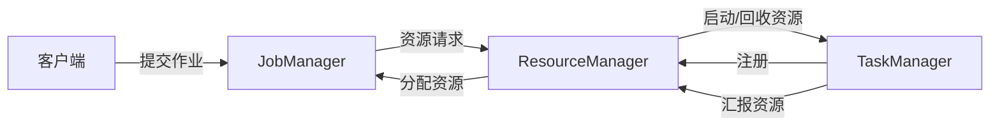

# Flink ResourceManager原理与代码实例讲解

## 1. 背景介绍
### 1.1 大数据处理的挑战
在大数据时代,海量数据的实时处理已成为各行各业的迫切需求。传统的批处理框架如Hadoop MapReduce已无法满足实时计算的要求。因此,流式计算框架应运而生,其中Apache Flink以其优异的性能和灵活的API脱颖而出。

### 1.2 Flink概述
Apache Flink是一个开源的分布式流处理和批处理框架。它提供了统一的API,支持流处理和批处理,可以实现高吞吐、低延迟、exactly-once语义的有状态计算。Flink的核心是其分布式流式数据流引擎,以数据并行和流水线方式执行任意流数据程序。

### 1.3 ResourceManager在Flink中的作用  
在Flink的架构中,ResourceManager扮演着至关重要的角色。它负责管理Flink集群中的资源,包括TaskManager的注册与注销、资源的分配与回收等。深入理解ResourceManager的工作原理,对于优化Flink作业的资源利用、提高集群的性能和稳定性具有重要意义。

## 2. 核心概念与联系
### 2.1 Flink架构概览
Flink采用主从架构,主要由JobManager、TaskManager和ResourceManager三大组件构成。
- JobManager: 负责接收客户端提交的作业,协调任务的执行。一个集群只有一个active的JobManager。 
- TaskManager: 负责执行作业的任务(Task),管理其所在节点的计算资源。一个集群可以有多个TaskManager。
- ResourceManager: 负责管理集群中的资源,如TaskManager的注册与注销、资源的分配与回收等。

### 2.2 ResourceManager的功能
ResourceManager的主要功能包括:
1. 接受并处理来自JobManager的资源请求。
2. 启动新的TaskManager分配资源,或从空闲的TaskManager分配资源。
3. 追踪TaskManager的状态,并在TaskManager失败时进行处理。
4. 资源的注册、分配和回收。

### 2.3 ResourceManager与其他组件的交互


## 3. 核心算法原理具体操作步骤
### 3.1 资源分配算法
当JobManager向ResourceManager请求资源时,ResourceManager会根据请求的资源类型和大小,从集群中选择合适的资源进行分配。Flink支持两种资源分配策略:
1. Eager资源分配: 一次性分配作业所需的全部资源,如果资源不足则作业无法启动。
2. Lazy资源分配: 按需分配资源,先启动作业,在执行过程中动态分配资源。

ResourceManager会维护一个资源池,记录集群中每个TaskManager的空闲资源情况。当收到资源请求时,它会遍历资源池,找到满足要求的TaskManager,并将资源分配给JobManager。

### 3.2 TaskManager的注册与注销
1. TaskManager启动后,会向ResourceManager发送注册请求,包含其所在节点的硬件资源情况。
2. ResourceManager收到请求后,将TaskManager加入资源池,并维护其状态信息。
3. 当TaskManager出现故障或手动关闭时,会向ResourceManager发送注销请求。
4. ResourceManager收到请求后,将TaskManager从资源池中移除,并回收其资源。

### 3.3 容错处理
当TaskManager出现故障时,ResourceManager需要及时将其从资源池中移除,并通知JobManager重新调度受影响的任务。具体步骤如下:
1. TaskManager定期向ResourceManager发送心跳,报告其健康状态。
2. 如果ResourceManager在一定时间内没有收到TaskManager的心跳,则认为其已失联。
3. ResourceManager将失联的TaskManager从资源池中移除,并通知JobManager重新调度受影响的任务。
4. JobManager重新向ResourceManager请求资源,启动新的TaskManager执行任务。

## 4. 数学模型和公式详细讲解举例说明
### 4.1 资源分配的数学模型
假设一个Flink集群有$n$个TaskManager,每个TaskManager有$m$个slot。一个作业需要$k$个slot。我们可以将资源分配问题建模为一个整数规划问题:

$$
\begin{aligned}
\min \quad & \sum_{i=1}^n y_i \\
\text{s.t.} \quad & \sum_{i=1}^n x_i = k \\
& x_i \leq m \cdot y_i, \quad i=1,\ldots,n \\
& x_i \in \mathbb{N}, \quad i=1,\ldots,n \\
& y_i \in \{0,1\}, \quad i=1,\ldots,n
\end{aligned}
$$

其中,$x_i$表示在第$i$个TaskManager上分配的slot数量,$y_i$是一个二元变量,表示是否使用第$i$个TaskManager。目标函数是最小化使用的TaskManager数量,约束条件保证分配的slot总数等于$k$,且每个TaskManager上分配的slot数不超过其容量$m$。

### 4.2 负载均衡的数学模型
为了提高集群的资源利用率和任务执行效率,ResourceManager需要尽可能将负载均衡地分配到各个TaskManager上。我们可以将负载均衡问题建模为一个二次规划问题:

$$
\begin{aligned}
\min \quad & \sum_{i=1}^n (x_i - \bar{x})^2 \\
\text{s.t.} \quad & \sum_{i=1}^n x_i = k \\
& 0 \leq x_i \leq m, \quad i=1,\ldots,n \\
& x_i \in \mathbb{N}, \quad i=1,\ldots,n
\end{aligned}
$$

其中,$\bar{x} = k/n$表示平均负载。目标函数是最小化各TaskManager负载与平均负载的差异平方和,约束条件保证分配的slot总数等于$k$,且每个TaskManager上分配的slot数不超过其容量$m$。

通过求解上述优化问题,ResourceManager可以得到一个尽可能均衡的资源分配方案,提高集群的性能和稳定性。

## 5. 项目实践：代码实例和详细解释说明
下面通过一个简单的代码实例,演示如何使用Flink的ResourceManager进行资源管理。

### 5.1 启动Flink集群
首先,我们需要启动一个Flink集群,包括一个JobManager和多个TaskManager。可以使用以下命令:

```bash
# 启动JobManager
bin/jobmanager.sh start

# 启动TaskManager
bin/taskmanager.sh start
```

### 5.2 提交Flink作业
接下来,我们编写一个简单的Flink作业,并提交到集群执行:

```java
public class ResourceManagerExample {
    public static void main(String[] args) throws Exception {
        // 创建执行环境
        StreamExecutionEnvironment env = StreamExecutionEnvironment.getExecutionEnvironment();
        
        // 设置并行度
        env.setParallelism(4);
        
        // 从集合中创建数据源
        DataStream<Integer> dataStream = env.fromElements(1, 2, 3, 4, 5);
        
        // 对数据进行转换处理
        DataStream<Integer> resultStream = dataStream.map(new MapFunction<Integer, Integer>() {
            @Override
            public Integer map(Integer value) throws Exception {
                return value * 2;
            }
        });
        
        // 打印结果
        resultStream.print();
        
        // 提交作业
        env.execute("Resource Manager Example");
    }
}
```

在这个例子中,我们创建了一个StreamExecutionEnvironment,设置作业的并行度为4。然后从一个集合中创建数据源,对数据进行简单的转换处理,最后打印结果并提交作业。

### 5.3 ResourceManager的工作流程
当我们提交作业后,Flink的ResourceManager会开始工作,具体流程如下:
1. JobManager收到客户端提交的作业,解析作业的并行度和资源需求。
2. JobManager向ResourceManager发送资源请求,包括所需的TaskManager数量和slot数量。
3. ResourceManager收到请求后,从资源池中选择满足要求的TaskManager,并将资源分配给JobManager。
4. 如果资源池中没有足够的空闲资源,ResourceManager会启动新的TaskManager。
5. TaskManager启动后向ResourceManager注册,ResourceManager将其加入资源池。
6. JobManager收到分配的资源后,将任务调度到对应的TaskManager上执行。
7. 任务执行完成后,JobManager向ResourceManager释放资源。
8. ResourceManager收到释放请求后,将资源标记为空闲,供后续作业使用。

通过以上流程,Flink的ResourceManager实现了集群资源的自动管理和调度,提高了资源利用率和作业执行效率。

## 6. 实际应用场景
Flink凭借其优异的性能和灵活的API,在许多实际场景中得到了广泛应用,例如:
1. 实时数据处理:如实时日志分析、监控告警、欺诈检测等。
2. 数据持久化:将流式数据写入数据库、文件系统或消息队列。
3. 数据分析:如实时统计分析、机器学习、图计算等。
4. 事件驱动应用:如实时推荐、实时竞价等。

在这些应用场景中,Flink的ResourceManager通过动态管理集群资源,保证了作业的高效执行和稳定运行。

## 7. 工具和资源推荐
1. Flink官方文档: https://flink.apache.org/docs/stable/
2. Flink GitHub仓库: https://github.com/apache/flink
3. Flink社区: https://flink.apache.org/community.html
4. Flink在线学习平台Ververica Academy: https://training.ververica.com/
5. 《Stream Processing with Apache Flink》书籍: O'Reilly Media出版,对Flink进行了全面深入的介绍。

## 8. 总结：未来发展趋势与挑战
随着大数据和实时计算的不断发展,Flink正面临着新的机遇和挑战:
1. 云原生支持:Flink需要更好地适应云环境,支持Kubernetes等容器化技术,实现弹性伸缩和高可用。
2. AI和机器学习:Flink需要与AI和机器学习平台深度集成,支持实时模型训练和推理。
3. 性能优化:优化Flink的资源管理和任务调度策略,进一步提高资源利用率和计算性能。
4. 生态系统建设:加强与其他大数据组件的集成,构建完整的大数据处理生态。

相信通过社区的共同努力,Flink将在未来的大数据领域发挥更加重要的作用。

## 9. 附录：常见问题与解答
1. 如何设置Flink作业的并行度?
   可以通过env.setParallelism()方法设置作业的全局并行度,也可以在算子上调用setParallelism()方法单独设置并行度。
2. TaskManager的slot是什么?
   slot是TaskManager中的资源分配单元,每个slot可以执行一个任务。TaskManager的slot数量决定了其可以并行执行的任务数。
3. 如何监控Flink集群的资源使用情况?
   Flink提供了Web UI和REST API,可以查看集群的资源使用情况,如TaskManager的数量、slot的分配情况、作业的运行状态等。
4. Flink支持哪些资源管理器?
   Flink支持多种资源管理器,如YARN、Mesos、Kubernetes等,可以根据实际需求选择合适的资源管理器。
5. Flink如何实现高可用?
   Flink支持多种高可用方案,如ZooKeeper、Kubernetes等。通过配置多个JobManager和StateBackend,可以实现Flink集群的高可用。

作者：禅与计算机程序设计艺术 / Zen and the Art of Computer Programming