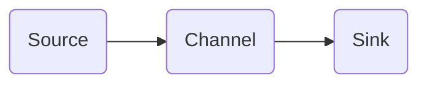

# Flume Channel原理与代码实例讲解

## 1.背景介绍
### 1.1 Flume简介
Apache Flume是一个分布式、可靠、高可用的海量日志采集、聚合和传输的系统。Flume可以采集各种数据源产生的海量日志数据，经过聚合后发送到存储系统中，比如Kafka、HDFS、HBase等。
### 1.2 Flume核心组件
Flume主要有Source、Channel、Sink三大核心组件:
- Source：数据采集组件，用于跟数据源对接，以获取数据。
- Channel：中转储存组件，源数据采集到Channel中后，会一直保存在Channel中，直到被Sink消费。
- Sink：下沉组件，负责将Channel中的数据写入到目标存储系统。

## 2.核心概念与联系
### 2.1 Event
Event是Flume数据传输的基本单元。Event由可选的header和载有数据的一个byte array构成。Header是由一系列的"key:value"对构成。
### 2.2 Channel
Channel是位于Source和Sink之间的缓冲区。Source将数据写到Channel，Sink从Channel读取数据。Channel允许Source和Sink运作在不同的速率上。Channel是线程安全的，可以同时处理几个Source的写入操作和几个Sink的读取操作。
Flume自带两种Channel：Memory Channel和File Channel。
- Memory Channel是内存中的队列。Memory Channel在不需要关心数据丢失的情景下适用。如果需要关心数据丢失，那么Memory Channel就不应该使用，因为程序死亡、机器宕机或者重启都会导致数据丢失。
- File Channel将所有事件写到磁盘。因此在程序关闭或机器宕机的情况下不会丢失数据。

### 2.3 Source、Channel、Sink之间的联系
下图展示了Source、Channel、Sink三者之间的关系：



## 3.核心算法原理具体操作步骤
### 3.1 Channel选择机制
Flume支持将Event发送到多个Channel，Flume提供了两种Channel选择机制：
- Replicating：将同一个Event发送到所有的Channel。
- Multiplexing：根据相应的原则，将不同的Event发送到不同的Channel。

### 3.2 Sink Processor
Flume支持将多个Sink串联在一起，形成一个Sink组，Sink Processor 用来定义Sink组的策略，目前支持两种Sink Processor：
- default：默认策略，Event按照顺序依次流经每个Sink。
- failover：故障转移策略，Event先发送到优先级最高的Sink，如果失败再发送到优先级次高的，以此类推。

## 4.数学模型和公式详细讲解举例说明
### 4.1 Channel容量估算
Channel的容量需要根据实际情况进行估算。估算Channel容量可以使用以下公式：

$Channel Capacity = \frac{SourceRate(MB/s) \times Delay(s)}{EventSize(MB)}$

其中：
- SourceRate：Source的数据产生速率
- Delay：最大允许的传输延迟
- EventSize：单个Event的大小

例如，假设Source的数据产生速率为1MB/s，允许的最大延迟为10s，单个Event大小为1KB，则Channel容量的估算为：

$Channel Capacity = \frac{1MB/s \times 10s}{1KB} = 10000$

即Channel的容量应该设置为10000。

## 5.项目实践：代码实例和详细解释说明
下面是一个使用File Channel的Flume配置示例：

```properties
# 定义Agent a1
a1.sources = s1
a1.channels = c1
a1.sinks = k1

# 配置Source
a1.sources.s1.type = netcat
a1.sources.s1.bind = localhost
a1.sources.s1.port = 9999

# 配置Channel
a1.channels.c1.type = file
a1.channels.c1.checkpointDir = /data/flume/checkpoint
a1.channels.c1.dataDirs = /data/flume/data

# 配置Sink
a1.sinks.k1.type = logger

# 连接组件
a1.sources.s1.channels = c1  
a1.sinks.k1.channel = c1
```

在上面的配置中：
1. 定义了一个名为a1的Agent，包含一个Source s1，一个Channel c1和一个Sink k1。  
2. Source的类型为netcat，监听localhost的9999端口。
3. Channel的类型为file，checkpoint和data文件分别保存在/data/flume/checkpoint和/data/flume/data目录下。
4. Sink的类型为logger，将数据输出到控制台。
5. 最后将Source和Sink与Channel连接起来。

## 6.实际应用场景
Flume广泛应用于海量日志数据的采集、聚合和移动。一些常见的使用场景包括：
- 日志收集：Flume可以收集服务器日志、应用程序日志等，并移动到HDFS、HBase等集中式存储系统中，以便进一步处理和分析。
- 数据采集：Flume可以与各种数据源集成，实时或者按周期采集数据，比如监控数据、网络流量数据等。
- 数据处理：Flume可以在数据传输的过程中对数据进行一些处理，比如过滤、转换等。

## 7.工具和资源推荐
- Flume官网：https://flume.apache.org/
- Flume用户手册：https://flume.apache.org/FlumeUserGuide.html
- Flume API文档：https://flume.apache.org/releases/content/1.9.0/apidocs/index.html
- Flume Github源码仓库：https://github.com/apache/flume

## 8.总结：未来发展趋势与挑战
Flume作为一个成熟的分布式日志收集框架，已经在众多大数据平台中得到广泛应用。未来Flume的发展趋势和面临的挑战包括：
1. 与流行的大数据技术栈继续深度集成，比如Kafka、Spark等。
2. 支持更多的数据源和目标存储系统，提供更灵活的扩展机制。  
3. 提供更友好的监控和管理界面，方便用户使用。
4. 进一步优化性能，支持更大规模的数据收集。
5. 加强数据安全方面的特性。

## 9.附录：常见问题与解答
### 9.1 Flume有哪些常用的Source类型？
- Avro Source：支持Avro协议（实际上是Avro RPC），内置支持。
- Thrift Source：支持Thrift协议，内置支持。
- Exec Source：基于Unix的command在标准输出上生产数据。
- JMS Source：从JMS系统（消息、主题）中读取数据。
- Spooling Directory Source：监控指定目录内数据变更。
- Kafka Source：从Kafka Topic中读取数据。
- NetCat Source：监听指定端口，将流经端口的每一个文本行数据作为Event输入。
- Syslog Source：读取syslog数据，产生Event。

### 9.2 Flume有哪些常用的Sink类型？
- HDFS Sink：写入Event数据到HDFS。支持文本和二进制格式，支持压缩。
- Hive Sink：写入Event数据到Hive。
- Logger Sink：将Event数据写入日志文件。
- Avro Sink：将Event数据送到另一个（运行Avro Source的）Flume Agent。
- Thrift Sink：将Event数据送到另一个（运行Thrift Source的）Flume Agent。
- File Roll Sink：将Event数据写入本地文件系统。
- Null Sink：丢弃所有Event数据。
- HBase Sink：将Event数据写入HBase数据库。
- Kafka Sink：将Event数据发布到Kafka Topic。

作者：禅与计算机程序设计艺术 / Zen and the Art of Computer Programming