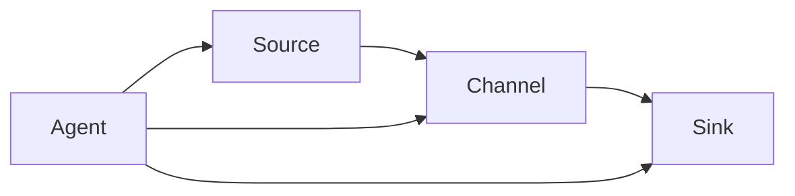

# Flume Source原理与代码实例讲解

## 1.背景介绍

Apache Flume是一个分布式、可靠且高可用的海量日志采集、聚合和传输的系统,它是Apache软件基金会的一个顶级项目。在大数据时代,日志数据作为企业的重要资产,如何高效地收集和传输海量日志数据成为了一个迫切需要解决的问题。Flume应运而生,它可以从不同的数据源采集数据,经过聚合后再将数据传输到下一个节点,最终存储到HDFS、HBase或Solr等目的地。

Flume的核心设计理念是基于流式数据的简单可靠性。它使用简单的数据流模型,以事件的形式从各种数据源采集数据,并通过内存通道临时存储,最后通过sink将数据写入目的地。Flume的这种架构设计使其具有很强的容错能力和故障转移机制,即使某个Agent发生故障,也不会影响整个系统的运行。

## 2.核心概念与联系

在深入探讨Flume Source的原理之前,我们需要先了解Flume的几个核心概念:

### 2.1 Event

Event是Flume数据传输的基本单元,它由Header和Body两部分组成。Header是键值对形式的元数据,用于描述事件的一些属性;Body则是事件的有效负载数据,通常是日志的原始内容。

### 2.2 Source

Source是数据进入Flume的入口,它负责从外部数据源采集数据,并将数据封装成Event发送到Channel。Flume支持多种类型的Source,如exec、syslog、spooling directory等。

### 2.3 Channel

Channel是Flume内部的数据传输通道,它在Source和Sink之间充当缓冲区的作用,可以临时存储事件数据。Channel的设计保证了Source和Sink的解耦,使它们可以并行运行,从而提高了Flume的吞吐量。常用的Channel类型有Memory Channel和File Channel。

### 2.4 Sink

Sink是Flume的出口,它从Channel中获取Event,并将数据发送到下一跳或最终目的地。Sink的类型由目的地决定,如HDFS Sink、HBase Sink等。

### 2.5 Agent

Agent是Flume的基本单元,它由一个Source、一个Channel和一个或多个Sink组成。Agent可以独立运行,也可以与其他Agent串联成更复杂的拓扑结构。

上述核心概念的关系如下Mermaid流程图所示:



## 3.核心算法原理具体操作步骤

Flume Source是数据进入Flume的入口,它负责从外部数据源采集数据并将其转换为Event。不同类型的Source采集数据的方式各不相同,但它们都遵循以下基本步骤:

1. **初始化(Initialize)**: Source在启动时进行初始化操作,例如建立与数据源的连接、加载配置参数等。

2. **状态检查(Status Check)**: Source定期检查数据源的状态,判断是否有新的数据可供采集。

3. **数据采集(Data Collection)**: 如果数据源有新数据,Source就从中读取原始数据。

4. **数据转换(Data Transformation)**: Source将原始数据转换为Flume Event的格式,包括设置Header和Body。

5. **事件传输(Event Transmission)**: Source将转换后的Event推送到Channel中,等待Sink从Channel中取出并发送到下游。

6. **重试和容错(Retry and Fault Tolerance)**: 如果在传输过程中发生错误,Source会根据配置的重试策略进行重试或记录错误日志。

下面以exec Source为例,详细介绍其工作原理和代码实现。

### 3.1 Exec Source原理

Exec Source是Flume中一种常用的Source类型,它可以通过执行外部进程或命令来采集数据。Exec Source的工作流程如下:

1. 启动时,根据配置的命令和参数创建一个进程。
2. 定期检查进程的输出流,如果有新的输出数据就读取出来。
3. 将读取到的数据转换为Event,设置Header和Body。
4. 将Event推送到Channel。
5. 如果进程退出,则根据配置决定是否重启进程。

### 3.2 Exec Source代码分析

我们来分析一下Exec Source的核心代码实现。首先是ExecSource类的构造函数,它用于初始化Source并加载配置参数:

```java
public ExecSource() {
  super();
  command = null;
  shell = null;
  restartThrottle = RESTART_THROTTLE_DEFAULT;
  logStdErr = true;
  batchSize = DEFAULT_BATCH_SIZE;
  restart = false;
  exitCodeMapper = new ExitCodeMapper();
}
```

接下来是Source的启动方法start(),它会根据配置创建进程并启动读取线程:

```java
@Override
public void start() {
  // ...
  executor = Executors.newSingleThreadExecutor(threadFactory);
  updateExecutor();
  // ...
}

private void updateExecutor() {
  if (runner == null) {
    runner = new ExecRunnable(command, shell, restart, logStdErr);
  } else {
    runner.setRestart(restart);
  }
  executor.execute(runner);
}
```

ExecRunnable是一个实现了Runnable接口的内部类,它负责执行命令并读取输出数据。以下是其run()方法的核心代码:

```java
@Override
public void run() {
  // ...
  while (!Thread.currentThread().isInterrupted()) {
    try {
      numBytes = stream.read(cbuf);
      if (numBytes >= 0) {
        // 将读取到的数据转换为Event并推送到Channel
        List<Event> events = doReads(numBytes);
        sourceCounter.addToEventAcceptedCount(events.size());
        sinkCounter.addToEventAcceptedCount(events.size());
        getChannelProcessor().processEventBatch(events);
        counterGroup.incrementAndPrint();
      } else {
        // 进程退出,根据配置决定是否重启
        handleexit();
        break;
      }
    } catch (Throwable t) {
      // ...
    }
  }
}
```

可以看到,ExecRunnable会不断读取进程的输出流,并将读取到的数据转换为Event。转换过程由doReads()方法完成:

```java
private List<Event> doReads(int numBytes) {
  List<Event> events = new ArrayList<Event>();
  byte[] byteArr = Arrays.copyOfRange(cbuf, 0, numBytes);
  String data = new String(byteArr);
  // 根据换行符切分数据
  for (String line : data.split(System.getProperty("line.separator"))) {
    if (line.length() != 0) {
      // 创建Event并设置Header和Body
      SimpleEvent event = new SimpleEvent();
      event.setBody(line.getBytes());
      events.add(event);
    }
  }
  return events;
}
```

可以看到,doReads()方法将读取到的字节数据转换为字符串,并根据换行符切分成多行,每行作为一个Event的Body。

最后,ExecRunnable会将转换后的Event批量推送到Channel中:

```java
getChannelProcessor().processEventBatch(events);
```

如果进程退出,ExecRunnable会调用handleExit()方法,根据配置决定是否重启进程。

## 4.数学模型和公式详细讲解举例说明

在Flume Source的实现中,没有涉及复杂的数学模型和公式。但是,我们可以从另一个角度来分析Flume的吞吐量模型。

假设Flume的吞吐量为T(events/s),Source的采集速率为R(events/s),Channel的缓冲区大小为C(events),Sink的发送速率为S(events/s)。根据流量守恒原理,我们可以得到以下公式:

$$
R = T = S
$$

也就是说,在稳定状态下,Source的采集速率、Flume的吞吐量和Sink的发送速率应该是相等的。

但是,由于Channel的缓冲作用,短时间内Source的采集速率可以大于Sink的发送速率,即:

$$
R > S
$$

这种情况下,Channel会不断累积数据,直到填满缓冲区。当Channel缓冲区满时,Flume会进入阻塞状态,此时有:

$$
R = C / (t_2 - t_1)
$$

其中$t_1$是Channel开始填充的时间,$t_2$是Channel填满的时间。

为了避免阻塞,我们需要保证长期来看Source的采集速率不大于Sink的发送速率,即:

$$
\overline{R} \leq \overline{S}
$$

其中,上线表示对时间的平均值。

综上所述,为了获得最大吞吐量,我们需要让Source、Channel和Sink的速率达到平衡,并适当调节Channel的缓冲区大小,从而在保证低延迟的同时避免数据丢失。

## 5.项目实践:代码实例和详细解释说明

为了更好地理解Flume Source的工作原理,我们来看一个基于Exec Source的实例项目。这个项目的目标是从一个日志文件中实时采集数据,并将数据发送到HDFS上。

### 5.1 项目结构

```
exec-source-example
├── lib
│   └── flume-ng-core-1.9.0.jar
├── logs
│   └── access.log
├── flume-conf.properties
└── run.sh
```

- lib目录存放Flume的核心jar包
- logs目录存放需要采集的日志文件access.log
- flume-conf.properties是Flume的配置文件
- run.sh是启动脚本

### 5.2 配置文件

flume-conf.properties的内容如下:

```properties
# Define the source, channel, sink
a1.sources = r1
a1.channels = c1
a1.sinks = k1

# Configure the source
a1.sources.r1.type = exec
a1.sources.r1.command = tail -F /path/to/exec-source-example/logs/access.log
a1.sources.r1.shell = /bin/bash -c

# Configure the channel
a1.channels.c1.type = memory
a1.channels.c1.capacity = 1000
a1.channels.c1.transactionCapacity = 100

# Configure the sink
a1.sinks.k1.type = hdfs
a1.sinks.k1.hdfs.path = hdfs://namenode/flume/events/%Y%m%d/%H
a1.sinks.k1.hdfs.filePrefix = events-
a1.sinks.k1.hdfs.round = true
a1.sinks.k1.hdfs.roundValue = 10
a1.sinks.k1.hdfs.roundUnit = minute

# Configure the channel/sink binding
a1.sources.r1.channels = c1
a1.sinks.k1.channel = c1
```

这个配置文件定义了一个名为a1的Agent,包含以下组件:

- Source: 类型为exec,执行tail -F命令从access.log文件中实时读取日志数据。
- Channel: 类型为memory,内存缓冲区大小为1000 events,每批传输100 events。
- Sink: 类型为hdfs,将数据写入HDFS,路径为hdfs://namenode/flume/events,按小时分桶存储。

### 5.3 启动脚本

run.sh的内容如下:

```bash
#!/bin/bash

# Set Flume classpath
FLUME_CLASSPATH=".:lib/*"

# Start Flume agent
flume-ng agent --conf conf --conf-file flume-conf.properties --name a1 -Dflume.root.logger=INFO,console
```

这个脚本设置了Flume的classpath,然后启动了名为a1的Agent。

### 5.4 运行实例

1. 确保HDFS集群已启动并运行正常。
2. 在exec-source-example目录下执行`./run.sh`启动Flume Agent。
3. 观察Flume的日志输出,确保Agent启动成功。
4. 在logs/access.log文件中追加一些日志数据,观察HDFS上是否有新的数据文件生成。

通过这个实例,我们可以看到Exec Source是如何从文件中采集数据、如何配置Source、Channel和Sink,以及Flume是如何将数据可靠地传输到HDFS的。你可以尝试修改配置参数,观察Flume的运行情况,从而加深对Flume Source原理的理解。

## 6.实际应用场景

Flume作为一款强大的日志采集系统,在实际生产环境中有着广泛的应用场景:

### 6.1 服务器日志收集

在大型互联网公司和云计算环境中,服务器的运行日志是非常宝贵的资源。通过配置Flume的Exec Source或Spooling Directory Source,我们可以实时采集服务器上的各种日志文件,如Nginx访问日志、Java应用日志、系统日志等。这些日志数据可以用于故障分析、安全审计、用户行为分析等目的。

### 6.2 数据库审计日志收集

对于金融、电商等对数据安全要求很高的行业,数据库审计日志是必不可少的。我们可以使用Flume的Exec Source来采集数