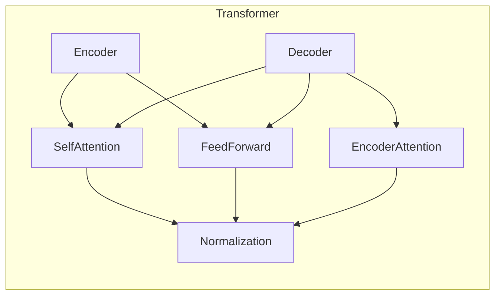

# GPT-4：点亮人工通用智能的火花

## 1. 背景介绍

### 1.1 人工智能的飞速发展

人工智能(Artificial Intelligence, AI)作为一门跨学科的技术,已经在各个领域取得了长足的进步。从计算机视觉、自然语言处理到机器学习和深度学习等,AI技术不断突破,为我们的生活带来了前所未有的变革。然而,尽管取得了巨大成就,但现有的AI系统仍然存在局限性,无法真正达到与人类相媲美的通用智能水平。

### 1.2 通用人工智能的追求

通用人工智能(Artificial General Intelligence, AGI)是AI领域的终极目标,旨在创造出能够像人类一样具备广泛的理解、推理和解决问题能力的智能系统。虽然这一目标看似遥不可及,但科技巨头和研究机构一直在不懈探索,希望能够最终实现这一梦想。

### 1.3 GPT-4的重要性

在这一背景下,OpenAI推出的GPT-4(Generative Pre-trained Transformer 4)被视为通向AGI的一个关键里程碑。作为GPT语言模型系列的最新进化,GPT-4展现出了令人惊叹的能力,在自然语言处理、推理和问题解决等多个领域表现出色,被认为是迄今为止最接近AGI的AI系统之一。

## 2. 核心概念与联系

### 2.1 GPT语言模型

GPT(Generative Pre-trained Transformer)是一种基于Transformer架构的大型语言模型,由OpenAI开发。它通过在海量文本数据上进行预训练,学习语言的结构和语义,从而获得强大的自然语言理解和生成能力。

GPT模型的核心思想是利用自注意力(Self-Attention)机制,允许模型在处理序列数据时充分捕捉长距离依赖关系,从而更好地理解上下文信息。

### 2.2 GPT-4的进化

GPT-4是GPT语言模型系列的最新版本,相比之前的GPT-3等模型,它在模型规模、训练数据量和训练方法等方面都有了显著的提升。

GPT-4采用了更大的模型容量和更多的训练数据,使其能够学习更丰富的知识和技能。同时,它还引入了一些新的训练技术,如对抗训练(Adversarial Training)和反事实推理(Counterfactual Reasoning),以提高模型的鲁棒性和推理能力。

### 2.3 多模态能力

与之前的GPT模型相比,GPT-4最大的创新之一是具备了多模态(Multimodal)能力。这意味着它不仅能够处理文本数据,还能够理解和生成图像、视频和音频等多种模态的数据。这使得GPT-4在许多实际应用场景中具有更广阔的应用前景。

### 2.4 通用智能的关键

GPT-4被视为通向AGI的一个关键步骤,原因在于它展现出了令人惊叹的通用智能能力。不仅在自然语言处理方面表现出色,GPT-4还能够进行复杂的推理、问题解决和决策,并在多个领域发挥作用。这种通用性和灵活性使其更接近于人类般的智能。

然而,GPT-4仍然存在一些局限性,例如缺乏持久的记忆和情景理解能力,以及在某些特定领域的专业知识储备不足等。因此,它更像是通向AGI的一个重要里程碑,而非AGI的完全实现。

## 3. 核心算法原理具体操作步骤

### 3.1 Transformer架构

GPT-4的核心架构是基于Transformer的,Transformer是一种全新的序列到序列(Sequence-to-Sequence)模型,它完全依赖于自注意力机制,而不使用传统的递归或卷积神经网络。

Transformer架构主要由编码器(Encoder)和解码器(Decoder)两个部分组成。编码器负责处理输入序列,而解码器则根据编码器的输出生成目标序列。



1. **自注意力(Self-Attention)**:自注意力机制是Transformer的核心,它允许模型在处理序列数据时充分捕捉长距离依赖关系。每个位置的输出都是所有位置的加权和,权重由注意力分数决定。

2. **前馈神经网络(Feed-Forward Network)**:前馈神经网络是Transformer中的另一个重要组件,它对每个位置的输出进行独立的位置wise全连接操作,以引入非线性变换。

3. **编码器注意力(Encoder-Decoder Attention)**:在解码器中,除了自注意力和前馈网络外,还引入了编码器注意力机制,用于关注输入序列中的不同位置,以获取相关的上下文信息。

4. **残差连接(Residual Connection)**和**层归一化(Layer Normalization)**:为了加速训练并提高模型性能,Transformer采用了残差连接和层归一化等技术。

### 3.2 GPT-4的训练过程

GPT-4的训练过程包括以下几个关键步骤:

1. **数据预处理**:首先需要收集和清理海量的文本数据,包括网页、书籍、论文等各种来源。这些数据将被用于模型的预训练。

2. **词嵌入(Word Embedding)**:将文本数据转换为向量表示,以便模型能够理解和处理。通常使用Word2Vec、GloVe等技术进行词嵌入。

3. **预训练(Pre-training)**:在大规模文本数据上对GPT-4进行预训练,使其学习语言的结构和语义。预训练通常采用自监督学习的方式,例如掩码语言模型(Masked Language Modeling)和下一句预测(Next Sentence Prediction)等任务。

4. **微调(Fine-tuning)**:在特定任务上对预训练模型进行微调,使其能够更好地适应该任务的需求。微调过程中,模型的大部分参数保持不变,只对一小部分参数进行调整。

5. **对抗训练(Adversarial Training)**:为了提高模型的鲁棒性,GPT-4采用了对抗训练技术。通过向输入数据添加小的扰动,模型被迫学习识别和抵御这些对抗性攻击,从而提高其泛化能力。

6. **反事实推理(Counterfactual Reasoning)**:GPT-4还引入了反事实推理的训练方法,旨在提高模型的推理和决策能力。通过构建一些假设情景,模型需要推断在这些情况下会发生什么,从而学习因果关系和逻辑推理。

### 3.3 多模态融合

GPT-4的一大创新是具备了多模态能力,即能够同时处理文本、图像、视频和音频等多种模态数据。这是通过在模型架构中引入了多模态融合机制实现的。

多模态融合的核心思想是将不同模态的数据映射到同一个潜在空间,然后在该空间中进行交互和融合。常见的融合方法包括:

1. **Early Fusion**:在输入层就将不同模态的数据融合,通过连接或级联的方式构建一个统一的表示。

2. **Late Fusion**:分别对每个模态进行单独编码,然后在更高层次将不同模态的表示进行融合。

3. **Cross-Modal Attention**:在自注意力机制中引入跨模态注意力,允许不同模态之间的相互关注和交互。

4. **Multimodal Transformer**:将Transformer架构扩展到多模态场景,在编码器和解码器中同时处理多种模态数据。

通过多模态融合,GPT-4能够充分利用不同模态之间的相关性和补充性,从而获得更丰富、更准确的数据表示,提高在各种任务上的表现。

## 4. 数学模型和公式详细讲解举例说明

### 4.1 自注意力机制

自注意力机制是Transformer架构的核心,它允许模型在处理序列数据时充分捕捉长距离依赖关系。自注意力的数学表示如下:

$$
\text{Attention}(Q, K, V) = \text{softmax}\left(\frac{QK^T}{\sqrt{d_k}}\right)V
$$

其中:

- $Q$是查询(Query)矩阵,表示当前位置需要关注的信息。
- $K$是键(Key)矩阵,表示其他位置的值,用于计算注意力分数。
- $V$是值(Value)矩阵,表示其他位置的值,将根据注意力分数进行加权求和。
- $d_k$是缩放因子,用于防止内积过大导致梯度消失或爆炸。

自注意力机制的计算过程如下:

1. 计算查询($Q$)和键($K$)之间的点积,得到注意力分数矩阵。
2. 对注意力分数矩阵进行缩放,除以$\sqrt{d_k}$。
3. 对缩放后的注意力分数矩阵执行Softmax操作,获得归一化的注意力权重。
4. 将注意力权重与值($V$)矩阵相乘,得到加权求和的结果,即自注意力的输出。

通过自注意力机制,模型能够动态地关注输入序列中的不同位置,捕捉长距离依赖关系,从而提高序列建模的性能。

### 4.2 掩码语言模型

掩码语言模型(Masked Language Modeling, MLM)是GPT-4预训练的一种重要任务,它要求模型预测被掩码(替换为特殊标记)的单词。MLM的目标函数可以表示为:

$$
\mathcal{L}_{\text{MLM}} = -\mathbb{E}_{x \sim X} \left[ \sum_{i \in \text{Mask}(x)} \log P(x_i | x_{\backslash i}) \right]
$$

其中:

- $X$是训练语料库中的序列集合。
- $x$是一个序列,其中一些单词被掩码。
- $\text{Mask}(x)$是掩码单词的位置集合。
- $x_{\backslash i}$表示除了第$i$个位置外的其他单词。
- $P(x_i | x_{\backslash i})$是模型预测第$i$个位置的单词的概率。

通过最小化MLM的损失函数,模型被迫学习理解上下文信息,并预测被掩码的单词,从而获得强大的语言理解和生成能力。

### 4.3 对抗训练

对抗训练(Adversarial Training)是GPT-4采用的一种训练技术,旨在提高模型的鲁棒性和泛化能力。对抗训练的目标函数可以表示为:

$$
\mathcal{L}_{\text{adv}} = \alpha \mathcal{L}(x, y) + \beta \mathbb{E}_{\delta \sim \Delta} \left[ \max_{\delta' \in \Delta} \mathcal{L}(x + \delta', y) \right]
$$

其中:

- $\mathcal{L}(x, y)$是模型在原始输入$x$和标签$y$上的损失函数。
- $\Delta$是一个扰动集合,用于生成对抗性样本。
- $\delta$是从$\Delta$中采样的扰动,用于生成对抗性样本$x + \delta$。
- $\alpha$和$\beta$是权重系数,控制原始损失和对抗损失的相对重要性。

对抗训练的过程是:首先生成对抗性样本$x + \delta$,使得模型在这些样本上的损失最大化;然后,通过最小化对抗损失函数$\mathcal{L}_{\text{adv}}$,模型被迫学习识别和抵御这些对抗性攻击,从而提高其泛化能力和鲁棒性。

## 5. 项目实践:代码实例和详细解释说明

虽然GPT-4的完整代码和模型权重尚未公开,但我们可以通过一些开源项目来了解Transformer架构和GPT语言模型的实现细节。以下是一个基于PyTorch实现的简化版GPT模型示例:

```python
import torch
import torch.nn as nn

class GPTModel(nn.Module):
    def __init__(self, vocab_size, embedding_dim, hidden_dim, num_layers, num_heads, max_seq_len):
        super(GPTModel, self).__init__()
        self.token_embeddings = nn.Embedding(vocab_size, embedding_dim)
        self.position_