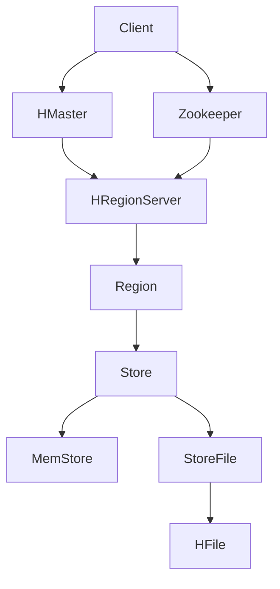

# HBase原理与代码实例讲解

## 1. 背景介绍

### 1.1 大数据时代的数据存储挑战

随着互联网、物联网、社交网络等技术的快速发展,我们已经进入了大数据时代。海量数据的存储和处理给传统的关系型数据库带来了巨大挑战。关系型数据库在面对 PB 级别的海量数据、高并发的读写请求时,显得力不从心。为了应对大数据带来的挑战,Google、Facebook 等互联网巨头先后推出了一系列 NoSQL 数据库。

### 1.2 HBase 的诞生

HBase 就是在这样的背景下诞生的。HBase 是一个高可靠性、高性能、面向列、可伸缩的分布式存储系统,是 Google BigTable 的开源实现。HBase 的诞生,为海量结构化数据提供了很好的存储方案。

## 2. 核心概念与联系

### 2.1 RowKey

RowKey 是 HBase 表的主键,用于唯一标识一行记录。RowKey 的设计非常重要,直接影响到 HBase 的性能。

### 2.2 Column Family

HBase 表按照 Column Family 组织数据。Column Family 是一组语义相关的列,每个 Column Family 都可以包含任意数量的列。不同 Column Family 存储在不同的文件中。

### 2.3 TimeStamp

HBase 中通过 TimeStamp 支持多版本。每个 Cell 都保存着同一份数据的多个版本,版本通过时间戳来索引。

### 2.4 Region

HBase 表按照 RowKey 范围被水平切分成多个 Region,每个 Region 负责存储一定范围内的数据。Region 是 HBase 中分布式存储和负载均衡的最小单元。

### 2.5 架构图



## 3. 核心算法原理具体操作步骤

### 3.1 写流程

1. Client 向 HRegionServer 发送写请求
2. HRegionServer 将数据写入 Region 的 MemStore
3. 数据在 MemStore 中累积到一定阈值后,触发 flush 操作写入 StoreFile

### 3.2 读流程

1. Client 向 HRegionServer 发送读请求
2. HRegionServer 先在 MemStore 中查找数据
3. 如果 MemStore 未命中,再去 BlockCache 中查找
4. 如果 BlockCache 未命中,则去 StoreFile 中查找

### 3.3 Compaction

当 StoreFile 达到一定数量后,会触发 Compaction 操作,将多个 StoreFile 合并成一个。

1. Minor Compaction:选取一些小的、相邻的 StoreFile 合并成一个更大的 StoreFile。
2. Major Compaction:将所有的 StoreFile 合并成一个文件,并清理过期和删除的数据。

## 4. 数学模型和公式详细讲解举例说明

### 4.1 RowKey 的散列

HBase 中 RowKey 的设计至关重要,一个好的 RowKey 设计可以避免热点问题,充分发挥 HBase 的性能。常见的 RowKey 设计方式有:

1. 加盐:在 RowKey 前加随机数,打散数据分布
   $RowKey_{salted} = RandomNum + RowKey$ 

2. 哈希:对 RowKey 进行哈希,使数据分布更均匀
   $RowKey_{hashed} = hash(RowKey)$

3. 反转:反转时间戳等递增字段,避免热点
   $RowKey_{reversed} = reverse(Timestamp) + OtherPart$

### 4.2 Compaction 的触发条件

Minor Compaction 通常在以下条件下被触发:

1. StoreFile 数量超过阈值 $min\_num\_files$
2. StoreFile 大小超过阈值 $max\_file\_size$
3. MemStore 大小超过阈值 $flush\_size\_trigger\_percentage \times flush\_size$

Major Compaction 通常在以下条件下被触发:

1. StoreFile 数量超过阈值 $max\_num\_files$
2. StoreFile 大小超过阈值 $major\_compact\_trigger\_size$
3. 定期触发,默认 7 天

## 5. 项目实践:代码实例和详细解释说明

### 5.1 创建表

```java
Configuration config = HBaseConfiguration.create();
Connection connection = ConnectionFactory.createConnection(config);
Admin admin = connection.getAdmin();

HTableDescriptor table = new HTableDescriptor(TableName.valueOf("test_table"));
table.addFamily(new HColumnDescriptor("cf"));

admin.createTable(table);
```

### 5.2 写入数据

```java
Table table = connection.getTable(TableName.valueOf("test_table"));
Put put = new Put(Bytes.toBytes("row1"));
put.addColumn(Bytes.toBytes("cf"), Bytes.toBytes("a"), Bytes.toBytes("value1"));
put.addColumn(Bytes.toBytes("cf"), Bytes.toBytes("b"), Bytes.toBytes("value2"));

table.put(put);
```

### 5.3 读取数据

```java
Table table = connection.getTable(TableName.valueOf("test_table"));
Get get = new Get(Bytes.toBytes("row1"));
Result result = table.get(get);

byte[] value = result.getValue(Bytes.toBytes("cf"), Bytes.toBytes("a"));
String valueStr = Bytes.toString(value);
System.out.println("Value: " + valueStr);
```

### 5.4 扫描数据

```java
Table table = connection.getTable(TableName.valueOf("test_table"));
Scan scan = new Scan();
scan.addFamily(Bytes.toBytes("cf"));
ResultScanner scanner = table.getScanner(scan);

for (Result result : scanner) {
  byte[] value = result.getValue(Bytes.toBytes("cf"), Bytes.toBytes("a"));
  System.out.println("Value: " + Bytes.toString(value));
}
```

## 6. 实际应用场景

HBase 在很多领域都有广泛应用,如:

1. 交通数据:存储车辆的实时 GPS 数据、轨迹数据等。
2. 金融数据:存储交易记录、订单信息、账户信息等。
3. 社交数据:存储用户信息、消息、好友关系等。
4. 物联网数据:存储传感器采集的实时数据。
5. 推荐系统:存储用户行为、偏好等数据。

## 7. 工具和资源推荐

1. HBase 官方网站:https://hbase.apache.org/
2. HBase 官方文档:https://hbase.apache.org/book.html
3. HBase 官方 Java API:https://hbase.apache.org/apidocs/index.html
4. Cloudera HBase 文档:https://docs.cloudera.com/documentation/enterprise/latest/topics/hbase.html
5. Hortonworks HBase 文档:https://docs.hortonworks.com/HDPDocuments/HDP3/HDP-3.1.5/hbase-data-access/index.html
6. 《HBase 权威指南》
7. 《HBase 实战》

## 8. 总结:未来发展趋势与挑战

HBase 作为一个高性能、可伸缩的分布式数据库,在大数据时代扮演着越来越重要的角色。未来,HBase 在以下几个方面可能有进一步的发展:

1. 与其他大数据框架的整合:如与 Spark、Flink 等计算框架的无缝整合。
2. 性能优化:进一步优化读写性能,降低延迟。
3. 二级索引:提供更灵活、高效的二级索引支持。
4. 云原生:更好地支持在 Kubernetes 等云平台上的部署和管理。

同时,HBase 也面临着一些挑战:

1. 学习曲线陡峭:对于新手来说,HBase 的概念和 API 相对复杂。
2. 运维难度大:HBase 集群的运维、调优需要较高的专业性。
3. 生态系统相对较小:与 Hadoop、Spark 等相比,HBase 的生态系统相对较小。

## 9. 附录:常见问题与解答

### 9.1 HBase 与 Hive 的区别是什么?

HBase 是一个 NoSQL 数据库,主要用于实时读写。而 Hive 是一个数据仓库工具,主要用于批处理和分析。

### 9.2 HBase 的 RowKey 设计有哪些原则?

1. RowKey 应该散列,避免热点。
2. RowKey 应该唯一。
3. RowKey 不应该太长,一般不超过 100 字节。
4. RowKey 要充分利用排序特性。

### 9.3 HBase 的 Compaction 有什么作用?

Compaction 可以减少 StoreFile 的数量,提高读性能。同时,Compaction 也可以清理过期和删除的数据,回收存储空间。

### 9.4 HBase 的二级索引有哪些选择?

常见的 HBase 二级索引方案有:

1. Coprocessor 二级索引
2. Phoenix 二级索引
3. Solr 集成
4. Elasticsearch 集成

### 9.5 HBase 如何实现数据备份?

HBase 可以通过 Snapshot 机制实现数据备份。Snapshot 可以在线创建,不影响业务读写。同时,Snapshot 可以用于灾备、数据迁移等场景。

---

作者:禅与计算机程序设计艺术 / Zen and the Art of Computer Programming