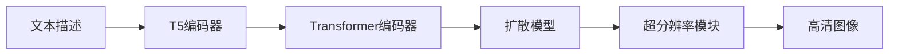

# Imagen原理与代码实例讲解

## 1. 背景介绍
### 1.1 生成式人工智能的发展历程
#### 1.1.1 早期的生成模型
#### 1.1.2 深度学习时代的突破
#### 1.1.3 Transformer架构的引入

### 1.2 文本到图像生成的研究进展 
#### 1.2.1 基于GAN的方法
#### 1.2.2 基于扩散模型的方法
#### 1.2.3 DALL-E和GLIDE等里程碑式工作

### 1.3 Imagen模型的提出
#### 1.3.1 Google Brain团队的研究
#### 1.3.2 Imagen的特点和优势
#### 1.3.3 Imagen在业界的影响力

## 2. 核心概念与联系
### 2.1 扩散模型 
#### 2.1.1 前向扩散过程
#### 2.1.2 反向去噪过程
#### 2.1.3 损失函数设计

### 2.2 Transformer编码器
#### 2.2.1 自注意力机制
#### 2.2.2 位置编码
#### 2.2.3 前馈神经网络

### 2.3 文本编码器
#### 2.3.1 T5文本编码器
#### 2.3.2 编码器的输入和输出
#### 2.3.3 文本特征的融合方式

### 2.4 超分辨率模块
#### 2.4.1 级联的超分辨率结构
#### 2.4.2 中间特征的跳跃连接
#### 2.4.3 噪声引入和去除

### 2.5 概念之间的联系


## 3. 核心算法原理具体操作步骤
### 3.1 训练阶段
#### 3.1.1 数据准备和预处理
#### 3.1.2 文本编码器的训练
#### 3.1.3 图像编码器的训练
#### 3.1.4 扩散模型的训练
#### 3.1.5 超分辨率模块的训练

### 3.2 推理阶段
#### 3.2.1 输入文本的预处理
#### 3.2.2 文本特征的提取
#### 3.2.3 潜在表示的采样
#### 3.2.4 图像的迭代生成
#### 3.2.5 超分辨率的应用

## 4. 数学模型和公式详细讲解举例说明
### 4.1 扩散模型的数学表示
#### 4.1.1 前向扩散过程的数学描述
$$ q(x_t|x_{t-1}) = \mathcal{N}(x_t; \sqrt{1-\beta_t} x_{t-1}, \beta_t \mathbf{I}) $$
#### 4.1.2 反向去噪过程的数学描述 
$$ p_\theta(x_{t-1}|x_t) = \mathcal{N}(x_{t-1}; \mu_\theta(x_t, t), \sigma_\theta(x_t, t)^2\mathbf{I}) $$
#### 4.1.3 损失函数的数学表达
$$ L_{vlb} = \mathbb{E}_{q(x_{0:T})} \left[ -\log \frac{p_\theta(x_{0:T})}{q(x_{1:T}|x_0)} \right] $$

### 4.2 Transformer编码器的数学原理
#### 4.2.1 自注意力机制的数学表示
$$ \text{Attention}(Q, K, V) = \text{softmax}(\frac{QK^T}{\sqrt{d_k}})V $$
#### 4.2.2 位置编码的数学表示
$$ \text{PE}(pos, 2i) = \sin(pos/10000^{2i/d_{model}}) $$
$$ \text{PE}(pos, 2i+1) = \cos(pos/10000^{2i/d_{model}}) $$
#### 4.2.3 前馈神经网络的数学表示
$$ \text{FFN}(x) = \max(0, xW_1 + b_1)W_2 + b_2 $$

### 4.3 超分辨率模块的数学原理
#### 4.3.1 上采样操作的数学表示
$$ f_{upsample}(x) = \text{Conv2DTranspose}(x, k, s) $$
#### 4.3.2 残差连接的数学表示
$$ f_{res}(x) = x + \text{Conv2D}(\text{ReLU}(\text{Conv2D}(x))) $$

## 5. 项目实践：代码实例和详细解释说明
### 5.1 环境配置和依赖安装
#### 5.1.1 Python和PyTorch环境
#### 5.1.2 必要的第三方库安装

### 5.2 数据集准备
#### 5.2.1 图像数据集的下载和组织
#### 5.2.2 文本数据的清洗和预处理

### 5.3 模型定义和初始化
#### 5.3.1 T5编码器的定义
```python
class T5Encoder(nn.Module):
    def __init__(self, ...):
        ...
    
    def forward(self, input_ids, attention_mask):
        ...
        return pooled_output
```
#### 5.3.2 Transformer编码器的定义
```python
class TransformerEncoder(nn.Module):
    def __init__(self, ...):
        ...
    
    def forward(self, x):
        ...
        return x
```
#### 5.3.3 扩散模型的定义
```python
class DiffusionModel(nn.Module):
    def __init__(self, ...):
        ...
    
    def forward(self, x, t, text_emb):
        ...
        return x_recon
```
#### 5.3.4 超分辨率模块的定义
```python
class SuperResolutionModule(nn.Module):
    def __init__(self, ...):
        ...
    
    def forward(self, x):
        ...
        return x_sr
```

### 5.4 训练流程
#### 5.4.1 数据加载和批处理
#### 5.4.2 模型前向传播和损失计算
#### 5.4.3 梯度反向传播和优化器更新
#### 5.4.4 模型的保存和加载

### 5.5 推理流程
#### 5.5.1 输入文本的预处理
#### 5.5.2 文本特征的提取
#### 5.5.3 潜在表示的采样
#### 5.5.4 图像的迭代生成
#### 5.5.5 超分辨率的应用

## 6. 实际应用场景
### 6.1 创意设计领域
#### 6.1.1 广告和宣传图的自动生成
#### 6.1.2 产品设计和概念图的生成
#### 6.1.3 游戏和电影场景的构建

### 6.2 教育和科普领域
#### 6.2.1 教学插图和示意图的生成
#### 6.2.2 科普文章的图像配图生成
#### 6.2.3 互动式教育内容的创建

### 6.3 辅助创作领域
#### 6.3.1 小说和文学作品的插图生成
#### 6.3.2 音乐专辑封面的设计
#### 6.3.3 视频内容的背景图生成

### 6.4 个性化定制领域 
#### 6.4.1 个性化贺卡和明信片的制作
#### 6.4.2 定制化服装和配饰的设计
#### 6.4.3 个性化家居装饰品的生成

## 7. 工具和资源推荐
### 7.1 开源实现
#### 7.1.1 Imagen官方实现
#### 7.1.2 社区贡献的PyTorch实现
#### 7.1.3 支持Imagen的开源框架

### 7.2 数据集资源
#### 7.2.1 LAION-5B数据集
#### 7.2.2 Conceptual Captions数据集
#### 7.2.3 其他高质量图文对数据集

### 7.3 相关论文和教程
#### 7.3.1 Imagen论文原文
#### 7.3.2 扩散模型相关综述
#### 7.3.3 Imagen原理解读文章

### 7.4 社区和讨论组
#### 7.4.1 Imagen官方讨论组
#### 7.4.2 Diffusion Models论坛
#### 7.4.3 相关的Reddit和Twitter账号

## 8. 总结：未来发展趋势与挑战
### 8.1 算法效率的提升
#### 8.1.1 模型压缩和加速技术
#### 8.1.2 新的采样策略和推理优化

### 8.2 生成质量的改进
#### 8.2.1 更大规模的预训练模型
#### 8.2.2 更丰富的条件控制机制
#### 8.2.3 更细粒度的图像编辑能力

### 8.3 多模态融合的探索
#### 8.3.1 文本-图像-音频的联合建模
#### 8.3.2 多模态交互式创作平台

### 8.4 道德和伦理问题
#### 8.4.1 版权和知识产权的考量
#### 8.4.2 有害内容生成的防范
#### 8.4.3 技术滥用和恶意利用的应对

## 9. 附录：常见问题与解答
### 9.1 Imagen与DALL-E 2的区别是什么？
### 9.2 Imagen生成的图像分辨率能达到多高？
### 9.3 Imagen支持哪些语言的文本输入？
### 9.4 如何平衡Imagen的创造力和忠实度？
### 9.5 Imagen生成的图像是否有版权风险？
### 9.6 个人或小团队如何搭建和训练Imagen模型？
### 9.7 Imagen的训练需要哪些计算资源？
### 9.8 如何将Imagen应用到特定领域？
### 9.9 Imagen生成的图像安全性如何保证？
### 9.10 未来Imagen还有哪些改进的方向？

作者：禅与计算机程序设计艺术 / Zen and the Art of Computer Programming