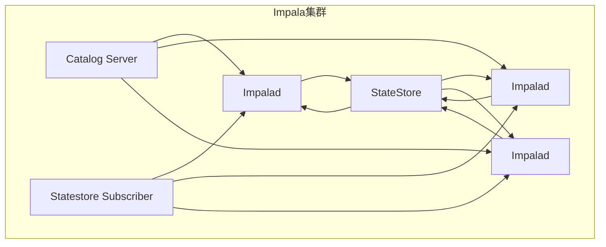

# Impala原理与代码实例讲解

## 1. 背景介绍

在大数据时代,数据量的爆炸式增长对传统数据库系统提出了巨大挑战。Apache Impala作为一种全新的大数据分析引擎,被设计用于在存储在Apache Hadoop集群中的大规模数据集上执行低延迟的SQL查询。它结合了传统数据库和Hadoop的优势,为企业级大数据分析提供了高性能、高并发、低延迟的解决方案。

Impala由Cloudera公司开发,于2012年开源,后加入Apache软件基金会。它可与Hadoop生态圈无缝集成,支持HDFS、HBase、Kudu等数据源,并与Hive、Spark等框架协同工作。Impala的出现极大地推动了大数据SQL分析的发展,被广泛应用于交互式分析、实时决策等场景。

## 2. 核心概念与联系

### 2.1 Impala架构

Impala采用无共享架构,由多个组件协同工作。其核心组件包括:

- **Impala Daemon(Impalad)**:负责查询执行、资源管理等核心功能。
- **StateStore**:存储集群元数据,协调各Impalad进程。
- **Catalog Server**:管理元数据,如表、视图等信息。
- **Statestore Subscriber**:订阅StateStore更新,缓存元数据。

Impala的无共享架构使其具有高可扩展性和高容错性。以下是Impala架构的Mermaid流程图:



### 2.2 Impala查询执行流程

Impala查询执行流程包括以下几个主要阶段:

1. **查询解析与优化**:将SQL查询解析为查询计划树,并进行优化。
2. **查询分发**:将查询计划分发到各个Impala节点进行执行。
3. **数据读取**:从HDFS、HBase等数据源读取相关数据。
4. **数据处理**:对读取的数据进行过滤、聚合等操作。
5. **数据传输**:在节点间传输中间数据。
6. **结果归并**:将各节点结果进行归并,生成最终结果。

以下是Impala查询执行流程的Mermaid流程图:


## 3. 核心算法原理具体操作步骤

### 3.1 查询解析与优化

Impala使用ANTLR和LLVM进行查询解析和优化。具体步骤如下:

1. **词法分析**:将SQL语句分解为一系列Token。
2. **语法分析**:根据SQL语法规则构建抽象语法树(AST)。
3. **语义分析**:验证AST的语义正确性,解析表、列等对象。
4. **逻辑优化**:对AST进行逻辑优化,如谓词下推、投影剪裁等。
5. **代码生成**:使用LLVM将优化后的AST翻译为本地代码。

### 3.2 查询分发与执行

Impala采用无共享架构,查询分发与执行步骤如下:

1. **查询计划分发**:将查询计划分发到各个Impala节点。
2. **数据读取**:各节点从HDFS、HBase等数据源读取相关数据。
3. **数据处理**:对读取的数据进行过滤、聚合等操作。
4. **数据传输**:在节点间传输中间数据,使用数据流水线技术。
5. **结果归并**:将各节点结果进行归并,生成最终结果。

### 3.3 代码向量化

为提高查询性能,Impala采用了代码向量化技术。具体步骤如下:

1. **列存储格式**:Impala使用列存储格式(Parquet等)存储数据。
2. **批量处理**:将数据划分为批次,批量处理可提高CPU缓存命中率。
3. **SIMD指令集**:利用现代CPU的SIMD指令集(AVX2等)进行向量化计算。
4. **代码生成**:使用LLVM动态生成高度优化的向量化代码。

代码向量化可极大提升Impala的查询性能,尤其在CPU密集型操作中表现出色。

## 4. 数学模型和公式详细讲解举例说明

### 4.1 代价模型

Impala使用基于代价的优化器(CBO)选择最优查询计划。代价模型考虑了多个因素,包括I/O代价、CPU代价等。I/O代价可用以下公式计算:

$$
I/O Cost = \sum_{i=1}^{n} \frac{data_i}{disk\_throughput} + \sum_{i=1}^{n} \frac{data_i}{network\_throughput}
$$

其中:
- $n$是数据分片数
- $data_i$是第$i$个分片的数据量
- $disk\_throughput$是磁盘吞吐量
- $network\_throughput$是网络吞吐量

CPU代价则与计算复杂度相关,可根据具体操作进行估算。

### 4.2 数据采样

为提高统计信息的准确性,Impala引入了数据采样技术。采样过程可用以下公式描述:

$$
\begin{aligned}
n &= \lceil \frac{z_{\alpha/2}^2 \cdot N \cdot \sigma^2}{d^2 \cdot (N-1) + z_{\alpha/2}^2 \cdot \sigma^2} \rceil \\
\bar{x} &= \frac{1}{n} \sum_{i=1}^{n} x_i \\
s^2 &= \frac{1}{n-1} \sum_{i=1}^{n} (x_i - \bar{x})^2
\end{aligned}
$$

其中:
- $n$是采样大小
- $N$是总体大小
- $\sigma^2$是总体方差
- $d$是允许的误差范围
- $z_{\alpha/2}$是正态分布的分位数
- $\bar{x}$是采样均值
- $s^2$是采样方差

通过采样,Impala可以获取数据分布、基数等统计信息,用于查询优化。

## 5. 项目实践:代码实例和详细解释说明

本节将通过一个示例项目,演示如何使用Impala进行交互式数据分析。我们将基于TPC-DS基准测试数据集,构建一个数据分析应用。

### 5.1 环境准备

1. 下载并安装Impala,版本为3.4.0。
2. 启动Impala集群,包括Impalad、StateStore、Catalog Server等组件。
3. 创建HDFS目录,用于存储TPC-DS数据集。

```bash
$ hdfs dfs -mkdir -p /user/impala/tpcds/data
```

4. 将TPC-DS数据集复制到HDFS目录中。

```bash
$ hdfs dfs -put tpcds-data /user/impala/tpcds/data
```

### 5.2 创建外部表

使用Impala创建外部表,关联TPC-DS数据集。以`store_sales`表为例:

```sql
CREATE EXTERNAL TABLE store_sales (
  ss_sold_date_sk BIGINT,
  ss_sold_time_sk BIGINT,
  ...
)
PARTITIONED BY (ss_sold_date_sk)
STORED AS PARQUET
LOCATION '/user/impala/tpcds/data/store_sales';
```

### 5.3 数据分析查询

现在,我们可以使用SQL查询对数据进行分析。以下是一个示例查询,统计每个商品类别的销售额:

```sql
SELECT
  i_category,
  SUM(ss_ext_sales_price) AS total_sales
FROM
  store_sales
  JOIN item ON ss_item_sk = i_item_sk
GROUP BY
  i_category
ORDER BY
  total_sales DESC
LIMIT 10;
```

该查询将执行以下步骤:

1. 从`store_sales`和`item`表读取相关数据。
2. 在Impala节点间传输和重新分区数据。
3. 在每个节点上执行本地聚合,计算部分结果。
4. 将各节点的部分结果进行归并,得到最终结果。

通过Impala的并行分布式执行,可以高效地完成这种复杂的分析查询。

### 5.4 性能优化

为进一步提升查询性能,我们可以对Impala进行优化,包括:

- **压缩**:对存储的Parquet文件进行压缩,减少I/O开销。
- **分区**:根据查询模式对表进行合理分区,过滤掉不需要的数据。
- **统计信息**:收集表和列的统计信息,供查询优化器使用。
- **资源管理**:根据查询并发度和重要性,合理分配计算资源。

以下是一个示例,为`store_sales`表创建统计信息:

```sql
COMPUTE STATS store_sales;
```

通过以上优化措施,可以进一步提升Impala的查询性能。

## 6. 实际应用场景

Impala凭借其高性能、高并发、低延迟的特点,被广泛应用于以下场景:

### 6.1 交互式数据分析

Impala最初被设计用于交互式数据分析,支持通过SQL对大数据进行即席查询和探索性分析。相比于MapReduce作业,Impala可以在秒级时间内返回查询结果,大大提高了分析效率。

### 6.2 实时决策支持

由于Impala能够快速处理大量数据,因此非常适合构建实时决策支持系统。例如,在电子商务网站中,Impala可以实时分析用户行为数据,为个性化推荐、定价优化等决策提供支持。

### 6.3 数据湖分析

Impala与Hadoop生态圈深度集成,可以高效地查询存储在HDFS、HBase等数据源中的数据,成为数据湖分析的重要工具。企业可以利用Impala快速分析数据湖中的结构化和非结构化数据。

### 6.4 ETL工作流

除了分析查询,Impala还可以用于ETL(提取、转换、加载)工作流程。由于Impala支持标准SQL,可以方便地从各种数据源提取数据,并进行转换和加载操作。

## 7. 工具和资源推荐

本节将介绍一些与Impala相关的有用工具和资源。

### 7.1 Impala Shell

Impala Shell是Impala自带的命令行工具,用于执行SQL查询和管理任务。它提供了自动补全、查询历史记录等功能,可以极大提高开发效率。

```bash
$ impala-shell
```

### 7.2 Impala Web UI

Impala Web UI是一个基于Web的监控和管理界面,可以查看集群状态、查询历史记录、资源利用率等信息。它对于调试和优化Impala集群非常有用。

### 7.3 Hue

Hue是一个开源的Web界面,集成了Impala、Hive、Spark等多种大数据工具。通过Hue,可以方便地编写、执行和调度Impala查询,并可视化查询结果。

### 7.4 Impala文档

Impala官方文档(https://impala.apache.org/docs/build/html/topics/impala_docs.html)提供了详细的参考资料,包括安装指南、SQL语法参考、性能优化技巧等。这是学习和使用Impala的重要资源。

### 7.5 Impala社区

Apache Impala拥有一个活跃的社区,包括邮件列表、Stack Overflow等渠道。可以在这些渠道上寻求帮助、分享经验或参与贡献。

## 8. 总结:未来发展趋势与挑战

Impala作为一种新兴的大数据分析引擎,在未来仍有广阔的发展空间。

### 8.1 云原生支持

随着云计算的兴起,Impala需要进一步加强对云原生环境的支持,如Kubernetes集成、自动扩缩容等功能,以适应云端部署场景。

### 8.2 AI/ML集成

未来,Imp