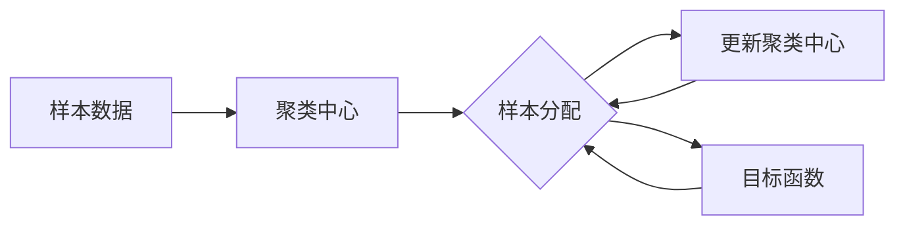

# K-Means - 原理与代码实例讲解

## 1. 背景介绍
### 1.1 聚类分析概述
#### 1.1.1 聚类分析的定义
聚类分析（Cluster Analysis）是一种无监督学习方法，其目的是将数据集中的样本划分为若干个通常是不相交的子集，每个子集称为一个"簇"（cluster）。通过这样的划分，每个簇内的样本具有较高的相似性，而不同簇间的样本具有较大的差异性。

#### 1.1.2 聚类分析的应用场景
聚类分析在实际应用中有着广泛的应用，例如：
- 市场细分：根据客户的属性（如年龄、收入、消费习惯等）将其划分为不同的群体，以便制定针对性的营销策略。
- 图像分割：将图像划分为不同的区域，每个区域对应着图像中的一个对象或部分。
- 异常检测：通过聚类分析识别出数据集中的异常点或离群点。

### 1.2 K-Means算法简介
K-Means是一种经典的基于划分的聚类算法，由MacQueen在1967年提出。它以k为参数，把n个对象分成k个簇，使簇内具有较高的相似度，而簇间的相似度较低。 

K-Means算法的基本思想是：首先随机选择k个对象作为初始的聚类中心，然后计算每个对象与各个聚类中心之间的距离，把每个对象分配给距离它最近的聚类中心所对应的簇。聚类中心以及分配的对象发生变化，则需要重新计算聚类中心和分配对象。不断迭代，直到聚类中心不再发生变化或达到最大迭代次数。

## 2. 核心概念与联系
### 2.1 聚类中心
聚类中心（Centroid）是每个簇的中心点，通常用该簇内所有样本的均值来表示。在K-Means算法中，聚类中心的选择对聚类结果有着重要影响。

### 2.2 样本间距离
样本间距离是指两个样本点之间的距离，常用的距离度量有欧氏距离、曼哈顿距离等。在K-Means算法中，通常使用欧氏距离来衡量样本间的相似度。

### 2.3 目标函数
K-Means算法的目标是最小化所有样本点到其所属簇的聚类中心的距离之和，即最小化平方误差和（Sum of Squared Errors，SSE）。目标函数可表示为：

$$J = \sum_{i=1}^k\sum_{x\in C_i} ||x-\mu_i||^2$$

其中，$\mu_i$表示第$i$个簇的聚类中心，$C_i$表示第$i$个簇内的样本集合。

### 2.4 概念联系
下图展示了K-Means算法中几个核心概念之间的联系：



## 3. 核心算法原理具体操作步骤
K-Means算法的具体步骤如下：

1. 随机选择k个样本作为初始的聚类中心。
2. 计算每个样本与各个聚类中心之间的距离，并将样本分配到距离最近的聚类中心所对应的簇中。
3. 对每个簇，计算该簇内所有样本的均值，并将均值作为新的聚类中心。
4. 重复步骤2和3，直到聚类中心不再发生变化或达到最大迭代次数。

## 4. 数学模型和公式详细讲解举例说明
### 4.1 欧氏距离
在K-Means算法中，通常使用欧氏距离来衡量样本间的相似度。两个n维样本点$x_i=(x_{i1},x_{i2},...,x_{in})$和$x_j=(x_{j1},x_{j2},...,x_{jn})$之间的欧氏距离定义为：

$$d(x_i,x_j) = \sqrt{\sum_{k=1}^n(x_{ik}-x_{jk})^2}$$

例如，在二维平面上，样本点$x_1=(1,2)$和$x_2=(4,6)$之间的欧氏距离为：

$$d(x_1,x_2) = \sqrt{(1-4)^2+(2-6)^2} = \sqrt{25} = 5$$

### 4.2 聚类中心的计算
在K-Means算法中，每个簇的聚类中心通过该簇内所有样本的均值来计算。假设第$i$个簇$C_i$内有$m$个样本，则其聚类中心$\mu_i$的计算公式为：

$$\mu_i = \frac{1}{m}\sum_{x\in C_i}x$$

例如，假设一个簇内有三个二维样本点$(1,2)$,$(2,3)$,$(3,4)$，则该簇的聚类中心为：

$$\mu = (\frac{1+2+3}{3},\frac{2+3+4}{3}) = (2,3)$$

## 5. 项目实践：代码实例和详细解释说明
下面使用Python实现K-Means算法，并对代码进行详细解释。

```python
import numpy as np

class KMeans:
    def __init__(self, n_clusters=2, max_iter=300):
        self.n_clusters = n_clusters
        self.max_iter = max_iter
        self.centroids = None
        
    def fit(self, X):
        # 随机选择初始聚类中心
        idx = np.random.choice(X.shape[0], self.n_clusters, replace=False)
        self.centroids = X[idx]
        
        for _ in range(self.max_iter):
            # 计算每个样本到聚类中心的距离
            distances = self._calc_distances(X)
            
            # 将每个样本分配到最近的聚类中心
            labels = np.argmin(distances, axis=1)
            
            # 更新聚类中心
            new_centroids = np.array([X[labels==i].mean(axis=0) for i in range(self.n_clusters)])
            
            # 判断聚类中心是否发生变化
            if np.all(self.centroids == new_centroids):
                break
            self.centroids = new_centroids
        
        return labels
    
    def _calc_distances(self, X):
        # 计算每个样本到聚类中心的距离
        distances = np.zeros((X.shape[0], self.n_clusters))
        for i, centroid in enumerate(self.centroids):
            distances[:,i] = np.linalg.norm(X - centroid, axis=1)
        return distances
```

代码解释：
- `__init__`方法初始化了KMeans类，包括聚类数`n_clusters`和最大迭代次数`max_iter`。
- `fit`方法对数据进行聚类，首先随机选择初始聚类中心，然后迭代执行以下步骤：
  - 计算每个样本到聚类中心的距离
  - 将每个样本分配到最近的聚类中心
  - 更新聚类中心为每个簇内样本的均值
  - 判断聚类中心是否发生变化，如果没有则停止迭代
- `_calc_distances`方法计算每个样本到聚类中心的欧氏距离。

使用示例：
```python
from sklearn.datasets import make_blobs

# 生成示例数据
X, _ = make_blobs(n_samples=100, centers=3, random_state=42)

# 创建KMeans对象并拟合数据
kmeans = KMeans(n_clusters=3)
labels = kmeans.fit(X)

# 输出聚类结果
print(labels)
```

## 6. 实际应用场景
K-Means算法在实际应用中有着广泛的应用，例如：
- 客户细分：根据客户的属性（如年龄、收入、消费习惯等）将其划分为不同的群体，以便制定针对性的营销策略。
- 图像分割：将图像划分为不同的区域，每个区域对应着图像中的一个对象或部分。
- 文本聚类：将文本数据划分为不同的主题或类别。
- 异常检测：通过聚类分析识别出数据集中的异常点或离群点。

## 7. 工具和资源推荐
- scikit-learn：Python机器学习库，提供了K-Means算法的高效实现。
- ELKI：Java编写的数据挖掘工具，包含多种聚类算法，支持大规模数据集。
- Weka：Java编写的数据挖掘软件，提供了多种聚类算法，并有可视化界面。

## 8. 总结：未来发展趋势与挑战
K-Means算法作为一种经典的聚类算法，在实际应用中取得了广泛的成功。但同时它也存在一些局限性，如对初始聚类中心敏感、难以发现非凸形状的簇等。

未来聚类分析领域的发展趋势可能包括：
- 大规模聚类：随着数据量的增长，如何高效地对大规模数据进行聚类分析是一个重要的研究方向。
- 高维聚类：在许多实际应用中，数据的维度很高，传统的聚类算法在高维数据上的效果往往不佳，因此需要研究更有效的高维聚类方法。
- 聚类结果的可解释性：在某些应用场景下，聚类结果需要具备一定的可解释性，以便用户理解和应用，因此如何获得可解释的聚类结果是一个值得研究的问题。

## 9. 附录：常见问题与解答
### 9.1 K-Means算法如何选择合适的聚类数k？
选择合适的聚类数是K-Means算法面临的一个重要问题。常用的方法有：
- 肘部法则（Elbow Method）：将不同k值下的SSE值绘制成曲线图，选择曲线变化趋缓的拐点处对应的k值。
- 轮廓系数（Silhouette Coefficient）：计算每个样本的轮廓系数，并求平均值，选择平均轮廓系数最大的k值。

### 9.2 K-Means算法的时间复杂度是多少？
假设数据集有n个样本，聚类数为k，特征维度为d，迭代次数为t，则K-Means算法的时间复杂度为O(nkdt)。在实际应用中，通常k<<n且t<<n，因此K-Means算法通常被认为是线性时间复杂度的。

### 9.3 K-Means算法对异常点敏感吗？
K-Means算法对异常点比较敏感，因为异常点会对聚类中心的计算产生较大影响。在应用K-Means算法前，通常需要对数据进行预处理，剔除可能的异常点。此外，也可以考虑使用对异常点更鲁棒的聚类算法，如K-Medoids算法。

作者：禅与计算机程序设计艺术 / Zen and the Art of Computer Programming