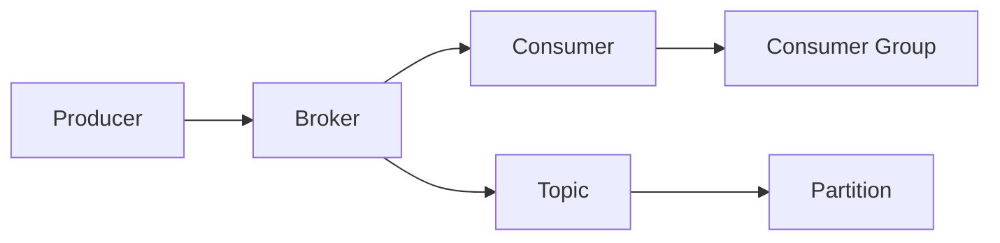

# Kafka Consumer原理与代码实例讲解

## 1. 背景介绍
### 1.1 消息队列概述
### 1.2 Kafka的发展历程
### 1.3 Kafka在大数据领域的应用现状

## 2. 核心概念与联系
### 2.1 Kafka的基本架构
#### 2.1.1 Producer
#### 2.1.2 Broker
#### 2.1.3 Consumer
### 2.2 Topic与Partition
#### 2.2.1 Topic的概念
#### 2.2.2 Partition的作用
#### 2.2.3 Leader和Follower
### 2.3 Consumer Group
#### 2.3.1 Consumer Group的概念
#### 2.3.2 Rebalance机制
#### 2.3.3 Offset管理
### 2.4 核心概念之间的关系


## 3. 核心算法原理具体操作步骤
### 3.1 Consumer的初始化过程
#### 3.1.1 创建KafkaConsumer对象
#### 3.1.2 订阅Topic
#### 3.1.3 加入Consumer Group
### 3.2 Consumer的消费过程
#### 3.2.1 Poll消息
#### 3.2.2 消息处理
#### 3.2.3 提交Offset
### 3.3 Rebalance的触发与执行
#### 3.3.1 Rebalance的触发条件
#### 3.3.2 Rebalance的执行过程
#### 3.3.3 Rebalance期间的消息处理

## 4. 数学模型和公式详细讲解举例说明
### 4.1 Consumer Lag的计算
Consumer Lag表示Consumer消费的进度落后于Producer生产的进度的程度,可以用以下公式计算:
$$
ConsumerLag = LogEndOffset - ConsumerOffset
$$
其中,$LogEndOffset$表示Partition中最新消息的Offset,$ConsumerOffset$表示Consumer提交的Offset。
例如,某个Partition中最新消息的Offset为1000,而Consumer提交的Offset为800,则Consumer Lag为:
$$
ConsumerLag = 1000 - 800 = 200
$$
### 4.2 Consumer吞吐量的估算
假设Consumer的处理时间为$T_p$,Poll的时间间隔为$T_i$,Poll到的消息条数为$N$,则Consumer的吞吐量$TP$可以用以下公式估算:
$$
TP = \frac{N}{T_p+T_i}
$$
例如,Consumer每次Poll 500条消息,处理时间为60ms,Poll间隔为100ms,则吞吐量为:
$$
TP=\frac{500}{0.06+0.1}=3125 (条/秒)
$$

## 5. 项目实践：代码实例和详细解释说明
### 5.1 KafkaConsumer的基本使用
```java
Properties props = new Properties();
props.put("bootstrap.servers", "localhost:9092");
props.put("group.id", "test");
props.put("key.deserializer", "org.apache.kafka.common.serialization.StringDeserializer");
props.put("value.deserializer", "org.apache.kafka.common.serialization.StringDeserializer");

KafkaConsumer<String, String> consumer = new KafkaConsumer<>(props);
consumer.subscribe(Arrays.asList("foo", "bar"));

while (true) {
    ConsumerRecords<String, String> records = consumer.poll(Duration.ofMillis(100));
    for (ConsumerRecord<String, String> record : records) {
        System.out.printf("offset = %d, key = %s, value = %s%n", record.offset(), record.key(), record.value());
    }
}
```
上述代码创建了一个KafkaConsumer对象,订阅了foo和bar两个Topic。然后通过一个while循环不断Poll消息并进行处理。

### 5.2 手动提交Offset
```java
try {
    while(true) {
        ConsumerRecords<String, String> records = consumer.poll(Duration.ofMillis(100));
        for (ConsumerRecord<String, String> record : records) {
            System.out.printf("offset = %d, key = %s, value = %s%n", record.offset(), record.key(), record.value());
        }
        consumer.commitSync();
    }
} finally {
  consumer.close();
}
```
与自动提交Offset不同,上述代码在每次消息处理完成后手动调用`commitSync`方法同步提交Offset。这样可以保证Offset的提交与消息的处理是一致的,不会出现消息处理完但Offset未提交的情况。

### 5.3 订阅指定Partition
```java
TopicPartition partition0 = new TopicPartition("foo", 0);
TopicPartition partition1 = new TopicPartition("foo", 1);
consumer.assign(Arrays.asList(partition0, partition1));

while (true) {
    ConsumerRecords<String, String> records = consumer.poll(Duration.ofMillis(100));
    for (ConsumerRecord<String, String> record : records) {
        System.out.printf("partition = %s, offset = %d, key = %s, value = %s%n", record.partition(), record.offset(), record.key(), record.value());
    }
    consumer.commitSync();
}
```
与`subscribe`方法不同,上述代码通过`assign`方法订阅了foo这个Topic的0号和1号Partition。这种方式下Consumer就不会参与Rebalance,而是固定消费指定的Partition。

## 6. 实际应用场景
### 6.1 日志收集
利用Kafka的高吞吐特性,可以将分布式系统中的日志统一收集到Kafka中,再由下游的Consumer进行消费和分析。
### 6.2 监控告警
Kafka可以作为监控系统的数据管道,将各个系统的监控数据实时写入Kafka,再由告警系统的Consumer实时分析,一旦发现异常就触发告警。
### 6.3 流式数据处理
Kafka与Storm、Spark Streaming等流式计算框架结合,可以实现实时的流式数据处理。Kafka负责数据管道,下游的流式计算框架负责计算。

## 7. 工具和资源推荐
### 7.1 Kafka Tool
一个Kafka的GUI管理工具,可以查看Topic、Partition、Consumer Group等信息。
### 7.2 Kafka Manager
Yahoo开源的Kafka管理平台,支持管理多个集群、检查Topic与Broker的状态等。
### 7.3 Kafka Eagle
一站式的Kafka集群监控与管理平台,可以实时查看集群的各项指标。
### 7.4 Confluent Platform
Confluent公司的Kafka商业化平台,提供了Schema Registry、REST Proxy、KSQL等组件。

## 8. 总结：未来发展趋势与挑战
### 8.1 云原生化
随着云计算的发展,越来越多的公司开始将Kafka部署在Kubernetes等容器平台上,实现弹性伸缩与故障自愈。
### 8.2 Serverless化
利用Serverless计算平台如AWS Lambda来托管Consumer,进一步降低运维成本,提高资源利用率。
### 8.3 与流批一体融合
Kafka与Flink等新一代大数据处理引擎深度集成,实现流批一体的数据处理范式。
### 8.4 实时数仓
利用Kafka和实时计算引擎搭建实时数仓,支持数据的实时摄入、清洗、聚合与查询。

## 9. 附录：常见问题与解答
### 9.1 Consumer的Rebalance机制是否会造成消息重复消费?
一般情况下不会,因为Rebalance前Consumer会提交Offset。但如果在Rebalance的过程中有新的消息写入,这些消息在Rebalance后就有可能被重复消费。可以将`auto.offset.reset`参数设置为latest来避免这种情况。
### 9.2 Consumer需要手动提交Offset吗?
不一定,可以通过`enable.auto.commit`参数来设置。自动提交虽然简单方便,但有可能造成消息丢失或重复消费。而手动提交虽然麻烦一些,但可以保证数据处理的一致性。
### 9.3 Consumer的消费速度跟不上怎么办?
首先要排查Consumer的处理逻辑是否有性能瓶颈,比如是否有过多的I/O操作、是否有加锁造成的阻塞等。如果Consumer本身没有问题,可以考虑增加Consumer的并行度,或者调整Poll的超时时间。
### 9.4 如何保证Consumer的Exactly Once语义?
Kafka从0.11版本开始引入了幂等性和事务机制。将Producer的`enable.idempotence`设为true,并将Consumer的`isolation.level`设为read_committed,就可以保证端到端的Exactly Once语义。
### 9.5 如何监控Consumer的状态?
可以通过Kafka自带的Metrics系统或JMX来暴露Consumer的各项指标,比如消费的TPS、Consumer Lag等。再利用Prometheus、Grafana等工具进行可视化监控与告警。

作者：禅与计算机程序设计艺术 / Zen and the Art of Computer Programming