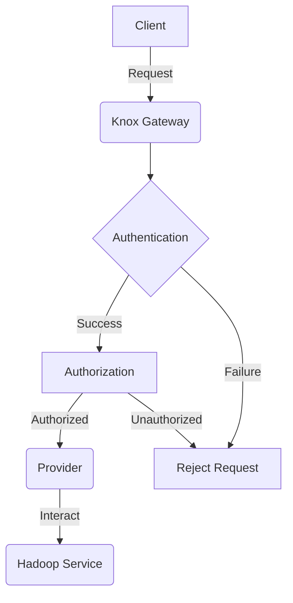

# Knox原理与代码实例讲解

## 1.背景介绍

在当今大数据时代,海量数据的存储和处理成为了一个巨大的挑战。Apache Hadoop作为一个分布式系统基础架构,能够可靠地存储和处理大规模数据集,已经广泛应用于各行各业。然而,由于Hadoop本身缺乏对数据访问的安全控制机制,使得企业在将其应用于生产环境时面临着数据泄露和未经授权访问的风险。

为了解决这一问题,Apache Knox诞生了。Knox是一个应用程序网关,为Hadoop集群提供了一个单一的访问入口点,并且能够对访问请求进行身份验证和授权。通过Knox,企业可以安全地将Hadoop服务暴露给外部客户端,同时保护敏感数据免受未经授权的访问。

## 2.核心概念与联系

Knox的核心概念包括:

1. **Gateway(网关)**: Knox Gateway是一个反向代理服务器,它充当Hadoop集群和外部客户端之间的中介。所有对Hadoop服务的请求都需要先经过Knox Gateway进行验证和路由。

2. **Provider(提供者)**: Provider是一个插件,用于与特定的Hadoop服务进行交互。Knox内置了多个Provider,如HDFS、YARN、Hive等,也支持开发自定义的Provider。

3. **Topology(拓扑)**: Topology描述了Hadoop集群中各个服务的布局,包括服务URL、Provider映射等信息。Knox根据Topology将请求路由到相应的服务。

4. **Authentication(认证)**: Knox支持多种认证方式,如Kerberos、SPNEGO等,确保只有经过身份验证的客户端才能访问Hadoop服务。

5. **Authorization(授权)**: Knox通过访问控制列表(ACL)对请求进行授权,只有被授权的用户和组才能访问特定的服务和资源。

这些核心概念相互关联,共同构建了Knox的安全访问控制体系。Gateway作为入口点接收请求,Provider与Hadoop服务交互,Topology指导请求路由,而认证和授权则确保了访问的安全性。



## 3.核心算法原理具体操作步骤

Knox的核心算法原理主要包括请求处理流程和授权算法两个部分。

### 3.1 请求处理流程

当一个客户端发送请求到Knox Gateway时,请求会经历以下步骤:

1. **接收请求**: Knox Gateway接收到客户端的请求。

2. **身份验证**: 根据配置的认证提供者(如Kerberos、SPNEGO等),对请求进行身份验证。如果身份验证失败,请求将被拒绝。

3. **查找Topology**: 根据请求的URL,查找匹配的Topology条目。

4. **授权检查**: 根据Topology中定义的ACL策略,检查请求是否被授权访问相应的服务。如果未被授权,请求将被拒绝。

5. **请求转发**: 如果请求通过了身份验证和授权检查,Knox Gateway将请求转发到相应的Hadoop服务。

6. **响应处理**: 将Hadoop服务的响应返回给客户端。

该流程确保了只有经过身份验证和授权的请求才能访问Hadoop服务,从而保证了数据的安全性。

### 3.2 授权算法

Knox的授权算法基于访问控制列表(ACL),它定义了用户、组对特定服务和资源的访问权限。ACL策略在Topology文件中进行配置。

当一个请求到达时,Knox会根据请求的用户身份、目标服务和资源,查找匹配的ACL策略。如果存在匹配的允许(Allow)策略,则请求被授权;如果存在匹配的拒绝(Deny)策略,或者没有匹配任何策略,则请求被拒绝。

ACL策略的匹配过程如下:

1. 首先匹配请求的用户身份,如果匹配则继续;否则匹配请求用户所属的组。

2. 然后匹配请求的服务名称,如果匹配则继续;否则匹配通配符服务名称。

3. 最后匹配请求的资源路径,如果匹配则继续;否则匹配通配符资源路径。

4. 如果所有条件都匹配,则应用该ACL策略。

通过这种层次匹配方式,Knox能够实现灵活的授权控制,同时也支持通过通配符进行粗粒度的授权管理。

## 4.数学模型和公式详细讲解举例说明

在Knox的授权算法中,我们可以使用集合理论对ACL策略进行建模。

假设我们有以下集合:

- $U$: 用户集合
- $G$: 组集合,其中 $\forall g \in G, g \subseteq U$
- $S$: 服务集合
- $R$: 资源集合

则一个ACL策略可以表示为一个四元组 $(u, g, s, r)$,其中:

- $u \in U \cup \{\ast\}$,表示用户或通配符
- $g \in G \cup \{\ast\}$,表示组或通配符
- $s \in S \cup \{\ast\}$,表示服务或通配符
- $r \in R \cup \{\ast\}$,表示资源或通配符

我们定义一个匹配函数 $match: (U \cup G) \times S \times R \rightarrow \{0, 1\}$,它判断一个请求 $(u', s', r')$ 是否匹配一个ACL策略 $(u, g, s, r)$:

$$
match((u', s', r'), (u, g, s, r)) = \begin{cases}
1, & \text{if } (u = u' \vee u = \ast \vee u' \in g) \wedge (s = s') \wedge (r = r') \\
0, & \text{otherwise}
\end{cases}
$$

对于一个请求 $(u', s', r')$,我们可以定义它的允许集合 $A$ 和拒绝集合 $D$:

$$
\begin{align*}
A &= \{(u, g, s, r) \in \text{ACL} \mid match((u', s', r'), (u, g, s, r)) = 1\} \\
D &= \{(u, g, s, r) \in \text{ACL} \mid match((u', s', r'), (u, g, s, r)) = 1\}
\end{align*}
$$

则请求 $(u', s', r')$ 被授权的条件是:

$$
A \neq \emptyset \wedge D = \emptyset
$$

也就是说,如果存在至少一个允许策略,且没有任何拒绝策略,则该请求被授权访问。

通过这种数学建模,我们可以更好地理解和分析Knox的授权算法,并为进一步优化和扩展提供理论基础。

## 5.项目实践:代码实例和详细解释说明

为了更好地理解Knox的工作原理,我们来看一个基于Knox的示例项目。在这个项目中,我们将构建一个简单的Hadoop集群,并通过Knox对其进行安全访问控制。

### 5.1 环境准备

首先,我们需要准备以下环境:

- Hadoop集群(包括HDFS、YARN和Hive服务)
- Knox Gateway
- Knox Topologies文件

为了简化操作,我们可以使用Docker容器来快速搭建这个环境。

### 5.2 配置Knox Topology

Knox Topology描述了Hadoop集群的服务布局,我们需要根据实际情况进行配置。下面是一个示例Topology文件:

```xml
<topology>
  <gateway>
    <provider>
      <role>authentication</role>
      <name>ShiroProvider</name>
      <enabled>true</enabled>
      <param>
        <name>sessionTimeout</name>
        <value>30</value>
      </param>
    </provider>

    <provider>
      <role>identity-assertion</role>
      <name>Default</name>
      <enabled>true</enabled>
    </provider>

    <service>
      <role>HDFS</role>
      <url>hdfs://namenode:8020</url>
    </service>

    <service>
      <role>YARN</role>
      <url>http://resourcemanager:8088</url>
    </service>

    <service>
      <role>HIVE</role>
      <url>http://hiveserver:10000</url>
    </service>
  </gateway>

  <service>
    <role>HDFS</role>
    <acl>
      <ace>
        <type>allow</type>
        <principal>users</principal>
        <permission>BROWSE</permission>
      </ace>
    </acl>
  </service>

  <service>
    <role>YARN</role>
    <acl>
      <ace>
        <type>allow</type>
        <principal>users</principal>
        <permission>SUBMIT_APP</permission>
      </ace>
    </acl>
  </service>

  <service>
    <role>HIVE</role>
    <acl>
      <ace>
        <type>allow</type>
        <principal>users</principal>
        <permission>QUERY</permission>
      </ace>
    </acl>
  </service>
</topology>
```

在这个Topology文件中,我们定义了三个服务:HDFS、YARN和Hive,并为每个服务配置了相应的ACL策略。具体来说:

- HDFS服务允许"users"组浏览文件系统
- YARN服务允许"users"组提交应用程序
- Hive服务允许"users"组执行查询

### 5.3 启动Knox Gateway

配置好Topology文件后,我们可以启动Knox Gateway了。Knox Gateway提供了一个Web UI,我们可以通过它来监控和管理Knox。

```bash
docker run -d -p 8443:8443 \
  -v /path/to/topology:/knox/conf/topologies \
  apache/knox:1.6.0
```

上面的命令将启动一个Knox Gateway容器,并将本地的Topology文件挂载到容器中。

### 5.4 客户端访问

现在,我们可以通过Knox Gateway来访问Hadoop集群了。由于我们配置的是"users"组,因此我们需要使用一个属于该组的用户进行访问。

```bash
# 列出HDFS根目录
curl -k -u user:password https://knox_host:8443/gateway/default/hdfs/v1/?op=LISTSTATUS

# 提交YARN作业
curl -k -u user:password -X POST https://knox_host:8443/gateway/default/yarn/v1/webhdfs/v1/user/input?op=MKDIR
curl -k -u user:password -X PUT https://knox_host:8443/gateway/default/yarn/v1/webhdfs/v1/user/input/data.txt

# 执行Hive查询
curl -k -u user:password -X POST https://knox_host:8443/gateway/default/hive/v1/statements \
  -d '{"statement":"SELECT * FROM table LIMIT 10"}'
```

如果一切正常,我们应该能够成功执行上述操作。如果使用未授权的用户或尝试未授权的操作,Knox将拒绝相应的请求。

通过这个示例,我们可以看到Knox如何通过配置Topology和ACL策略来实现对Hadoop服务的安全访问控制。

## 6.实际应用场景

Knox作为一个安全的应用程序网关,在以下场景中发挥着重要作用:

1. **企业大数据平台**: 在企业内部,Knox可以为Hadoop集群提供一个统一的安全入口,方便不同部门和用户访问大数据服务,同时保护敏感数据免受未经授权的访问。

2. **云服务提供商**: 云服务提供商可以使用Knox为客户提供基于Hadoop的大数据服务,并通过Knox的安全机制来隔离不同客户的数据和资源。

3. **物联网(IoT)数据处理**: 在物联网领域,大量的设备和传感器会产生海量数据。Knox可以为这些数据提供一个安全的接入点,将其引入Hadoop集群进行存储和分析。

4. **金融行业**: 金融行业对数据安全和隐私保护有着严格的要求。Knox可以帮助金融机构安全地将Hadoop集群用于风险分析、欺诈检测等应用场景。

5. **医疗健康领域**: 医疗健康数据是高度敏感的,需要严格的访问控制措施。Knox可以为医疗机构提供一个安全的大数据平台,用于存储和分析患者数据,同时保护患者隐私。

总的来说,无论是在企业内部还是面向外部客户提供服务,Knox都能够为Hadoop生态系统提供一层安全防护,使大数据应用更加可靠和安全。

## 7.工具和资源推荐

在使用Knox时,以下工具和资源可能会对您有所帮助:

1. **Apache Knox官方文档**: Apache Knox的官方文档提供了详细的安装、配置和使用指南,是学习Knox的重要资源。网址: https://knox.apache.org/books