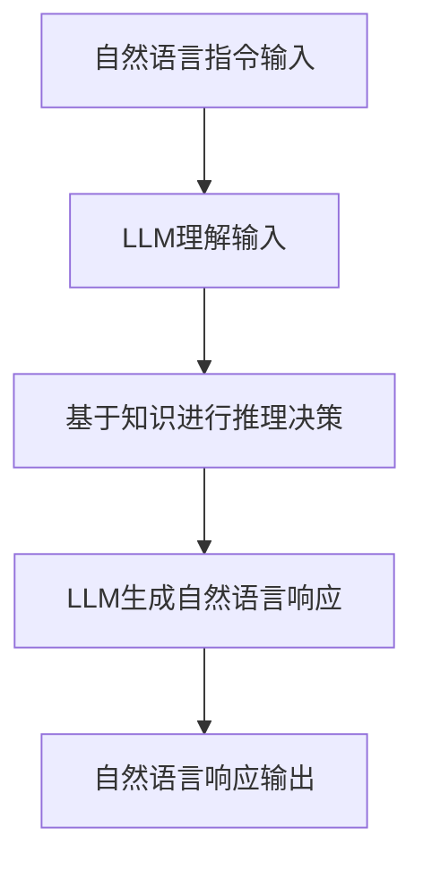
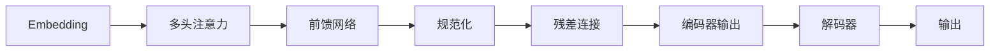

# LLM-based Single-Agent System

## 1.背景介绍

随着人工智能技术的不断发展,大型语言模型(Large Language Model,LLM)已经成为当前最受关注的人工智能领域之一。LLM通过从海量文本数据中学习,能够生成看似人类写作的自然语言输出,在自然语言处理、问答系统、内容生成等领域展现出了巨大的潜力。

单智能体系统(Single-Agent System)是指由单个智能体(Agent)组成的系统,智能体是一个感知环境并根据某种策略做出行为的自治实体。传统的单智能体系统通常采用规则引擎、决策树等方式实现,但由于知识库的局限性,很难处理复杂、开放的问题场景。

基于LLM的单智能体系统(LLM-based Single-Agent System)则将LLM作为智能体的核心,利用LLM强大的自然语言理解和生成能力,使智能体能够更好地理解和响应自然语言指令,从而在更广阔的领域发挥作用。这种新型智能体系统不仅具有出色的语言交互能力,还能够基于所学知识进行推理、规划和决策,展现出通用的智能行为。

## 2.核心概念与联系

### 2.1 大型语言模型(LLM)

大型语言模型是一种基于自然语言的人工智能模型,通过从海量文本数据中学习,获得对自然语言的深刻理解和生成能力。常见的LLM包括GPT(Generative Pre-trained Transformer)、BERT(Bidirectional Encoder Representations from Transformers)等,它们采用了Transformer等神经网络架构,能够对上下文进行建模和理解。

LLM的核心优势在于其通用性和可扩展性。与传统的基于规则或模板的NLP系统不同,LLM可以从数据中自主学习语言知识,并在此基础上进行推理和生成。这使得LLM能够应对开放领域的自然语言任务,而不仅限于特定的场景。

### 2.2 单智能体系统

单智能体系统由一个智能体(Agent)与环境(Environment)组成。智能体是一个感知环境并根据某种策略做出行为的自治实体,而环境则是智能体存在和运行的外部世界。

智能体与环境之间存在着感知-行为循环。智能体首先通过传感器获取环境状态,然后根据策略函数输出行为,该行为会对环境产生影响,进而改变环境状态,形成一个闭环过程。

传统的单智能体系统通常采用规则引擎、决策树等方式实现策略函数,但由于知识库的局限性,很难处理复杂、开放的问题场景。而基于LLM的单智能体系统则将LLM作为策略函数的核心,利用LLM强大的语言理解和生成能力,使智能体能够更好地理解和响应自然语言指令,从而在更广阔的领域发挥作用。

### 2.3 LLM-based单智能体系统

基于LLM的单智能体系统将LLM作为智能体的核心,用于实现策略函数。在这种架构下,智能体的感知输入和行为输出都是自然语言形式,LLM负责理解输入的自然语言指令,并根据所学知识生成相应的自然语言响应作为行为输出。

这种新型智能体系统不仅具有出色的语言交互能力,还能够基于所学知识进行推理、规划和决策,展现出通用的智能行为。相比于传统的基于规则或模板的系统,LLM-based单智能体系统具有更强的通用性和可扩展性,能够应对更加开放和复杂的场景。

## 3.核心算法原理具体操作步骤

基于LLM的单智能体系统的核心算法原理可以概括为以下步骤:



1. **自然语言指令输入**:用户或系统通过自然语言形式向智能体发出指令,如"预订一间酒店房间"、"规划一条旅行路线"等。

2. **LLM理解输入**:LLM接收到自然语言输入后,利用其语言理解能力对输入进行分析和理解,建立对应的语义表示。

3. **基于知识进行推理决策**:LLM根据对输入的理解,结合其所学的知识和经验,进行推理和决策,规划出合理的行为序列。

4. **LLM生成自然语言响应**:LLM将推理决策的结果转化为自然语言形式,生成相应的响应内容,如"已为您预订XX酒店的标准房一间,入住日期为..."。

5. **自然语言响应输出**:生成的自然语言响应被输出,作为智能体对原始指令的反馈和执行结果。

需要注意的是,上述过程可能是迭代的,智能体的响应可能会引发用户的进一步指令,形成一个交互循环。在这个过程中,LLM会持续地理解输入、进行推理决策并生成响应。

## 4.数学模型和公式详细讲解举例说明

LLM通常是基于transformer等神经网络架构实现的,其核心数学模型是自注意力(Self-Attention)机制。

### 4.1 Self-Attention机制

Self-Attention是transformer中的关键组件,它能够捕捉输入序列中任意两个位置之间的依赖关系。对于一个长度为n的输入序列$X = (x_1, x_2, ..., x_n)$,Self-Attention的计算过程如下:

1) 将输入序列$X$分别线性映射到查询(Query)、键(Key)和值(Value)向量:

$$
Q = XW^Q\\
K = XW^K\\
V = XW^V
$$

其中$W^Q, W^K, W^V$分别是可学习的查询、键和值的线性映射参数。

2) 计算查询$Q$与所有键$K$的点积,获得注意力分数矩阵:

$$
\text{Attention}(Q, K, V) = \text{softmax}(\frac{QK^T}{\sqrt{d_k}})V
$$

其中$d_k$是键向量的维度,用于缩放点积值。

3) 对注意力分数矩阵进行行软最大值操作(Softmax),得到注意力权重矩阵。

4) 将注意力权重矩阵与值向量$V$相乘,得到编码后的输出序列表示。

通过Self-Attention,transformer能够直接捕捉输入序列中任意两个位置之间的依赖关系,而不受位置之间距离的限制。这使得transformer在处理长序列时具有优势,并为LLM的强大语言建模能力奠定了基础。

### 4.2 Transformer架构

Transformer是一种全注意力的序列到序列模型,它完全基于Self-Attention机制,不依赖循环神经网络(RNN)或卷积神经网络(CNN)。Transformer的基本架构如下:



1. **Embedding**:将输入序列(如文本)转换为向量表示。

2. **多头注意力(Multi-Head Attention)**:将输入向量序列分别输入多个Self-Attention子层,并将它们的输出拼接起来,捕捉不同子空间的依赖关系。

3. **前馈网络(Feed-Forward Network)**:对每个位置的向量进行全连接的前馈神经网络变换,为模型增加非线性能力。

4. **规范化(Normalization)**:对子层的输出进行规范化,使特征在合理范围内。

5. **残差连接(Residual Connection)**:将输入直接与子层的输出相加,以缓解深层网络的梯度消失问题。

6. **编码器输出**:编码器层的输出,表示对输入序列的编码。

7. **解码器(Decoder)**:解码器也采用类似的多头注意力、前馈网络等结构,但会额外引入对编码器输出的注意力,以捕捉输入与输出之间的依赖关系。

8. **输出**:解码器的输出,即模型对目标序列(如文本生成)的预测。

通过transformer架构,LLM能够高效地对长序列进行建模,捕捉输入和输出之间的长程依赖关系,从而实现出色的自然语言理解和生成能力。

## 5.项目实践:代码实例和详细解释说明

以下是一个使用Python和Hugging Face Transformers库实现基于LLM的简单单智能体系统的示例:

```python
from transformers import AutoModelForCausalLM, AutoTokenizer

# 加载预训练的LLM
model_name = "microsoft/DialoGPT-large"
tokenizer = AutoTokenizer.from_pretrained(model_name)
model = AutoModelForCausalLM.from_pretrained(model_name)

# 定义智能体的交互函数
def agent_interact(input_text):
    # 对输入进行tokenize
    input_ids = tokenizer.encode(input_text, return_tensors="pt")

    # 生成响应
    output = model.generate(input_ids, max_length=1024, do_sample=True, top_k=50, top_p=0.95, num_return_sequences=1)

    # 解码响应
    response_text = tokenizer.decode(output[0], skip_special_tokens=True)

    return response_text

# 智能体与用户交互
while True:
    user_input = input("Human: ")
    agent_response = agent_interact(user_input)
    print("Agent:", agent_response)
```

上述代码实现了一个基于DialoGPT大型语言模型的简单对话智能体系统。主要步骤如下:

1. 导入必要的库和模型。

2. 定义`agent_interact`函数,作为智能体的核心交互逻辑。
   - 对用户输入的自然语言进行tokenize,转换为模型可接受的张量表示。
   - 调用LLM进行生成,获得响应序列。这里使用了top-k、top-p等采样策略,以增加响应的多样性。
   - 将生成的响应序列解码为自然语言文本。

3. 在主循环中,不断接收用户输入,调用`agent_interact`函数获取智能体响应,并将响应输出。

该示例展示了如何使用LLM构建一个简单的单智能体系统。在实际应用中,我们可以根据需求对智能体的输入输出、LLM的配置、推理决策逻辑等进行定制和扩展,以满足特定场景的需求。

## 6.实际应用场景

基于LLM的单智能体系统具有出色的语言理解和生成能力,可以应用于各种需要自然语言交互的场景,包括但不限于:

1. **智能助手**:可以作为通用的智能助手,为用户提供问答服务、任务辅助等功能。

2. **客户服务**:在客户服务领域,可以用于自动化的客户咨询、投诉处理等。

3. **教育辅导**:作为智能辅导系统,为学生提供个性化的学习指导和解答。

4. **写作辅助**:可以辅助用户进行文本创作、修改、校对等工作。

5. **信息检索**:通过自然语言查询,从海量数据中检索相关信息。

6. **对话系统**:构建具有上下文理解能力的对话代理,用于客服、游戏等场景。

7. **决策支持**:根据用户的自然语言需求,提供决策建议和方案规划。

8. **内容生成**:自动生成新闻、故事、文案等各类内容。

9. **代码辅助**:理解自然语言描述,自动生成或修改代码。

10. **机器人控制**:通过自然语言指令控制机器人执行各种任务。

总的来说,基于LLM的单智能体系统凭借其强大的语言理解和生成能力,可以广泛应用于需要自然语言交互的各个领域,为人类提供智能化的语言服务。

## 7.工具和资源推荐

在开发和使用基于LLM的单智能体系统时,以下工具和资源可能会非常有用:

1. **预训练语言模型**:
   - GPT系列模型(GPT-3、InstructGPT等)
   - BERT系列模型
   - T5、PALM等多任务模型