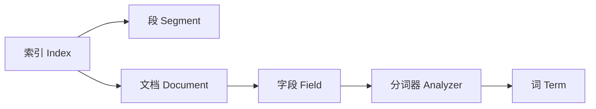

# Lucene原理与代码实例讲解

## 1. 背景介绍
### 1.1 什么是Lucene
Lucene是一个高性能、可扩展的全文检索引擎库，由Apache软件基金会开发并维护。它提供了一套简单却强大的API，使开发人员能够方便地为他们的应用程序添加全文检索功能。Lucene使用Java编写，但也有其他编程语言的移植版本，如PyLucene（Python）、CLucene（C++）等。

### 1.2 Lucene的发展历史
Lucene最初由Doug Cutting开发，他在1999年发布了第一个开源版本。2001年，Lucene成为Apache软件基金会Jakarta项目的一个子项目。随着时间的推移，Lucene不断发展壮大，吸引了越来越多的开发者参与其中。2005年，Lucene从Jakarta项目中独立出来，成为Apache顶级项目。目前，Lucene已经发展到4.x版本，广泛应用于各种需要全文检索的场景，如搜索引擎、内容管理系统、文档归档等。

### 1.3 Lucene的应用场景
Lucene可以应用于多种场景，例如：

1. 搜索引擎：如Wikipedia的搜索功能就是基于Lucene实现的。
2. 内容管理系统：如Drupal、Joomla等CMS系统都集成了Lucene用于内容搜索。  
3. 企业级搜索：许多企业使用Lucene构建自己的内部搜索系统，用于检索员工手册、项目文档等。
4. 电子商务：在电商网站中，Lucene常用于商品目录的搜索。
5. 日志分析：通过Lucene对日志文件建立索引，可以快速查找和分析相关信息。

## 2. 核心概念与联系
### 2.1 索引（Index）
索引是Lucene的核心，它是一种数据结构，用于快速查找和检索存储的文档。Lucene索引由一个或多个独立的段（Segment）组成，每个段本身就是一个倒排索引。当我们向Lucene索引中添加文档时，会先写入内存中的索引，达到一定的大小或时间阈值后，再刷新到磁盘形成一个新的段。搜索时会同时查询所有的段，并合并搜索结果。

### 2.2 文档（Document）
在Lucene中，文档是索引和搜索的基本单位。每个文档包含一个或多个字段（Field），不同的字段可以存储不同类型的数据，如文本、数字、日期等。同一个字段可以存储多个值，称为多值字段。文档写入索引库后，就可以通过搜索条件来匹配和查找相关的文档了。

### 2.3 字段（Field）  
字段用于存储文档的具体内容，可以理解为数据库表中的列。Lucene支持多种字段类型，如文本、数字、日期等。每个字段有以下属性：

- 是否分词（Tokenized）：指定该字段的内容是否需要经过分词处理。  
- 是否存储（Stored）：指定该字段的值是否要存储到索引中，以便结果集直接从索引中获取而不需要查询原始数据。
- 是否索引（Indexed）：指定该字段是否要建立索引，只有索引过的字段才能被搜索到。

### 2.4 分词器（Analyzer） 
分词器负责将字段的文本内容切分成一个个单独的词（Term），并对词进行一些预处理，如转小写、去除停用词等。分词器是可定制的，Lucene内置了多种分词器，如StandardAnalyzer、WhitespaceAnalyzer等，也可以自定义分词器以满足特定领域的需求。

下面是Lucene核心概念之间的关系图：



## 3. 核心算法原理具体操作步骤
### 3.1 索引创建
1. 创建IndexWriter对象，指定索引存储目录和分词器。
2. 遍历待索引的原始文档集合：
   - 创建Document对象。
   - 为Document添加Field。
   - 通过IndexWriter将Document写入索引。
3. 关闭IndexWriter，提交索引更改。

### 3.2 索引搜索
1. 创建IndexReader对象，打开要搜索的索引目录。
2. 创建IndexSearcher对象，传入IndexReader。
3. 使用QueryParser或手动构建Query对象，指定查询语句和默认字段。
4. 调用IndexSearcher的search方法，传入Query对象和所需结果数量，得到TopDocs对象。
5. 遍历TopDocs中的ScoreDoc对象：
   - 通过IndexSearcher的doc方法获取对应的Document对象。
   - 从Document中获取需要的Field值。
6. 关闭IndexReader。

### 3.3 索引更新
1. 创建IndexWriter对象，指定索引目录和分词器。
2. 根据需要执行以下操作：
   - 添加文档：创建新的Document对象并通过IndexWriter的addDocument方法添加。  
   - 删除文档：通过IndexWriter的deleteDocuments方法删除匹配指定Term或Query的文档。
   - 更新文档：先删除旧文档，再添加新文档。
3. 关闭IndexWriter，提交索引更改。

## 4. 数学模型和公式详细讲解举例说明
### 4.1 向量空间模型（Vector Space Model）
Lucene使用向量空间模型来计算文档与查询之间的相关度。在该模型中，每个文档和查询都被表示为一个多维向量，维度对应于词汇表中的每个唯一词项。文档向量中每个维度的值表示该词项在文档中的重要性，常用的计算方法是TF-IDF。

- 词频（Term Frequency，TF）：词项t在文档d中出现的频率。
$$
TF(t,d) = \frac{f_{t,d}}{\sum_{t'\in d} f_{t',d}}
$$

- 逆文档频率（Inverse Document Frequency，IDF）：衡量词项t在整个文档集合中的稀缺程度。
$$
IDF(t) = \log \frac{N}{n_t}
$$
其中，N为文档总数，$n_t$为包含词项t的文档数。

- TF-IDF权重：词项t在文档d中的重要性。
$$
TFIDF(t,d) = TF(t,d) \times IDF(t)
$$

文档d和查询q的相关度可以通过它们的向量点积来计算：
$$
score(q,d) = \sum_{t\in q} TFIDF(t,q) \times TFIDF(t,d)
$$

### 4.2 布尔模型（Boolean Model） 
布尔模型是一种简单的检索模型，基于布尔逻辑对文档进行分类。查询由布尔运算符（AND、OR、NOT）连接的词项组成，只有满足布尔表达式的文档才会被检索到。

例如，对于查询 "information AND retrieval"，只有同时包含"information"和"retrieval"的文档才会被返回；而对于查询 "information OR retrieval"，只要包含其中任意一个词项的文档都会被返回。

### 4.3 短语查询（Phrase Query）
短语查询要求文档中必须包含指定的词项序列。Lucene使用移动窗口（Sliding Window）算法来实现短语查询，具体步骤如下：

1. 对查询短语进行分词，得到词项序列 $[t_1, t_2, ..., t_n]$。
2. 对于每个文档：
   - 初始化一个大小为n的窗口，从文档的起始位置开始滑动。 
   - 对于每个窗口位置：
     - 如果窗口内的词项与查询短语的词项完全匹配，则记录该匹配位置。
     - 将窗口向右滑动一个词项位置。
   - 如果找到了完整的短语匹配，则将文档加入结果集。

## 5. 项目实践：代码实例和详细解释说明
下面通过一个简单的Java代码示例来演示Lucene的基本用法，包括索引创建、搜索和更新。

```java
import org.apache.lucene.analysis.standard.StandardAnalyzer;
import org.apache.lucene.document.*;
import org.apache.lucene.index.*;
import org.apache.lucene.queryparser.classic.QueryParser;
import org.apache.lucene.search.*;
import org.apache.lucene.store.Directory;
import org.apache.lucene.store.FSDirectory;

import java.io.IOException;
import java.nio.file.Paths;

public class LuceneDemo {

    public static void main(String[] args) throws Exception {
        // 指定索引存储目录
        Directory directory = FSDirectory.open(Paths.get("index"));
        
        // 创建索引
        indexDocuments(directory);
        
        // 搜索索引
        searchIndex(directory);
        
        // 更新索引  
        updateIndex(directory);
        
        // 关闭目录
        directory.close();
    }

    private static void indexDocuments(Directory directory) throws IOException {
        // 创建IndexWriter
        IndexWriterConfig config = new IndexWriterConfig(new StandardAnalyzer());
        IndexWriter writer = new IndexWriter(directory, config);
        
        // 创建Document对象
        Document doc1 = new Document();
        doc1.add(new TextField("title", "Lucene in Action", Field.Store.YES));
        doc1.add(new StringField("isbn", "193398817", Field.Store.YES));
        doc1.add(new TextField("content", "Lucene is a powerful search engine library.", Field.Store.NO));
        
        Document doc2 = new Document();  
        doc2.add(new TextField("title", "Solr in Action", Field.Store.YES));
        doc2.add(new StringField("isbn", "1617291021", Field.Store.YES));
        doc2.add(new TextField("content", "Solr is an enterprise search server based on Lucene.", Field.Store.NO));
        
        // 写入索引
        writer.addDocument(doc1);
        writer.addDocument(doc2);
        
        // 提交并关闭IndexWriter
        writer.close();
    }
    
    private static void searchIndex(Directory directory) throws Exception {
        // 创建IndexReader
        IndexReader reader = DirectoryReader.open(directory);
        
        // 创建IndexSearcher  
        IndexSearcher searcher = new IndexSearcher(reader);
        
        // 解析查询字符串
        QueryParser parser = new QueryParser("content", new StandardAnalyzer());
        Query query = parser.parse("lucene");
        
        // 执行搜索，返回前10条结果
        TopDocs topDocs = searcher.search(query, 10);
        
        // 遍历搜索结果
        for (ScoreDoc scoreDoc : topDocs.scoreDocs) {
            Document doc = searcher.doc(scoreDoc.doc);
            System.out.println("Title: " + doc.get("title"));  
            System.out.println("ISBN: " + doc.get("isbn"));
            System.out.println("Score: " + scoreDoc.score);
            System.out.println("--------------------");
        }
        
        // 关闭IndexReader
        reader.close();
    }
    
    private static void updateIndex(Directory directory) throws Exception {
        // 创建IndexWriter  
        IndexWriterConfig config = new IndexWriterConfig(new StandardAnalyzer());
        IndexWriter writer = new IndexWriter(directory, config);
        
        // 删除文档
        writer.deleteDocuments(new Term("isbn", "193398817"));
        
        // 添加新文档
        Document doc = new Document();
        doc.add(new TextField("title", "Elasticsearch in Action", Field.Store.YES));
        doc.add(new StringField("isbn", "1617294624", Field.Store.YES));
        doc.add(new TextField("content", "Elasticsearch is a distributed search and analytics engine.", Field.Store.NO));
        writer.addDocument(doc);
        
        // 提交并关闭IndexWriter
        writer.close();
    }
}
```

在这个示例中，我们首先创建了一个`FSDirectory`对象来指定索引存储的目录。然后，通过`indexDocuments`方法创建索引，将两个文档写入索引库。接着，`searchIndex`方法演示了如何解析查询字符串并执行搜索，最后遍历并输出搜索结果。`updateIndex`方法展示了如何删除和添加文档来更新索引。

需要注意的是，在实际项目中，我们通常会使用更加复杂的文档结构和查询方式，并且会对索引进行优化，如使用复合索引、调整分词器等，以提高搜索性能和准确度。

## 6. 实际应用场景
Lucene作为一个强大的全文检索库，在很多实际场景中都有广泛应用，下面列举几个典型的例子：

### 6.1 搜索引擎
Lucene是许多开源和商业搜索引擎的基础，如Solr、Elasticsearch、Nutch等。这些搜索引擎在Lucene的基础上提供了更加丰富的功能和更好的可扩展性，使得构建大规模、高性能的搜索系统变得更加容易。

### 6.2 内容管理系统
很多内容管理系统（CMS）都集