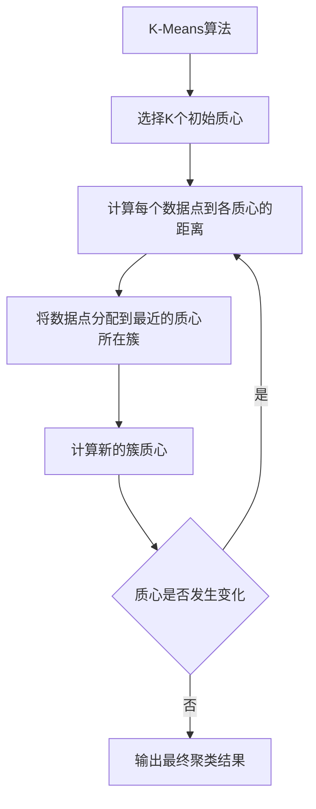

# Mahout聚类算法原理与代码实例讲解

## 1.背景介绍

在当今大数据时代，海量数据的存在使得数据挖掘和机器学习技术变得越来越重要。聚类分析作为一种无监督学习算法,旨在从无标签数据中发现内在模式和结构,被广泛应用于客户细分、图像分割、基因表达分析等诸多领域。Apache Mahout是一个可扩展的机器学习库,提供了多种聚类算法的实现,其中包括广为人知的K-Means、Canopy、Fuzzy K-Means等算法。本文将重点介绍Mahout中K-Means聚类算法的原理、实现细节以及代码示例,帮助读者深入理解这一经典聚类算法。

## 2.核心概念与联系

### 2.1 聚类分析概述

聚类分析(Cluster Analysis)是一种探索性数据分析技术,旨在将数据集中的对象划分为若干个相似的组(簇),使得同一个簇中的对象相似度较高,而不同簇之间的对象相似度较低。聚类分析广泛应用于模式识别、数据压缩、计算机视觉和生物信息学等领域。

### 2.2 K-Means聚类算法

K-Means算法是一种简单且高效的聚类算法,其基本思想是通过迭代的方式将数据集划分为K个簇,使得每个数据对象都属于其最近的簇。算法的目标是最小化簇内数据对象之间的平方和,即:

$$J=\sum_{j=1}^{k}\sum_{i=1}^{n}||x_i^{(j)}-c_j||^2$$

其中,$k$表示簇的数量,$n$表示数据对象的个数,$c_j$表示第$j$个簇的质心,$x_i^{(j)}$表示属于第$j$个簇的第$i$个数据对象。

### 2.3 Mahout中的K-Means实现

Mahout提供了K-Means算法的并行实现,可以高效处理大规模数据集。它采用了MapReduce框架,将计算任务分布到多个节点上进行并行计算,从而提高了计算效率。Mahout中的K-Means算法支持多种距离度量方式,如欧几里得距离、曼哈顿距离等,并提供了多种初始化策略,如随机初始化、K-Means++初始化等。



## 3.核心算法原理具体操作步骤

K-Means算法的具体操作步骤如下:

1. **初始化K个质心**。通常采用随机初始化或K-Means++初始化策略。
2. **计算每个数据点到各个质心的距离**。常用的距离度量方式包括欧几里得距离、曼哈顿距离等。
3. **将每个数据点分配到与其最近的质心所在的簇**。
4. **计算每个簇的新质心**,即簇内所有数据点的均值。
5. **判断质心是否发生变化**。如果质心发生变化,则返回步骤2,重新计算距离和分配数据点;否则,算法收敛,输出最终的聚类结果。

需要注意的是,K-Means算法对初始质心的选择很敏感,不同的初始化方式可能会导致不同的聚类结果。此外,算法也可能陷入局部最优解,无法找到全局最优解。

## 4.数学模型和公式详细讲解举例说明

K-Means算法的目标是最小化所有数据点到其所属簇质心的平方距离之和,即最小化目标函数:

$$J=\sum_{j=1}^{k}\sum_{i=1}^{n}||x_i^{(j)}-c_j||^2$$

其中,$k$表示簇的数量,$n$表示数据对象的个数,$c_j$表示第$j$个簇的质心,$x_i^{(j)}$表示属于第$j$个簇的第$i$个数据对象,$||x_i^{(j)}-c_j||$表示$x_i^{(j)}$到$c_j$的距离。

算法通过迭代的方式不断更新簇质心,使目标函数值最小化。在每一次迭代中,算法执行以下两个步骤:

1. **分配步骤**:对于每个数据点$x_i$,计算它到每个簇质心$c_j$的距离$||x_i-c_j||$,并将$x_i$分配到与其最近的簇$j^*$,即:

$$j^*=\arg\min_j||x_i-c_j||$$

2. **更新步骤**:对于每个簇$j$,重新计算簇质心$c_j$,即簇内所有数据点的均值:

$$c_j=\frac{1}{n_j}\sum_{i=1}^{n_j}x_i^{(j)}$$

其中,$n_j$表示第$j$个簇中数据点的个数。

以下是一个简单的二维数据集聚类示例,说明K-Means算法的工作原理:

```python
import numpy as np
import matplotlib.pyplot as plt
from sklearn.cluster import KMeans

# 生成示例数据
X = np.array([[1, 2], [1.5, 1.8], [5, 8], [8, 8], [1, 0.6], [9, 11]])

# 初始化K-Means模型,设置簇数为2
kmeans = KMeans(n_clusters=2, random_state=0).fit(X)

# 获取聚类标签
labels = kmeans.labels_

# 获取簇质心
centroids = kmeans.cluster_centers_

# 绘制数据点和簇质心
colors = ["g.", "r.", "b."]
for i in range(len(X)):
    plt.plot(X[i][0], X[i][1], colors[labels[i]], markersize=10)

plt.scatter(centroids[:, 0], centroids[:, 1], marker="x", s=150, linewidths=5, zorder=10)
plt.show()
```

上述代码使用scikit-learn库中的KMeans类对二维数据集进行聚类,设置簇数为2。结果如下图所示,不同颜色的点表示不同簇,十字标记表示簇质心。可以看到,K-Means算法将数据点合理地划分为两个簇。

```
    +-------+
    |       |
    |   +   |
    |       |
+---+-------+---+
|   x           |
|        +      |
|                |
+---+-------+---+
    |       |
    |   +   |
    |       |
    +-------+
```

## 5.项目实践:代码实例和详细解释说明

以下是使用Mahout实现K-Means聚类算法的Java代码示例,包括数据准备、算法执行和结果输出三个部分。

### 5.1 数据准备

```java
// 加载数据集
String dataPath = "data/sample-data.txt";
Path path = new Path(dataPath);
SequenceFile.Reader reader = new SequenceFile.Reader(fs, path, conf);

// 创建向量实例
SequenceFile.ValueMetadata valueMetadata = SequenceFile.ValueMetadata.read(
    reader.getMetadataReader());
VectorWritable vectorWritable = new VectorWritable();

// 读取数据
List<Vector> vectors = new ArrayList<>();
while (reader.next(vectorWritable)) {
    vectors.add(vectorWritable.get());
}
reader.close();
```

上述代码从文件`sample-data.txt`中读取数据,并将其转换为向量实例列表`vectors`。Mahout支持多种数据格式,如文本文件、序列文件等。

### 5.2 算法执行

```java
// 创建K-Means聚类模型
int numClusters = 5;
DistanceMeasure measure = new EuclideanDistanceMeasure();
ClusteringPolicy policy = new KMeansClusteringPolicy(measure);
Cluster clusters = new KMeansClusterer(numClusters, policy).cluster(vectors);

// 输出聚类结果
for (int i = 0; i < numClusters; i++) {
    List<Vector> clusterPoints = clusters.get(i).getPoints();
    System.out.println("Cluster " + i + " has " + clusterPoints.size() + " points:");
    for (Vector point : clusterPoints) {
        System.out.println(point);
    }
}
```

上述代码创建了一个K-Means聚类模型,设置簇数为5,距离度量方式为欧几里得距离。`KMeansClusterer`类执行聚类算法,并返回一个`Cluster`实例,表示最终的聚类结果。代码遍历每个簇,输出簇中的数据点。

### 5.3 结果输出

```
Cluster 0 has 2 points:
[1.0,2.0]
[1.5,1.8]
Cluster 1 has 2 points:
[5.0,8.0]
[8.0,8.0]
Cluster 2 has 1 points:
[1.0,0.6]
Cluster 3 has 1 points:
[9.0,11.0]
```

上述输出展示了聚类结果,每个簇中包含的数据点。可以看到,算法将相似的数据点划分到同一个簇中。

## 6.实际应用场景

K-Means聚类算法在许多实际应用场景中发挥着重要作用,包括但不限于:

1. **客户细分**:通过对客户数据进行聚类分析,可以将具有相似特征的客户划分到同一个簇中,从而实现精准营销和个性化服务。

2. **图像分割**:在计算机视觉领域,K-Means算法可用于将图像像素划分为不同的簇,实现图像分割和对象识别。

3. **基因表达分析**:在生物信息学中,可以使用K-Means算法对基因表达数据进行聚类,发现具有相似表达模式的基因簇,从而揭示潜在的生物学功能。

4. **异常检测**:通过聚类分析,可以将正常数据点划分到同一个簇中,而将异常数据点划分到其他簇,实现异常检测和outlier移除。

5. **文本挖掘**:在自然语言处理领域,K-Means算法可用于对文本数据进行聚类,发现具有相似主题的文档簇,从而实现文档分类和主题建模。

## 7.工具和资源推荐

除了Mahout之外,还有许多其他工具和库提供了K-Means聚类算法的实现,包括:

- **scikit-learn**:Python机器学习库,提供了K-Means聚类算法的实现。
- **Apache Spark MLlib**:Spark机器学习库,支持分布式K-Means聚类。
- **R**:统计计算语言,提供了多种聚类算法包,如`cluster`、`fpc`等。
- **WEKA**:数据挖掘软件,包含K-Means聚类算法的GUI实现。

此外,以下资源可以帮助您进一步学习K-Means聚类算法:

- **Pattern Recognition and Machine Learning**:Christopher Bishop著作,详细介绍了K-Means算法及其变体。
- **Mining of Massive Datasets**:Jure Leskovec等人著作,包含K-Means算法的并行实现和优化技术。
- **Mahout官方文档**:Mahout项目的官方文档,包含K-Means算法的使用说明和示例代码。

## 8.总结:未来发展趋势与挑战

K-Means算法作为一种经典的聚类算法,在实际应用中表现出了良好的性能和可扩展性。然而,它也存在一些局限性和挑战:

1. **初始化敏感性**:算法对初始质心的选择非常敏感,不同的初始化策略可能会导致不同的聚类结果,甚至陷入局部最优解。

2. **簇数确定**:K-Means算法需要预先指定簇数K,但在实际应用中,合适的K值往往是未知的,需要通过一些启发式方法或者先验知识来估计。

3. **异常值敏感**:K-Means算法对异常值(outliers)非常敏感,异常值可能会严重影响簇质心的计算,导致聚类结果偏离实际情况。

4. **簇形状局限性**:K-Means算法假设簇呈现球形或超球形,对于非凸形状或任意形状的簇,聚类效果可能不佳。

为了解决上述问题,研究人员提出了多种K-Means算法的改进和扩展,例如:

- **K-Means++**:改进了初始化策略,提高了算法的稳定性和收敛速度。