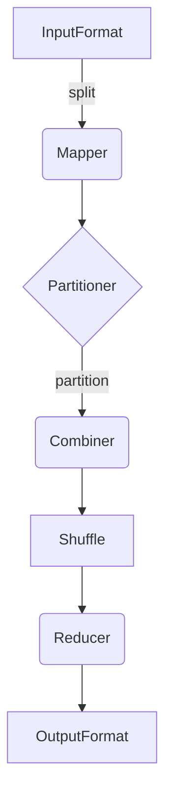

# MapReduce 原理与代码实例讲解

## 1.背景介绍

### 1.1 大数据时代的到来

随着互联网、移动互联网、物联网的快速发展,海量的结构化和非结构化数据被不断产生和积累。传统的数据处理方式已经无法满足大数据时代对数据存储和计算的需求。大数据时代对数据处理提出了新的挑战:

1. 海量数据存储
2. 数据计算处理能力
3. 数据传输效率
4. 数据处理扩展性

### 1.2 MapReduce 的诞生

为了解决大数据处理的难题,Google 于2004年提出了 MapReduce 编程模型。MapReduce 是一种分布式数据处理模式,能够在大规模集群上并行处理海量数据。MapReduce 的核心思想是将计算过程分为两个阶段:Map 阶段和 Reduce 阶段。

MapReduce 编程模型具有以下优点:

1. 高容错性和高可用性
2. 可扩展性强
3. 高性能
4. 编程简单

MapReduce 得到了广泛应用,成为大数据处理的事实标准。

## 2.核心概念与联系

### 2.1 MapReduce 核心概念

**InputFormat:** 将输入数据集切分为多个数据块,并产生键值对 (key, value)。

**Mapper:** 对每个输入键值对执行用户编写的 Map 函数,生成中间键值对。

**Partitioner:** 对 Mapper 输出的键值对进行分区。

**Combiner(可选):** 对相同分区内的数据进行局部汇总,减少数据传输量。

**Shuffle:** 将 Mapper 输出的数据按分区传输给对应的 Reducer。

**Reducer:** 对每个分区中的数据执行用户编写的 Reduce 函数,生成最终输出结果。

**OutputFormat:** 将 Reducer 输出的结果写入外部存储。

### 2.2 MapReduce 执行流程

MapReduce 作业的执行流程如下:



1. InputFormat 将输入数据集切分为多个数据块,并产生键值对。
2. Mapper 对每个输入键值对执行用户编写的 Map 函数,生成中间键值对。
3. Partitioner 对 Mapper 输出的键值对进行分区。
4. Combiner(可选)对相同分区内的数据进行局部汇总,减少数据传输量。
5. Shuffle 将 Mapper 输出的数据按分区传输给对应的 Reducer。
6. Reducer 对每个分区中的数据执行用户编写的 Reduce 函数,生成最终输出结果。
7. OutputFormat 将 Reducer 输出的结果写入外部存储。

## 3.核心算法原理具体操作步骤

### 3.1 Map 阶段

Map 阶段的主要任务是将输入数据转换为中间数据,并进行数据分区。具体步骤如下:

1. **InputFormat:** 将输入数据集切分为多个数据块,并产生键值对 (key, value)。
2. **Mapper:** 对每个输入键值对执行用户编写的 Map 函数,生成中间键值对。Map 函数的输入是 (key, value) 对,输出也是 (key, value) 对。

Map 函数伪代码:

```
Map(key, value):
    // 处理输入数据
    ...
    
    // 生成中间键值对
    emit(intermediateKey, intermediateValue)
```

3. **Partitioner:** 对 Mapper 输出的键值对进行分区。默认使用 HashPartitioner,根据键的哈希值进行分区。
4. **Combiner(可选):** 对相同分区内的数据进行局部汇总,减少数据传输量。Combiner 的输入和输出数据类型必须与 Reducer 函数相同。

### 3.2 Shuffle 阶段

Shuffle 阶段的主要任务是将 Map 阶段输出的数据按分区传输给对应的 Reducer。具体步骤如下:

1. **Partitioner:** 对 Mapper 输出的键值对进行分区。
2. **排序:** 对每个分区内的数据按键进行排序。
3. **合并:** 将相同键的数据合并在一起。
4. **复制:** 将每个分区的数据复制到对应的 Reducer 节点上。

### 3.3 Reduce 阶段

Reduce 阶段的主要任务是对每个分区中的数据执行用户编写的 Reduce 函数,生成最终输出结果。具体步骤如下:

1. **Reducer:** 对每个分区中的数据执行用户编写的 Reduce 函数,生成最终输出结果。Reduce 函数的输入是 (key, iterator<value>) 对,输出是 (key, value) 对。

Reduce 函数伪代码:

```
Reduce(key, values):
    result = 0
    for value in values:
        // 处理每个值
        ...
        result += value
    
    // 生成最终输出
    emit(key, result)
```

2. **OutputFormat:** 将 Reducer 输出的结果写入外部存储。

## 4.数学模型和公式详细讲解举例说明

在 MapReduce 编程模型中,常见的数学模型和公式包括:

### 4.1 数据分区

MapReduce 使用 Partitioner 对 Mapper 输出的键值对进行分区。常用的分区函数是哈希分区函数:

$$
partition(key) = (hash(key) \& Integer.MAX\_VALUE) \% numPartitions
$$

其中:

- $hash(key)$ 是键的哈希值
- $Integer.MAX\_VALUE$ 是整数的最大值,用于避免负数的哈希值
- $numPartitions$ 是分区的数量

例如,如果有 4 个分区,键为 "apple" 的哈希值为 123456,则该键值对将被分配到第 2 个分区:

$$
partition("apple") = (123456 \& 2147483647) \% 4 = 2
$$

### 4.2 数据排序

在 Shuffle 阶段,MapReduce 会对每个分区内的数据按键进行排序。常用的排序算法是快速排序算法。

快速排序算法的时间复杂度为 $O(n \log n)$,其中 $n$ 是待排序数据的个数。

### 4.3 数据合并

在 Shuffle 阶段,MapReduce 会将相同键的数据合并在一起,以便 Reducer 可以高效地处理。

假设有以下 Mapper 输出:

```
(apple, 1)
(banana, 1)
(apple, 1)
(orange, 1)
(apple, 1)
```

经过合并后,Reducer 将接收到以下输入:

```
(apple, [1, 1, 1])
(banana, [1])
(orange, [1])
```

### 4.4 数据复制

在 Shuffle 阶段,MapReduce 会将每个分区的数据复制到对应的 Reducer 节点上。假设有 3 个 Reducer 节点,数据将被复制如下:

```
Reducer 1: (apple, [1, 1, 1])
Reducer 2: (banana, [1])
Reducer 3: (orange, [1])
```

## 5.项目实践:代码实例和详细解释说明

下面是一个使用 Apache Hadoop 实现 WordCount 的 MapReduce 代码示例:

### 5.1 Mapper 代码

```java
import java.io.IOException;
import org.apache.hadoop.io.IntWritable;
import org.apache.hadoop.io.LongWritable;
import org.apache.hadoop.io.Text;
import org.apache.hadoop.mapreduce.Mapper;

public class WordCountMapper extends Mapper<LongWritable, Text, Text, IntWritable> {

    private final static IntWritable one = new IntWritable(1);
    private Text word = new Text();

    @Override
    public void map(LongWritable key, Text value, Context context) throws IOException, InterruptedException {
        String line = value.toString();
        String[] words = line.split("\\s+");
        for (String w : words) {
            word.set(w);
            context.write(word, one);
        }
    }
}
```

- `WordCountMapper` 继承自 `Mapper` 类,实现 `map` 方法。
- `map` 方法的输入是文本行的偏移量 (`LongWritable`) 和文本行内容 (`Text`)。
- 将文本行拆分为单词,对每个单词调用 `context.write` 方法,输出单词 (`Text`) 和计数 (`IntWritable`) 1。

### 5.2 Reducer 代码

```java
import java.io.IOException;
import org.apache.hadoop.io.IntWritable;
import org.apache.hadoop.io.Text;
import org.apache.hadoop.mapreduce.Reducer;

public class WordCountReducer extends Reducer<Text, IntWritable, Text, IntWritable> {

    @Override
    public void reduce(Text key, Iterable<IntWritable> values, Context context)
            throws IOException, InterruptedException {
        int sum = 0;
        for (IntWritable value : values) {
            sum += value.get();
        }
        context.write(key, new IntWritable(sum));
    }
}
```

- `WordCountReducer` 继承自 `Reducer` 类,实现 `reduce` 方法。
- `reduce` 方法的输入是单词 (`Text`) 和该单词对应的计数迭代器 (`Iterable<IntWritable>`)。
- 对每个单词,累加其计数,并输出单词 (`Text`) 和总计数 (`IntWritable`)。

### 5.3 主程序代码

```java
import org.apache.hadoop.conf.Configuration;
import org.apache.hadoop.fs.Path;
import org.apache.hadoop.io.IntWritable;
import org.apache.hadoop.io.Text;
import org.apache.hadoop.mapreduce.Job;
import org.apache.hadoop.mapreduce.lib.input.FileInputFormat;
import org.apache.hadoop.mapreduce.lib.output.FileOutputFormat;

public class WordCount {

    public static void main(String[] args) throws Exception {
        Configuration conf = new Configuration();
        Job job = Job.getInstance(conf, "word count");
        job.setJarByClass(WordCount.class);
        job.setMapperClass(WordCountMapper.class);
        job.setCombinerClass(WordCountReducer.class);
        job.setReducerClass(WordCountReducer.class);
        job.setOutputKeyClass(Text.class);
        job.setOutputValueClass(IntWritable.class);
        FileInputFormat.addInputPath(job, new Path(args[0]));
        FileOutputFormat.setOutputPath(job, new Path(args[1]));
        System.exit(job.waitForCompletion(true) ? 0 : 1);
    }
}
```

- 创建 `Configuration` 对象和 `Job` 对象。
- 设置 Mapper、Combiner 和 Reducer 类。
- 设置输出键值类型。
- 设置输入路径和输出路径。
- 提交作业并等待完成。

### 5.4 运行示例

假设有一个名为 `input.txt` 的文本文件,内容如下:

```
Hello World
Hello Hadoop
```

运行 WordCount 程序:

```
$ hadoop jar wordcount.jar WordCount input.txt output
```

输出结果 (`output/part-r-00000`):

```
Hadoop 1
Hello 2
World 1
```

## 6.实际应用场景

MapReduce 广泛应用于各种大数据处理场景,包括但不限于:

### 6.1 日志分析

通过分析网站访问日志、服务器日志等,可以获取用户行为模式、系统性能等有价值的信息。

### 6.2 数据处理

对结构化数据(如关系数据库)和非结构化数据(如网页、文本文件)进行处理、统计和分析。

### 6.3 机器学习

在机器学习算法中,MapReduce 可用于并行处理海量训练数据,加速模型训练过程。

### 6.4 推荐系统

通过分析用户行为数据,为用户推荐感兴趣的商品、内容等。

### 6.5 图像处理

对海量图像数据进行处理,如图像分类、对象检测等。

### 6.6 生物信息学

分析基因组数据、蛋白质序列等生物数据。

## 7.工具和资源推荐

### 7.1 Apache Hadoop

Apache Hadoop 是最著名的 MapReduce 实现,提供了完整的分布式计算框架。

- 官网: https://hadoop.apache.org/
- 文档: https://hadoop.apache.org/docs/stable/
- 教程: https://hadoop.apache.org/docs/stable/hadoop-project-dist/hadoop-common/CommandsManual.html

### 7.2 Apache Spark

Apache Spark 是一种快速、通用的大数据处理引擎,支持内存计算,并提供了 Spark SQL、Spark Streaming、MLlib 等模块。

- 官网: https://spark.apache.org/
- 文档: https://spark.apache.org/docs/latest/
- 教程: https://spark.apache.org/docs/latest/quick-start.html

### 7.3 云服务

主流云服务提供商如 Amazon Web Services、Microsoft Azure、Google Cloud Platform 等,都提供