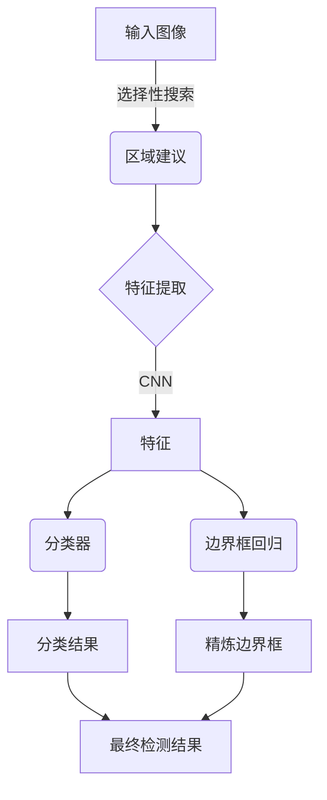
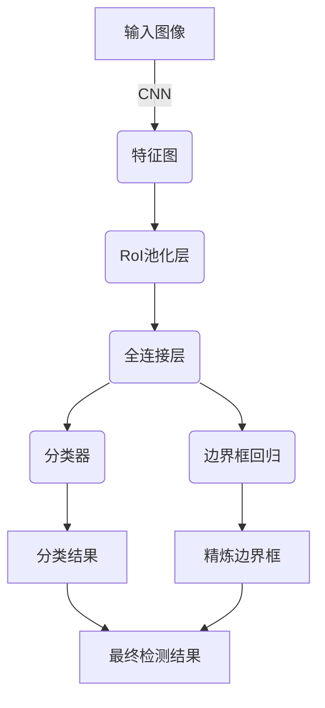
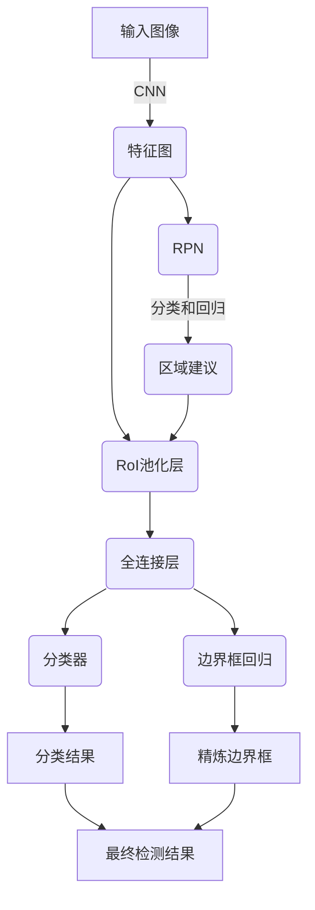
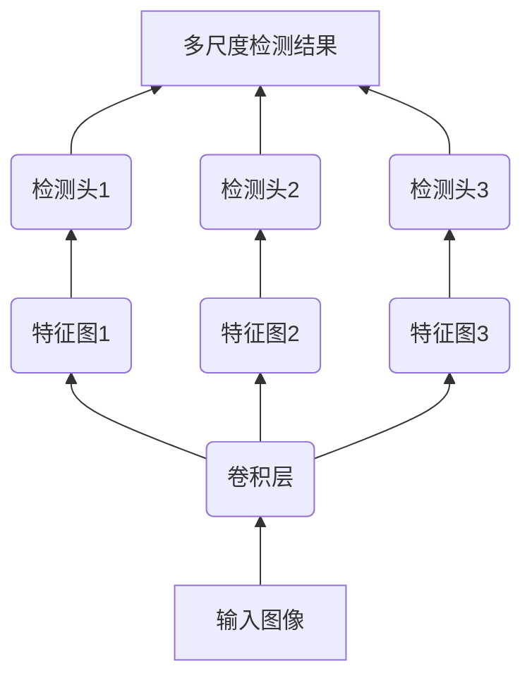

# Object Detection 原理与代码实战案例讲解

## 1.背景介绍

在计算机视觉领域,对象检测(Object Detection)是一项基础且极为重要的任务。它旨在自动定位图像或视频中的目标对象,并给出这些对象的精确边界框位置。对象检测技术广泛应用于安防监控、自动驾驶、机器人视觉、人脸识别等诸多领域,是实现智能系统视觉理解能力的关键一环。

随着深度学习的兴起,基于卷积神经网络(CNN)的对象检测算法取得了长足进步,在准确率和运行效率上都有了显著提升。目前,主流的对象检测算法可以分为两大类:基于region proposal的两阶段检测器,以及基于回归的一阶段检测器。

## 2.核心概念与联系

### 2.1 区域建议(Region Proposal)

区域建议是对象检测中一个关键概念。它的作用是从输入图像中生成一组区域候选框(Region Proposals),这些候选框可能包含目标对象。传统的区域建议方法包括选择性搜索(Selective Search)等算法。

### 2.2 两阶段检测器

两阶段检测器首先使用区域建议网络(Region Proposal Network,RPN)生成候选区域,然后对这些候选区域进行分类和边界框回归,得到最终的检测结果。代表性算法有R-CNN、Fast R-CNN、Faster R-CNN等。

### 2.3 一阶段检测器

一阶段检测器直接对输入图像的密集先验框(Dense Prior Boxes)进行分类和回归,无需显式的区域建议步骤。这类算法计算效率更高,代表有YOLO、SSD等。

### 2.4 锚框(Anchor Boxes)

锚框是对象检测算法中的一个重要概念,它定义了一组先验的边界框,用于对图像中可能存在的对象进行编码和采样。锚框的设计对算法性能有很大影响。

## 3.核心算法原理具体操作步骤  

### 3.1 R-CNN

R-CNN(Region-based Convolutional Neural Networks)是应用深度学习于对象检测任务的开山之作。它的核心思想是:

1. 使用选择性搜索算法提取大约2000个区域建议
2. 将每个区域建议馈送到CNN中提取特征
3. 使用SVM分类器对提取的特征进行分类
4. 使用线性回归refined边界框位置

R-CNN虽然取得了开创性的成果,但由于需逐个区域建议进行CNN特征提取,计算效率极低。



### 3.2 Fast R-CNN  

为了提高R-CNN的效率,Fast R-CNN提出了一些改进:

1. 在整个图像上采用CNN提取特征图,避免了重复计算
2. 使用RoI池化层代替逐个crop特征,加快特征提取
3. 在网络后端加入两个并行的全连接层,一个用于分类,一个用于边界框回归

Fast R-CNN将特征提取和分类回归整合到了一个统一网络中,大大提高了速度。



### 3.3 Faster R-CNN

Faster R-CNN在Fast R-CNN的基础上,加入了区域建议网络(RPN),使得整个系统完全基于深度网络,无需其他外部区域建议方法。RPN的工作原理是:

1. 在特征图上滑动小窗口
2. 对每个窗口位置生成多个不同尺度和比例的锚框
3. 对锚框进行二值分类(前景/背景)和边界框回归
4. 根据分数过滤出高质量的区域建议

RPN与Fast R-CNN的检测网络共享卷积特征,在单个网络中高效完成了区域建议和目标检测的整个过程。



## 4.数学模型和公式详细讲解举例说明

### 4.1 IoU(Intersection over Union)

IoU是目标检测中常用的一个评估指标,用于衡量预测边界框与真实边界框之间的重叠程度。IoU的计算公式为:

$$
IoU = \frac{Area\ of\ Overlap}{Area\ of\ Union}
$$

其中,Overlap表示预测框与真实框的交集区域,Union表示两个框的并集区域。IoU的取值范围为[0,1],值越大表示重叠程度越高。

在对象检测算法的训练过程中,通常会设置一个IoU阈值,当预测框与真实框的IoU大于该阈值时,才将其视为正样本,用于计算分类损失和回归损失。

### 4.2 多尺度特征金字塔

对于不同大小的目标对象,需要在不同尺度的特征图上进行检测。为此,一种常用的技术是构建特征金字塔(Feature Pyramid),将不同尺度的特征图组合起来,用于检测不同大小的对象。

SSD(Single Shot MultiBox Detector)算法使用了多尺度特征金字塔的思想。它在不同层次的特征图上预测不同尺度的边界框,从而实现对不同大小目标的高效检测。



### 4.3 Non-Maximum Suppression

在对象检测过程中,通常会出现多个重叠的边界框检测到同一个目标对象。为了解决这个问题,需要使用非极大值抑制(Non-Maximum Suppression,NMS)算法对重叠的边界框进行合并和过滤。

NMS算法的基本思路是:

1. 对所有边界框根据置信度得分进行排序
2. 选取置信度最高的边界框作为基准框
3. 计算其余框与基准框的IoU,移除IoU大于阈值的框
4. 重复上述过程,直到所有框都被处理

通过NMS,可以有效地去除重叠的冗余检测框,提高检测精度。

## 5.项目实践:代码实例和详细解释说明

以下是使用PyTorch实现Faster R-CNN算法的示例代码,包括RPN网络和检测网络的构建:

```python
import torch
import torch.nn as nn

# RPN网络
class RPN(nn.Module):
    def __init__(self, in_channels, mid_channels, ratios, scales):
        super().__init__()
        self.conv = nn.Conv2d(in_channels, mid_channels, 3, 1, 1)
        self.cls = nn.Conv2d(mid_channels, mid_channels, 1)
        self.reg = nn.Conv2d(mid_channels, 4 * len(ratios) * len(scales), 1)
        self.ratios = ratios
        self.scales = scales

    def forward(self, x):
        x = self.conv(x)
        cls = self.cls(x)
        reg = self.reg(x)
        # 生成锚框
        anchors = generate_anchors(x.size()[-2:], self.ratios, self.scales)
        return cls, reg, anchors

# 检测网络    
class FasterRCNN(nn.Module):
    def __init__(self, backbone, rpn, roi_head):
        super().__init__()
        self.backbone = backbone
        self.rpn = rpn
        self.roi_head = roi_head

    def forward(self, x):
        feat = self.backbone(x)
        cls, reg, anchors = self.rpn(feat)
        proposals = generate_proposals(cls, reg, anchors)
        roi_feats = roi_pooling(feat, proposals)
        cls_score, bbox_pred = self.roi_head(roi_feats)
        return cls_score, bbox_pred
```

在上述代码中:

- `RPN`网络负责生成区域建议,包括分类和回归两个分支
- `FasterRCNN`模型将backbone网络提取的特征图输入到RPN中获取区域建议,然后通过RoI池化获取对应的特征,最后由检测头预测分类和边界框回归结果

实现细节如生成锚框、非极大值抑制等步骤在此省略,读者可以参考PyTorch官方对象检测教程获取完整代码。

## 6.实际应用场景

对象检测技术在现实世界中有着广泛的应用,下面列举了一些典型场景:

1. **安防监控**: 在视频监控系统中,对象检测可以实时检测和跟踪移动目标,发现可疑活动,提高安防效率。

2. **自动驾驶**: 对行人、车辆、交通标志等目标的准确检测是自动驾驶技术的基础,确保行车安全。

3. **机器人视觉**: 通过对象检测,机器人可以识别周围环境中的物体,实现精准抓取、导航等功能。

4. **人脸识别**: 先对图像或视频流中的人脸区域进行检测,然后再进行识别,是人脸识别系统的关键步骤。

5. **医疗影像分析**: 在医学影像如CT、MRI等图像上,对肿瘤、器官等目标的检测可以辅助医生诊断。

6. **无人机航拍**: 对地面目标如建筑物、车辆的检测,可用于测绘、监测等任务。

除此之外,对象检测在零售分析、农业、野生动物保护等领域也有着广阔的应用前景。

## 7.工具和资源推荐

在学习和实践对象检测算法时,以下工具和资源或许能给你一些帮助:

1. **开源库**:
   - PyTorch: https://pytorch.org/
   - TensorFlow: https://www.tensorflow.org/
   - OpenCV: https://opencv.org/

2. **模型库**:
   - Torchvision: https://pytorch.org/vision/stable/models.html
   - TensorFlow Model Zoo: https://github.com/tensorflow/models

3. **数据集**:
   - COCO: http://cocodataset.org/
   - Pascal VOC: http://host.robots.ox.ac.uk/pascal/VOC/
   - Open Images: https://opensource.google/projects/open-images-dataset

4. **教程**:
   - PyTorch Object Detection: https://pytorch.org/tutorials/intermediate/torchvision_tutorial.html
   - TensorFlow Object Detection: https://tensorflow-object-detection-api-tutorial.readthedocs.io/

5. **论文**:
   - Faster R-CNN: https://arxiv.org/abs/1506.01497
   - YOLO: https://arxiv.org/abs/1506.02640
   - SSD: https://arxiv.org/abs/1512.02325

6. **在线课程**:
   - Coursera计算机视觉课程: https://www.coursera.org/learn/convolutional-neural-networks
   - Udacity自动驾驶纳米学位: https://www.udacity.com/course/self-driving-car-engineer-nanodegree--nd013

利用这些资源,你可以更好地掌握对象检测的理论知识,并通过实践巩固所学。

## 8.总结:未来发展趋势与挑战

对象检测是计算机视觉中极具挑战的任务之一。虽然近年来深度学习算法取得了长足进步,但仍有一些问题有待解决:

1. **小目标检测**:对于图像中的小目标,由于分辨率较低,检测准确率仍有待提高。

2. **遮挡和occlusion**:目标被部分遮挡时,检测难度加大。需要更强大的特征表示能力。

3. **实时性和效率**:在一些实时应用场景中,对检测速度和效率有较高要求,仍需优化模型结构。

4. **数据不平衡**:训练数据中不同类别