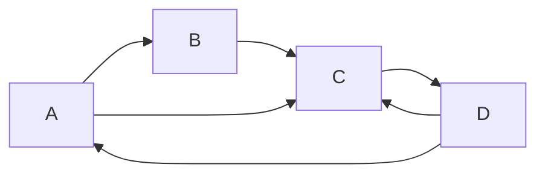

# PageRank 原理与代码实例讲解

## 1. 背景介绍

### 1.1 网络时代的到来

随着互联网的迅速发展,信息在网络中的传播变得前所未有的便捷和高效。然而,海量的网页信息也给搜索引擎带来了巨大的挑战。如何从茫茫大海中精准地找到用户所需的信息,成为搜索引擎公司必须解决的核心问题。

### 1.2 传统搜索引擎的局限性

早期的搜索引擎主要依赖于网页内容中的关键词进行检索和排名。这种方法存在一些明显的缺陷:

1. 无法很好地评估网页的重要性和权威性
2. 容易受到关键词堆砌等作弊手段的影响
3. 忽视了网页之间的链接关系

因此,迫切需要一种新的排名算法来解决这些问题。

### 1.3 PageRank 算法的诞生

1998年,斯坦福大学的两名计算机科学博士生 Larry Page 和 Sergey Brin 提出了 PageRank 算法,这一算法成为谷歌搜索引擎的核心算法之一。PageRank 算法通过分析网页之间的链接结构,评估每个网页的重要性和权威性,从而为搜索结果排名提供了一种全新的思路。

## 2. 核心概念与联系

### 2.1 PageRank 算法的核心思想

PageRank 算法的核心思想是,一个高质量的网页往往会受到其他重要网页的多次链接。换句话说,如果一个网页被许多其他重要网页链接,那么这个网页本身也应该是重要的。这种"重要性"的概念类似于学术界的引用,被多次引用的论文通常也更有价值。

### 2.2 PageRank 值的计算

每个网页都会被赋予一个 PageRank 值,用于衡量其重要性。PageRank 值的计算基于以下两个基本原则:

1. **链接投票原则**: 一个网页的 PageRank 值会受到链向它的所有其他网页的 PageRank 值的影响。
2. **平均分配原则**: 一个网页所拥有的 PageRank 值会平均分配给它所链接的所有其他网页。

基于这两个原则,PageRank 算法通过迭代计算的方式,最终得到每个网页的 PageRank 值。

### 2.3 PageRank 与搜索引擎排名

虽然 PageRank 值不是唯一决定搜索结果排名的因素,但它确实是一个非常重要的参考指标。搜索引擎会综合考虑 PageRank 值、网页内容相关性等多个因素,为用户提供最合适的搜索结果。

## 3. 核心算法原理具体操作步骤 

### 3.1 PageRank 算法的数学模型

PageRank 算法的数学模型可以用下面的公式表示:

$$PR(p) = \frac{1-d}{N} + d \sum_{q \in M(p)} \frac{PR(q)}{L(q)}$$

其中:

- $PR(p)$ 表示网页 $p$ 的 PageRank 值
- $N$ 是网络中所有网页的总数
- $M(p)$ 是链接到网页 $p$ 的所有网页的集合
- $L(q)$ 是网页 $q$ 的出链接数量
- $d$ 是一个阻尼系数,通常取值为 $0.85$

这个公式可以解释为:一个网页的 PageRank 值来自两部分,一部分是所有网页对它的贡献(第一项),另一部分是其他高 PageRank 值网页通过链接对它的贡献(第二项)。

### 3.2 PageRank 算法的迭代计算过程

由于 PageRank 值的计算涉及到所有网页之间的相互影响,因此需要通过迭代的方式进行计算。具体步骤如下:

1. 初始化: 给所有网页赋予相同的 PageRank 值,例如 $\frac{1}{N}$。
2. 迭代计算:
    - 对于每个网页 $p$,计算其 PageRank 值 $PR(p)$ 
    - 使用上一步计算出的 $PR(p)$ 值,重复计算所有网页的 PageRank 值
    - 重复上一步,直到 PageRank 值收敛(变化小于某个阈值)
3. 结果输出: 得到每个网页的最终 PageRank 值

需要注意的是,在实际计算中,由于网络规模庞大,通常会采用一些优化技术(如:分治、随机游走等)来加速计算过程。

### 3.3 PageRank 算法流程图

为了更好地理解 PageRank 算法的计算过程,我们使用 Mermaid 绘制了一个流程图:

```mermaid
graph TD
    A[初始化所有网页的 PageRank 值] --> B[对每个网页 p 计算 PR(p)]
    B --> C{PR 值是否收敛?}
    C -->|是| D[输出最终 PageRank 值]
    C -->|否| B
```

该流程图清晰地展示了 PageRank 算法的迭代计算过程,直到 PageRank 值收敛为止。

## 4. 数学模型和公式详细讲解举例说明

为了更好地理解 PageRank 算法的数学模型,我们将通过一个简单的例子来进行详细说明。

### 4.1 示例网络

假设我们有一个由 4 个网页组成的小型网络,它们之间的链接关系如下图所示:



在这个网络中,网页 A 链接到网页 B 和 C,网页 B 链接到网页 C,网页 C 链接到网页 D,网页 D 链接回网页 A 和 C。

### 4.2 PageRank 值的计算过程

现在,我们来计算这个小型网络中每个网页的 PageRank 值。为了简化计算,我们假设阻尼系数 $d = 0.85$,初始 PageRank 值都设为 $\frac{1}{4}$。

**第一次迭代**:

$$\begin{aligned}
PR(A) &= \frac{1-0.85}{4} + 0.85 \times \frac{PR(D)}{2} \\
      &= 0.0375 + 0.0425 \\
      &= 0.08
\end{aligned}$$

$$\begin{aligned}
PR(B) &= \frac{1-0.85}{4} + 0.85 \times \frac{PR(A)}{2} \\
      &= 0.0375 + 0.04 \\
      &= 0.0775
\end{aligned}$$

$$\begin{aligned}
PR(C) &= \frac{1-0.85}{4} + 0.85 \times \left( \frac{PR(A)}{2} + \frac{PR(B)}{1} + \frac{PR(D)}{2} \right) \\
      &= 0.0375 + 0.04 + 0.0775 + 0.0425 \\
      &= 0.1975
\end{aligned}$$

$$\begin{aligned}
PR(D) &= \frac{1-0.85}{4} + 0.85 \times \frac{PR(C)}{2} \\
      &= 0.0375 + 0.0838 \\
      &= 0.1213
\end{aligned}$$

**第二次迭代**:

重复上述过程,使用第一次迭代计算出的 PageRank 值,进行第二次迭代计算。

**后续迭代**:

重复上述过程,直到 PageRank 值收敛(变化小于某个阈值)。

通过这个示例,我们可以清楚地看到,PageRank 算法是如何通过网页之间的链接关系,计算出每个网页的重要性权重的。

## 5. 项目实践: 代码实例和详细解释说明

为了帮助读者更好地理解 PageRank 算法的实现,我们将提供一个 Python 代码示例,并对其进行详细的解释说明。

### 5.1 代码实例

```python
import numpy as np

# 初始化网页数量和阻尼系数
N = 4
d = 0.85

# 构建链接矩阵
links = np.array([[0, 1, 1, 0],
                  [0, 0, 1, 0],
                  [0, 0, 0, 1],
                  [1, 0, 1, 0]])

# 计算出链接数量
outlinks = np.sum(links, axis=1)

# 替换出链接数量为 0 的元素,避免除以 0 的错误
outlinks[outlinks == 0] = 1

# 初始化 PageRank 值
pr = np.ones(N) / N

# 迭代计算 PageRank 值
for _ in range(100):
    new_pr = (1 - d) / N + d * np.sum(links * pr[:, None] / outlinks[None, :], axis=1)
    diff = np.sum(np.abs(new_pr - pr))
    if diff < 1e-6:
        break
    pr = new_pr

# 输出最终 PageRank 值
print("Final PageRank values:")
print(pr)
```

### 5.2 代码解释

1. 首先,我们导入 NumPy 库,用于进行数值计算。

2. 然后,我们初始化网页数量 `N` 和阻尼系数 `d`。在这个示例中,我们假设网络中有 4 个网页,阻尼系数设置为 0.85。

3. 接下来,我们构建一个链接矩阵 `links`。这个矩阵表示网页之间的链接关系,其中 `links[i, j] = 1` 表示网页 `i` 链接到网页 `j`。在这个示例中,我们使用了与前面示例相同的链接关系。

4. 我们计算每个网页的出链接数量,存储在数组 `outlinks` 中。为了避免除以 0 的错误,我们将出链接数量为 0 的元素替换为 1。

5. 然后,我们初始化所有网页的 PageRank 值为 `1/N`。

6. 进入迭代计算的主循环。在每次迭代中,我们根据 PageRank 公式计算新的 PageRank 值 `new_pr`。如果新旧 PageRank 值之间的差异小于某个阈值(这里设置为 1e-6),则认为已经收敛,退出循环。否则,将新计算的 PageRank 值赋给 `pr`,进入下一次迭代。

7. 最后,我们输出每个网页的最终 PageRank 值。

通过这个代码示例,您可以清楚地看到 PageRank 算法的实现过程。当然,在实际应用中,网络规模会非常庞大,因此需要采用一些优化技术来加速计算过程。

## 6. 实际应用场景

PageRank 算法不仅被广泛应用于网页排名,还可以用于评估其他类型网络中节点的重要性。以下是一些典型的应用场景:

### 6.1 社交网络分析

在社交网络中,每个用户可以看作是一个节点,用户之间的关系(如关注、好友等)可以看作是链接。通过计算每个用户的 PageRank 值,我们可以评估其在社交网络中的影响力和重要性。这种方法可以应用于推荐系统、影响力营销等领域。

### 6.2 学术引文网络分析

在学术界,每篇论文可以看作是一个节点,论文之间的引用关系可以看作是链接。计算每篇论文的 PageRank 值,可以帮助我们评估其在该领域的重要性和影响力。这种方法可以用于论文推荐、学者评估等场景。

### 6.3 蛋白质互作网络分析

在生物信息学领域,蛋白质可以看作是节点,蛋白质之间的相互作用可以看作是链接。通过计算每个蛋白质的 PageRank 值,我们可以发现一些在蛋白质网络中扮演关键角色的蛋白质,从而有助于疾病机理的研究和新药开发。

### 6.4 其他应用场景

除了上述场景,PageRank 算法还可以应用于交通网络分析、犯罪网络分析、推荐系统等多个领域。只要存在链接关系的网络,就可以尝试使用 PageRank 算法来评估节点的重要性。

## 7. 工具和资源推荐

如果您希望进一步学习和实践 PageRank 算法,以下是一些推荐的工具和资源:

### 7.1 Python 库

- **NetworkX**: 一个用于