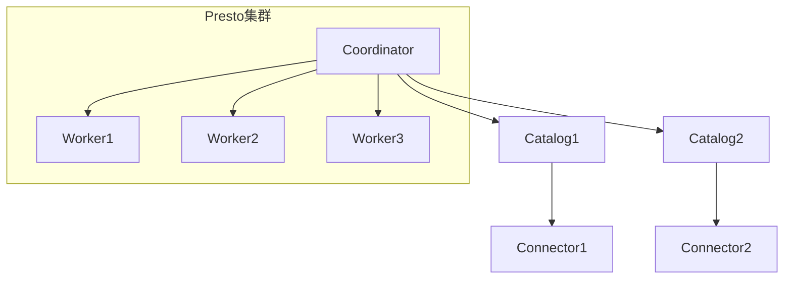
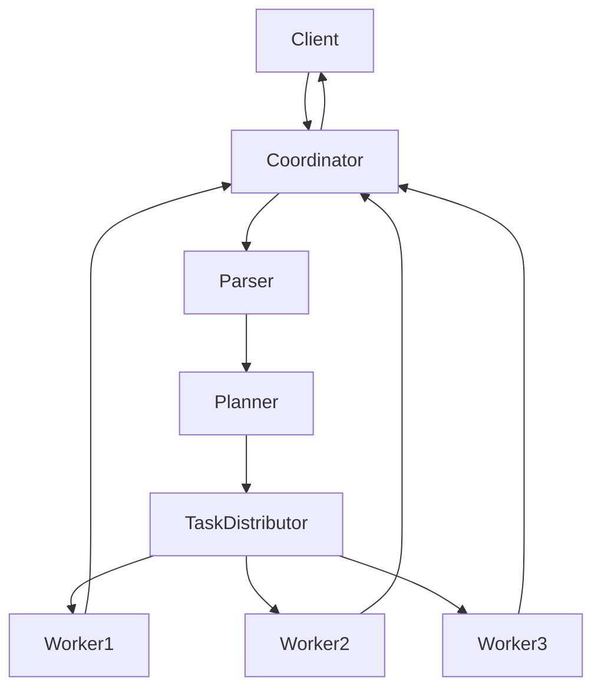

# Presto原理与代码实例讲解

## 1.背景介绍

在当今大数据时代,数据分析和处理已经成为各行业的关键能力。传统的数据库系统难以满足现代数据处理的需求,因此出现了一系列新兴的大数据处理引擎。其中,Presto作为一款开源的大数据分布式SQL查询引擎,凭借其出色的查询性能和良好的扩展性,在业界获得了广泛的应用。

Presto最初由Facebook的数据基础架构团队开发,旨在提供一个能够快速、可扩展地查询多种数据源的解决方案。它采用了全新的架构设计,摒弃了传统数据库的磁盘存储模型,转而使用内存计算和分布式并行处理,从而实现了高效的数据查询。

随着大数据生态系统的不断发展,Presto逐渐演化成为一个独立的开源项目,并被许多知名公司和组织采用,包括Netflix、Airbnb、Twitter等。它的应用场景涵盖了数据分析、商业智能、机器学习等多个领域。

## 2.核心概念与联系

### 2.1 Presto架构概览

Presto采用了主从架构,由一个Coordinator(协调器)和多个Worker(工作节点)组成。其核心组件包括:

- Coordinator: 负责解析SQL查询,制定查询计划并将任务分发给Worker执行。
- Worker: 执行实际的数据处理任务,包括读取数据、执行计算和返回结果。
- Catalog: 用于管理和访问不同的数据源,如Hive、MySQL等。
- Connector: 实现了与特定数据源交互的接口,用于读取和写入数据。



### 2.2 查询执行流程

1. 客户端提交SQL查询到Coordinator。
2. Coordinator对SQL进行解析和优化,生成分布式执行计划。
3. Coordinator将执行计划分发到各个Worker节点。
4. Worker节点通过Connector从数据源读取数据,并执行计算任务。
5. Worker将中间结果传递给下游节点,最终将结果返回给Coordinator。
6. Coordinator汇总结果并返回给客户端。



## 3.核心算法原理具体操作步骤

### 3.1 查询优化

Presto在执行查询之前,会对SQL进行一系列优化,以提高查询效率。主要优化步骤包括:

1. **语法分析**: 将SQL语句解析为抽象语法树(AST)。
2. **语义分析**: 对AST进行类型检查、名称解析等语义分析。
3. **逻辑优化**: 对查询进行等价变换,如谓词下推、投影剪裁等。
4. **代数优化**: 将逻辑计划转换为更高效的物理计划。
5. **代价模型**: 根据代价模型选择最优的执行计划。

### 3.2 并行执行

Presto的并行执行是通过以下几个步骤实现的:

1. **任务拆分**: Coordinator根据数据分布情况,将查询拆分为多个任务。
2. **任务调度**: 将任务分发给Worker节点执行,实现负载均衡。
3. **数据重分区**: 在执行过程中,数据可能需要在节点间重新分区。
4. **中间结果交换**: Worker节点将中间结果传递给下游节点。
5. **结果归并**: 最终将所有结果归并,返回给Coordinator。

### 3.3 内存管理

由于Presto采用内存计算模型,因此内存管理是其核心能力之一。主要包括:

1. **内存池**: 将内存划分为多个池,用于不同的计算任务。
2. **内存溢出**: 当内存不足时,可将中间数据溢写到磁盘。
3. **内存回收**: 及时回收不再使用的内存,避免内存泄漏。

### 3.4 代码向量化

Presto采用了代码向量化技术,将标量代码转换为向量代码,以充分利用现代CPU的SIMD指令集,提高计算性能。

```java
// 标量代码
for (int i = 0; i < length; i++) {
    result[i] = left[i] + right[i];
}

// 向量化代码
int position = 0;
for (int i = 0; i < length / 4; i++) {
    result.loadVector(position) = left.loadVector(position).add(right.loadVector(position));
    position += 4;
}
```

## 4.数学模型和公式详细讲解举例说明

在查询优化和执行过程中,Presto使用了多种数学模型和公式,以实现更高效的计算。

### 4.1 代价模型

Presto使用基于代价的优化器(CBO)来选择最优的执行计划。代价模型用于估计每个计划的代价,通常包括CPU、内存和IO等多个维度。

假设一个查询需要扫描两个表A和B,并对结果进行聚合操作。其代价模型可表示为:

$$
Cost = C_{scan}(A) + C_{scan}(B) + C_{join}(A \Join B) + C_{agg}(A \Join B)
$$

其中:

- $C_{scan}(A)$和$C_{scan}(B)$分别表示扫描表A和B的代价。
- $C_{join}(A \Join B)$表示连接操作的代价。
- $C_{agg}(A \Join B)$表示聚合操作的代价。

优化器将评估不同执行计划的代价,选择代价最小的计划执行。

### 4.2 数据重分区

在执行过程中,数据可能需要在节点间重新分区,以满足下游操作的需求。常见的重分区策略包括:

- **哈希重分区**: 根据指定的键对数据进行哈希分区,确保相同键值的数据位于同一个分区。
- **范围重分区**: 根据指定的键对数据进行范围分区,确保键值在某个范围内的数据位于同一个分区。

假设有$n$个Worker节点,需要对一个数据集$D$进行哈希重分区,其中$D$中的元素$d$的键为$key(d)$,则重分区后的分区$P_i$可表示为:

$$
P_i = \{d \in D | hash(key(d)) \bmod n = i\}
$$

### 4.3 代码向量化

代码向量化可以显著提高CPU的计算效率。假设需要对两个长度为$n$的向量$A$和$B$进行元素级加法操作,生成结果向量$C$,则标量代码和向量化代码的性能差异可以用下式表示:

$$
T_{scalar} = n \times t_{add} \\
T_{vector} = \frac{n}{k} \times t_{add\_vector} + n \times t_{load/store}
$$

其中:

- $T_{scalar}$和$T_{vector}$分别表示标量代码和向量化代码的执行时间。
- $t_{add}$和$t_{add\_vector}$分别表示标量加法和向量加法的时间。
- $k$表示向量长度,通常为4或8。
- $t_{load/store}$表示加载和存储数据的时间。

由于$t_{add\_vector} \ll k \times t_{add}$,因此向量化代码可以显著提高性能。

## 5.项目实践:代码实例和详细解释说明

### 5.1 Presto SQL查询示例

以下是一个使用Presto查询Hive表的示例:

```sql
SELECT
    year,
    count(*)
FROM
    hive.web.page_views
WHERE
    year >= 2020
GROUP BY
    year
ORDER BY
    year DESC
LIMIT 5;
```

该查询从Hive表`page_views`中查询2020年及以后的数据,按年份进行分组并计算每年的记录数,最后按年份降序排列并限制输出前5条记录。

### 5.2 自定义Presto连接器

Presto支持通过自定义连接器访问各种数据源。以下是一个简单的文件系统连接器示例:

```java
// 定义连接器元数据
@ConnectorType("file")
public class FileConnector implements ConnectorFactory {
    // ...
}

// 定义文件系统元数据提供者
public class FileMetadataProvider implements ConnectorMetadataProvider {
    // ...
}

// 定义文件系统分区提供者
public class FilePartitionProvider implements ConnectorPartitionProvider {
    // ...
}

// 定义文件系统记录集提供者
public class FileRecordSetProvider implements ConnectorRecordSetProvider {
    // ...
}
```

该连接器允许Presto直接查询文件系统中的数据文件,如CSV、JSON等。开发人员可以根据需求扩展连接器的功能。

### 5.3 Presto用户自定义函数(UDF)

Presto支持使用Java开发用户自定义函数(UDF),以扩展SQL的功能。以下是一个计算字符串相似度的UDF示例:

```java
@ScalarFunction("string_similarity")
@Description("Returns the similarity between two strings using Levenshtein distance")
public class StringSimilarityFunction {
    @SqlType(StandardTypes.DOUBLE)
    public static double similarity(
            @SqlType(StandardTypes.VARCHAR) Slice left,
            @SqlType(StandardTypes.VARCHAR) Slice right) {
        int distance = StringUtils.levenshteinDistance(left.toStringUtf8(), right.toStringUtf8());
        int maxLength = Math.max(left.length(), right.length());
        return 1.0 - (double) distance / maxLength;
    }
}
```

该UDF实现了计算两个字符串相似度的功能,可以在SQL中使用:

```sql
SELECT string_similarity('hello', 'world');
```

## 6.实际应用场景

Presto凭借其高效的查询性能和良好的扩展性,在多个领域得到了广泛应用:

1. **数据分析**: Presto可以快速查询和分析来自不同数据源的海量数据,支持BI工具和数据可视化。
2. **ETL**: 利用Presto的SQL能力,可以实现高效的数据提取、转换和加载(ETL)流程。
3. **机器学习**: Presto可以快速处理训练数据,为机器学习模型的训练和评估提供支持。
4. **实时数据处理**: Presto可以与流式处理系统(如Kafka)集成,实现对实时数据的低延迟查询和分析。

## 7.工具和资源推荐

以下是一些与Presto相关的有用工具和资源:

1. **Presto Web UI**: Presto内置的Web界面,可用于监控集群状态、查询执行情况等。
2. **Presto CLI**: Presto命令行工具,用于执行SQL查询和管理操作。
3. **Presto JDBC Driver**: 允许使用JDBC连接Presto,支持多种编程语言和BI工具。
4. **Presto Docker镜像**: 提供了预构建的Presto Docker镜像,方便快速部署和测试。
5. **Presto官方文档**: Presto的官方文档,包含了详细的概念介绍、配置指南和最佳实践。
6. **Presto Slack社区**: Presto的官方Slack社区,可以与开发者和用户交流、提问和获取支持。

## 8.总结:未来发展趋势与挑战

Presto作为一款优秀的大数据分布式SQL查询引擎,在未来仍将持续发展和完善。预计的发展趋势包括:

1. **性能优化**: 持续优化查询执行效率,提高并行度和利用率。
2. **功能增强**: 支持更多的数据源连接器、SQL语法扩展和新特性。
3. **云原生支持**: 更好地支持云环境和Kubernetes等容器编排系统。
4. **机器学习集成**: 与机器学习框架更紧密集成,支持模型训练和评估。

同时,Presto也面临一些挑战,如:

1. **资源管理**: 在大规模集群环境下,如何更好地管理和调度资源。
2. **故障恢复**: 提高系统的容错性和故障恢复能力。
3. **安全性**: 加强对数据访问和操作的安全控制。
4. **易用性**: 简化配置和管理,提升用户体验。

总的来说,Presto将继续发展壮大,为大数据分析和处理提供强大的支持。

## 9.附录:常见问题与解答

1. **Presto与Hive/Spark的区别是什么?**

Pr