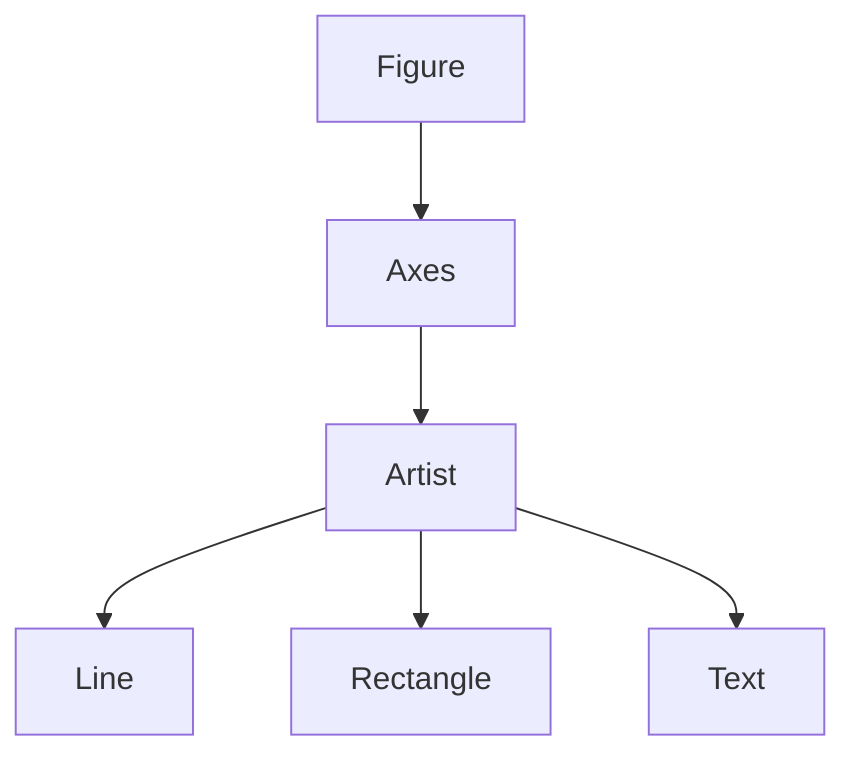
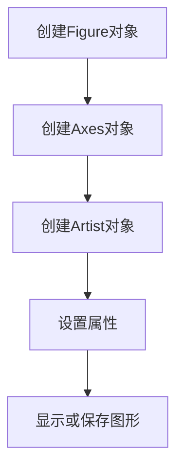
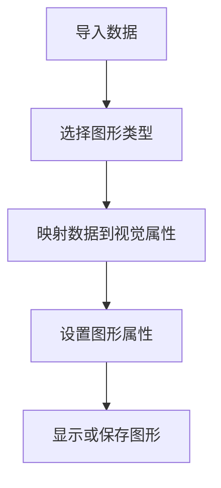

# Python机器学习实战：数据可视化的艺术 - Matplotlib & Seaborn 应用

## 1.背景介绍

在当今数据时代,数据可视化已经成为一项关键技能。无论是探索性数据分析、模型评估还是结果呈现,有效的数据可视化都能帮助我们更好地理解数据,发现隐藏的模式和趋势,并将发现以清晰、吸引人的方式传达给他人。Python作为领先的数据科学语言,拥有强大的可视化库,其中Matplotlib和Seaborn是两个广为人知的库。

### 1.1 Matplotlib简介

Matplotlib是Python中一个低级别的绘图库,提供了广泛的绘图功能,包括线形图、散点图、柱状图、直方图、等高线图、3D图形等。它高度可定制,并且与Python的科学计算生态系统(如NumPy、SciPy和Pandas)紧密集成。Matplotlib被广泛应用于各种领域,包括科学出版、金融分析、信号处理等。

### 1.2 Seaborn简介

Seaborn是一个建立在Matplotlib之上的高级别数据可视化库。它提供了一种更加现代化、吸引人的默认风格,并且专注于探索性数据分析和统计可视化。Seaborn支持多种常见的可视化类型,如散点图、线形图、条形图、热图等,并且能够与Pandas数据结构无缝集成。

## 2.核心概念与联系

### 2.1 Matplotlib核心概念

Matplotlib的核心概念包括Figure、Axes、Artist等。

- **Figure**:表示整个图形窗口,可以包含一个或多个Axes。
- **Axes**:表示图形区域,是实际绘制图形元素的区域。
- **Artist**:是一个抽象基类,表示任何可以在Axes上绘制的元素,如线条、矩形、文本等。

这些核心概念之间的关系如下Mermaid流程图所示:



### 2.2 Seaborn核心概念

Seaborn的核心概念包括:

- **数据集**:Seaborn可以直接处理Pandas数据结构(如DataFrame和Series)。
- **图形类型**:Seaborn支持多种常见的统计图形类型,如散点图、线形图、条形图、热图等。
- **图形语义映射**:Seaborn使用语义映射的方式将数据映射到视觉属性上,如颜色、大小、形状等。
- **图形美化**:Seaborn提供了现成的吸引人的默认样式,并支持高度自定义。

## 3.核心算法原理具体操作步骤

### 3.1 Matplotlib核心算法原理

Matplotlib的核心算法原理包括以下几个步骤:

1. **创建Figure对象**:使用`plt.figure()`函数创建一个新的Figure对象。
2. **创建Axes对象**:使用`fig.add_subplot()`或`fig.add_axes()`在Figure中添加一个或多个Axes对象。
3. **创建Artist对象**:使用各种绘图函数(如`plt.plot()`、`plt.bar()`等)在Axes上创建Artist对象,如线条、矩形、文本等。
4. **设置属性**:设置Figure、Axes和Artist的各种属性,如标题、标签、颜色、线型等。
5. **显示或保存图形**:使用`plt.show()`显示图形,或使用`plt.savefig()`保存图形为文件。

这个过程可以用以下Mermaid流程图表示:



### 3.2 Seaborn核心算法原理

Seaborn的核心算法原理包括以下几个步骤:

1. **导入数据**:使用Pandas导入数据集。
2. **选择图形类型**:根据数据类型和可视化目标选择合适的图形类型,如散点图、线形图、条形图等。
3. **映射数据到视觉属性**:使用Seaborn的语义映射函数(如`sns.scatterplot()`、`sns.lineplot()`等)将数据映射到视觉属性上,如颜色、大小、形状等。
4. **设置图形属性**:设置图形的各种属性,如标题、标签、颜色映射等。
5. **显示或保存图形**:使用`plt.show()`显示图形,或使用`plt.savefig()`保存图形为文件。

这个过程可以用以下Mermaid流程图表示:



## 4.数学模型和公式详细讲解举例说明

数据可视化虽然主要是绘图,但也涉及一些数学模型和公式,特别是在处理数据和绘制某些复杂图形时。以下是一些常见的数学模型和公式:

### 4.1 线性回归

线性回归是一种常用的监督学习算法,用于建立自变量和因变量之间的线性关系模型。线性回归的数学模型如下:

$$y = \theta_0 + \theta_1x_1 + \theta_2x_2 + ... + \theta_nx_n$$

其中,y是因变量,x是自变量,θ是需要估计的参数。

我们可以使用Seaborn的`sns.regplot()`函数绘制线性回归图,如下所示:

```python
import seaborn as sns
tips = sns.load_dataset("tips")
sns.regplot(x="total_bill", y="tip", data=tips)
```

### 4.2 核密度估计

核密度估计(Kernel Density Estimation, KDE)是一种用于估计随机变量的概率密度函数的非参数技术。KDE的数学模型如下:

$$\hat{f}_h(x) = \frac{1}{nh}\sum_{i=1}^nK\left(\frac{x-x_i}{h}\right)$$

其中,n是样本数量,h是带宽参数,K是核函数。

我们可以使用Seaborn的`sns.kdeplot()`函数绘制核密度估计图,如下所示:

```python
import seaborn as sns
tips = sns.load_dataset("tips")
sns.kdeplot(data=tips["total_bill"], shade=True)
```

### 4.3 层次聚类

层次聚类是一种常用的无监督学习算法,用于将数据对象划分为具有相似性的簇。层次聚类的过程可以用一个树状图(树状图)来表示,树状图的高度表示聚类距离。

我们可以使用Seaborn的`sns.clustermap()`函数绘制层次聚类热图,如下所示:

```python
import seaborn as sns
flights = sns.load_dataset("flights")
cluster_map = sns.clustermap(flights.pivot("month", "year", "passengers"))
```

## 5.项目实践:代码实例和详细解释说明

在这一部分,我们将通过一个实际的数据集和代码示例,详细说明如何使用Matplotlib和Seaborn进行数据可视化。我们将使用著名的鸢尾花数据集(Iris dataset)。

### 5.1 导入数据和库

```python
import pandas as pd
from matplotlib import pyplot as plt
import seaborn as sns

# 导入鸢尾花数据集
iris = sns.load_dataset("iris")
```

### 5.2 使用Matplotlib绘制散点图

```python
# 设置图形大小
plt.figure(figsize=(8, 6))

# 绘制散点图
plt.scatter(iris['sepal_length'], iris['sepal_width'], c=iris['species'].map({'setosa': 'r', 'versicolor': 'g', 'virginica': 'b'}), alpha=0.5)

# 设置标题和标签
plt.title('Iris Dataset: Sepal Length vs Sepal Width', fontsize=16)
plt.xlabel('Sepal Length (cm)', fontsize=14)
plt.ylabel('Sepal Width (cm)', fontsize=14)

# 显示图形
plt.show()
```

在这个示例中,我们使用`plt.scatter()`函数绘制了一个散点图,每个点的颜色表示不同的鸢尾花种类。我们还设置了图形的标题和坐标轴标签。

### 5.3 使用Seaborn绘制小提琴图

```python
# 设置图形样式
sns.set_style("whitegrid")

# 绘制小提琴图
plt.figure(figsize=(10, 6))
sns.violinplot(x="species", y="sepal_length", data=iris, palette="husl")

# 设置标题和标签
plt.title('Iris Dataset: Sepal Length Distribution', fontsize=16)
plt.xlabel('Species', fontsize=14)
plt.ylabel('Sepal Length (cm)', fontsize=14)

# 显示图形
plt.show()
```

在这个示例中,我们使用`sns.violinplot()`函数绘制了一个小提琴图,展示了不同鸢尾花种类的萼片长度分布。我们还设置了图形的标题和坐标轴标签,并使用了Seaborn的默认样式。

### 5.4 使用Seaborn绘制成对关系图

```python
# 设置图形样式
sns.set_style("ticks")

# 绘制成对关系图
plt.figure(figsize=(12, 10))
sns.pairplot(iris, hue="species", palette="husl")

# 显示图形
plt.show()
```

在这个示例中,我们使用`sns.pairplot()`函数绘制了一个成对关系图,展示了鸢尾花数据集中不同特征之间的关系。每个对角线上的图形显示了单个特征的分布,而非对角线上的图形显示了两个特征之间的关系。我们还使用了`hue`参数根据鸢尾花种类对数据点进行了着色。

通过这些示例,您应该已经掌握了使用Matplotlib和Seaborn进行数据可视化的基本知识。接下来,我们将探讨一些更高级的主题和技巧。

## 6.实际应用场景

数据可视化在各个领域都有广泛的应用,以下是一些常见的应用场景:

### 6.1 商业智能和数据分析

在商业智能和数据分析领域,数据可视化被广泛用于探索和呈现数据,帮助企业了解客户行为、销售趋势、营销活动效果等,从而做出更好的决策。常见的可视化类型包括仪表板、报告、图表等。

### 6.2 科学研究和学术出版

在科学研究和学术出版领域,数据可视化是一种有力的工具,用于呈现实验结果、展示数据模式和趋势,以及传达研究发现。常见的可视化类型包括线形图、散点图、箱线图、热图等。

### 6.3 金融分析

在金融分析领域,数据可视化被用于监控股票、债券、外汇等金融工具的价格走势,分析市场趋势,评估投资组合表现。常见的可视化类型包括蜡烛图、K线图、热力图等。

### 6.4 社交媒体和网络分析

在社交媒体和网络分析领域,数据可视化被用于展示用户行为、内容传播、网络结构等。常见的可视化类型包括节点链接图、树状图、流程图等。

### 6.5 医疗健康

在医疗健康领域,数据可视化被用于展示患者数据、疾病发展趋势、医疗资源分布等。常见的可视化类型包括热力图、气泡图、树状图等。

## 7.工具和资源推荐

除了Matplotlib和Seaborn之外,Python还有许多其他优秀的数据可视化库和工具,以下是一些推荐:

### 7.1 Plotly

Plotly是一个强大的开源数据可视化库,支持多种交互式和Web友好的图形类型,如散点图、条形图、箱线图、地图等。它还提供了一个在线工具Plotly Chart Studio,可以方便地创建和共享交互式可视化。

### 7.2 Bokeh

Bokeh是一个面向Web的交互式可视化库,专注于创建高性能、交互式的数据应用程序。它支持多种图形类型,如散点图、线形图、直方图等,并且提供了丰富的交互功能,如缩放、平移、工具提示等。

### 7.3 Altair

Altair是一个基于Vega和Vega-Lite的声明式统计可视化库。它使用简单的Python API,允许您使用数据帧构建复杂的可视化,并支持多种图形类型,如散点图、条形图、直方图等