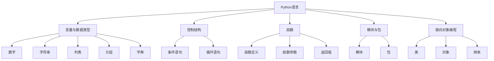

# Python语言基础原理与代码实战案例讲解

## 1.背景介绍

Python是一种高级编程语言,由Guido van Rossum于1991年首次发布。Python以其简洁、易读、易学的语法特点,成为了当今最受欢迎的编程语言之一。Python广泛应用于Web开发、数据分析、人工智能、科学计算等领域。

Python的设计哲学是"优雅"、"明确"、"简单"。Python语言的简洁性体现在:

- 使用缩进来定义代码块,无需使用花括号或关键字
- 无需显式声明变量类型
- 支持多种编程范式,包括面向对象、函数式编程等  

Python拥有丰富的标准库和第三方库,使得开发者可以快速构建复杂的应用程序。Python的解释型特性也使得其成为编写脚本和快速原型开发的理想选择。

## 2.核心概念与联系

要掌握Python语言,需要理解其核心概念及其之间的联系。下面是Python语言的一些核心概念:

### 2.1 变量与数据类型

- 变量:用于存储数据值的标识符
- 数据类型:Python中内置的数据类型包括数字、字符串、列表、元组、字典等

### 2.2 控制结构

- 条件语句:使用if、elif和else实现条件分支
- 循环语句:使用for和while实现循环

### 2.3 函数

- 函数定义:使用def关键字定义函数
- 函数参数:位置参数、默认参数、可变参数等
- 返回值:使用return语句返回函数结果

### 2.4 模块与包

- 模块:将相关的代码组织到一个文件中,提高代码的可重用性
- 包:将相关的模块组织到一个目录中,提供更高层次的代码组织

### 2.5 面向对象编程

- 类:使用class关键字定义类
- 对象:类的实例
- 继承:通过继承实现代码复用和多态

下图展示了Python语言核心概念之间的关系:



## 3.核心算法原理具体操作步骤

Python语言本身并不涉及复杂的算法,但其标准库和第三方库中提供了丰富的算法实现。下面以Python内置的排序算法为例,介绍其具体操作步骤。

Python内置的排序算法是Timsort,它结合了合并排序和插入排序的优点。Timsort的具体操作步骤如下:

1. 将待排序的数组分割成多个长度为32或64的子数组(run)。
2. 对每个子数组使用插入排序进行排序。
3. 将相邻的两个有序子数组合并成一个更大的有序数组,重复此过程直到整个数组有序。

在合并有序子数组时,Timsort使用了一种优化策略:

1. 维护一个栈,用于存储待合并的有序子数组。
2. 当新的有序子数组生成时,将其与栈顶的子数组比较。
3. 如果新子数组的长度小于栈顶子数组,则将新子数组压入栈中。
4. 如果新子数组的长度大于栈顶子数组,则将栈顶子数组弹出并与新子数组合并,重复此过程直到满足压栈条件。

通过这种优化策略,Timsort可以高效地合并有序子数组,从而提高排序性能。

## 4.数学模型和公式详细讲解举例说明

Python语言本身并不涉及复杂的数学模型,但在数据分析、科学计算等领域,Python常常被用于实现各种数学模型和算法。下面以线性回归模型为例,详细讲解其数学原理。

线性回归是一种用于建模因变量和自变量之间线性关系的统计方法。给定一组观测数据 $\{(x_i, y_i)\}_{i=1}^n$,线性回归的目标是找到一条直线 $y = wx + b$,使得预测值与实际值之间的误差平方和最小。

线性回归的数学模型可以表示为:

$$y = wx + b + \epsilon$$

其中,$w$和$b$分别为直线的斜率和截距,$\epsilon$为误差项。

为了找到最优的$w$和$b$,需要最小化误差平方和:

$$\min_{w,b} \sum_{i=1}^n (y_i - wx_i - b)^2$$

这个优化问题可以通过最小二乘法求解。令误差平方和对$w$和$b$的偏导数等于0:

$$\frac{\partial}{\partial w} \sum_{i=1}^n (y_i - wx_i - b)^2 = -2 \sum_{i=1}^n x_i(y_i - wx_i - b) = 0$$

$$\frac{\partial}{\partial b} \sum_{i=1}^n (y_i - wx_i - b)^2 = -2 \sum_{i=1}^n (y_i - wx_i - b) = 0$$

化简上述方程组,可以得到$w$和$b$的解析解:

$$w = \frac{\sum_{i=1}^n (x_i - \bar{x})(y_i - \bar{y})}{\sum_{i=1}^n (x_i - \bar{x})^2}$$

$$b = \bar{y} - w\bar{x}$$

其中,$\bar{x}$和$\bar{y}$分别为$x$和$y$的均值。

有了$w$和$b$的解析解,就可以用Python实现线性回归模型了。下面是一个简单的示例:

```python
import numpy as np

def linear_regression(x, y):
    x_mean = np.mean(x)
    y_mean = np.mean(y)
    
    numerator = np.sum((x - x_mean) * (y - y_mean))
    denominator = np.sum((x - x_mean) ** 2)
    
    w = numerator / denominator
    b = y_mean - w * x_mean
    
    return w, b

# 示例数据
x = np.array([1, 2, 3, 4, 5])
y = np.array([2, 4, 5, 4, 5])

# 拟合线性回归模型
w, b = linear_regression(x, y)

print(f"Slope: {w:.2f}")
print(f"Intercept: {b:.2f}")
```

输出结果:

```
Slope: 0.70
Intercept: 1.50
```

这个示例展示了如何用Python从零开始实现一个简单的线性回归模型。在实际应用中,通常会使用Python的第三方库(如scikit-learn)来实现更复杂的机器学习模型。

## 5.项目实践:代码实例和详细解释说明

下面通过一个实际的项目案例,展示如何使用Python进行Web开发。这个项目使用Flask框架构建一个简单的博客应用。

### 5.1 项目结构

```
blog/
    templates/
        index.html
        post.html
    app.py
    requirements.txt
```

- `templates/`:存储HTML模板文件
- `app.py`:Flask应用的主文件
- `requirements.txt`:项目依赖的Python包列表

### 5.2 安装依赖

在项目根目录下执行以下命令安装依赖:

```bash
pip install -r requirements.txt
```

### 5.3 编写Flask应用

`app.py`文件的内容如下:

```python
from flask import Flask, render_template

app = Flask(__name__)

# 博客文章数据
posts = [
    {
        'title': 'First Post',
        'content': 'This is the first post.'
    },
    {
        'title': 'Second Post',
        'content': 'This is the second post.'
    }
]

@app.route('/')
def index():
    return render_template('index.html', posts=posts)

@app.route('/post/<int:post_id>')
def post(post_id):
    post = posts[post_id]
    return render_template('post.html', post=post)

if __name__ == '__main__':
    app.run(debug=True)
```

这个Flask应用定义了两个路由:

- `/`:博客首页,显示所有文章的标题列表
- `/post/<post_id>`:显示指定ID的文章内容

### 5.4 编写HTML模板

`templates/index.html`文件的内容如下:

```html
<!DOCTYPE html>
<html>
<head>
    <title>My Blog</title>
</head>
<body>
    <h1>Welcome to My Blog</h1>
    <ul>
        
            <li><a href="{{ url_for('post', post_id=loop.index0) }}">{{ post.title }}</a></li>
        
    </ul>
</body>
</html>
```

这个模板使用Jinja2语法,通过``循环渲染文章标题列表。

`templates/post.html`文件的内容如下:

```html
<!DOCTYPE html>
<html>
<head>
    <title>{{ post.title }}</title>
</head>
<body>
    <h1>{{ post.title }}</h1>
    <p>{{ post.content }}</p>
    <a href="{{ url_for('index') }}">Back to Home</a>
</body>
</html>
```

这个模板渲染指定文章的标题和内容。

### 5.5 运行应用

在项目根目录下执行以下命令启动Flask应用:

```bash
python app.py
```

然后在浏览器中访问`http://localhost:5000`,就可以看到博客首页了。点击文章标题链接,可以查看文章详情页。

这个示例项目展示了如何使用Flask快速构建一个简单的Web应用。在实际开发中,还需要考虑数据库集成、用户认证、前端样式等方面的内容。

## 6.实际应用场景

Python语言在各个领域都有广泛的应用,下面列举几个典型的应用场景:

### 6.1 Web开发

Python有许多优秀的Web框架,如Django、Flask、Tornado等。这些框架提供了强大的工具和库,使得开发Web应用变得简单高效。Python还有丰富的第三方库,可以方便地集成数据库、缓存、消息队列等组件。

### 6.2 数据分析

Python是数据分析领域的主流语言之一。Numpy、Pandas、Matplotlib等库提供了强大的数据处理和可视化功能。Python还可以与Hadoop、Spark等大数据平台集成,用于处理海量数据。

### 6.3 机器学习

Python是机器学习领域的首选语言。Scikit-learn提供了丰富的机器学习算法库,TensorFlow、PyTorch等深度学习框架也都有Python接口。Python简洁的语法和强大的生态系统,使得研究人员和工程师可以快速实现和迭代机器学习模型。

### 6.4 自动化运维

Python是自动化运维的利器。Fabric、Ansible等库可以用于自动化部署和配置管理。Python还可以用于编写系统管理脚本,完成日志分析、监控报警等任务。

### 6.5 游戏开发

Python也可以用于游戏开发。PyGame库提供了丰富的游戏开发功能,包括图形渲染、事件处理、声音播放等。一些大型游戏,如EVE Online,也使用Python作为游戏逻辑的开发语言。

总之,Python语言凭借其简洁的语法、丰富的库、高效的开发效率,在各个领域都得到了广泛的应用。

## 7.工具和资源推荐

下面推荐一些Python相关的工具和资源,帮助读者进一步学习和应用Python。

### 7.1 集成开发环境(IDE)

- PyCharm:JetBrains出品的Python IDE,功能强大,支持智能代码补全、调试、重构等。
- Visual Studio Code:微软出品的轻量级代码编辑器,通过安装Python扩展,可以获得很好的Python开发体验。

### 7.2 包管理工具

- pip:Python官方的包管理工具,用于安装和管理Python包。
- Anaconda:数据科学领域常用的Python发行版,内置了许多常用的科学计算包。

### 7.3 在线学习资源

- 官方文档:Python官方网站提供了详尽的语言和标准库文档,是学习Python的权威资源。
- Real Python:提供了大量优质的Python教程和文章,覆盖Python各个应用领