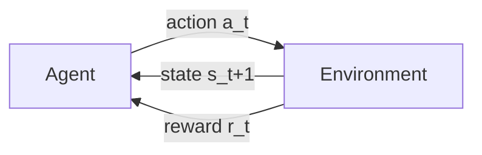
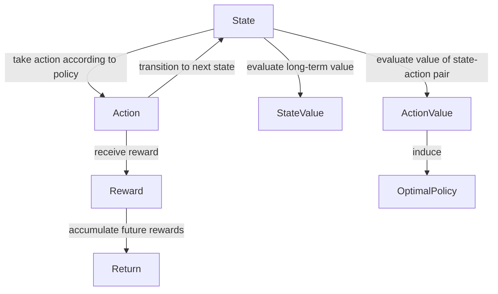
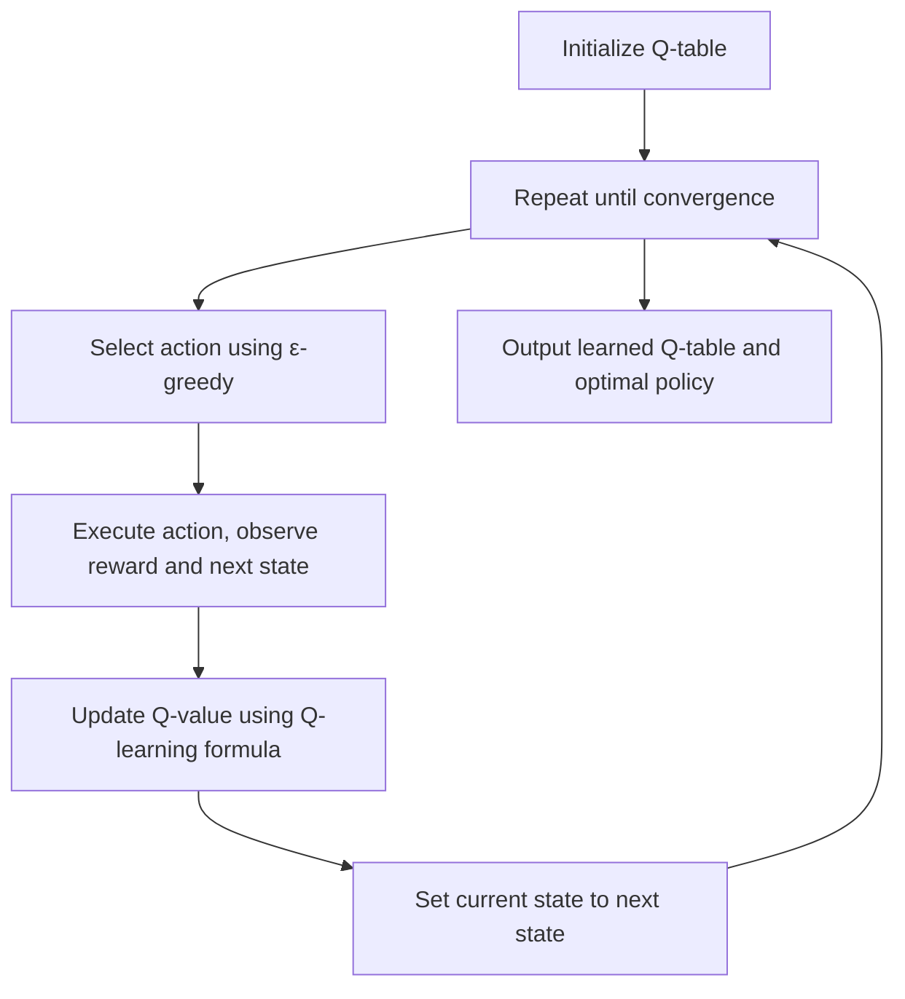

# Q-learning算法

## 1.背景介绍
强化学习是一种机器学习范式,它关注于智能体(Agent)如何在一个环境中通过学习来最大化其累积奖励。Q-learning是强化学习中一种非常流行和有效的算法,由Watkins在1989年首次提出。它是一种无模型(model-free)、离线策略(off-policy)的时间差分学习算法。

Q-learning的核心思想是学习一个动作-值函数(Action-Value Function),记为Q(s,a),它表示在状态s下采取动作a可以获得的长期累积奖励的期望。通过不断与环境交互,智能体可以逐步优化其Q函数,最终学习到一个最优策略。

### 1.1 强化学习的基本框架
要理解Q-learning,首先需要了解强化学习的基本框架。在强化学习中,智能体与环境不断交互,在每个时间步t,智能体观察到环境的状态st,并根据某个策略π选择一个动作at。环境接收到动作后,会反馈给智能体一个即时奖励rt,并转移到下一个状态st+1。这个过程不断循环,形成一个马尔可夫决策过程(Markov Decision Process, MDP)。



### 1.2 探索与利用的权衡
在强化学习中,智能体面临着探索(Exploration)与利用(Exploitation)的权衡问题。探索是指尝试新的动作,以发现可能更好的策略;利用是指采取当前已知的最优动作,以最大化累积奖励。Q-learning通过ε-贪心策略来平衡探索和利用。

### 1.3 Q-learning的优势
相比其他强化学习算法,Q-learning有以下优势:
1. 无需知道环境的转移概率和奖励函数,因此适用于未知环境。
2. 能够从离线的经验数据中学习,不需要在线与环境交互。 
3. 通过异步更新,可以高效地学习最优策略。
4. 收敛性有理论保证,在一定条件下能够收敛到最优Q函数。

## 2.核心概念与联系
要掌握Q-learning算法,需要理解以下核心概念:
- 状态(State):环境的状态表示,通常用s表示。
- 动作(Action):智能体可采取的行为,通常用a表示。
- 策略(Policy):状态到动作的映射,表示在某状态下应该采取的动作,通常用π表示。
- 奖励(Reward):环境反馈给智能体的即时奖励,表示采取动作的好坏,通常用r表示。
- 回报(Return):从某状态开始,采取一系列动作后获得的累积奖励的期望,通常用Gt表示。
- 状态值函数(State-Value Function):表示状态的长期价值,即从该状态开始能获得的期望回报,通常用V(s)表示。 
- 动作值函数(Action-Value Function):表示在某状态下采取某动作的长期价值,即Q(s,a)。

这些概念之间有着紧密的联系,例如:
- 价值函数与即时奖励和下一状态价值的关系: $V(s) = E[r + γV(s')]$
- 最优价值函数与最优Q函数的关系: $V_*(s)=\max_a Q_*(s,a)$
- 最优策略与最优Q函数的关系: $\pi_*(s) = \arg\max_a Q_*(s,a)$



## 3.核心算法原理与操作步骤
Q-learning的核心是学习最优的Q函数。根据最优Q函数,智能体的最优策略为:在每个状态s下选择Q值最大的动作a。Q-learning通过不断更新Q表来逼近最优Q函数。

### 3.1 Q-learning的更新公式
Q-learning的核心更新公式为:

$$Q(s_t,a_t) \leftarrow Q(s_t,a_t)+\alpha[r_t+\gamma \max_a Q(s_{t+1},a)-Q(s_t,a_t)]$$

其中:
- $s_t$是t时刻的状态
- $a_t$是t时刻采取的动作
- $r_t$是t时刻获得的即时奖励
- $s_{t+1}$是t+1时刻的下一状态
- $\alpha$是学习率,控制每次更新的步长
- $\gamma$是折扣因子,表示未来奖励的重要程度

### 3.2 Q-learning的操作步骤
Q-learning的基本操作步骤如下:
1. 初始化Q表,对于所有状态-动作对(s,a),令Q(s,a)=0
2. 重复以下步骤,直到收敛:
   1. 根据ε-贪心策略,以概率ε随机选择动作,否则选择Q值最大的动作
   2. 执行选定的动作a,观察奖励r和下一状态s'
   3. 根据Q-learning的更新公式,更新Q(s,a)
   4. s ← s'
3. 输出最终学到的Q表和最优策略π*



## 4.数学模型和公式详解
Q-learning算法的数学模型基于马尔可夫决策过程(MDP)。一个MDP由一个五元组$(S,A,P,R,\gamma)$定义,其中:
- $S$是有限的状态集合
- $A$是有限的动作集合
- $P$是状态转移概率矩阵,$P(s'|s,a)$表示在状态s下采取动作a转移到状态s'的概率
- $R$是奖励函数,$R(s,a)$表示在状态s下采取动作a获得的即时奖励
- $\gamma \in [0,1]$是折扣因子,表示未来奖励的重要程度

在MDP中,策略π是从状态到动作的映射,即$\pi(a|s)$表示在状态s下采取动作a的概率。我们的目标是寻找最优策略π*,使得从任意状态开始执行π*,获得的期望累积奖励最大化。

### 4.1 价值函数的贝尔曼方程
Q-learning的理论基础是价值函数的贝尔曼方程(Bellman Equation)。对于任意策略π,其状态值函数$V^\pi(s)$满足:

$$V^\pi(s) = \sum_a \pi(a|s) \sum_{s',r} P(s',r|s,a)[r+\gamma V^\pi(s')]$$

类似地,动作值函数$Q^\pi(s,a)$满足: 

$$Q^\pi(s,a) = \sum_{s',r} P(s',r|s,a)[r+\gamma \sum_{a'} \pi(a'|s') Q^\pi(s',a')]$$

最优价值函数$V_*(s)$和$Q_*(s,a)$满足贝尔曼最优方程:

$$V_*(s) = \max_a \sum_{s',r} P(s',r|s,a)[r+\gamma V_*(s')]$$

$$Q_*(s,a) = \sum_{s',r} P(s',r|s,a)[r+\gamma \max_{a'} Q_*(s',a')]$$

### 4.2 Q-learning的收敛性证明
Q-learning算法的收敛性可以通过随机逼近理论来证明。假设学习率$\alpha_t$满足:

$$\sum_{t=0}^\infty \alpha_t = \infty, \quad \sum_{t=0}^\infty \alpha_t^2 < \infty$$

并且每个状态-动作对无限次地被访问到,那么Q-learning算法以概率1收敛到最优Q函数$Q_*$。

证明的核心是将Q-learning算法转化为一个随机逼近过程,利用随机逼近理论中的收敛定理得到结论。详细的证明过程可参考相关文献。

## 5.项目实践:代码实例与详解
下面给出一个使用Python实现Q-learning算法的简单示例,以悬崖寻路环境(Cliff Walking)为例。

### 5.1 悬崖寻路环境介绍
在悬崖寻路环境中,智能体的目标是从起点走到终点,同时要避免掉下悬崖。环境如下图所示:

```
  S A B C D
  E F G H I
  J K L M N
  O P Q R T
```

其中,S为起点,T为终点,ABCD为悬崖。智能体每走一步奖励为-1,掉下悬崖的奖励为-100,到达终点的奖励为0。

### 5.2 Q-learning算法实现
```python
import numpy as np

# 定义悬崖寻路环境
class CliffWalkingEnv:
    def __init__(self, ncol, nrow):
        self.nrow = nrow
        self.ncol = ncol
        self.x = 0 # 记录当前智能体位置的横坐标
        self.y = self.nrow - 1 # 记录当前智能体位置的纵坐标
        
    def step(self, action):
        # 4种动作, change[0]:上, change[1]:下, change[2]:左, change[3]:右。坐标系原点(0,0)
        # 定义在左上角
        change = [[0, -1], [0, 1], [-1, 0], [1, 0]]  
        self.x = min(self.ncol - 1, max(0, self.x + change[action][0]))
        self.y = min(self.nrow - 1, max(0, self.y + change[action][1]))
        next_state = self.y * self.ncol + self.x
        reward = -1
        done = False
        if self.y == self.nrow - 1 and self.x > 0:  # 下一个位置在悬崖或者目标
            done = True
            if self.x != self.ncol - 1:
                reward = -100
        return next_state, reward, done
    
    def reset(self): # 回归初始状态,起点在左上角
        self.x = 0
        self.y = self.nrow - 1
        return self.y * self.ncol + self.x
      
# 训练Q-learning算法
def train_Q_learning(env, n_episodes, gamma=0.9, alpha=0.1, epsilon=0.1):
    n_states = env.nrow * env.ncol # 计算一共有多少种状态
    n_actions = 4 # 4种动作
    Q_table = np.zeros((n_states, n_actions)) # 初始化Q表
    
    for i in range(n_episodes):
        done = False
        s = env.reset() # 回归初始状态
        while not done:
            if np.random.uniform() < epsilon: # epsilon-greedy策略选取下一步的操作
                a = np.random.choice(n_actions)
            else:
                a = np.argmax(Q_table[s])
            
            s_next, r, done = env.step(a) # 执行动作,获得下一个状态、奖励和是否结束
            Q_table[s,a] += alpha * (r + gamma * np.max(Q_table[s_next]) - Q_table[s,a]) # 更新Q表
            s = s_next # 更新当前状态
    
    return Q_table
    
# 测试训练好的Q表
def test_Q_learning(env, Q_table):
    done = False
    s = env.reset()
    while not done:
        a = np.argmax(Q_table[s])
        s, r, done = env.step(a)
        print(s//env.ncol, s%env.ncol)
        
if __name__ == "__main__":
    env = CliffWalkingEnv(ncol=5, nrow=4)
    Q_table = train_Q_learning(env, n_episodes=500)
    test_Q_learning(env, Q_table)
```

### 5.3 代码解析
- `CliffWalkingEnv`类实现了悬崖寻路环境,包括状态转移、奖励计算和重置环境等功能。
- `train_Q_learning`函数实现了Q-learning算法的训练过程,包括使用ε-贪心策略选择动作、执行动作、更新Q表等步骤。
- `test_Q_learning`函数使用训练好的Q表在环境中测试,输出智能体的行走路径。

运行上述代码,可以看到智能体学习到的最优路径,成功避开了悬崖区域。

## 6.实际应用场景
Q-learning算法在许多领域有着广泛的应用,例如:
- 智能体