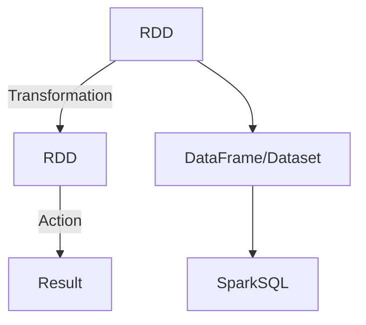

# RDD原理与代码实例讲解

## 1. 背景介绍

在大数据时代,数据的规模和复杂性都在快速增长,传统的数据处理方式已经无法满足现代应用的需求。Apache Spark作为一种快速、通用的大规模数据处理引擎,凭借其优秀的性能和易用性,成为了当前最流行的大数据处理框架之一。Spark的核心数据结构——RDD(Resilient Distributed Dataset,弹性分布式数据集)是实现其高效并行计算的关键所在。

RDD不仅提供了一种高度抽象的数据表示形式,还支持对数据进行转化和操作,从而使得分布式计算变得更加简单高效。本文将深入探讨RDD的工作原理、实现细节以及实际应用场景,帮助读者全面了解这一核心概念。

## 2. 核心概念与联系

### 2.1 RDD的定义

RDD是一种分布式的、不可变的、可重用的数据集合,是Spark中最基本的数据抽象。它可以从任何存储源(如HDFS、HBase、Cassandra等)创建,也可以通过现有RDD转化而来。

RDD具有以下几个核心特征:

- **分区(Partitioned)**: RDD中的数据被划分为多个分区(Partition),这些分区被分布在集群的不同节点上,从而实现数据的并行处理。
- **不可变(Immutable)**: RDD本身是不可变的,一旦创建就无法修改。对RDD的任何转化操作都会生成一个新的RDD。
- **有血统(Lineage)**: RDD通过记录它是如何从其他RDD或数据源衍生而来的转化操作,从而构建了一个血统关系图。这使得RDD可以自动重建,提高了容错能力。
- **延迟计算(Lazy Evaluation)**: RDD的转化操作都是延迟计算的,只有在需要计算结果时,才会触发实际的计算过程。

### 2.2 RDD与其他数据结构的关系

RDD与Spark生态系统中的其他核心概念密切相关,如下图所示:



- **Transformation**: 转化操作可以从一个RDD生成一个新的RDD,如map、filter、flatMap等。
- **Action**: 动作操作会触发RDD的实际计算,并返回结果,如count、collect、saveAsTextFile等。
- **DataFrame/Dataset**: 这两种结构化的数据抽象建立在RDD之上,提供了更高层次的API,特别适用于结构化数据处理。
- **SparkSQL**: Spark的SQL模块,支持使用SQL语句查询DataFrame/Dataset。

## 3. 核心算法原理具体操作步骤

### 3.1 RDD的创建

RDD可以通过两种方式创建:

1. **从外部存储系统创建**

   Spark支持从多种外部存储系统创建RDD,包括本地文件系统、HDFS、Amazon S3、Cassandra、HBase等。例如,从HDFS上的文本文件创建RDD:

   ```scala
   val textFile = sc.textFile("hdfs://...")
   ```

2. **从驱动器程序中的集合创建**

   也可以从驱动器程序中的集合(如数组)创建RDD:

   ```scala
   val data = Array(1, 2, 3, 4, 5)
   val distData = sc.parallelize(data)
   ```

### 3.2 RDD的转化操作

转化操作会从一个RDD生成一个新的RDD,常用的转化操作包括:

- **map**: 对RDD中的每个元素应用一个函数,生成一个新的RDD。
- **filter**: 返回一个新的RDD,只包含满足指定条件的元素。
- **flatMap**: 与map类似,但每个输入元素被映射为0个或多个输出元素。
- **union**: 返回一个新的RDD,包含源RDD和其他RDD的所有元素。
- **join**: 对两个RDD执行内连接操作。

这些操作都是延迟计算的,只有在执行Action操作时才会真正触发计算。

### 3.3 RDD的Action操作

Action操作会触发RDD的实际计算并返回结果,常用的Action操作包括:

- **reduce**: 使用给定的函数对RDD中的所有元素进行聚合操作。
- **collect**: 将RDD中的所有元素拉取到驱动器程序中,形成一个数组。
- **count**: 返回RDD中元素的个数。
- **take**: 返回RDD中的前n个元素。
- **saveAsTextFile**: 将RDD的元素以文本文件的形式写入到HDFS或本地文件系统。

### 3.4 RDD的血统关系

RDD的血统关系记录了RDD是如何从其他RDD或数据源衍生而来的转化操作序列。这使得RDD可以自动重建,提高了容错能力。

当一个RDD的某个分区数据由于节点故障而丢失时,Spark可以根据该RDD的血统关系,重新计算并重建丢失的数据分区,而不需要从头重新计算整个RDD。

## 4. 数学模型和公式详细讲解举例说明

在RDD的实现中,涉及到一些重要的数学模型和公式,下面将对其进行详细讲解。

### 4.1 数据分区策略

RDD中的数据被划分为多个分区,这些分区分布在集群的不同节点上,实现了数据的并行处理。数据分区策略决定了如何将RDD中的数据划分为分区,并将这些分区分配给不同的执行节点。

常用的数据分区策略包括:

- **HashPartitioner**: 根据数据的key进行哈希分区,确保相同key的数据位于同一个分区中。
- **RangePartitioner**: 根据数据的key范围进行分区,确保一个分区中的key值在一个范围内。

假设要对一个RDD进行HashPartitioner分区,分区数为n,数据的key为k,则分区id可以通过下面的公式计算得到:

$$
partitionId = k.hashCode() \% n
$$

其中,hashCode()是对key进行哈希计算的函数。

### 4.2 数据局部性

数据局部性是Spark实现高效计算的关键因素之一。由于RDD的分区分布在集群的不同节点上,因此在执行任务时,需要考虑数据和计算的位置,尽可能将计算任务分配到数据所在的节点上,以减少数据传输开销。

Spark使用了一种延迟调度策略,在实际执行任务之前,会先构建一个任务调度图,根据数据的位置信息,为每个任务分配一个局部性级别,包括:

- **PROCESS_LOCAL**: 数据位于同一个执行进程中,无需进行数据传输。
- **NODE_LOCAL**: 数据位于同一个节点上,但在不同的执行进程中,需要进行进程内数据传输。
- **NO_PREF**: 数据位于其他节点上,需要进行节点间数据传输。
- **RACK_LOCAL**: 数据位于同一个机架上的其他节点,需要进行机架内数据传输。

任务调度器会优先选择局部性级别更高的任务进行执行,以提高数据局部性,从而提高整体计算效率。

## 5. 项目实践: 代码实例和详细解释说明

下面通过一个实际项目案例,展示如何使用RDD进行数据处理。我们将从一个文本文件中读取数据,统计每个单词出现的次数,并将结果保存到HDFS上。

### 5.1 创建RDD

首先,从HDFS上的文本文件创建一个RDD:

```scala
val textFile = sc.textFile("hdfs://...path/README.md")
```

### 5.2 转化操作

对RDD执行一系列转化操作:

```scala
val words = textFile.flatMap(line => line.split(" "))
val pairs = words.map(word => (word, 1))
val wordCounts = pairs.reduceByKey((a, b) => a + b)
```

1. `flatMap`将每一行文本拆分为单词,生成一个新的RDD。
2. `map`将每个单词映射为一个(单词,1)的键值对,方便后续的计数操作。
3. `reduceByKey`对相同的键(单词)进行值(计数)的聚合,得到每个单词出现的次数。

### 5.3 Action操作

最后,执行Action操作将结果保存到HDFS:

```scala
wordCounts.saveAsTextFile("hdfs://...path/wordcount_result")
```

完整代码如下:

```scala
val textFile = sc.textFile("hdfs://...path/README.md")
val words = textFile.flatMap(line => line.split(" "))
val pairs = words.map(word => (word, 1))
val wordCounts = pairs.reduceByKey((a, b) => a + b)
wordCounts.saveAsTextFile("hdfs://...path/wordcount_result")
```

### 5.4 代码解释

1. `sc.textFile`从HDFS上读取文本文件,创建一个RDD。每个RDD分区对应文件的一个数据块。
2. `flatMap`将每一行文本拆分为单词,生成一个新的RDD `words`。
3. `map`将每个单词映射为一个(单词,1)的键值对,方便后续的计数操作,生成一个新的RDD `pairs`。
4. `reduceByKey`对相同的键(单词)进行值(计数)的聚合,得到每个单词出现的次数,生成一个新的RDD `wordCounts`。
5. `saveAsTextFile`将结果RDD `wordCounts`保存到HDFS指定路径下。

通过这个实例,我们可以看到RDD提供了一种高度抽象的数据处理方式,使用简洁的函数式API就可以完成复杂的数据转化和计算任务。

## 6. 实际应用场景

RDD作为Spark核心的数据抽象,可以广泛应用于各种大数据处理场景,包括但不限于:

### 6.1 大数据分析

通过对海量数据(如日志数据、用户行为数据等)进行转化和计算,可以发现隐藏其中的有价值信息和规律,为企业的决策提供数据支持。

### 6.2 机器学习

Spark MLlib库基于RDD实现了多种机器学习算法,可以在大规模数据集上高效地训练模型,应用于推荐系统、异常检测、图像识别等领域。

### 6.3 流式计算

Spark Streaming将流式数据(如实时日志、传感器数据等)抽象为一系列的小批量RDD,可以对其进行类似批处理的转化和计算操作,实现近乎实时的数据处理。

### 6.4 图计算

Spark GraphX基于RDD构建了一个分布式图计算框架,可以高效地执行图遍历、最短路径等图算法,应用于社交网络分析、网络拓扑优化等领域。

## 7. 工具和资源推荐

为了更好地学习和使用RDD,这里推荐一些有用的工具和资源:

### 7.1 Spark官方文档

Spark官方文档(https://spark.apache.org/docs/latest/)详细介绍了RDD的概念、API和用法,是学习RDD的权威参考资料。

### 7.2 Spark编程指南

《Spark编程指南》(Learning Spark: Lightning-Fast Big Data Analysis)是一本很好的Spark入门书籍,涵盖了RDD、Spark SQL、Spark Streaming等核心概念和实践案例。

### 7.3 Spark源代码

阅读Spark源代码(https://github.com/apache/spark)可以深入了解RDD的实现细节,对于提高Spark开发能力非常有帮助。

### 7.4 Spark社区

Spark拥有一个活跃的开源社区,可以在Spark用户邮件列表(https://spark.apache.org/community.html)和Stack Overflow上寻求帮助、分享经验。

## 8. 总结: 未来发展趋势与挑战

RDD作为Spark核心的数据抽象,为大数据处理提供了高度抽象和高效的解决方案。然而,随着大数据场景的不断演进,RDD也面临着一些新的挑战和发展趋势:

### 8.1 结构化数据处理

虽然RDD可以处理任意类型的数据,但对于结构化数据(如表格数据)的处理效率并不理想。Spark引入了DataFrame和Dataset等更高层次的结构化数据抽象,提供了更好的性能和优化能力。未来,结构化数据处理将成为Spark的重点发展方向之一。

### 8.2 流式计算

随着实时数据处理需求的不断增长,流式计算将成为大数据处理的重要场景。Spark Structure