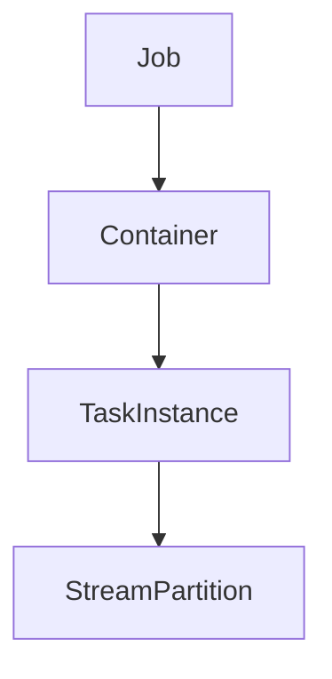

# Samza Task原理与代码实例讲解

## 1. 背景介绍

在现代分布式系统中,实时数据处理和流式计算扮演着重要角色。Apache Samza是一个分布式流处理系统,旨在提供高度可扩展、容错和低延迟的数据处理能力。Samza基于Apache Kafka构建,利用Kafka的消息队列作为数据源,并将处理后的结果输出到Kafka topics、数据库或文件系统等存储系统。

Samza的核心组件之一是Task,它负责实际执行流处理逻辑。每个Task都是一个独立的线程,处理分配给它的一部分数据流。本文将深入探讨Samza Task的原理、工作机制和代码实现,帮助读者全面理解这一关键组件。

## 2. 核心概念与联系

在深入探讨Samza Task之前,我们需要了解一些核心概念:

### 2.1 流分区(Stream Partition)

Kafka将每个topic分成多个分区(partition),每个分区是一个有序、不可变的消息序列。这种分区机制使得Kafka能够实现水平扩展,提高吞吐量和并行性。

### 2.2 Task实例(Task Instance)

每个Task实例负责处理一个或多个流分区。Task实例是Samza的基本执行单元,由一个单独的线程驱动。

### 2.3 容器(Container)

容器是Samza的部署单元,它包含一个或多个Task实例。每个容器运行在一个独立的JVM进程中。

### 2.4 作业(Job)

作业是Samza的最高级别抽象,它由一个或多个Task实例组成,用于执行特定的流处理逻辑。

这些概念之间的关系如下所示:



## 3. 核心算法原理具体操作步骤

Samza Task的核心算法原理可以概括为以下几个步骤:

### 3.1 初始化

在启动时,Samza会为每个Task实例分配一个或多个流分区。Task实例会初始化自身的状态,包括设置消费者(consumer)、序列化器(serializer)等组件。

### 3.2 消费消息

Task实例通过Kafka消费者从分配的流分区中消费消息。消费者使用一种称为"重置与批处理(Reset and Batch)"的策略来保证至少一次处理语义。

### 3.3 处理消息

对于每个消费的消息,Task实例会执行用户定义的处理逻辑。这可能涉及转换、过滤、连接或聚合等操作。

### 3.4 更新状态

如果处理逻辑需要维护状态,Task实例会将新的状态持久化到状态存储(如RocksDB)中。

### 3.5 生产输出

处理后的消息可能会发送到下游Kafka主题、数据库或文件系统等输出系统。

### 3.6 检查点(Checkpoint)

为了实现恢复能力,Task实例会定期将自身的状态和消费位移(offset)写入检查点主题。这样,在发生故障时,Task实例可以从最后一个检查点恢复执行。

上述步骤在Task实例的生命周期内不断重复,直到作业结束或发生故障。

## 4. 数学模型和公式详细讲解举例说明

在流处理系统中,一个关键的指标是延迟,即消息从进入系统到被处理的时间。Samza的设计目标之一是最小化延迟。

假设一个Task实例处理 $n$ 个分区,每个分区的消息到达速率为 $\lambda_i$ ($i=1,2,...,n$)。根据排队理论,如果服务时间服从指数分布,且平均服务率为 $\mu$,那么该Task实例的平均延迟 $D$ 可以表示为:

$$D = \frac{1}{\mu - \sum_{i=1}^{n}\lambda_i}$$

上式表明,为了最小化延迟,我们需要:

1. 提高Task实例的处理能力 $\mu$,例如使用更强大的硬件资源或优化代码。
2. 减少每个Task实例需要处理的分区数量 $n$,从而降低 $\sum_{i=1}^{n}\lambda_i$。

此外,Samza采用了一种称为"无界延迟调度(Unbounded Delay Scheduling)"的策略,通过动态调整Task实例的优先级来进一步降低延迟。具体来说,如果一个Task实例的延迟超过了预设阈值,它的优先级会被提高,从而获得更多的CPU时间片。这种策略可以有效防止消息延迟无限增长。

## 5. 项目实践:代码实例和详细解释说明

为了更好地理解Samza Task的工作原理,让我们来看一个简单的WordCount示例。该示例从Kafka主题中读取文本消息,统计每个单词出现的次数,并将结果写回到另一个Kafka主题。

### 5.1 定义Task

首先,我们需要定义一个Task类,实现Samza的`StreamTask`接口:

```java
public class WordCountTask implements StreamTask, InitableTask {
    private Map<String, Integer> wordCounts = new HashMap<>();

    @Override
    public void init(Config config, TaskContext context) {
        // 初始化Task状态
    }

    @Override
    public void process(IncomingMessageEnvelope envelope, MessageCollector collector, TaskCoordinator coordinator) {
        String message = (String) envelope.getMessage();
        String[] words = message.split("\\s+");

        for (String word : words) {
            wordCounts.put(word, wordCounts.getOrDefault(word, 0) + 1);
        }

        // 发送输出到Kafka主题
        for (Map.Entry<String, Integer> entry : wordCounts.entrySet()) {
            collector.send(new OutgoingMessageEnvelope(new KeyedWordCount(entry.getKey(), entry.getValue())));
        }
    }
}
```

在`init`方法中,我们可以初始化Task的状态。在`process`方法中,Task从输入消息流中读取消息,统计每个单词的出现次数,并将结果发送到输出主题。

### 5.2 定义作业

接下来,我们需要定义一个作业,指定输入和输出主题,以及要执行的Task:

```java
JobConfig jobConfig = JobConfig.factory()
    .setStreamJobFactory(WordCountTaskFactory.class)
    .addInputStream(KafkaSystemFactory.getMessageEnvelope("input-topic"), "input-system")
    .addOutputStream("output-topic", KafkaSystemFactory.getMessageEnvelope(), "output-system")
    .build();

LocalApplicationRunner runner = new LocalApplicationRunner(jobConfig);
runner.run();
```

在这个示例中,我们使用`LocalApplicationRunner`在本地运行作业。在生产环境中,您可以使用`yarn`或`standalone`模式在集群上运行作业。

### 5.3 运行作业

当我们运行作业时,Samza会自动创建Task实例、分配流分区并执行Task逻辑。您可以在日志中看到类似如下的输出:

```
Consuming from Kafka
    ...
    Processed message: "Hello Samza Hello World"
    Word counts: {"Hello":2,"Samza":1,"World":1}
    ...
```

这表明Task实例正在从Kafka主题中消费消息,并正确地统计了单词出现的次数。

## 6. 实际应用场景

Samza Task的设计使其适用于各种实时数据处理场景,包括但不限于:

- **日志处理**: 从Web服务器、应用程序或设备收集日志,进行解析、过滤和聚合,用于监控、安全分析或业务智能。
- **物联网数据处理**: 处理来自传感器、智能设备或车辆的实时数据流,用于预测维护、环境监测或交通优化。
- **实时推荐系统**: 基于用户行为数据流构建实时推荐模型,为电子商务、媒体或广告系统提供个性化推荐。
- **金融交易处理**: 实时处理金融交易数据,用于欺诈检测、风险管理或合规监控。
- **社交媒体分析**: 从社交媒体平台收集实时数据流,进行情感分析、热点追踪或用户行为分析。

无论是在企业内部还是面向公众的应用程序中,Samza Task都可以提供高效、可扩展的实时数据处理能力。

## 7. 工具和资源推荐

如果您希望深入学习Samza及其Task组件,以下资源可能会对您有所帮助:

- **Apache Samza官方文档**: https://samza.apache.org/
- **Samza入门教程**: https://samza.apache.org/startup/
- **Samza示例项目**: https://github.com/apache/samza-hello-samza
- **Samza源代码**: https://github.com/apache/samza
- **Samza社区邮件列表**: https://samza.apache.org/community/

除了官方资源外,您还可以查阅一些优秀的第三方博客、书籍和在线课程,深入学习Samza的架构、最佳实践和高级特性。

## 8. 总结:未来发展趋势与挑战

作为一个成熟的流处理系统,Samza已经被众多公司和组织广泛采用。然而,随着大数据和实时计算领域的不断发展,Samza也面临着一些挑战和发展趋势:

- **流处理与批处理的融合**: 未来,流处理和批处理可能会进一步融合,形成统一的数据处理范式。Samza可能需要与批处理系统(如Apache Spark)更好地集成。
- **机器学习与人工智能**: 实时数据流越来越多地应用于机器学习和人工智能领域,如推荐系统、预测分析和自然语言处理。Samza可能需要提供更好的支持,以便与机器学习框架(如TensorFlow或PyTorch)无缝集成。
- **流处理与边缘计算**:随着物联网和5G技术的发展,越来越多的数据处理将发生在边缘设备上。Samza可能需要优化其架构,以支持边缘计算场景。
- **流处理与事件驱动架构**: 事件驱动架构(Event-Driven Architecture)正在成为构建分布式系统的主流方式。Samza可能需要进一步加强对事件驱动架构的支持,提供更好的事件处理能力。
- **流处理与serverless计算**: Serverless计算正在兴起,它可以提供更高的资源利用率和自动扩展能力。Samza可能需要探索如何与Serverless计算平台(如AWS Lambda或Azure Functions)集成。

总的来说,尽管Samza已经是一个成熟的流处理系统,但它仍需要不断发展和创新,以适应新兴的技术趋势和应用场景。

## 9. 附录:常见问题与解答

### 9.1 Samza与Apache Storm和Apache Spark Streaming有何区别?

Apache Storm和Apache Spark Streaming也是流处理系统,但它们与Samza有一些重要区别:

- **设计理念**: Storm基于"持续流"的概念,而Samza和Spark Streaming基于"离散流"的概念。这意味着Storm需要持续不断地处理数据,而Samza和Spark Streaming可以将流分成小批次进行处理。
- **容错机制**: Storm使用了基于记录(record)的容错机制,而Samza和Spark Streaming使用了基于批次(batch)的容错机制。Samza和Spark Streaming的容错机制通常被认为更简单、更可靠。
- **状态管理**: Samza和Spark Streaming都提供了内置的状态管理机制,而Storm需要依赖外部系统(如Redis或Memcached)来管理状态。
- **集成**: Samza深度集成了Kafka,可以直接从Kafka主题读取和写入数据。Spark Streaming也可以与Kafka集成,但需要额外的配置。Storm则需要使用外部连接器与Kafka集成。

总的来说,Samza更适合构建需要低延迟、高吞吐量和可靠性的流处理应用程序,尤其是那些需要与Kafka紧密集成的应用程序。而Storm和Spark Streaming可能更适合一些特定的场景,如需要持续不断地处理数据流或需要与其他大数据系统(如Hadoop或Spark)集成。

### 9.2 如何在Samza中实现有状态的流处理?

Samza提供了内置的状态管理机制,允许Task实例维护和持久化自身的状态。实现有状态的流处理通常包括以下步骤:

1. **定义状态工厂(StateFactory)**: 状态工厂负责创建和管理Task实例的状态存储。Samza支持多种状态存储后端,如RocksDB、Kafka日志或内存中的HashMap。
2. **在Task中使用状态存储**: 在Task的`init`方法中,从状态工厂获取状态存储实例。在`process`方法中,使用状态存储读取、更新和持久化状态