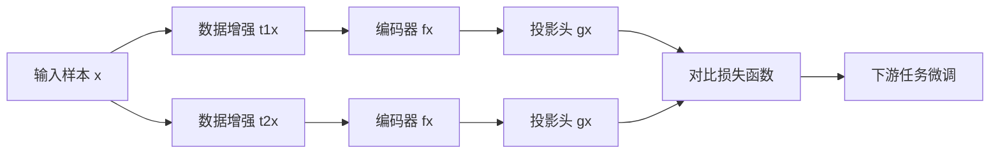

# Self-Supervised Learning原理与代码实例讲解

## 1. 背景介绍
### 1.1 什么是Self-Supervised Learning
Self-Supervised Learning(SSL,自监督学习)是一种机器学习范式,它通过设计智能的监督信号来训练神经网络,而无需人工标注的数据。与传统的有监督学习和无监督学习不同,SSL既不需要人工标注的标签,也不是完全无监督,而是利用数据本身蕴含的某些结构化信息来构建监督信号,从而实现模型的自我学习。

### 1.2 Self-Supervised Learning的意义
SSL的意义在于:
1. 解决了有监督学习需要大量人工标注数据的瓶颈,降低了人力成本
2. 相比无监督学习,SSL能学到更有价值、更高级的特征表示
3. 通过预训练得到的模型,可以更好地迁移到下游任务,提升模型泛化能力

### 1.3 Self-Supervised Learning的发展历程
SSL最早可以追溯到2014年Dosovitskiy等人的工作[1],他们提出通过各种数据变换来构建自监督任务。此后,SSL开始在CV、NLP等领域蓬勃发展。一些里程碑式的工作包括:
- 2019年,SimCLR[2]提出了对比学习范式,在ImageNet分类任务上取得了与有监督方法相媲美的效果
- 2020年,BERT[3]通过掩码语言建模实现了强大的语言理解能力,刷新了多项NLP任务的SOTA
- 2021年,MAE[4]提出了掩码自编码的预训练范式,在多个视觉任务上取得了SOTA表现

## 2. 核心概念与联系
### 2.1 Pretext Task与Downstream Task  
SSL的核心是设计pretext task(前置任务)来训练模型,使其学会数据的一般性特征表示,然后将预训练的模型迁移到downstream task(下游任务)。Pretext task一般是数据自带的监督信号,而downstream task则是我们真正关心的目标任务。

### 2.2 Contrastive Learning
Contrastive Learning(对比学习)是SSL的重要分支,其核心思想是最大化"正样本"的相似度,最小化"负样本"的相似度。所谓"正负样本"是通过数据变换构建的,比如同一张图片的不同视角可以作为正样本对。

### 2.3 Generative SSL 
Generative SSL(生成式自监督)的代表是auto-encoding和auto-regressive模型。前者如VAE通过重构输入来学习特征,后者如GPT通过自回归来建模下一个token的概率分布。掩码重构也是一种常见的生成式SSL范式。

### 2.4 Masked Image Modeling
Masked Image Modeling(MIM,掩码图像建模)借鉴了NLP中的掩码语言模型,通过随机掩码图像块并预测被掩块的像素值来进行预训练。MIM是近年来CV领域的研究热点。

## 3. 核心算法原理具体操作步骤
这里以SimCLR[2]为例,介绍对比学习的具体算法步骤:
1. 数据增强:对每个样本$x$,生成两个数据变换$x_i,x_j$,作为正样本对 
2. 编码器:将$x_i,x_j$分别输入编码器(如ResNet),得到特征$h_i,h_j$
3. 投影头:将$h_i,h_j$输入MLP投影头,得到$z_i,z_j$
4. 对比损失:最大化$z_i,z_j$的相似度,最小化负样本对的相似度,损失函数为:
$$
\mathcal{L}_{i,j} = -\log \frac{\exp(\mathrm{sim}(z_i,z_j)/\tau)}{\sum_{k=1}^{2N} \mathbf{1}_{[k \neq i]} \exp(\mathrm{sim}(z_i, z_k)/\tau)} 
$$
其中$\mathrm{sim}$为余弦相似度,$\tau$为温度超参数,$N$为batch size。

5. 下游任务:去掉投影头,冻结编码器参数,在下游任务数据上微调分类器。

算法流程图如下:



## 4. 数学模型和公式详细讲解举例说明
对比学习的数学模型可以用概率论来阐述。给定一个样本$x$,我们的目标是学习一个编码函数$f$,使得正样本对$(x_i,x_j)$在编码空间中的分布概率$p(f(x_i),f(x_j))$最大,负样本对的分布概率最小。

假设编码后的特征服从正态分布,即$f(x_i) \sim \mathcal{N}(\mu_i,\Sigma_i), f(x_j) \sim \mathcal{N}(\mu_j,\Sigma_j)$,则它们的联合分布为:

$$
p(f(x_i),f(x_j)) = \frac{\exp(-\frac{1}{2}(z-\mu)^T\Sigma^{-1}(z-\mu))}{\sqrt{(2\pi)^{2d}|\Sigma|}}
$$

其中$z=[f(x_i)^T,f(x_j)^T]^T, \mu=[\mu_i^T,\mu_j^T]^T, \Sigma=\begin{bmatrix} \Sigma_i & \Sigma_{ij} \\ \Sigma_{ij} & \Sigma_j \end{bmatrix}$

我们希望最大化正样本对的联合概率分布,最小化负样本对的联合概率分布,因此损失函数可以定义为:

$$
\mathcal{L} = -\mathbb{E}_{x_i,x_j \sim p_{\text{pos}}} [\log p(f(x_i),f(x_j))] + \mathbb{E}_{x_i,x_k \sim p_{\text{neg}}} [\log p(f(x_i),f(x_k))]
$$

其中$p_{\text{pos}}$和$p_{\text{neg}}$分别表示正样本对和负样本对的分布。这个损失函数可以通过NCE(Noise Contrastive Estimation)来近似,最终得到的就是前面提到的对比损失。

通过最小化该损失函数,编码器$f$可以学习到区分性的特征表示,使得正样本在编码空间中聚集,负样本相互远离。学习到的特征通常可以很好地迁移到下游任务。

## 5. 项目实践：代码实例和详细解释说明
这里给出一个PyTorch版的SimCLR代码示例:

```python
import torch
import torch.nn as nn
import torchvision.transforms as T

# 数据增强
class TransformsSimCLR:
    def __init__(self, size):
        s = 1
        color_jitter = T.ColorJitter(0.8 * s, 0.8 * s, 0.8 * s, 0.2 * s)
        self.train_transform = T.Compose([
            T.RandomResizedCrop(size=size),
            T.RandomHorizontalFlip(),
            T.RandomApply([color_jitter], p=0.8),
            T.RandomGrayscale(p=0.2),
            T.GaussianBlur(kernel_size=int(0.1 * size)),
            T.ToTensor(),
        ])

    def __call__(self, x):
        return self.train_transform(x), self.train_transform(x)

# 编码器
class ResNetSimCLR(nn.Module):
    def __init__(self, base_model, out_dim):
        super().__init__()
        self.resnet_dict = {"resnet18": models.resnet18(pretrained=False),
                            "resnet50": models.resnet50(pretrained=False)}

        resnet = self._get_basemodel(base_model)
        num_ftrs = resnet.fc.in_features

        self.features = nn.Sequential(*list(resnet.children())[:-1])

        # projection MLP
        self.l1 = nn.Linear(num_ftrs, num_ftrs)
        self.l2 = nn.Linear(num_ftrs, out_dim)

    def _get_basemodel(self, model_name):
        try:
            model = self.resnet_dict[model_name]
        except KeyError:
            raise InvalidBackboneError(
                "Invalid backbone architecture. Check the config file and pass one of: resnet18 or resnet50")
        else:
            return model

    def forward(self, x):
        h = self.features(x)
        h = h.squeeze()

        x = self.l1(h)
        x = F.relu(x)
        x = self.l2(x)
        return h, x

# 对比损失    
class NT_Xent(nn.Module):
    def __init__(self, batch_size, temperature, world_size):
        super().__init__()
        self.batch_size = batch_size
        self.temperature = temperature
        self.world_size = world_size

        self.mask = self.mask_correlated_samples(batch_size, world_size)
        self.criterion = nn.CrossEntropyLoss(reduction="sum")
        self.similarity_f = nn.CosineSimilarity(dim=2)

    def mask_correlated_samples(self, batch_size, world_size):
        N = 2 * batch_size * world_size
        mask = torch.ones((N, N), dtype=bool)
        mask = mask.fill_diagonal_(0)
        for i in range(batch_size * world_size):
            mask[i, batch_size * world_size + i] = 0
            mask[batch_size * world_size + i, i] = 0
        return mask

    def forward(self, z_i, z_j):
        N = 2 * self.batch_size * self.world_size

        z = torch.cat((z_i, z_j), dim=0)
        sim = self.similarity_f(z.unsqueeze(1), z.unsqueeze(0)) / self.temperature

        sim_i_j = torch.diag(sim, self.batch_size * self.world_size)
        sim_j_i = torch.diag(sim, -self.batch_size * self.world_size)

        positive_samples = torch.cat((sim_i_j, sim_j_i), dim=0).reshape(N, 1)
        negative_samples = sim[self.mask].reshape(N, -1)

        labels = torch.zeros(N).to(positive_samples.device).long()
        logits = torch.cat((positive_samples, negative_samples), dim=1)
        loss = self.criterion(logits, labels)
        loss /= N
        return loss
```

代码解释:
- TransformsSimCLR类定义了一系列数据增强操作,包括随机裁剪、翻转、颜色变换、高斯模糊等,每个样本生成两个互为正样本的变换。
- ResNetSimCLR类定义了编码器网络,使用ResNet作为backbone,并在最后加入了projection MLP。
- NT_Xent类定义了对比损失函数,通过计算正负样本对的相似度,并使用交叉熵损失来优化。
- 训练时,将增强后的正样本对输入编码器,得到特征表示,然后计算对比损失并反向传播更新参数。
- 下游任务时,去掉projection MLP,使用编码器的特征输出接上任务专属的层(如全连接分类层),在下游任务数据上进行微调。

## 6. 实际应用场景
SSL在诸多领域都有广泛应用,例如:
- 计算机视觉:图像分类、目标检测、语义分割等
- 自然语言处理:语言理解、问答系统、机器翻译等
- 语音识别:声纹识别、语音合成、语音转文本等
- 图数据挖掘:节点分类、链接预测、图生成等
- 多模态学习:视听语言理解、图像描述、视频问答等

以计算机视觉为例,当前SOTA的图像分类模型几乎都是先在ImageNet-1k或ImageNet-22k数据集上进行SSL预训练,然后在特定任务数据集上微调。SSL不仅能提高模型精度,而且大大减少了对标注数据的依赖。

## 7. 工具和资源推荐
想要入门SSL,这里推荐一些学习资源:
- 综述论文:《Self-supervised Visual Feature Learning with Deep Neural Networks: A Survey》
- 教程:《Self-Supervised Representation Learning》(https://lilianweng.github.io/posts/2019-11-10-self-supervised/)
- Github:
    - 图像SSL:https://github.com/HobbitLong/PyContrast
    - 视频SSL:https://github.com/Reza-Safdari/PyVSR
    - 图SSL:https://github.com/ChandlerBang/SelfTask-GNN
- 开源框架: 
    - Tensorflow: https://www.tensorflow.org/tutorials/generative/self_supervised_simclr
    - PyTorch: https://pytorch.org/docs/stable/generated/torch.nn.functional.normalize.html
    - Keras: https://keras.io/examples/vision/semisupervised_simclr/

## 8. 总结：未来发展