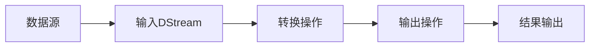

# Spark Streaming原理与代码实例讲解

## 1. 背景介绍
### 1.1 大数据流处理的重要性
在当今大数据时代,海量数据以流的形式不断产生和累积。企业需要对这些实时数据流进行及时处理和分析,以便快速洞察业务趋势,优化决策。传统的批处理模式已无法满足实时性要求。因此,大数据流处理技术应运而生,成为大数据领域的研究热点。
### 1.2 Spark Streaming 概述
Spark Streaming 是Apache Spark生态系统中的核心组件之一,是建立在Spark Core之上的实时流处理框架。它扩展了Spark的核心API,支持弹性,高吞吐,可容错的实时数据流处理。Spark Streaming能够从多种数据源(如Kafka, Flume, HDFS等)实时摄取数据,并以微批次(micro-batch)的方式进行处理,最终将结果推送到外部文件系统、数据库或应用程序中。
### 1.3 Spark Streaming 的优势
相比Storm、Flink等其他流处理框架,Spark Streaming具有如下优势:

1. 易用性:无缝集成Spark生态,API与Spark Core、SQL保持一致,学习曲线平缓。
2. 高吞吐:基于Spark引擎,可实现每秒数百MB的高吞吐处理能力。  
3. 容错性:借助RDD和DStream,具备高容错性和一致性保证。
4. 丰富的算子:提供filter, map, reduce, join等丰富的转换算子。
5. 灵活部署:可运行在Standalone、Mesos、YARN等多种资源管理框架之上。

## 2. 核心概念与联系
### 2.1 DStream
DStream(Discretized Stream)是Spark Streaming的核心抽象,代表一个持续不断的数据流。在内部实现上,DStream是一系列连续的RDD(弹性分布式数据集)。每个RDD包含一个时间间隔内的数据。对DStream的操作转换为对RDD的操作。

### 2.2 输入DStream与接收器
输入DStream代表从数据源获取的输入数据流。Spark Streaming提供两种内置的数据源:

1. 基本数据源:如文件系统、socket连接等。对应的输入DStream包括 FileInputDStream、SocketInputDStream等。
2. 高级数据源:如Kafka, Flume, Kinesis等。需要引入额外的依赖。

接收器(Receiver)是输入DStream的重要组成部分。系统会为每个输入DStream启动一个Receiver,用于持续接收外部数据源的数据流。

### 2.3 DStream转换操作
DStream支持两种类型的操作:转换(Transformations)和输出(Output)。转换操作用于在DStream上执行计算,生成一个新的DStream。常见的转换操作包括:

- map(func): 对源DStream的每个元素应用函数func,返回一个新的DStream
- flatMap(func): 与map类似,但每个输入项可以映射到0个或多个输出项
- filter(func): 返回一个新的DStream,仅包含源DStream中满足func的元素
- reduceByKey(func): 对于(K,V)键值对形式的DStream,返回一个新的(K,V)对的DStream,其中的每个值是针对每个key应用func聚合后的结果
- join(): 连接两个(K,V)对的DStream,返回(K,(V1,V2))形式的新DStream

### 2.4 DStream输出操作
输出操作用于将DStream的数据推送到外部系统,如文件系统、数据库等。常见输出操作包括:

- print(): 在运行流应用程序的驱动结点上打印DStream中每个批次的前10个元素
- saveAsTextFiles(prefix, [suffix]): 将DStream的内容以文本文件形式保存到文件系统中
- saveAsObjectFiles(prefix, [suffix]): 将DStream中的元素序列化为Java对象并保存到文件系统
- foreachRDD(func): 对DStream中的每个RDD应用函数func进行自定义输出操作

### 2.5 Spark Streaming 工作流程
下图展示了Spark Streaming的基本工作原理:



1. 数据源持续产生数据流
2. 输入DStream通过Receiver不断接收数据并封装成DStream
3. 对DStream应用一系列转换操作,生成新的DStream
4. 通过输出操作将结果数据输出到外部系统
5. 结果被持久化或供其他应用使用

## 3. 核心算法原理具体操作步骤
Spark Streaming的核心是将连续的数据流转换为一系列的小批量数据(RDD),然后使用Spark引擎进行微批处理。其基本步骤如下:

1. 将数据流划分为一系列的batch,每个batch对应一个RDD
2. Spark Streaming 的 Receiver 在每个 batch 的时间间隔内收集输入数据并存储为 RDD
3. 对每个batch的RDD应用转换操作,生成新的RDD
4. 最后将结果推送到外部系统

具体来说,Spark Streaming的DStream是由一系列连续的RDD组成的,每个RDD包含一个时间间隔的数据。Spark Streaming会不断地产生新的RDD,并对其应用转换操作。RDD的容错性依赖于检查点机制和RDD谱系(lineage),可以实现高效的状态恢复。

## 4. 数学模型和公式详细讲解举例说明
Spark Streaming中的一些核心算子基于数学模型和统计学原理。以reduceByKey为例,它常用于对DStream中的键值对进行聚合操作。设输入数据流中有N个键值对$(k_i, v_i), i=1,2,...,N$,按key进行聚合的数学表达式为:

$$result = \bigcup_{k} \{(k, v)|v = \sum_{i=1}^{N} v_i, if\ k_i = k\}$$

其中,$\bigcup$表示并集操作。该公式表示,对于每个key,将所有具有相同key的值进行累加求和,最终得到每个key对应的聚合结果。

举例说明,假设输入DStream包含以下键值对数据:

```
(A, 1) (B, 2) (C, 3) (A, 4) (B, 5) (A, 6)
```

应用reduceByKey后,得到的结果为:

```
(A, 11) (B, 7) (C, 3)
```

这里,key A对应的值为1+4+6=11,key B对应的值为2+5=7,key C对应的值保持不变。

## 5. 项目实践：代码实例和详细解释说明
下面通过一个简单的Spark Streaming代码实例,演示如何进行词频统计。该示例从socket接收文本数据,对每个批次的文本进行词频统计,并将结果打印输出。

```scala
import org.apache.spark._
import org.apache.spark.streaming._

object NetworkWordCount {
  def main(args: Array[String]) {
    // 创建SparkConf和StreamingContext
    val conf = new SparkConf().setMaster("local[2]").setAppName("NetworkWordCount")
    val ssc = new StreamingContext(conf, Seconds(1))
    
    // 创建输入DStream,监听本地9999端口
    val lines = ssc.socketTextStream("localhost", 9999)
    
    // 对DStream应用转换操作
    val words = lines.flatMap(_.split(" "))
    val pairs = words.map(word => (word, 1))
    val wordCounts = pairs.reduceByKey(_ + _)
    
    // 打印结果
    wordCounts.print()
    
    // 启动流计算
    ssc.start()
    ssc.awaitTermination()
  }
}
```

代码解释:

1. 首先创建SparkConf和StreamingContext,指定使用本地模式和批次间隔为1秒。
2. 通过socketTextStream创建输入DStream,监听本地9999端口的文本数据。 
3. 对DStream应用一系列转换操作:
   - 使用flatMap将每行文本拆分为单词
   - 使用map将每个单词映射为(word, 1)形式的键值对
   - 使用reduceByKey按单词进行聚合,对每个单词的计数值求和
4. 使用print()打印每个批次的词频统计结果
5. 启动流计算并等待终止

可以在本地启动一个socket服务,然后运行该程序。向socket发送文本数据,就能实时看到词频统计的结果输出。

## 6. 实际应用场景
Spark Streaming在实际场景中有广泛的应用,包括:

1. 实时日志分析:通过分析应用程序、服务器的日志流,实时检测异常情况,如错误率突增、响应时间增长等。
2. 实时推荐系统:根据用户的实时浏览、点击行为,动态调整推荐结果,提升用户体验。
3. 欺诈检测:对交易数据流进行实时分析,识别异常交易模式,防范金融欺诈。
4. 实时数据统计:对网站的点击流、搜索日志等进行实时统计分析,如热门搜索词、访问量统计等。
5. 物联网数据处理:对传感器、设备产生的数据流进行实时处理,用于设备监控、预测性维护等。

## 7. 工具和资源推荐
1. Spark官方文档:提供了Spark Streaming详细的原理介绍、API文档以及编程指南。
2. Spark Summit:Spark领域一年一度的技术盛会,分享众多Spark Streaming的实践案例和经验。
3. Github:有许多Spark Streaming的开源项目,如日志分析、推荐系统等,可以作为学习和参考的素材。
4. 《Spark Streaming源码解析》:详细剖析了Spark Streaming的源码实现,适合进阶学习。
5. 《Stream Processing with Apache Spark》:专门介绍Spark Streaming的英文书籍,全面系统。

## 8. 总结：未来发展趋势与挑战
Spark Streaming已成为流处理领域的主流框架之一。未来,Spark Streaming有望在以下方面取得进一步的发展:

1. 与结构化流(Structured Streaming)的融合:统一批流处理的API和引擎。
2. 支持更多的流数据源:与Kafka、Kinesis等系统的集成将更加完善。
3. 流批一体化:Spark Streaming与Spark Core、SQL的融合将更加紧密,简化开发。
4. 低延迟优化:Spark Streaming的处理延迟有望进一步降低,满足更苛刻的实时性需求。

同时,Spark Streaming也面临一些挑战:

1. 吞吐量瓶颈:如何进一步提升高吞吐场景下的性能。
2. 反压机制:如何更好地处理上下游节点速率不匹配的情况。
3. 高可用性:如何在集群环境中保证7x24小时稳定运行。

## 9. 附录：常见问题与解答
1. Spark Streaming与Storm、Flink的区别是什么?

Spark Streaming采用微批处理模型,而Storm和Flink采用纯流模型。Spark Streaming基于Spark,学习成本低,而Storm和Flink在低延迟和一些复杂流场景上有优势。

2. Spark Streaming的数据来源有哪些?

Spark Streaming支持多种数据源,包括Kafka、Flume、Kinesis、TCP Socket、HDFS等。也可以自定义数据源。

3. Spark Streaming如何保证数据处理的exactly-once语义?

Spark Streaming通过checkpoint机制,可以保证数据处理的exactly-once语义。即数据要么被处理且只处理一次,要么完全不被处理。

4. Spark Streaming的延迟一般是多少?

Spark Streaming的延迟取决于批次的大小。一般设置为0.5~5秒,在100ms左右。如果对延迟要求更低,可以考虑Storm或Flink。

5. Spark Streaming适合处理海量数据吗?

Spark Streaming采用微批处理模型,天生适合处理海量数据。Spark可以利用内存进行高效的批量处理,单集群每秒可以处理数百兆的数据量。

作者：禅与计算机程序设计艺术 / Zen and the Art of Computer Programming