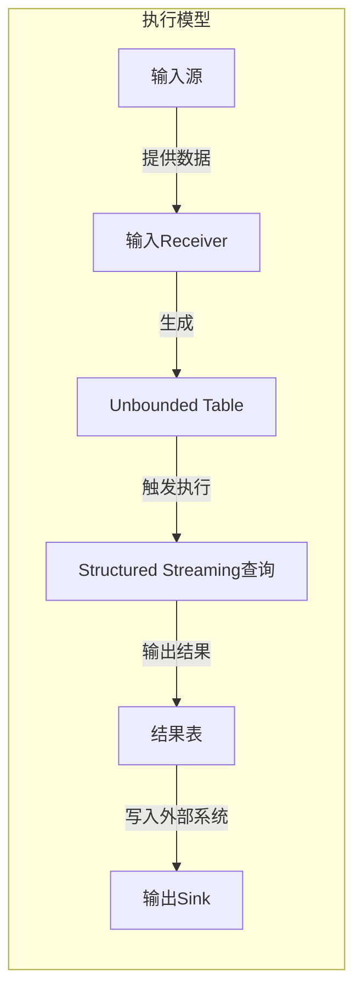

# Structured Streaming原理与代码实例讲解

## 1.背景介绍

在当今数据密集型应用程序的时代,实时数据处理变得越来越重要。Apache Spark作为一个统一的大数据处理引擎,提供了Structured Streaming模块,用于构建可扩展、高吞吐量、容错的端到端流数据处理管道。Structured Streaming基于Spark SQL引擎,将流数据视为一种不断追加的表,使用类似批处理的方式进行流处理。

### 1.1 流处理的挑战

传统的流处理系统面临以下几个主要挑战:

- **数据丢失和重复处理**:由于流式系统的无状态特性,在发生故障时可能会导致数据丢失或重复处理。
- **数据一致性**:在分布式环境下,需要确保多个节点之间的数据处理结果保持一致。
- **延迟**:实时流处理要求低延迟,但大多数系统难以在保证一致性的同时实现低延迟。
- **代码复杂性**:开发人员需要手动处理流数据的各种边缘情况,如数据重排序、延迟等,导致代码复杂。

### 1.2 Structured Streaming的优势

Structured Streaming旨在解决上述挑战,它提供了以下关键优势:

- **端到端的容错**:通过Write Ahead Log(预写日志)机制,能够在发生故障时自动恢复,避免数据丢失或重复处理。
- **一次性一致性语义**:确保记录被精确处理一次,即使发生故障也不会有数据丢失或重复。
- **统一的批流处理模型**:批处理和流处理使用相同的API,降低了开发人员的学习成本。

## 2.核心概念与联系

### 2.1 流数据作为表

Structured Streaming将流数据视为一种不断追加的表。每个流数据源映射到一个输入表,而流数据处理的结果则映射到一个结果表。

```
输入表 ====> 查询 ====> 结果表
```

### 2.2 执行模型

Structured Streaming的执行模型由以下几个核心组件组成:



1. **输入源(Input Source)**:如Kafka、文件系统等,用于提供连续的数据流。
2. **输入Receiver(Input Receiver)**:从输入源消费数据,并生成Unbounded Table。
3. **Unbounded Table**:一种逻辑概念,表示连续被追加的表。
4. **Structured Streaming查询(Streaming Query)**:将Unbounded Table作为输入,并执行增量查询以生成结果表。
5. **结果表(Result Table)**:查询的输出,是一个Unbounded Table。
6. **输出Sink(Output Sink)**:将结果表的数据写入外部系统,如文件系统、Kafka等。

### 2.3 流处理与批处理的关系

Structured Streaming采用微批处理模型,将流数据切分为一系列小批次进行处理。每个批次内部使用Spark的批处理引擎,批次之间通过状态管理实现有状态计算。

这种设计使得流处理和批处理可以使用相同的执行引擎和API,从而实现了统一的批流处理模型。

## 3.核心算法原理具体操作步骤 

### 3.1 输入数据接收

Structured Streaming支持从各种源接收数据,包括Apache Kafka、文件系统、Socket连接等。接收数据的具体步骤如下:

1. **创建输入源**:根据数据源类型创建相应的输入源,如KafkaSource、FileSource等。
2. **创建输入Receiver**:输入源创建对应的输入Receiver,用于从源头消费数据。
3. **生成Unbounded Table**:输入Receiver将接收到的数据封装为Unbounded Table。

### 3.2 增量查询执行

Structured Streaming通过增量执行查询来处理流数据:

1. **触发执行**:根据设置的触发间隔(如1秒),Structured Streaming会定期触发查询执行。
2. **获取增量数据**:查询从Unbounded Table中获取自上次触发以来新追加的数据。
3. **执行增量查询**:使用Spark SQL引擎执行增量查询,生成新的结果。
4. **更新结果表**:将新的结果数据追加到结果表中。

通过这种增量式执行,Structured Streaming可以高效地处理持续到达的数据,并保证端到端的一次性语义。

### 3.3 容错与状态管理

Structured Streaming通过预写日志(Write Ahead Log)机制实现容错和状态管理:

1. **预写日志**:在处理每个输入数据时,先将数据和计算状态信息写入预写日志。
2. **更新状态**:只有在成功写入预写日志后,才会更新内部状态。
3. **故障恢复**:发生故障时,可以从预写日志中重构输入数据和状态,继续执行。

这种机制确保了精确一次的处理语义,即使在发生故障的情况下也不会有数据丢失或重复处理。

### 3.4 结果输出

Structured Streaming支持将处理结果输出到多种系统,如文件系统、Kafka等:

1. **创建输出Sink**:根据目标系统类型创建相应的输出Sink,如FileStreamSink、KafkaSink等。
2. **写入结果数据**:将结果表中的新数据批量写入输出Sink。
3. **提交输出**:输出Sink将数据提交到目标系统。

输出Sink可以根据需要设置各种写出模式,如完整模式(覆盖写出)、追加模式等。

## 4.数学模型和公式详细讲解举例说明

在Structured Streaming中,输入数据流可以被视为一个无限追加的表,表示为$\text{Input Table} = \{I_1, I_2, \ldots, I_n, \ldots\}$,其中$I_n$是第n个追加的数据批次。

每次触发执行时,查询会从$\text{Input Table}$中获取自上次触发后新追加的数据$\Delta I_n$,并执行增量查询$Q(\Delta I_n)$,生成新的结果数据$\Delta R_n$。

$$\Delta R_n = Q(\Delta I_n)$$

结果表$\text{Result Table}$是所有增量结果的并集:

$$\text{Result Table} = \bigcup\limits_{n=1}^{\infty} \Delta R_n$$

在执行增量查询时,Structured Streaming采用了一种称为"有状态流"(Stateful Streaming)的模型。对于需要跨批次维护状态的操作(如聚合、Join等),Structured Streaming会为每个键(Key)维护一个状态,并在每次触发时根据新数据更新相应的状态。

设$s_n(k)$表示键$k$在第$n$次触发时的状态,则有:

$$s_n(k) = f(s_{n-1}(k), \Delta I_n(k))$$

其中$f$是根据具体的操作(如聚合、Join等)定义的状态更新函数。

通过这种状态管理机制,Structured Streaming可以高效地执行需要维护状态的操作,并保证端到端的一次性语义。

## 5.项目实践:代码实例和详细解释说明

以下是一个使用Structured Streaming从Kafka主题读取数据、执行WordCount统计并将结果写回Kafka的完整示例:

### 5.1 导入依赖

```scala
import org.apache.spark.sql.functions._
import org.apache.spark.sql.streaming.Trigger
import org.apache.spark.sql.types._
```

### 5.2 创建SparkSession

```scala
val spark = SparkSession
  .builder()
  .appName("StructuredStreamingWordCount")
  .getOrCreate()

import spark.implicits._
```

### 5.3 定义输入数据Schema

```scala
val inputSchema = StructType(
  StructField("value", StringType, true) :: Nil
)
```

### 5.4 创建输入流

```scala
val inputStream = spark
  .readStream
  .format("kafka")
  .option("kafka.bootstrap.servers", "localhost:9092")
  .option("subscribe", "inputTopic")
  .load()
  .select(from_json(col("value").cast("string"), inputSchema).alias("value"))
  .select("value.*")
```

### 5.5 执行WordCount查询

```scala
val wordCounts = inputStream
  .select(explode(split(col("value"), " ")).alias("word"))
  .groupBy("word")
  .count()
```

### 5.6 启动查询并输出结果

```scala
val query = wordCounts
  .writeStream
  .format("kafka")
  .option("kafka.bootstrap.servers", "localhost:9092")
  .option("topic", "outputTopic")
  .outputMode("complete")
  .trigger(Trigger.ProcessingTime("10 seconds"))
  .start()

query.awaitTermination()
```

以上代码执行以下步骤:

1. 从Kafka主题"inputTopic"创建输入流。
2. 对输入流执行WordCount查询,统计每个单词的出现次数。
3. 将WordCount结果以完整模式(overwrite)每10秒写入Kafka主题"outputTopic"。

### 5.7 代码解释

- `readStream`和`writeStream`分别用于创建输入流和输出流。
- `format("kafka")`指定使用Kafka作为数据源和接收器。
- `option("subscribe", "inputTopic")`订阅Kafka主题"inputTopic"作为输入源。
- `from_json`用于从JSON格式解析输入数据。
- `explode`和`split`用于将每行数据拆分为单词。
- `groupBy`和`count`执行WordCount聚合操作。
- `outputMode("complete")`指定每次触发时都输出完整的更新后的结果集。
- `trigger(Trigger.ProcessingTime("10 seconds"))`设置每10秒触发一次增量执行。

通过这个示例,你可以看到如何使用Structured Streaming从Kafka读取数据流、执行流式计算并将结果输出到Kafka。你可以根据需要修改数据源、计算逻辑和输出目标来构建自己的流式应用程序。

## 6.实际应用场景

Structured Streaming可以应用于各种实时数据处理场景,包括但不限于:

1. **物联网(IoT)数据处理**: 从大量的传感器设备中实时收集和处理数据,用于监控、预测和控制。
2. **实时日志分析**: 从Web服务器、应用程序等收集日志数据,进行实时分析以发现异常、安全威胁等。
3. **金融交易监控**: 对金融交易数据进行实时分析,检测欺诈行为、异常交易等。
4. **实时推荐系统**: 根据用户的实时行为数据,提供个性化的推荐内容。
5. **实时报表和仪表盘**: 从各种数据源收集实时数据,生成实时报表和可视化仪表盘。
6. **流式机器学习**: 使用Structured Streaming进行实时特征工程,并与Spark MLlib集成进行流式机器学习。

总的来说,任何需要对大量实时数据进行低延迟处理的场景,都可以考虑使用Structured Streaming构建高性能、容错的流式数据处理管道。

## 7.工具和资源推荐

以下是一些有用的工具和资源,可以帮助你更好地学习和使用Structured Streaming:

1. **Apache Spark官方文档**: https://spark.apache.org/docs/latest/structured-streaming-programming-guide.html
2. **Structured Streaming编程指南**: https://jaceklaskowski.gitbooks.io/mastering-apache-spark/content/spark-structured-streaming.html
3. **Kafka集成示例**: https://github.com/apache/spark/tree/master/examples/src/main/scala/org/apache/spark/examples/streaming/kafka
4. **StructuredStreaming源码**: https://github.com/apache/spark/tree/master/sql/core/src/main/scala/org/apache/spark/sql/streaming
5. **Spark Structured Streaming在线训练课程**: https://www.pluralsight.com/courses/spark-structured-streaming
6. **Spark Streaming与Structured Streaming对比**: https://databricks.com/blog/2016/07/28/structured-streaming-in-apache-spark.html

## 8.总结:未来发展趋势与挑战

Structured Streaming作为Apache Spark的一个重要模块,在实时数据处理领域发挥着越来越重要的作用。未来,Structured Streaming可能会面临以下一些发展趋势和挑战:

1. **低延迟要求**: 随着实时数据处理场景的不断增加,对于端到端延迟的要求会越来越高。Structured Streaming需要进一步优化延迟,以满足更多低延迟场景的需求。

2. **无服务器