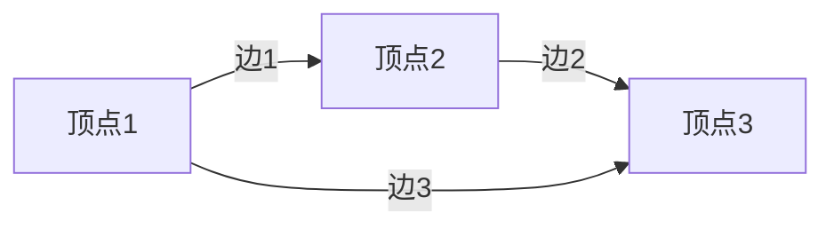
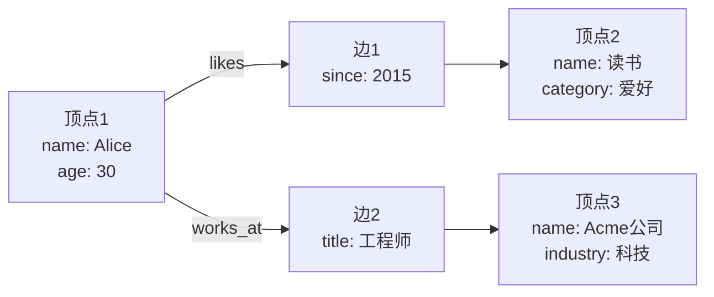
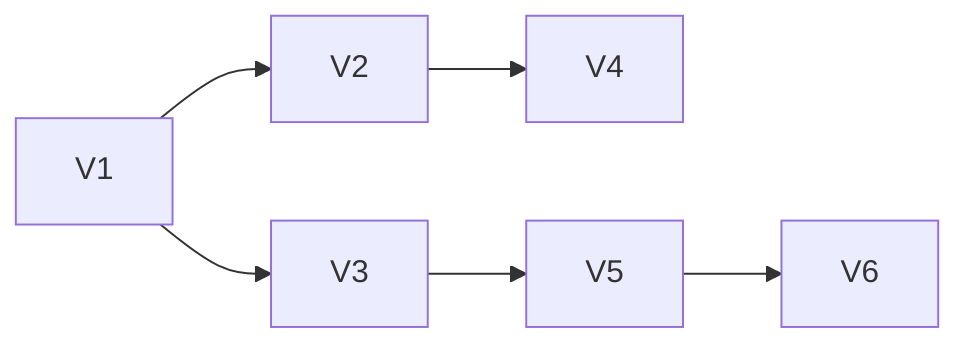

# TinkerPop原理与代码实例讲解

## 1.背景介绍

### 1.1 图数据库的兴起

随着大数据时代的到来,传统的关系型数据库在处理复杂关系和海量数据方面遇到了巨大挑战。图数据库(Graph Database)作为一种新型的NoSQL数据库,被广泛应用于社交网络、推荐系统、知识图谱等领域。它以图(Graph)的形式高效存储和查询关系数据,非常适合描述多对多的复杂关系。

### 1.2 TinkerPop介绍  

TinkerPop是一个开源的图计算框架,提供了一套标准的图查询语言Gremlin,并支持多种图数据库和图计算引擎。它使得开发者能够编写可移植的应用程序,而不用关心底层的图数据库实现细节。Apache TinkerPop已经成为图数据库领域的事实标准。

## 2.核心概念与联系

### 2.1 图的数据结构

图是由顶点(Vertex)和边(Edge)组成的数据结构。顶点用于存储实体数据,边表示实体之间的关系。每个顶点和边都可以有任意数量的属性(Property)。



### 2.2 属性图模型

TinkerPop采用属性图(Property Graph)模型,即顶点和边都可以有任意数量的键值对属性。这种灵活的模型非常适合表示现实世界中的复杂关系。



### 2.3 Gremlin查询语言

Gremlin是TinkerPop中的图遍历查询语言,灵感来自于函数式编程。它提供了一组流畅(Fluent)的API,支持链式调用方式构建复杂的查询逻辑。Gremlin查询语句就像一个小行走者(Gremlin)在图上遍历一样。

## 3.核心算法原理具体操作步骤  

### 3.1 图遍历算法

图遍历是图计算中最基本也是最常用的算法,用于查找符合条件的顶点和边。TinkerPop中的Gremlin语言提供了多种遍历策略:

1. **BFS(Breadth-First Search)**: 广度优先遍历,从起点开始,先访问所有邻居节点,再访问邻居的邻居。

2. **DFS(Depth-First Search)**: 深度优先遍历,从起点开始,沿着一条路径一直遍历,直到没有下一个节点,再返回上一层。



上图中,从V1开始BFS遍历顺序为: V1 -> V2 -> V3 -> V4 -> V5 -> V6

从V1开始DFS遍历顺序为: V1 -> V2 -> V4 -> V3 -> V5 -> V6

### 3.2 Gremlin语法

Gremlin语法灵活且功能强大,支持链式调用的流畅API。下面是一些常用的步骤(Step):

- `g.V()`: 获取所有顶点
- `g.E()`: 获取所有边
- `has('name', 'Alice')`: 过滤出name属性为Alice的顶点/边
- `out('likes')`: 沿着likes边遍历到目标顶点
- `inE()`: 获取指向当前顶点的所有入边
- `values('age')`: 获取当前顶点的age属性值
- `dedup()`: 去重
- `order().by('age')`: 按age属性值排序

### 3.3 实例:查找Alice的爱好

```groovy
// 从Alice顶点开始
g.V().has('name','Alice')
  // 沿着likes边遍历到目标顶点
  .out('likes')
  // 获取目标顶点的name和category属性
  .values('name','category')
```

上面的Gremlin语句从Alice顶点出发,沿着likes边遍历到目标顶点,最后获取目标顶点的name和category属性值。

## 4.数学模型和公式详细讲解举例说明

### 4.1 PageRank算法

PageRank是一种用于计算网页重要性的著名算法,它模拟了随机游走过程在网页图上的分布。对于一个网页,它的PageRank值取决于指向它的其他页面的PageRank值之和。

PageRank算法的数学模型如下:

$$
PR(p_i) = \frac{1-d}{N} + d\sum_{p_j\in M(p_i)}\frac{PR(p_j)}{L(p_j)}
$$

其中:
- $PR(p_i)$表示页面$p_i$的PageRank值
- $N$是网页总数
- $M(p_i)$是指向$p_i$的所有页面集合
- $L(p_j)$是页面$p_j$的出度(指向其他页面的链接数)
- $d$是一个阻尼系数,通常取值0.85

PageRank算法可以用迭代的方式计算,直到收敛或达到最大迭代次数。在TinkerPop中,可以使用SparkGraphComputer等图计算引擎高效实现PageRank。

### 4.2 最短路径算法

在图数据库中,常常需要计算两个顶点之间的最短路径。最短路径问题可以使用经典的Dijkstra算法或A*算法等来解决。

以Dijkstra算法为例,其基本思想是从源顶点开始,逐步遍历其他顶点,并更新从源顶点到其他顶点的最短距离。算法的时间复杂度为$O((|V|+|E|)\log|V|)$,其中$|V|$和$|E|$分别表示顶点数和边数。

在TinkerPop中,可以使用ShortestPathVertexProgram等内置程序计算最短路径:

```groovy
// 从顶点1到顶点4的最短路径
g.V(1).shortestPath().
  with(ShortestPathStrategy.Target, __.has('name','顶点4')).
    iterate()
```

## 5.项目实践:代码实例和详细解释说明

### 5.1 环境准备

本示例使用Apache TinkerPop 3.4.9版本,并采用Gremlin Server + Gremlin Console的架构。

1. 下载并安装[Apache TinkerPop](https://tinkerpop.apache.org/download.html)
2. 启动Gremlin Server: `./bin/gremlin-server.sh`
3. 启动Gremlin Console: `./bin/gremlin.sh`

在Console中,先连接到Gremlin Server:

```groovy
:remote connect tinkerpop.server conf/remote.yaml session
==>Configured localhost/127.0.0.1:8182
```

### 5.2 创建图实例

我们先创建一个简单的社交网络图,包含人物、电影和书籍等实体及它们之间的关系。

```groovy
// 创建图实例
graph = TinkerGraph.open()

// 创建顶点
alice = graph.addVertex(T.label, 'person', 'name', 'Alice', 'age', 30)
bob = graph.addVertex(T.label, 'person', 'name', 'Bob', 'age', 35)
inception = graph.addVertex(T.label, 'movie', 'name', 'Inception', 'year', 2010)
theDaVinciCode = graph.addVertex(T.label, 'book', 'name', 'The Da Vinci Code', 'author', 'Dan Brown')

// 创建边
graph.addEdge('likes', alice, inception)
graph.addEdge('likes', bob, inception)
graph.addEdge('likes', alice, theDaVinciCode)
```

### 5.3 基本查询

```groovy
// 获取所有人物
g.V().hasLabel('person')

// 获取Alice喜欢的所有实体
g.V().has('name','Alice').outE('likes').inV()

// 获取Bob喜欢的所有电影
g.V().has('name','Bob').
  outE('likes').
  inV().hasLabel('movie')
```

### 5.4 高级查询

```groovy
// 查找Alice和Bob共同喜欢的实体
g.V().has('name','Alice').as('a').
  outE('likes').inV().as('x').
  select('x').
  V().has('name','Bob').
  outE('likes').inV().
  where(within('x'))
  
// 计算Alice和Bob之间的最短路径
g.V().has('name','Alice').as('a').
  V().has('name','Bob').as('b').
  select('a','b').
  shortestPath().
  with(ShortestPathStrategy.Target).
    by(bothE().count()).
    iterate()
```

上面的查询语句展示了Gremlin语言的强大功能,如子查询、路径查找等。开发者可以根据业务需求,灵活构建复杂的图查询逻辑。

## 6.实际应用场景

### 6.1 社交网络分析

社交网络是图数据库最典型的应用场景。通过构建用户-用户的关系图,我们可以分析用户之间的亲密度、影响力等社交属性,为社交推荐、广告投放等提供数据支持。

例如,下面的查询可以找到与Alice最亲密的朋友:

```groovy
g.V().has('name','Alice').
  outE('friends').inV().
  order().by('friendSince',decr).
  limit(10)
```

### 6.2 知识图谱

知识图谱是以图的形式存储实体及其关系的知识库。通过构建知识图谱,我们可以实现智能问答、关系推理等功能。

例如,下面的查询可以找到"丹布朗"写的所有书籍:

```groovy
g.V().has('author','Dan Brown').
  inE('writtenBy').
  outV().values('name')
```

### 6.3 推荐系统

图数据库非常适合构建推荐系统。通过分析用户-商品的关系图,我们可以发现用户的兴趣爱好,从而为其推荐感兴趣的商品。

例如,下面的查询可以为Alice推荐她可能喜欢的电影:

```groovy
g.V().has('name','Alice').as('a').
  outE('likes').inV().as('x').
  select('x').
  until(hasLabel('movie')).
  repeat(outE('likes').inV()).
  emit().
  where(neq('a')).
  dedup()
```

## 7.工具和资源推荐

### 7.1 图可视化工具

- [GraphExplorer](https://tinkerpop.apache.org/docs/current/tutorials/gremlin-server/): TinkerPop内置的Web图可视化工具
- [Graphistry](https://www.graphistry.com/): 功能强大的商业图可视化工具
- [Cytoscape](https://cytoscape.org/): 开源的生物信息学图可视化工具

### 7.2 图计算引擎

- [Apache Spark GraphX](https://spark.apache.org/graphx/): 基于Spark的分布式图计算引擎
- [Apache Giraph](https://giraph.apache.org/): 基于Hadoop的大规模图处理系统
- [GraphBLAS](https://graphblas.org/): 基于线性代数的图计算标准

### 7.3 图数据库

- [Neo4j](https://neo4j.com/): 商业图数据库,性能优秀
- [JanusGraph](https://janusgraph.org/): 开源分布式图数据库
- [Amazon Neptune](https://aws.amazon.com/neptune/): AWS云图数据库服务

## 8.总结:未来发展趋势与挑战

### 8.1 图计算的广泛应用

随着图数据库技术的不断发展,图计算将会在更多领域得到应用,如金融反欺诈、交通路线规划、网络安全等。图数据库的优势在于高效存储和查询关系数据,能够帮助我们更好地理解和利用复杂的关系数据。

### 8.2 图与AI的结合

人工智能技术如知识图谱、关系推理等与图数据库有着天然的联系。未来,图数据库将会成为支撑人工智能应用的重要基础设施,两者的结合将产生更多创新应用。

### 8.3 图计算的挑战

尽管图数据库技术日趋成熟,但仍面临一些挑战:

1. **性能瓶颈**: 随着数据规模的增长,图计算的性能将受到挑战。需要更高效的分布式图计算引擎。

2. **标准缺失**: