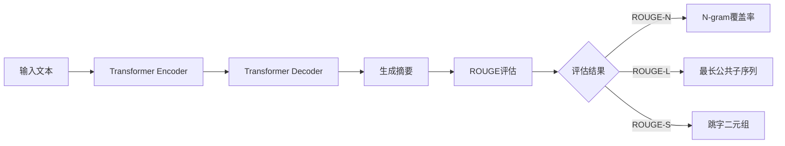

# Transformer大模型实战 理解ROUGE 评估指标

## 1. 背景介绍
### 1.1 Transformer模型概述
#### 1.1.1 Transformer的提出与发展
#### 1.1.2 Transformer的核心思想
#### 1.1.3 Transformer的优势与局限

### 1.2 评估指标的重要性
#### 1.2.1 评估指标在NLP任务中的作用
#### 1.2.2 常见的NLP评估指标
#### 1.2.3 ROUGE指标的地位与影响

## 2. 核心概念与联系
### 2.1 Transformer模型
#### 2.1.1 Encoder-Decoder结构
#### 2.1.2 Self-Attention机制
#### 2.1.3 位置编码
#### 2.1.4 残差连接与Layer Normalization

### 2.2 ROUGE评估指标
#### 2.2.1 ROUGE的定义与计算方法
#### 2.2.2 ROUGE-N
#### 2.2.3 ROUGE-L 
#### 2.2.4 ROUGE-S
#### 2.2.5 ROUGE的优缺点

### 2.3 Transformer与ROUGE的关系
#### 2.3.1 Transformer在文本生成任务中的应用
#### 2.3.2 ROUGE在评估Transformer生成结果中的作用
#### 2.3.3 Transformer与ROUGE的互补性

## 3. 核心算法原理具体操作步骤
### 3.1 Transformer模型训练
#### 3.1.1 数据准备与预处理
#### 3.1.2 模型构建
#### 3.1.3 损失函数与优化器选择
#### 3.1.4 训练过程与超参数调优

### 3.2 ROUGE评估过程
#### 3.2.1 参考摘要与候选摘要的准备
#### 3.2.2 ROUGE-N的计算
#### 3.2.3 ROUGE-L的计算
#### 3.2.4 ROUGE-S的计算
#### 3.2.5 ROUGE综合得分的计算

## 4. 数学模型和公式详细讲解举例说明
### 4.1 Transformer的数学表示
#### 4.1.1 Self-Attention的数学公式
#### 4.1.2 位置编码的数学表示
#### 4.1.3 残差连接与Layer Normalization的数学公式

### 4.2 ROUGE指标的数学公式
#### 4.2.1 ROUGE-N的数学公式
$$
ROUGE-N = \frac{\sum_{S\in\{RefSummaries\}} \sum_{gram_n \in S} Count_{match}(gram_n)}{\sum_{S\in\{RefSummaries\}} \sum_{gram_n \in S} Count(gram_n)}
$$
其中，$gram_n$ 表示长度为 $n$ 的n-gram，$Count_{match}(gram_n)$ 表示候选摘要中与参考摘要匹配的 $gram_n$ 的数量，$Count(gram_n)$ 表示参考摘要中 $gram_n$ 的数量。

#### 4.2.2 ROUGE-L的数学公式
$$
ROUGE-L = F_{lcs} = \frac{(1+\beta^2)R_{lcs}P_{lcs}}{R_{lcs}+\beta^2P_{lcs}}
$$
其中，$R_{lcs}$ 和 $P_{lcs}$ 分别表示最长公共子序列(Longest Common Subsequence, LCS)的召回率和准确率，$\beta$ 是一个用于调节召回率和准确率之间平衡的参数。

#### 4.2.3 ROUGE-S的数学公式
$$
ROUGE-S = F_{skip2} = \frac{(1+\beta^2)R_{skip2}P_{skip2}}{R_{skip2}+\beta^2P_{skip2}}
$$
其中，$R_{skip2}$ 和 $P_{skip2}$ 分别表示跳字二元组(Skip-bigram)的召回率和准确率，$\beta$ 是一个用于调节召回率和准确率之间平衡的参数。

### 4.3 实例讲解
#### 4.3.1 Transformer中Self-Attention计算过程
#### 4.3.2 ROUGE-N、ROUGE-L和ROUGE-S的计算示例

## 5. 项目实践：代码实例和详细解释说明
### 5.1 使用Transformer进行文本摘要生成
#### 5.1.1 数据集准备
#### 5.1.2 Transformer模型定义
#### 5.1.3 模型训练
#### 5.1.4 模型推理与生成

### 5.2 使用ROUGE对生成结果进行评估
#### 5.2.1 安装与导入ROUGE评估包
#### 5.2.2 准备参考摘要与候选摘要
#### 5.2.3 计算ROUGE-N、ROUGE-L和ROUGE-S得分
#### 5.2.4 结果分析与讨论

## 6. 实际应用场景
### 6.1 新闻文章自动摘要
### 6.2 论文摘要生成
### 6.3 会议记录摘要
### 6.4 客户评论摘要
### 6.5 法律文书摘要

## 7. 工具和资源推荐
### 7.1 Transformer模型实现工具
#### 7.1.1 Hugging Face Transformers库
#### 7.1.2 OpenNMT
#### 7.1.3 Fairseq

### 7.2 ROUGE评估工具
#### 7.2.1 Python ROUGE包
#### 7.2.2 Java ROUGE包
#### 7.2.3 Perl ROUGE脚本

### 7.3 数据集资源
#### 7.3.1 CNN/Daily Mail数据集
#### 7.3.2 Gigaword数据集
#### 7.3.3 LCSTS数据集
#### 7.3.4 NLPCC数据集

## 8. 总结：未来发展趋势与挑战
### 8.1 Transformer模型的发展方向
#### 8.1.1 模型结构的改进
#### 8.1.2 预训练方法的探索
#### 8.1.3 知识融合与注入

### 8.2 ROUGE指标的局限性与改进
#### 8.2.1 ROUGE指标的局限性
#### 8.2.2 语义相似度的考量
#### 8.2.3 人工评估与自动评估的结合

### 8.3 文本摘要任务的挑战
#### 8.3.1 摘要的可读性与连贯性
#### 8.3.2 领域适应性
#### 8.3.3 摘要的多样性生成

## 9. 附录：常见问题与解答
### 9.1 Transformer模型的训练技巧
### 9.2 ROUGE指标的适用范围
### 9.3 如何选择合适的文本摘要模型
### 9.4 文本摘要评估的其他指标
### 9.5 Transformer在其他NLP任务中的应用

Transformer模型和ROUGE评估指标是当前文本摘要任务中的重要工具。Transformer凭借其并行计算能力和自注意力机制，在生成高质量摘要方面表现出色。而ROUGE指标则提供了一种自动评估生成摘要质量的方法，通过比较生成摘要与参考摘要之间的n-gram覆盖率、最长公共子序列和跳字二元组等指标，来衡量生成摘要的相关性和流畅性。

尽管Transformer和ROUGE在文本摘要任务中取得了显著成果，但它们仍然存在一些局限性和挑战。例如，Transformer生成的摘要有时可能缺乏连贯性和可读性，而ROUGE指标也难以捕捉摘要的语义相似度和多样性。未来的研究方向可能包括Transformer模型结构的改进、知识融合与注入、ROUGE指标的改进以及人工评估与自动评估的结合等。

总之，Transformer和ROUGE为文本摘要任务提供了强大的工具和评估手段，推动了该领域的发展。深入理解它们的原理、应用场景和局限性，对于进一步提升文本摘要的性能具有重要意义。

作者：禅与计算机程序设计艺术 / Zen and the Art of Computer Programming