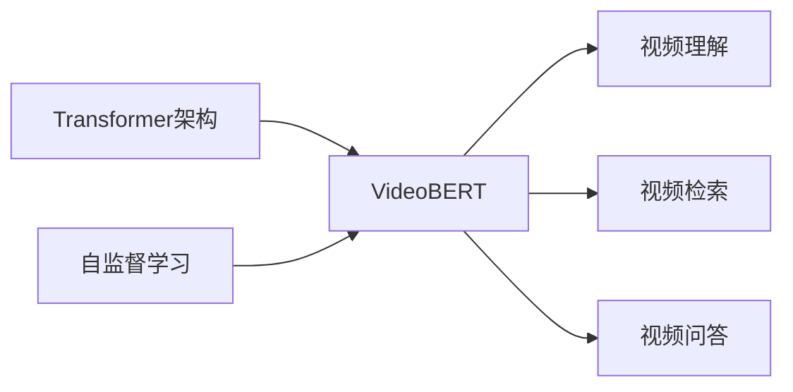

# Transformer大模型实战 预训练VideoBERT模型

## 1. 背景介绍

### 1.1 视频理解的重要性
在当今信息爆炸的时代,视频已成为人们获取信息和娱乐的主要媒介之一。随着短视频平台的兴起,视频内容呈现出爆发式增长。如何高效、准确地理解和分析视频内容,成为人工智能领域的一大挑战。

### 1.2 Transformer在NLP领域的成功
Transformer模型自2017年被提出以来,在自然语言处理(NLP)领域取得了巨大成功。以BERT(Bidirectional Encoder Representations from Transformers)为代表的预训练语言模型,在多项NLP任务上取得了SOTA(State-of-the-Art)的表现。这启发研究者探索将Transformer架构应用到其他领域。

### 1.3 VideoBERT的提出
受BERT启发,研究者提出了VideoBERT模型,旨在利用Transformer架构和自监督学习方法,从海量无标注视频数据中学习通用的视频表示。VideoBERT有望在视频理解、视频检索、视频问答等任务上取得突破性进展。

## 2. 核心概念与联系

### 2.1 Transformer架构
- Transformer是一种基于自注意力机制(Self-Attention)的神经网络架构。
- 抛弃了传统的RNN/CNN结构,完全依赖于注意力机制来建模序列数据。
- 由编码器(Encoder)和解码器(Decoder)两部分组成,可以并行化计算,训练效率高。

### 2.2 自监督学习
- 自监督学习是一种无需人工标注数据的机器学习范式。
- 通过设计巧妙的预测任务,让模型从大规模无标注数据中自主学习有用的表示。
- 常见的自监督任务包括:掩码语言建模(Masked Language Modeling)、次句预测(Next Sentence Prediction)等。

### 2.3 VideoBERT模型
- VideoBERT是一个基于Transformer的视频预训练模型。
- 采用自监督学习方法,在大规模无标注视频数据上进行预训练。
- 通过掩码视频建模(Masked Video Modeling)和视频-文本对齐(Video-Text Alignment)两个预训练任务,学习视频的通用表示。

### 2.4 核心概念关系图


## 3. 核心算法原理具体操作步骤

### 3.1 VideoBERT模型架构
VideoBERT采用了类似BERT的Transformer编码器架构:
1. 输入表示:将视频帧和对应的文本描述拼接为一个序列,添加位置嵌入和模态类型嵌入。
2. Transformer编码器:多层Transformer编码器对输入序列进行特征提取和融合。
3. 预训练任务:在输出端添加掩码视频建模和视频-文本对齐的预测头。

### 3.2 预训练任务
#### 3.2.1 掩码视频建模(Masked Video Modeling)
- 随机掩盖一定比例的视频帧,让模型预测被掩盖的帧的视觉特征。
- 通过重建被掩盖的视频帧,促使模型学习视频帧之间的时序依赖和语义信息。

#### 3.2.2 视频-文本对齐(Video-Text Alignment)  
- 随机替换一定比例的文本描述为错误描述,让模型判断文本是否与视频匹配。
- 通过对齐视频和文本信息,促使模型学习视频与文本的跨模态语义对应关系。

### 3.3 微调与下游任务
1. 在特定任务的标注数据上,使用预训练的VideoBERT参数初始化模型。
2. 根据任务的输入输出,在VideoBERT上添加任务特定的输出层。
3. 使用标注数据对整个模型进行端到端的微调,优化任务目标。
4. 在测试集上评估模型性能,不断调整超参数,直至达到最优效果。

## 4. 数学模型和公式详细讲解举例说明

### 4.1 自注意力机制(Self-Attention)
自注意力机制是Transformer的核心组件,用于计算序列中元素之间的依赖关系。对于输入序列 $\mathbf{X} \in \mathbb{R}^{n \times d}$,自注意力的计算过程如下:

1. 计算查询矩阵 $\mathbf{Q}$、键矩阵 $\mathbf{K}$、值矩阵 $\mathbf{V}$:
$$\mathbf{Q} = \mathbf{X}\mathbf{W}^Q, \mathbf{K} = \mathbf{X}\mathbf{W}^K, \mathbf{V} = \mathbf{X}\mathbf{W}^V$$

2. 计算注意力权重矩阵 $\mathbf{A}$:
$$\mathbf{A} = \text{softmax}(\frac{\mathbf{Q}\mathbf{K}^T}{\sqrt{d_k}})$$

3. 计算注意力输出 $\mathbf{Z}$:
$$\mathbf{Z} = \mathbf{A}\mathbf{V}$$

其中,$\mathbf{W}^Q, \mathbf{W}^K, \mathbf{W}^V \in \mathbb{R}^{d \times d_k}$是可学习的权重矩阵,$d_k$是缩放因子,通常取$\sqrt{d}$。

### 4.2 掩码视频建模损失
掩码视频建模任务的目标是最小化重建损失,即被掩盖的视频帧的预测特征与真实特征之间的距离。设$\mathbf{h}_i \in \mathbb{R}^d$为第$i$个被掩盖视频帧的预测特征,$\mathbf{v}_i \in \mathbb{R}^d$为其真实特征,损失函数定义为:

$$\mathcal{L}_{MVM} = \frac{1}{M}\sum_{i=1}^M ||\mathbf{h}_i - \mathbf{v}_i||^2$$

其中,$M$为被掩盖的视频帧数量。通过最小化该损失函数,模型学习预测被掩盖视频帧的视觉特征。

### 4.3 视频-文本对齐损失
视频-文本对齐任务的目标是最大化正确文本描述的概率,同时最小化错误文本描述的概率。设$y_i \in \{0, 1\}$为第$i$个文本描述的标签(0表示错误,1表示正确),$p_i$为模型预测的正确概率,损失函数定义为:

$$\mathcal{L}_{VTA} = -\frac{1}{N}\sum_{i=1}^N [y_i \log p_i + (1 - y_i) \log (1 - p_i)]$$

其中,$N$为文本描述的数量。通过最小化该交叉熵损失,模型学习判断视频与文本是否匹配。

## 5. 项目实践：代码实例和详细解释说明

下面以PyTorch为例,给出VideoBERT模型的核心代码实现:

```python
import torch
import torch.nn as nn

class VideoBERT(nn.Module):
    def __init__(self, video_dim, text_dim, hidden_dim, num_layers, num_heads, dropout):
        super().__init__()
        self.video_embedding = nn.Linear(video_dim, hidden_dim)
        self.text_embedding = nn.Linear(text_dim, hidden_dim)
        self.position_embedding = nn.Embedding(max_position, hidden_dim)
        self.modal_embedding = nn.Embedding(2, hidden_dim)
        
        encoder_layer = nn.TransformerEncoderLayer(hidden_dim, num_heads, dropout)
        self.transformer_encoder = nn.TransformerEncoder(encoder_layer, num_layers)
        
        self.video_head = nn.Linear(hidden_dim, video_dim)
        self.align_head = nn.Linear(hidden_dim, 2)
        
    def forward(self, video_features, text_features):
        # 输入编码
        video_embeds = self.video_embedding(video_features)
        text_embeds = self.text_embedding(text_features)
        
        batch_size, video_len, _ = video_embeds.size()
        batch_size, text_len, _ = text_embeds.size()
        
        position_ids = torch.arange(video_len + text_len).expand(batch_size, -1)
        position_embeds = self.position_embedding(position_ids)
        
        modal_ids = torch.cat([torch.zeros(video_len), torch.ones(text_len)]).long()
        modal_ids = modal_ids.expand(batch_size, -1)
        modal_embeds = self.modal_embedding(modal_ids)
        
        inputs_embeds = torch.cat([video_embeds, text_embeds], dim=1)
        inputs_embeds += position_embeds + modal_embeds
        
        # Transformer编码
        encoder_outputs = self.transformer_encoder(inputs_embeds)
        
        # 预训练任务
        video_outputs = self.video_head(encoder_outputs[:, :video_len])
        align_outputs = self.align_head(encoder_outputs[:, -1])
        
        return video_outputs, align_outputs
```

代码解释:
1. `VideoBERT`类继承了`nn.Module`,是一个PyTorch的神经网络模块。
2. 在`__init__`方法中定义了输入嵌入层、位置嵌入层、模态嵌入层、Transformer编码器层以及预训练任务的输出头。
3. 在`forward`方法中,首先对视频特征和文本特征进行嵌入,并添加位置嵌入和模态嵌入。
4. 将嵌入后的视频特征和文本特征拼接为一个序列,送入Transformer编码器进行特征提取和融合。
5. 从Transformer编码器的输出中,分别提取视频特征和文本特征,送入相应的输出头进行预训练任务的预测。
6. 返回掩码视频建模的重建特征和视频-文本对齐的对齐概率。

在实际使用时,还需要定义相应的数据加载器、优化器、学习率调度器等,并在大规模视频数据集上进行预训练。预训练完成后,可以在下游任务的标注数据上进行微调,完成特定的视频理解任务。

## 6. 实际应用场景

VideoBERT作为一个通用的视频预训练模型,可以应用于多种视频理解任务,包括但不限于:

### 6.1 视频分类
- 将VideoBERT微调用于视频分类任务,如视频情感分析、视频场景识别等。
- 在VideoBERT的输出端添加分类器,使用标注数据进行微调,可以显著提高分类精度。

### 6.2 视频检索
- 利用VideoBERT提取的视频特征,构建视频检索系统。
- 给定查询视频或文本,在VideoBERT特征空间中寻找最相似的视频,实现高效、准确的视频检索。

### 6.3 视频问答
- 将VideoBERT扩展为视频问答模型,回答关于视频内容的自然语言问题。
- 在VideoBERT上添加问答任务的输出层,使用视频问答数据集进行微调,可以显著提高视频问答的准确率。

### 6.4 视频摘要
- 利用VideoBERT学习的视频表示,自动生成视频的文本摘要。
- 在VideoBERT的基础上添加序列到序列的解码器,使用视频摘要数据集进行微调,可以生成高质量的视频摘要。

## 7. 工具和资源推荐

### 7.1 视频数据集
- [Kinetics](https://deepmind.com/research/open-source/kinetics):大规模视频动作识别数据集。
- [ActivityNet](http://activity-net.org/):人类活动识别和时序定位数据集。
- [YouTube-8M](https://research.google.com/youtube8m/):大规模多标签视频分类数据集。

### 7.2 代码实现
- [transformers](https://github.com/huggingface/transformers):🤗 Hugging Face 的Transformers库,提供了BERT等预训练模型的PyTorch和TensorFlow实现。
- [MMAction2](https://github.com/open-mmlab/mmaction2):OpenMMLab 的下一代视频理解工具箱,基于PyTorch,支持多种视频理解任务和模型。

### 7.3 教程和文章
- [Transformer模型详解](https://jalammar.github.io/illustrated-transformer/):图解Transformer模型的结构和原理。
- [VideoBERT论文解读](https://zhuanlan.zhihu.com/p/101553182):VideoBERT论文的详细解读和分析。
- [PyTorch官方教程](https://pytorch.org/tutorials/):PyTorch官方提供的教程,包括基础用法、模型定义、数据加载等。

##