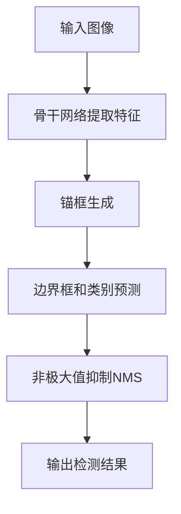

# YOLOv7原理与代码实例讲解

## 1.背景介绍

在计算机视觉领域,目标检测是一项非常重要和具有挑战性的任务。它旨在在给定的图像或视频中定位感兴趣的目标,并识别出它们的类别。随着深度学习技术的快速发展,基于卷积神经网络(CNN)的目标检测算法取得了巨大的进步,其中YOLO(You Only Look Once)系列算法因其高效和准确而备受关注。

YOLO是一种基于回归的单阶段目标检测算法,与传统的基于分类的两阶段目标检测算法(如R-CNN系列)相比,它直接从输入图像预测边界框和类别,避免了候选区域的提取和分类两个独立的步骤,大大提高了检测速度。自2016年首次提出以来,YOLO算法已经经历了多次迭代更新,其性能不断提升。YOLOv7是该系列算法的最新版本,它在保持高效的同时,进一步提高了检测精度,成为目前最先进的实时目标检测算法之一。

## 2.核心概念与联系

YOLOv7的核心思想是将目标检测任务转化为一个端到端的回归问题。具体来说,它将输入图像划分为SxS个网格,每个网格单元需要预测B个边界框以及每个边界框所属的类别概率。边界框由(x,y,w,h)四个值表示,分别对应边界框的中心坐标和宽高,这些值都是相对于当前网格单元的比例。同时,每个边界框还需要预测一个置信度分数,表示该边界框包含目标的可信程度。

YOLOv7在YOLOv5的基础上进行了多方面的改进和优化,主要包括以下几个方面:

### 2.1 骨干网络

YOLOv7采用了一种新的骨干网络ELAN(Efficient Lane Attack for Anchors),它基于EfficientNet架构,通过注意力机制和反向传播路径规范化(BPN)等技术,在保持高效的同时提高了网络的表达能力。

### 2.2 数据增强

YOLOv7使用了多种数据增强策略,如Mosaic增强、MixUp增强、HSV增强等,有效扩充了训练数据,提高了模型的泛化能力。

### 2.3 锚框分配策略

YOLOv7采用了一种新的锚框分配策略EAR(Efficient Anchor Ratio),通过K-Means聚类算法自动学习锚框的形状和比例,使得预测的边界框更加贴合目标物体。

### 2.4 损失函数

YOLOv7对损失函数进行了改进,引入了一种新的边界框损失项CIoULoss,能够更好地惩罚不准确的预测框。同时,还采用了一种新的物体检测评估指标P@IoU,用于评估模型在不同IoU阈值下的性能。

## 3.核心算法原理具体操作步骤

YOLOv7算法的核心步骤如下:

1. **网络输入**:将输入图像缩放到固定尺寸(如640x640),并归一化到[0,1]范围内。

2. **骨干网络提取特征**:输入图像经过ELAN骨干网络,提取出多尺度特征图。

3. **锚框生成**:根据EAR策略,在每个特征图上生成一组先验锚框。

4. **边界框和类别预测**:将每个锚框与相应的特征图区域相关联,通过卷积层预测该锚框的边界框坐标(x,y,w,h)、置信度和类别概率。

5. **非极大值抑制(NMS)**:对预测的边界框进行NMS,去除重叠较多的冗余框。

6. **输出检测结果**:根据置信度阈值筛选出最终的检测框及其类别。

以上步骤可以通过以下Mermaid流程图直观地展示:



## 4.数学模型和公式详细讲解举例说明

### 4.1 边界框预测

对于每个锚框,YOLOv7需要预测以下几个参数:

- $t_x, t_y$: 预测框中心相对于网格单元的偏移量
- $t_w, t_h$: 预测框的宽高相对于锚框的比例
- $p_o$: 预测框包含目标的置信度
- $p_1, p_2, ..., p_C$: 预测框所属类别的概率分布

具体计算公式如下:

$$
b_x = \sigma(t_x) + c_x \\
b_y = \sigma(t_y) + c_y \\
b_w = p_w e^{t_w} \\
b_h = p_h e^{t_h} \\
\text{置信度} = p_o \times IOU_{\text{预测框和真实框}} \\
\text{类别概率} = p_1, p_2, ..., p_C
$$

其中$c_x, c_y$是当前网格单元的左上角坐标,$p_w, p_h$是锚框的宽高。$\sigma$是sigmoid函数,确保$b_x, b_y$在[0,1]范围内。

### 4.2 损失函数

YOLOv7的损失函数由三部分组成:边界框损失、置信度损失和分类损失。

**边界框损失**:

$$
\mathcal{L}_{\text{box}} = \lambda_{\text{box}}\sum_{i=0}^{N}w_i^{\text{obj}}\left[1 - \text{IoU}(b_i, b_i^*)\right]
$$

其中$b_i$是预测框,$b_i^*$是真实框,IoU是两个框的交并比。$w_i^{\text{obj}}$是一个权重项,对包含目标的框给予更高权重。$\lambda_{\text{box}}$是一个超参数,用于平衡不同损失项的贡献。

**置信度损失**:

$$
\mathcal{L}_{\text{conf}} = \lambda_{\text{noobj}}\sum_{i=0}^{N}w_i^{\text{noobj}}\left(p_i^{\text{obj}}\right)^2 + \lambda_{\text{obj}}\sum_{i=0}^{N}w_i^{\text{obj}}\left(1 - p_i^{\text{obj}}\right)^2
$$

第一项是对不包含目标的框的置信度进行惩罚,第二项是对包含目标的框的置信度进行惩罚。$w_i^{\text{noobj}}$和$w_i^{\text{obj}}$是相应的权重项。

**分类损失**:

$$
\mathcal{L}_{\text{class}} = \lambda_{\text{class}}\sum_{i=0}^{N}w_i^{\text{obj}}\sum_{c\in\text{classes}}p_i(c)\log\left(\hat{p}_i(c)\right)
$$

其中$p_i(c)$是真实标签,$\hat{p}_i(c)$是预测的类别概率分布。$w_i^{\text{obj}}$是对包含目标的框的权重。

**总损失**:

$$
\mathcal{L} = \mathcal{L}_{\text{box}} + \mathcal{L}_{\text{conf}} + \mathcal{L}_{\text{class}}
$$

在训练过程中,通过反向传播算法最小化总损失函数,从而优化网络参数。

### 4.3 非极大值抑制(NMS)

由于同一个目标可能会被多个锚框检测到,因此需要进行NMS去除冗余的重叠框。NMS的基本思路是:

1. 根据预测框的置信度对所有框进行排序。
2. 从置信度最高的框开始,计算它与其他框的IoU。
3. 移除与当前框的IoU大于阈值的所有其他框。
4. 重复步骤2和3,直到所有框都被处理完毕。

通过NMS,可以保留置信度最高的一些不重叠的框,作为最终的检测结果。

## 5.项目实践:代码实例和详细解释说明

以下是使用PyTorch实现的YOLOv7目标检测模型的简化版本代码,仅包含核心部分:

```python
import torch
import torch.nn as nn

# 定义ELAN骨干网络
class ELAN(nn.Module):
    ...

# 定义YOLOv7检测头
class YOLOv7Head(nn.Module):
    def __init__(self, num_anchors, num_classes):
        super().__init__()
        self.num_anchors = num_anchors
        self.num_classes = num_classes
        ...

    def forward(self, x):
        # 预测边界框坐标、置信度和类别概率
        box_pred = ...
        obj_pred = ...
        class_pred = ...
        return box_pred, obj_pred, class_pred

# 定义YOLOv7模型
class YOLOv7(nn.Module):
    def __init__(self, num_classes=80, img_size=640):
        super().__init__()
        self.backbone = ELAN()
        self.head = YOLOv7Head(num_anchors=3, num_classes=num_classes)

    def forward(self, x):
        # 提取特征图
        feat_maps = self.backbone(x)

        # 在特征图上预测边界框、置信度和类别
        box_preds, obj_preds, class_preds = [], [], []
        for feat in feat_maps:
            box_pred, obj_pred, class_pred = self.head(feat)
            box_preds.append(box_pred)
            obj_preds.append(obj_pred)
            class_preds.append(class_pred)

        # 执行非极大值抑制
        detections = non_max_suppression(box_preds, obj_preds, class_preds)
        return detections

# 非极大值抑制
def non_max_suppression(boxes, obj_scores, class_scores, iou_thresh=0.5):
    ...
```

上述代码中:

1. `ELAN`类定义了YOLOv7的骨干网络,用于提取多尺度特征图。
2. `YOLOv7Head`类定义了YOLOv7的检测头,用于在特征图上预测边界框坐标、置信度和类别概率。
3. `YOLOv7`类定义了整个YOLOv7模型,包括骨干网络和检测头两部分。在`forward`函数中,它首先使用骨干网络提取特征图,然后在每个特征图上使用检测头进行预测,最后执行非极大值抑制得到最终的检测结果。
4. `non_max_suppression`函数实现了非极大值抑制算法,根据置信度阈值和IoU阈值去除重叠的冗余框。

在实际使用中,可以加载预训练的YOLOv7模型权重,并在自定义数据集上进行微调或直接进行推理。以下是一个简单的示例:

```python
# 加载预训练模型
model = YOLOv7(num_classes=80)
model.load_state_dict(torch.load('yolov7.pth'))

# 准备输入数据
img = Image.open('test.jpg')
input_tensor = preprocess(img, img_size=640)

# 执行推理
with torch.no_grad():
    detections = model(input_tensor)

# 后处理和可视化结果
draw_bboxes(img, detections)
```

上述代码首先加载预训练的YOLOv7模型权重,然后对输入图像进行预处理,接着执行模型推理得到检测结果,最后进行后处理和可视化。通过这种方式,我们可以轻松地将YOLOv7应用于各种目标检测任务。

## 6.实际应用场景

YOLOv7作为一种高效准确的实时目标检测算法,在许多领域都有广泛的应用前景,例如:

1. **安防监控**: 在监控视频中检测和跟踪移动目标,如人、车辆等,用于安全防范。

2. **自动驾驶**: 在自动驾驶汽车的感知系统中,实时检测路面上的行人、车辆、障碍物等,为决策和控制提供关键信息。

3. **机器人视觉**: 在机器人视觉系统中,检测和识别周围环境中的目标物体,实现智能导航和操作。

4. **无人机应用**: 在无人机航拍视频中检测感兴趣目标,用于监测、巡逻等任务。

5. **智能视频分析**: 对视频流进行实时目标检测和跟踪,用于行为分析、人流统计等应用。

6. **工业检测**: 在工业生产线上,实时检测产品缺陷、异常等,保证产品质量。

7. **农业领域**: 检测作物病虫