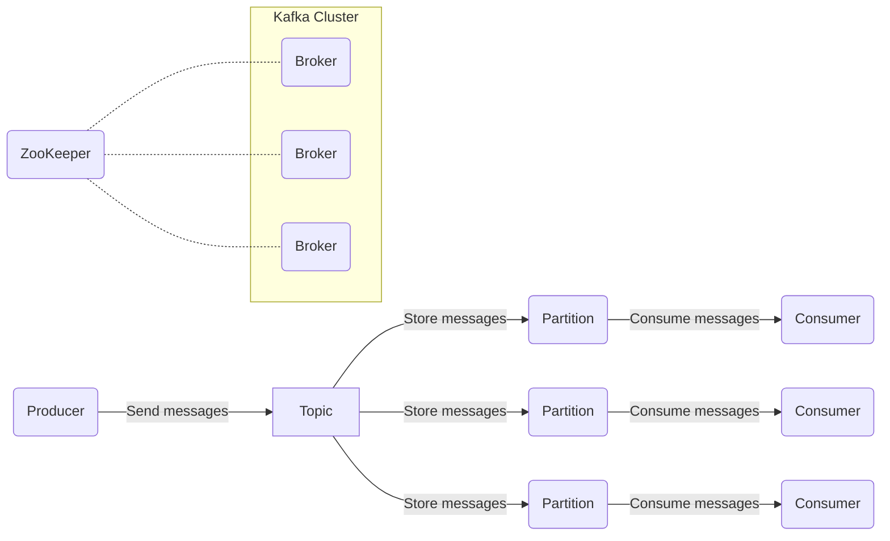
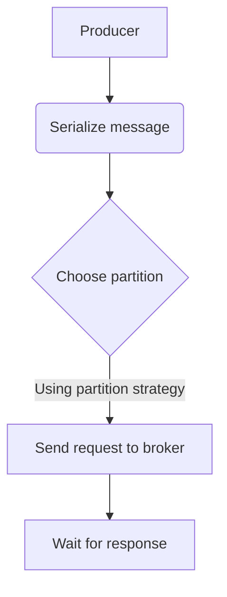
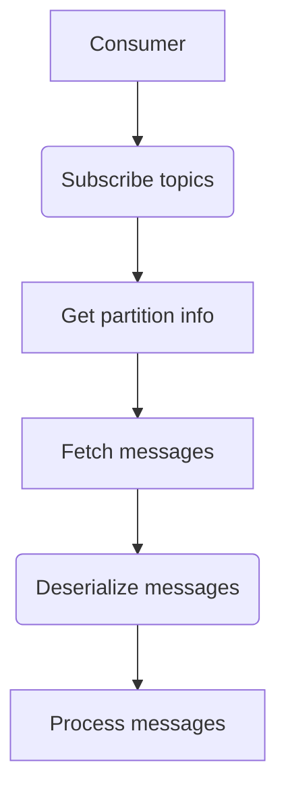
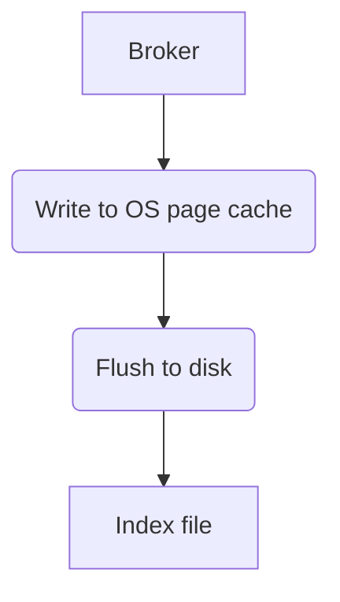

# 【AI大数据计算原理与代码实例讲解】Kafka

## 1. 背景介绍

### 1.1 大数据时代的到来

随着互联网、物联网和云计算的快速发展,海量的数据正以前所未有的规模和速度被生成。这些数据来自于各种来源,如社交媒体、移动设备、传感器等。传统的数据处理系统已经无法满足对这些大规模数据的存储、处理和分析需求。为了应对这一挑战,大数据技术应运而生。

### 1.2 大数据处理的挑战

大数据处理面临着诸多挑战,包括:

- **数据量大**:每天产生的数据量已达到了前所未有的规模,需要强大的存储和计算能力。
- **数据种类多**:数据来源多样,包括结构化数据(如数据库)和非结构化数据(如图像、视频等)。
- **数据传输速度快**:数据需要实时或近实时地被处理和分析。
- **数据价值密度低**:有价值的数据往往被淹没在海量的无用数据中。

### 1.3 流式处理的重要性

为了应对上述挑战,流式处理(Stream Processing)成为了大数据处理的关键技术之一。与传统的批量处理不同,流式处理能够实时地处理持续到来的数据流,从而满足实时分析和响应的需求。

## 2. 核心概念与联系

### 2.1 Kafka 简介

Apache Kafka 是一个分布式的流式处理平台,它被广泛应用于大数据领域。Kafka 提供了一种可靠的、高吞吐量的、分区的、可复制的提交日志服务,使其成为大数据流处理的理想选择。

### 2.2 Kafka 核心概念

- **Topic**: 一个 Topic 可以被看作是一个队列,用于存储流式数据。
- **Partition**: 每个 Topic 可以被分为多个 Partition,每个 Partition 在存储层面是一个有序的、不可变的消息序列。
- **Producer**: 生产者,用于向 Kafka 发送消息。
- **Consumer**: 消费者,用于从 Kafka 消费消息。
- **Broker**: Kafka 实例,负责存储和处理消息。
- **Zookeeper**: 用于协调 Kafka 集群中的节点。

### 2.3 Kafka 工作流程

Kafka 的工作流程如下:

1. Producer 向 Kafka 发送消息到指定的 Topic。
2. Kafka 将消息存储在 Topic 对应的 Partition 中。
3. Consumer 从 Partition 中消费消息。



## 3. 核心算法原理具体操作步骤

### 3.1 生产者发送消息

当生产者向 Kafka 发送消息时,会经历以下步骤:

1. **序列化**: 将消息序列化为字节数组。
2. **分区**: 根据分区策略选择目标 Partition。
3. **发送请求**: 将消息发送到对应的 Broker。
4. **等待响应**: 等待 Broker 的响应,确认消息是否发送成功。



### 3.2 消费者消费消息

消费者从 Kafka 消费消息的步骤如下:

1. **订阅 Topic**: 消费者向 Kafka 订阅感兴趣的 Topic。
2. **获取分区信息**: 根据订阅的 Topic,获取对应的 Partition 信息。
3. **拉取消息**: 从分配的 Partition 中拉取消息。
4. **反序列化**: 将拉取到的字节数组反序列化为消息对象。
5. **处理消息**: 对消息进行处理。



### 3.3 消息存储

Kafka 将消息存储在 Partition 中,每个 Partition 是一个有序的、不可变的消息序列。消息存储的步骤如下:

1. **写入操作系统页缓存**: 消息首先被写入操作系统的页缓存中。
2. **写入磁盘**: 页缓存中的数据定期刷新到磁盘上。
3. **索引文件**: 为了提高查询效率,Kafka 会维护一个索引文件,记录每个消息在日志文件中的位置。



## 4. 数学模型和公式详细讲解举例说明

### 4.1 分区策略

Kafka 提供了多种分区策略,用于确定消息应该被发送到哪个 Partition。常见的分区策略包括:

1. **Round-Robin 策略**: 将消息平均分布到所有 Partition 中。
2. **Key 哈希策略**: 根据消息的键值计算哈希值,将具有相同键值的消息发送到同一个 Partition。

假设有 $n$ 个 Partition,消息的键值为 $key$,则 Key 哈希策略可以用以下公式计算目标 Partition 的索引:

$$
partition = hash(key) \% n
$$

其中 $hash(key)$ 是一个哈希函数,用于计算 $key$ 的哈希值。

### 4.2 消息复制

为了提高可靠性和容错性,Kafka 支持在多个 Broker 之间复制消息。每个 Partition 都有一个 Leader Replica 和多个 Follower Replica。Leader Replica 负责处理所有的生产者请求和消费者请求,而 Follower Replica 只负责从 Leader Replica 复制消息。

假设一个 Topic 有 $m$ 个 Partition,每个 Partition 有 $r$ 个 Replica,则该 Topic 的总 Replica 数量为:

$$
total\_replicas = m \times r
$$

### 4.3 消息传递语义

Kafka 提供了三种消息传递语义:

1. **At most once**: 消息可能会丢失,但不会被重复传递。
2. **At least once**: 消息不会丢失,但可能会被重复传递。
3. **Exactly once**: 消息既不会丢失,也不会被重复传递。

Exactly once 语义是最严格的,但也是最难实现的。Kafka 通过结合生产者和消费者的幂等性,以及事务机制,来实现 Exactly once 语义。

## 5. 项目实践: 代码实例和详细解释说明

### 5.1 生产者示例

以下是一个使用 Java 编写的 Kafka 生产者示例:

```java
Properties props = new Properties();
props.put("bootstrap.servers", "localhost:9092");
props.put("key.serializer", "org.apache.kafka.common.serialization.StringSerializer");
props.put("value.serializer", "org.apache.kafka.common.serialization.StringSerializer");

Producer<String, String> producer = new KafkaProducer<>(props);

for (int i = 0; i < 100; i++) {
    String message = "Message " + i;
    ProducerRecord<String, String> record = new ProducerRecord<>("topic1", message);
    producer.send(record);
}

producer.flush();
producer.close();
```

1. 首先创建一个 `Properties` 对象,用于配置 Kafka 生产者。
2. 设置 `bootstrap.servers` 属性,指定 Kafka 集群的地址。
3. 设置 `key.serializer` 和 `value.serializer` 属性,指定键值的序列化器。
4. 创建一个 `KafkaProducer` 实例。
5. 循环发送 100 条消息到 `topic1` 主题。
6. 调用 `flush()` 方法,确保所有消息都被发送。
7. 调用 `close()` 方法,关闭生产者。

### 5.2 消费者示例

以下是一个使用 Java 编写的 Kafka 消费者示例:

```java
Properties props = new Properties();
props.put("bootstrap.servers", "localhost:9092");
props.put("group.id", "group1");
props.put("key.deserializer", "org.apache.kafka.common.serialization.StringDeserializer");
props.put("value.deserializer", "org.apache.kafka.common.serialization.StringDeserializer");

KafkaConsumer<String, String> consumer = new KafkaConsumer<>(props);
consumer.subscribe(Collections.singletonList("topic1"));

while (true) {
    ConsumerRecords<String, String> records = consumer.poll(Duration.ofMillis(100));
    for (ConsumerRecord<String, String> record : records) {
        System.out.println("Received message: " + record.value());
    }
}
```

1. 创建一个 `Properties` 对象,用于配置 Kafka 消费者。
2. 设置 `bootstrap.servers` 属性,指定 Kafka 集群的地址。
3. 设置 `group.id` 属性,指定消费者所属的消费组。
4. 设置 `key.deserializer` 和 `value.deserializer` 属性,指定键值的反序列化器。
5. 创建一个 `KafkaConsumer` 实例。
6. 订阅 `topic1` 主题。
7. 循环调用 `poll()` 方法,从 Kafka 拉取消息。
8. 打印接收到的消息。

## 6. 实际应用场景

Kafka 广泛应用于各种场景,包括但不限于:

1. **消息队列**: Kafka 可以作为一个高性能、可靠的消息队列,用于异步通信和解耦。
2. **日志收集**: Kafka 可以用于收集和存储各种日志数据,如应用程序日志、服务器日志等。
3. **流处理**: Kafka 可以与流处理框架(如 Apache Spark、Apache Flink)集成,用于实时数据处理和分析。
4. **事件驱动架构**: Kafka 可以作为事件源,支持事件驱动架构的构建。
5. **数据集成**: Kafka 可以用于数据管道,实现各种数据源之间的数据集成和传输。

## 7. 工具和资源推荐

### 7.1 Kafka 工具

- **Kafka Tool**: 一个基于 Web 的 Kafka 管理和监控工具,提供了友好的用户界面。
- **Kafka Manager**: 另一个基于 Web 的 Kafka 管理工具,支持集群管理、主题管理等功能。
- **Kafka-Python**: 一个 Python 客户端库,用于与 Kafka 进行交互。
- **Kafka-Node**: 一个 Node.js 客户端库,用于与 Kafka 进行交互。

### 7.2 学习资源

- **Apache Kafka 官方文档**: https://kafka.apache.org/documentation/
- **Kafka: The Definitive Guide**: 一本权威的 Kafka 书籍,由 Kafka 创始人之一撰写。
- **Confluent 博客**: https://www.confluent.io/blog/ Confluent 公司的官方博客,提供了大量 Kafka 相关的文章和教程。
- **Kafka 在线课程**: 像 Udemy、Coursera 等平台上提供了多门 Kafka 相关的在线课程。

## 8. 总结: 未来发展趋势与挑战

### 8.1 未来发展趋势

1. **云原生支持**: Kafka 将继续加强对云原生环境的支持,如 Kubernetes 集成等。
2. **流处理集成**: Kafka 与流处理框架的集成将变得更加紧密,提供更好的端到端流处理解决方案。
3. **事件驱动架构**: 随着事件驱动架构的兴起,Kafka 将在这一领域扮演更加重要的角色。
4. **机器学习和人工智能**: Kafka 将被更多地应用于机器学习和人工智能领域,用于实时数据处理和模型训练。

### 8.2 挑战

1. **数据安全性**: 随着数据量的增长,确保数据的安全性和隐私性将成为一个重大挑战。
2. **性能优化**: 持续优化 Kafka 的性能,以满足日益增长的数据处理需求。
3. **运维复杂性**: 管理和维护大规模的 Kafka 集群将变得更加复杂,需要更好