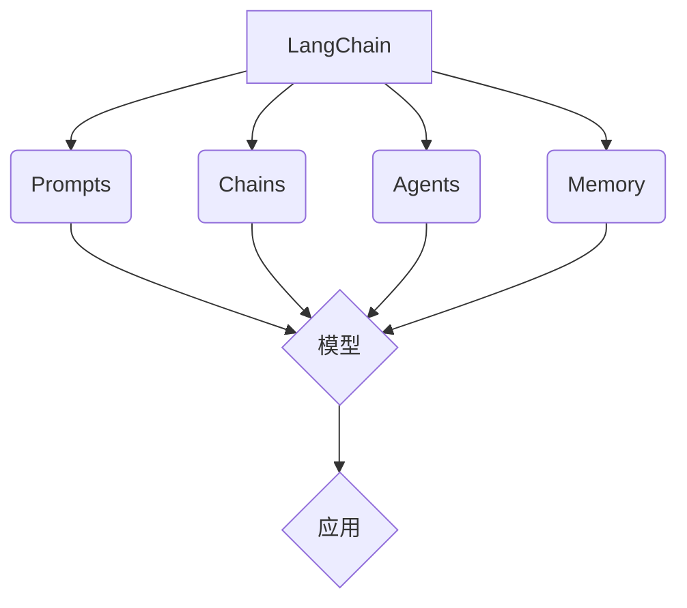

# 【LangChain编程：从入门到实践】LangChain简介

## 1. 背景介绍
### 1.1 人工智能与自然语言处理的发展
#### 1.1.1 人工智能的历史与现状
#### 1.1.2 自然语言处理的重要性
#### 1.1.3 大语言模型的崛起

### 1.2 LangChain的诞生
#### 1.2.1 LangChain的起源与发展
#### 1.2.2 LangChain的定位与目标
#### 1.2.3 LangChain在AI领域的独特价值

## 2. 核心概念与联系
### 2.1 LangChain的核心组件
#### 2.1.1 Prompts - 提示工程
#### 2.1.2 Chains - 链式调用
#### 2.1.3 Agents - 智能代理
#### 2.1.4 Memory - 记忆机制

### 2.2 LangChain与其他框架的比较
#### 2.2.1 LangChain vs OpenAI API
#### 2.2.2 LangChain vs Hugging Face
#### 2.2.3 LangChain的优势与特点

### 2.3 LangChain生态系统概览
#### 2.3.1 LangChain支持的模型与数据源
#### 2.3.2 LangChain的扩展性与灵活性
#### 2.3.3 LangChain社区与资源

## 3. 核心算法原理具体操作步骤
### 3.1 Prompts的设计与优化
#### 3.1.1 Prompt模板的创建
#### 3.1.2 Few-shot Learning的应用
#### 3.1.3 Prompt优化技巧

### 3.2 Chains的构建与执行
#### 3.2.1 Sequential Chain的使用
#### 3.2.2 Interleaved Chain的应用
#### 3.2.3 自定义Chain的开发

### 3.3 Agents的训练与部署
#### 3.3.1 Agent的工作原理
#### 3.3.2 自定义Agent的创建
#### 3.3.3 Agent的持续学习与优化

### 3.4 Memory的管理与应用
#### 3.4.1 ConversationBufferMemory的使用
#### 3.4.2 EntityMemory的应用场景
#### 3.4.3 自定义Memory的开发

## 4. 数学模型和公式详细讲解举例说明 
### 4.1 语言模型的数学基础
#### 4.1.1 Transformer架构原理
$$ Attention(Q,K,V) = softmax(\frac{QK^T}{\sqrt{d_k}})V $$
#### 4.1.2 Self-Attention机制
$$ a_{ij} = \frac{exp(e_{ij})}{\sum_{k=1}^{n} exp(e_{ik})} $$
#### 4.1.3 位置编码
$$ PE_{(pos,2i)} = sin(pos / 10000^{2i/d_model}) $$
$$ PE_{(pos,2i+1)} = cos(pos / 10000^{2i/d_model}) $$

### 4.2 Prompt工程的数学原理  
#### 4.2.1 Prompt模板的数学表示
#### 4.2.2 Few-shot Learning的数学解释
#### 4.2.3 Prompt优化的数学基础

### 4.3 强化学习在Agent中的应用
#### 4.3.1 Markov Decision Process (MDP)
$$ V^{\pi}(s) = \mathbb{E} \left[ \sum_{t=0}^{\infty} \gamma^t r_t | s_0 = s, \pi \right] $$
#### 4.3.2 Q-Learning算法
$$ Q(s_t,a_t) \leftarrow Q(s_t,a_t) + \alpha \left[ r_t + \gamma \max_a Q(s_{t+1},a) - Q(s_t,a_t) \right] $$
#### 4.3.3 策略梯度方法
$$ \nabla_\theta J(\theta) = \mathbb{E}_{\tau \sim p_\theta(\tau)} \left[ \sum_{t=0}^T \nabla_\theta \log \pi_\theta(a_t|s_t) A^{\pi_\theta}(s_t,a_t) \right] $$

## 5. 项目实践：代码实例和详细解释说明
### 5.1 使用LangChain实现问答系统
#### 5.1.1 数据准备与预处理
#### 5.1.2 构建Prompt模板
#### 5.1.3 设计问答Chain
#### 5.1.4 模型训练与评估

### 5.2 基于LangChain的文本摘要生成
#### 5.2.1 数据集选择与处理
#### 5.2.2 Prompt工程与优化
#### 5.2.3 构建摘要生成Chain
#### 5.2.4 模型微调与测试

### 5.3 利用LangChain开发智能客服Agent
#### 5.3.1 定义Agent的动作空间
#### 5.3.2 设计状态表示与奖励函数
#### 5.3.3 Agent的训练与部署
#### 5.3.4 人机交互测试与优化

## 6. 实际应用场景
### 6.1 智能写作助手
#### 6.1.1 自动生成文章大纲
#### 6.1.2 辅助创作与内容优化
#### 6.1.3 写作风格迁移

### 6.2 个性化推荐系统
#### 6.2.1 用户画像构建
#### 6.2.2 个性化推荐生成
#### 6.2.3 推荐解释与反馈

### 6.3 智能搜索与信息抽取
#### 6.3.1 语义搜索引擎
#### 6.3.2 实体关系抽取
#### 6.3.3 知识图谱构建

## 7. 工具和资源推荐
### 7.1 LangChain官方文档与教程
#### 7.1.1 快速入门指南
#### 7.1.2 API参考手册
#### 7.1.3 最佳实践与案例分析

### 7.2 LangChain社区与交流平台
#### 7.2.1 GitHub仓库与贡献指南
#### 7.2.2 Discord社区与讨论组
#### 7.2.3 Twitter账号与博客

### 7.3 其他相关工具与库
#### 7.3.1 OpenAI API与模型
#### 7.3.2 Hugging Face Transformers
#### 7.3.3 Streamlit与Gradio等应用框架

## 8. 总结：未来发展趋势与挑战
### 8.1 LangChain的发展路线图
#### 8.1.1 新功能与组件的引入
#### 8.1.2 性能优化与扩展性改进
#### 8.1.3 与其他生态系统的融合

### 8.2 大语言模型的发展趋势
#### 8.2.1 模型规模与性能的提升
#### 8.2.2 多模态学习与跨域迁移
#### 8.2.3 隐私与安全问题的应对

### 8.3 LangChain面临的挑战与机遇
#### 8.3.1 技术挑战与创新方向
#### 8.3.2 商业应用与市场拓展
#### 8.3.3 社会影响与伦理考量

## 9. 附录：常见问题与解答
### 9.1 如何选择合适的LangChain组件？
### 9.2 如何处理数据隐私与安全问题？
### 9.3 如何平衡模型性能与计算资源？
### 9.4 如何评估LangChain应用的效果？
### 9.5 如何为LangChain项目做贡献？

作者：禅与计算机程序设计艺术 / Zen and the Art of Computer Programming