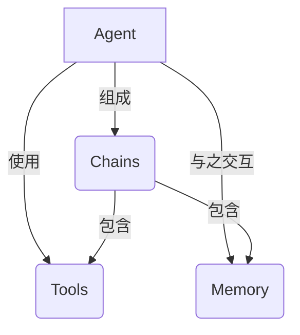
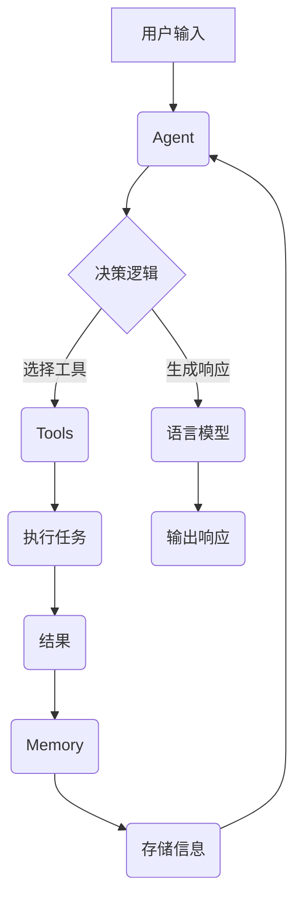

# 【LangChain编程：从入门到实践】

## 1. 背景介绍

### 1.1 人工智能的崛起

在过去几十年中，人工智能(AI)技术取得了长足的进步,已经渗透到我们生活的方方面面。从语音助手到自动驾驶汽车,从推荐系统到医疗诊断,AI正在彻底改变着我们的工作和生活方式。然而,构建智能系统并非易事,需要整合多种技术和工具。

### 1.2 LangChain的诞生

正是在这种背景下,LangChain应运而生。作为一个强大的Python库,LangChain旨在简化人工智能应用程序的开发过程,为开发者提供了一种统一的方式来构建各种智能系统。无论是自然语言处理(NLP)、知识库管理还是代理智能体(Agent),LangChain都提供了一套全面的工具和接口。

### 1.3 LangChain的优势

LangChain的主要优势在于其模块化设计和可扩展性。它将复杂的AI系统分解为多个模块,每个模块负责特定的任务,如数据加载、语言模型调用、知识库查询等。这种模块化设计不仅提高了代码的可读性和可维护性,还允许开发者轻松地集成新的组件和功能。

## 2. 核心概念与联系

LangChain的核心概念包括Agent、Tool、Memory和Chain。这些概念相互关联,共同构建了一个强大而灵活的AI系统。



### 2.1 Agent

Agent是LangChain中的核心概念,代表一个智能代理。它负责接收用户的输入,调用适当的工具(Tools)完成任务,并将结果返回给用户。Agent的行为由其内部的决策逻辑(如规则或语言模型)所驱动。

### 2.2 Tools

Tools是LangChain中的另一个关键概念,代表各种可用于完成特定任务的工具或功能。这些工具可以是网络API、数据库查询、文件操作等。Agent通过调用这些工具来执行所需的操作。

### 2.3 Memory

Memory是LangChain中用于存储和检索信息的组件。它允许Agent记住过去的对话和操作,从而在执行新任务时利用这些信息。Memory可以采用不同的形式,如向量数据库、文本文件或语言模型本身的内部状态。

### 2.4 Chains

Chains是LangChain中用于组合和编排多个组件(如Agent、Tools和Memory)的概念。它们定义了这些组件之间的交互方式,从而实现复杂的AI系统。Chains可以嵌套和组合,形成更高级别的抽象。

## 3. 核心算法原理具体操作步骤

LangChain的核心算法原理涉及多个方面,包括语言模型的调用、工具的选择和执行,以及信息的存储和检索。下面我们将详细介绍这些核心操作步骤。



### 3.1 用户输入和Agent初始化

整个过程从用户的输入开始。用户可以通过文本、语音或其他形式向Agent提出请求或问题。Agent会根据用户的输入和预设的决策逻辑(如规则或语言模型)来确定下一步的操作。

### 3.2 工具选择和执行

Agent会根据任务需求选择合适的工具(Tools)。例如,如果需要进行网络搜索,Agent可能会选择一个Web搜索API作为工具。一旦选择了工具,Agent就会调用该工具并提供必要的参数,执行相应的操作。

### 3.3 结果处理和存储

工具执行完成后,会将结果返回给Agent。Agent可以选择将这些结果存储在Memory中,以供将来使用。存储的形式可以是向量数据库、文本文件或语言模型的内部状态。

### 3.4 响应生成

根据工具的执行结果和Memory中存储的信息,Agent会使用语言模型生成最终的响应。这个响应可能是对用户问题的直接回答,也可能是进一步的指令或说明。

### 3.5 循环迭代

在许多情况下,一个任务可能需要多个步骤才能完成。因此,整个过程可能会循环迭代多次,直到Agent认为任务已经完成为止。在每次迭代中,Agent会根据当前的状态选择合适的工具,执行操作,更新Memory,并生成新的响应。

## 4. 数学模型和公式详细讲解举例说明

虽然LangChain本身并不直接涉及复杂的数学模型,但它可以与各种语言模型和向量数据库集成,这些组件往往会使用一些数学模型和公式。下面我们将介绍一些常见的数学模型和公式,以及它们在LangChain中的应用。

### 4.1 语言模型

语言模型是自然语言处理(NLP)领域的核心技术之一。它们旨在捕捉语言的统计特性,并用于生成或预测文本序列。常见的语言模型包括N-gram模型、神经网络模型(如LSTM和Transformer)等。

LangChain可以与各种语言模型集成,如GPT-3、BERT和T5。这些模型通常使用自注意力(Self-Attention)机制来捕捉文本中的长程依赖关系。自注意力的核心思想是允许每个单词直接关注到其他单词,而不是严格按照序列顺序进行处理。

自注意力的数学表示如下:

$$
\mathrm{Attention}(Q, K, V) = \mathrm{softmax}\left(\frac{QK^T}{\sqrt{d_k}}\right)V
$$

其中,$$Q$$是查询(Query)矩阵,$$K$$是键(Key)矩阵,$$V$$是值(Value)矩阵,$$d_k$$是缩放因子,用于防止点积过大导致的梯度饱和问题。

### 4.2 向量数据库

向量数据库(Vector Database)是一种特殊的数据库,它将文本或其他数据表示为高维向量,并基于向量相似性进行查询和检索。这种表示方式使得向量数据库能够有效地处理非结构化数据,如自然语言文本。

LangChain可以与多种向量数据库集成,如FAISS、Weaviate和Chroma。这些数据库通常使用某种向量嵌入技术(如Word2Vec、GloVe或BERT)将文本转换为向量表示。

向量相似性计算通常使用余弦相似度或内积相似度。余弦相似度的公式如下:

$$
\mathrm{sim}(u, v) = \frac{u \cdot v}{\|u\| \|v\|}
$$

其中,$$u$$和$$v$$是两个向量,$$\cdot$$表示向量点积,$$\|\cdot\|$$表示向量的$$L_2$$范数。

### 4.3 聚类算法

在某些情况下,LangChain可能需要对数据进行聚类,以发现潜在的模式或结构。常见的聚类算法包括K-Means、层次聚类和DBSCAN等。

以K-Means算法为例,其目标是将$$n$$个数据点划分为$$k$$个聚类,使得每个数据点到其所属聚类中心的距离之和最小。数学表达式如下:

$$
\underset{S}{\mathrm{argmin}}\sum_{i=1}^{k}\sum_{x \in S_i}\|x - \mu_i\|^2
$$

其中,$$S = \{S_1, S_2, \ldots, S_k\}$$是数据点的聚类划分,$$\mu_i$$是第$$i$$个聚类的中心点。

## 5. 项目实践:代码实例和详细解释说明

为了更好地理解LangChain的使用方式,我们将通过一个实际项目来演示其核心功能。在这个项目中,我们将构建一个简单的问答系统,能够回答有关编程语言Python的常见问题。

### 5.1 项目设置

首先,我们需要安装LangChain库及其依赖项:

```bash
pip install langchain openai wikipedia
```

接下来,我们导入所需的模块:

```python
from langchain.agents import initialize_agent, Tool
from langchain.llms import OpenAI
from langchain.utilities import WikipediaAPIWrapper
```

我们将使用OpenAI的语言模型作为Agent的决策引擎,并使用Wikipedia作为一个工具来查询相关信息。

### 5.2 定义工具

我们定义一个Wikipedia工具,用于查询和检索Wikipedia上的信息:

```python
wiki = WikipediaAPIWrapper()
tools = [
    Tool(
        name="Wikipedia",
        func=wiki.run,
        description="Useful for querying Wikipedia for information related to Python programming language."
    )
]
```

### 5.3 初始化Agent

接下来,我们初始化一个Agent,并指定使用的语言模型和工具:

```python
llm = OpenAI(temperature=0)
agent = initialize_agent(tools, llm, agent="zero-shot-react-description", verbose=True)
```

在这里,我们使用OpenAI的语言模型,并将其温度参数设置为0,以获得更加确定性的输出。我们还指定了使用"zero-shot-react-description"作为Agent的类型,这意味着Agent将根据工具的描述来决定何时使用哪个工具。

### 5.4 与Agent交互

现在,我们可以向Agent提出问题,并观察它如何利用Wikipedia工具来回答:

```python
query = "What is the difference between Python lists and tuples?"
response = agent.run(query)
print(response)
```

Agent将首先尝试使用其内部的知识来回答问题。如果无法满意地回答,它将调用Wikipedia工具来查询相关信息,并基于查询结果生成最终的响应。

### 5.5 代码解释

让我们逐步解释上面的代码:

1. 我们首先导入所需的模块,包括`langchain.agents`、`langchain.llms`和`langchain.utilities`。
2. 然后,我们定义了一个Wikipedia工具,它将作为Agent可用的工具之一。
3. 接下来,我们初始化一个OpenAI语言模型,并将其与之前定义的工具一起传递给`initialize_agent`函数,以创建一个新的Agent实例。
4. 最后,我们向Agent提出一个问题,并打印出它的响应。

在这个过程中,Agent会根据问题的内容和工具的描述来决定是否需要调用Wikipedia工具。如果需要,它将使用工具查询相关信息,并将查询结果与其内部知识相结合,生成最终的响应。

通过这个示例,您可以看到LangChain如何简化了智能系统的构建过程。您只需定义所需的工具,初始化一个Agent,然后就可以与之进行自然语言交互了。

## 6. 实际应用场景

LangChain的应用场景非常广泛,涵盖了自然语言处理、知识管理、任务自动化等多个领域。下面是一些典型的应用场景:

### 6.1 问答系统

问答系统是LangChain最常见的应用场景之一。通过集成语言模型、知识库和各种工具,LangChain可以构建出能够回答各种问题的智能系统。这种系统可以应用于客户服务、技术支持、教育等领域。

### 6.2 任务自动化

LangChain还可以用于自动化各种任务,如数据处理、文件操作、Web抓取等。通过定义合适的工具和Agent,您可以创建出执行特定任务的智能代理,从而提高工作效率。

### 6.3 知识管理

LangChain提供了强大的知识管理功能,可以帮助组织有效地存储、检索和利用知识资产。您可以将各种数据源(如文档、数据库、API等)集成到LangChain中,并使用语言模型和向量数据库进行智能查询和推理。

### 6.4 个人助理

LangChain还可以用于构建个人助理,为用户提供各种服务,如日程安排、信息查询、任务提醒等。这种助理可以通过自然语言交互,并利用LangChain的各种功能来满足用户的需求。

### 6.5 其他应用

除了上述场景,LangChain还可以应用于文本摘要