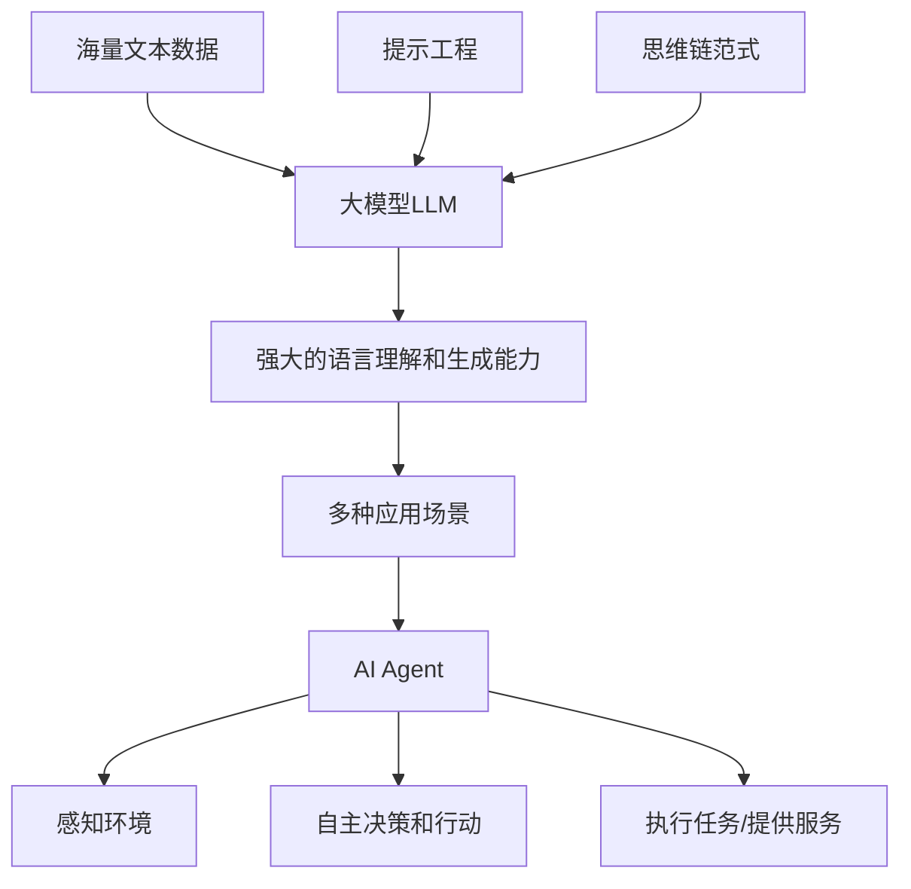

# 【大模型应用开发 动手做AI Agent】Gartner的8项重要预测

## 1. 背景介绍

人工智能(Artificial Intelligence, AI)技术的快速发展正在深刻地影响和重塑着各行各业。作为全球著名的信息技术研究和顾问公司，Gartner一直致力于洞察前沿技术趋势，为企业和机构提供战略性建议。近期，Gartner发布了一份关于人工智能未来发展的重要预测报告，其中特别关注了大模型(Large Language Model, LLM)和AI Agent在实际应用开发中的前景与挑战。

本文将围绕Gartner报告中的8项重要预测，深入探讨大模型应用开发的核心概念、关键技术、实践案例以及未来趋势，为开发者和决策者提供有价值的参考和启示。通过系统梳理大模型应用开发的全景图，揭示其中蕴含的机遇与挑战，助力企业抢占人工智能新赛道，实现数字化转型和创新发展。

## 2. 核心概念与联系

要理解Gartner预测的内涵和意义，首先需要厘清几个核心概念：

### 2.1 大模型(Large Language Model, LLM)

大模型是指基于海量文本数据训练的大规模语言模型，通常包含数十亿甚至上千亿个参数。代表性的大模型有GPT-3、PaLM、BLOOM等。大模型具有强大的自然语言理解和生成能力，可以应用于问答、对话、摘要、写作等多种任务。

### 2.2 AI Agent

AI Agent是一种智能化的软件程序，能够感知环境，根据设定的目标自主地采取行动。AI Agent内置了复杂的决策逻辑和学习机制，可以执行特定的任务或提供个性化的服务。典型的AI Agent包括智能客服、推荐系统、自动驾驶等。

### 2.3 提示工程(Prompt Engineering) 

提示工程是指如何设计和优化输入给AI模型的提示(Prompt)，以引导模型生成期望的输出。对于大模型来说，提示的设计直接影响模型的表现和适用场景。提示工程涉及prompt的格式、内容、样例等多个方面。

### 2.4 思维链(Chain-of-Thought, CoT)

思维链是一种提示范式，通过引导模型逐步分解推理过程，显式地生成中间步骤，从而提高复杂推理任务的准确性。思维链揭示了大模型内在的推理能力，为构建更加智能的AI Agent提供了新思路。

下图展示了这些核心概念之间的联系：



## 3. 核心算法原理具体操作步骤

大模型的核心算法主要包括Transformer和自回归语言模型。下面以GPT(Generative Pre-trained Transformer)为例，介绍其基本原理和训练步骤。

### 3.1 Transformer结构

GPT采用Transformer的Decoder结构，主要由以下几个部分组成：

1. 输入嵌入(Input Embedding)：将输入的token序列映射为连续的向量表示。
2. 位置编码(Positional Encoding)：为每个token的位置信息添加可学习的位置向量。
3. 多头注意力(Multi-Head Attention)：通过自注意力机制捕捉token之间的依赖关系。
4. 前馈神经网络(Feed Forward Neural Network)：对注意力层的输出进行非线性变换。
5. 层归一化(Layer Normalization)：对每一层的输入进行归一化，加速训练收敛。

### 3.2 自回归语言建模

GPT使用自回归语言模型(Auto-regressive Language Model)来建模文本序列的概率分布。给定前面的token序列，模型预测下一个token的条件概率：

$$P(x_t|x_{<t}) = \frac{exp(e_t^T h_{t-1})}{\sum_{i=1}^{|V|} exp(e_i^T h_{t-1})}$$

其中，$x_t$表示第t个token，$h_{t-1}$表示前t-1个token的隐层状态，$e_i$表示词表V中第i个token的嵌入向量。

### 3.3 训练流程

GPT的训练流程如下：

1. 数据准备：收集和清洗大规模无标注文本数据，构建训练语料库。
2. 文本预处理：对文本进行tokenization，将每个token映射为唯一的整数ID。
3. 模型初始化：根据设定的模型参数(如层数、隐藏层维度等)初始化GPT模型。
4. 前向传播：将预处理后的token序列输入GPT，计算损失函数(如交叉熵损失)。
5. 反向传播：根据损失函数计算梯度，使用优化器(如Adam)更新模型参数。 
6. 迭代训练：重复步骤4-5，直到模型收敛或达到预设的训练轮数。
7. 模型评估：在验证集或测试集上评估模型性能，如perplexity、BLEU等指标。
8. 模型应用：将训练好的模型部署到实际应用中，如生成任务、问答任务等。

## 4. 数学模型和公式详细讲解举例说明

本节以Transformer中的多头注意力机制为例，详细讲解其数学模型和公式。

多头注意力可以捕捉序列中不同位置之间的依赖关系，增强模型的表达能力。其核心思想是将输入序列的每个token与其他所有token进行注意力计算，得到一个加权平均的表示。

具体来说，多头注意力的计算过程如下：

1. 将输入序列X通过三个线性变换得到Query矩阵Q、Key矩阵K和Value矩阵V：

$$Q = XW^Q, K = XW^K, V = XW^V$$

其中，$W^Q, W^K, W^V$是可学习的权重矩阵。

2. 计算Query和Key的点积注意力分数，并除以$\sqrt{d_k}$（$d_k$为Key的维度）以缩放数值范围：

$$Attention(Q,K,V) = softmax(\frac{QK^T}{\sqrt{d_k}})V$$

3. 将注意力分数通过softmax归一化，得到注意力权重矩阵：

$$A = softmax(\frac{QK^T}{\sqrt{d_k}})$$

4. 将注意力权重矩阵与Value矩阵相乘，得到加权平均的表示：

$$Head_i = AV$$

5. 多头注意力并行计算多个头(head)，然后拼接所有头的输出：

$$MultiHead(Q,K,V) = Concat(Head_1, ..., Head_h)W^O$$

其中，$h$为头的数量，$W^O$为输出层的权重矩阵。

举个例子，假设我们有一个长度为6的输入序列："I love natural language processing"，经过Transformer的多头注意力层处理后，每个token都会得到一个新的表示向量。以"language"这个token为例，多头注意力会考虑其与其他token（如"natural"、"processing"）的相关性，赋予更高的注意力权重，从而得到一个更加上下文相关的表示。

## 5. 项目实践：代码实例和详细解释说明

下面是一个使用PyTorch实现GPT模型的简化版代码示例：

```python
import torch
import torch.nn as nn

class GPT(nn.Module):
    def __init__(self, vocab_size, d_model, nhead, num_layers, dropout=0.1):
        super().__init__()
        self.embed = nn.Embedding(vocab_size, d_model)
        self.pos_embed = nn.Parameter(torch.zeros(1, 1024, d_model))
        self.layers = nn.ModuleList([
            nn.TransformerEncoderLayer(d_model, nhead, dim_feedforward=4*d_model, dropout=dropout)
            for _ in range(num_layers)
        ])
        self.norm = nn.LayerNorm(d_model)
        self.fc = nn.Linear(d_model, vocab_size)

    def forward(self, x):
        x = self.embed(x) + self.pos_embed[:, :x.size(1), :]
        for layer in self.layers:
            x = layer(x)
        x = self.norm(x)
        x = self.fc(x)
        return x
```

代码解释：

1. 定义了一个名为GPT的PyTorch模型类，构造函数接受词表大小、隐藏层维度、注意力头数、层数等超参数。
2. 使用nn.Embedding实现输入嵌入层，将token ID映射为连续向量表示。
3. 定义可学习的位置嵌入向量pos_embed，与输入嵌入相加，引入位置信息。
4. 使用nn.TransformerEncoderLayer搭建Transformer的编码器层，并用nn.ModuleList将多个编码器层串联起来。
5. 使用nn.LayerNorm对编码器的输出进行层归一化。
6. 使用nn.Linear实现输出层，将隐藏层表示映射回词表空间，用于预测下一个token。
7. 在前向传播函数forward中，依次执行输入嵌入、位置编码、多层编码器、层归一化和输出层等步骤，返回最终的预测结果。

使用该GPT模型进行文本生成的示例代码如下：

```python
model = GPT(vocab_size=10000, d_model=768, nhead=12, num_layers=12)
input_ids = torch.randint(0, 10000, (1, 100))  # 随机生成输入序列
output = model(input_ids)
next_token_probs = torch.softmax(output[:, -1, :], dim=-1)
next_token_id = torch.multinomial(next_token_probs, num_samples=1)
```

这里首先随机生成了一个长度为100的输入序列，然后将其传入GPT模型进行前向传播，得到输出概率分布。接着使用softmax对最后一个token的输出概率进行归一化，并通过multinomial采样生成下一个token的ID。重复这个过程即可实现文本生成。

## 6. 实际应用场景

大模型和AI Agent在实际应用中有广泛的场景，下面列举几个典型的例子：

### 6.1 智能客服

利用大模型强大的语言理解和生成能力，可以构建智能客服系统。用户提出问题后，AI Agent通过分析问题语义，检索知识库，生成恰当的回答，提供24小时不间断的客户服务。相比传统的人工客服，智能客服可以大幅提高响应效率和服务质量，降低人力成本。

### 6.2 个性化推荐

大模型可以从海量的用户行为数据中学习用户的兴趣偏好，构建用户画像。AI Agent根据用户画像，结合实时的交互上下文，为用户推荐感兴趣的内容、商品或服务。个性化推荐可以显著提升用户体验和满意度，增加用户粘性和转化率。

### 6.3 智能写作助手

大模型在文本生成方面有出色的表现，可以应用于智能写作助手。用户输入文章主题、关键词、提纲等信息，AI Agent自动生成符合要求的文章初稿。用户再进行必要的修改和润色，即可快速完成写作任务。智能写作助手可以极大地提高内容创作的效率和质量，降低写作门槛。

### 6.4 医疗诊断和辅助决策

大模型可以从海量的医疗文献、病历、影像等数据中学习医学知识，辅助医生进行疾病诊断和治疗决策。AI Agent通过分析患者的症状、体征、检查结果等信息，给出可能的诊断结果和治疗方案建议，协助医生制定个性化的诊疗计划。这种人机协同的智能医疗方式可以提高诊断准确率，规避医疗风险，改善医疗服务水平。

## 7. 工具和资源推荐

对于开发者和研究者来说，掌握优质的工具和资源至关重要。以下是一些实用的大模型应用开发工具和学习资源：

### 7.1 开源框架和库

- Hugging Face Transformers：包含主流NLP模型的开源库，支持PyTorch和TensorFlow。
- OpenAI GPT-3 API：OpenAI提供的GPT-3模型API，可以方便地调用强大的语言模型能力。
- DeepPav