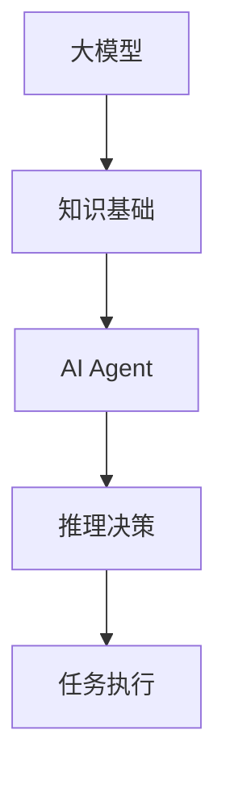

# 【大模型应用开发 动手做AI Agent】人类的大脑了不起

## 1. 背景介绍
### 1.1 人工智能的发展历程
#### 1.1.1 早期人工智能的探索
#### 1.1.2 机器学习的兴起 
#### 1.1.3 深度学习的突破

### 1.2 大模型的出现
#### 1.2.1 大模型的定义
#### 1.2.2 大模型的特点
#### 1.2.3 大模型的应用前景

### 1.3 AI Agent的概念
#### 1.3.1 AI Agent的定义
#### 1.3.2 AI Agent的特点
#### 1.3.3 AI Agent的应用场景

## 2. 核心概念与联系
### 2.1 大模型
#### 2.1.1 大模型的架构
#### 2.1.2 大模型的训练方法
#### 2.1.3 大模型的优化技术

### 2.2 AI Agent
#### 2.2.1 AI Agent的组成
#### 2.2.2 AI Agent的工作原理
#### 2.2.3 AI Agent的设计考量

### 2.3 大模型与AI Agent的关系
#### 2.3.1 大模型为AI Agent提供知识基础
#### 2.3.2 AI Agent利用大模型进行推理决策
#### 2.3.3 大模型与AI Agent协同工作



## 3. 核心算法原理具体操作步骤
### 3.1 Transformer架构
#### 3.1.1 自注意力机制
#### 3.1.2 多头注意力
#### 3.1.3 位置编码

### 3.2 预训练与微调
#### 3.2.1 无监督预训练
#### 3.2.2 有监督微调
#### 3.2.3 零样本学习

### 3.3 知识蒸馏
#### 3.3.1 教师模型与学生模型
#### 3.3.2 软标签与硬标签
#### 3.3.3 蒸馏损失函数

## 4. 数学模型和公式详细讲解举例说明
### 4.1 注意力机制
#### 4.1.1 注意力得分计算
$$
\text{Attention}(Q, K, V) = \text{softmax}(\frac{QK^T}{\sqrt{d_k}})V
$$
其中，$Q$、$K$、$V$ 分别表示查询、键、值向量，$d_k$ 为键向量的维度。

#### 4.1.2 多头注意力
$$
\text{MultiHead}(Q, K, V) = \text{Concat}(\text{head}_1, ..., \text{head}_h)W^O
$$
其中，$\text{head}_i = \text{Attention}(QW_i^Q, KW_i^K, VW_i^V)$，$W_i^Q$、$W_i^K$、$W_i^V$ 和 $W^O$ 为可学习的权重矩阵。

### 4.2 预训练目标
#### 4.2.1 掩码语言模型（Masked Language Model）
$$
\mathcal{L}_{\text{MLM}} = -\sum_{i \in \mathcal{M}} \log P(x_i | \boldsymbol{x}_{\backslash \mathcal{M}})
$$
其中，$\mathcal{M}$ 表示被掩码的词的集合，$\boldsymbol{x}_{\backslash \mathcal{M}}$ 表示未被掩码的词。

#### 4.2.2 下一句预测（Next Sentence Prediction）
$$
\mathcal{L}_{\text{NSP}} = -\log P(y | \boldsymbol{x}_1, \boldsymbol{x}_2)
$$
其中，$y$ 表示两个句子 $\boldsymbol{x}_1$ 和 $\boldsymbol{x}_2$ 是否相邻。

### 4.3 知识蒸馏
#### 4.3.1 软标签蒸馏
$$
\mathcal{L}_{\text{KD}} = -\sum_{i=1}^N \sum_{j=1}^C p_i^T(j) \log p_i^S(j)
$$
其中，$p_i^T$ 和 $p_i^S$ 分别表示教师模型和学生模型在第 $i$ 个样本上的预测概率分布，$N$ 为样本数，$C$ 为类别数。

## 5. 项目实践：代码实例和详细解释说明
### 5.1 使用Hugging Face Transformers库加载预训练模型
```python
from transformers import AutoTokenizer, AutoModel

# 加载预训练模型和分词器
model_name = "bert-base-uncased"
tokenizer = AutoTokenizer.from_pretrained(model_name)
model = AutoModel.from_pretrained(model_name)
```

### 5.2 对输入文本进行编码
```python
# 对输入文本进行编码
text = "This is an example sentence."
inputs = tokenizer(text, return_tensors="pt")
```

### 5.3 使用预训练模型进行推理
```python
# 使用预训练模型进行推理
with torch.no_grad():
    outputs = model(**inputs)
    
# 获取最后一层隐藏状态
last_hidden_state = outputs.last_hidden_state
```

### 5.4 微调预训练模型
```python
# 定义下游任务的数据集
dataset = ...

# 定义微调的超参数
num_epochs = 3
batch_size = 16
learning_rate = 2e-5

# 使用AdamW优化器和线性学习率调度器
optimizer = AdamW(model.parameters(), lr=learning_rate)
scheduler = get_linear_schedule_with_warmup(optimizer, num_warmup_steps=0, num_training_steps=len(dataset) * num_epochs)

# 训练循环
for epoch in range(num_epochs):
    for batch in dataset:
        # 前向传播
        outputs = model(**batch)
        loss = outputs.loss
        
        # 反向传播和优化
        loss.backward()
        optimizer.step()
        scheduler.step()
        optimizer.zero_grad()
```

## 6. 实际应用场景
### 6.1 智能客服
#### 6.1.1 客户意图识别
#### 6.1.2 自动回复生成
#### 6.1.3 情感分析

### 6.2 个性化推荐
#### 6.2.1 用户画像构建
#### 6.2.2 物品表示学习
#### 6.2.3 推荐排序

### 6.3 智能搜索
#### 6.3.1 查询理解
#### 6.3.2 文档排序
#### 6.3.3 答案抽取

## 7. 工具和资源推荐
### 7.1 开源框架
#### 7.1.1 Hugging Face Transformers
#### 7.1.2 OpenAI GPT-3
#### 7.1.3 Google BERT

### 7.2 预训练模型
#### 7.2.1 BERT
#### 7.2.2 RoBERTa
#### 7.2.3 XLNet

### 7.3 数据集
#### 7.3.1 Wikipedia
#### 7.3.2 BookCorpus
#### 7.3.3 Common Crawl

## 8. 总结：未来发展趋势与挑战
### 8.1 大模型的发展趋势
#### 8.1.1 模型规模的增大
#### 8.1.2 训练效率的提升
#### 8.1.3 多模态融合

### 8.2 AI Agent的发展趋势
#### 8.2.1 更加智能化和个性化
#### 8.2.2 与人类的自然交互
#### 8.2.3 跨领域应用

### 8.3 面临的挑战
#### 8.3.1 计算资源的限制
#### 8.3.2 数据隐私和安全
#### 8.3.3 伦理和法律问题

## 9. 附录：常见问题与解答
### 9.1 大模型需要多少计算资源？
大模型的训练需要大量的计算资源，通常需要使用高性能的GPU或TPU设备。具体所需的计算资源取决于模型的规模和训练数据的大小。目前，训练一个大型的语言模型可能需要数百个GPU设备和数周甚至数月的时间。

### 9.2 如何选择合适的预训练模型？
选择预训练模型时需要考虑以下因素：
1. 模型的架构和规模
2. 预训练数据的领域和质量
3. 模型在下游任务上的表现
4. 模型的推理速度和资源占用

通常建议选择在大规模高质量数据上训练的模型，并在目标任务相关的基准测试中表现良好。同时也要权衡模型的推理速度和资源占用，以满足实际应用的需求。

### 9.3 大模型会取代人类吗？
大模型虽然在许多任务上表现出色，但它们仍然是基于数据和算法的人工智能系统。大模型并不具备人类的常识、情感和创造力。它们更多地是作为人类的助手和工具，帮助人类更高效地完成某些任务。未来，人工智能和人类的协作将成为主流，二者互补而不是相互取代。

作者：禅与计算机程序设计艺术 / Zen and the Art of Computer Programming